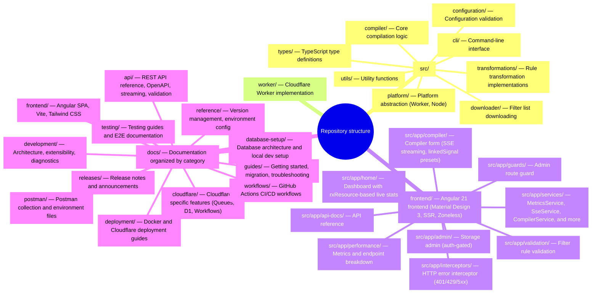
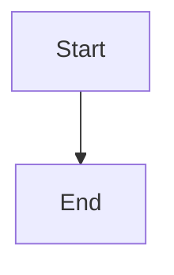

# Contributing to Adblock Compiler

Thank you for your interest in contributing to the Adblock Compiler project! This guide will help you get started.

## Package Manager Convention

> **⚠️ Important:** This project uses **pnpm** (for the Angular frontend workspace) and **Deno** (for the Worker backend). **Never use `npm` commands directly** — doing so will generate `package-lock.json` files that must not be committed and can create version-mismatch issues.
>
> | Scope                    | Tool                 | Example                                             |
> | ------------------------ | -------------------- | --------------------------------------------------- |
> | Angular frontend         | `pnpm`               | `pnpm --filter adblock-compiler-frontend run build` |
> | Worker / backend         | `deno`               | `deno task dev`                                     |
> | Wrangler (Worker deploy) | `deno task wrangler` | `deno task wrangler deploy`                         |
>
> The single source of truth for Node package versions is `pnpm-lock.yaml`. If you accidentally run `npm install` and a `package-lock.json` appears, delete it before committing.

## Development Setup

1. **Prerequisites**
   - [Deno](https://deno.land/) 2.x or higher
   - [Node.js](https://nodejs.org/) 22.x or higher (for Angular frontend)
   - [pnpm](https://pnpm.io/) 10.x or higher
   - Git

2. **Clone and Setup**

   ```bash
   git clone https://github.com/jaypatrick/adblock-compiler.git
   cd adblock-compiler
   deno cache src/index.ts
   pnpm install                    # Install Angular frontend dependencies
   deno task setup:hooks           # Install pre-push git hook (recommended)
   ```

3. **Run Tests**
   ```bash
   deno task test                                       # Backend tests (Deno)
   pnpm --filter adblock-compiler-frontend run test     # Frontend tests (Vitest)
   ```

## Commit Message Guidelines

We use **Conventional Commits** for automatic version bumping and changelog generation.

### Format

```
<type>[optional scope]: <description>

[optional body]

[optional footer]
```

### Types

- `feat:` - New feature (triggers **minor** version bump: 0.12.0 → 0.13.0)
- `fix:` - Bug fix (triggers **patch** version bump: 0.12.0 → 0.12.1)
- `perf:` - Performance improvement (triggers **patch** version bump)
- `docs:` - Documentation changes (no version bump)
- `style:` - Code style changes (no version bump)
- `refactor:` - Code refactoring (no version bump)
- `test:` - Adding or updating tests (no version bump)
- `chore:` - Maintenance tasks (no version bump)
- `ci:` - CI/CD changes (no version bump)

### Breaking Changes

For breaking changes, add `!` after type or include `BREAKING CHANGE:` in footer:

```bash
# Option 1: Using !
feat!: change API to async-only

# Option 2: Using footer
feat: migrate to new configuration format

BREAKING CHANGE: Configuration schema has changed.
Old format is no longer supported.
```

This triggers a **major** version bump: 0.12.0 → 1.0.0

### Examples

✅ **Good Examples:**

```bash
feat: add WebSocket support for real-time compilation
feat(worker): implement queue-based processing
fix: resolve memory leak in rule parser
fix(validation): handle edge case for IPv6 addresses
perf: optimize deduplication algorithm by 50%
docs: add API documentation for streaming endpoint
test: add integration tests for batch compilation
chore: update dependencies to latest versions
```

❌ **Bad Examples:**

```bash
added feature              # Missing type prefix
Fix bug                    # Incorrect capitalization
feat add new feature       # Missing colon
update code                # Too vague, missing type
```

## Pull Request Process

1. **Create a Branch**

   ```bash
   git checkout -b feature/your-feature-name
   # or
   git checkout -b fix/your-bug-fix
   ```

2. **Make Your Changes**
   - Write code following the project's style guide
   - Add tests for new functionality
   - Update documentation as needed

3. **Test Your Changes**

   ```bash
   # Quick preflight check (runs fmt, lint, type check, schema generation drift check)
   deno task preflight

   # Individual checks
   deno task test           # Run tests
   deno task fmt            # Format code
   deno task lint           # Lint code
   deno task check          # Type check

   # If you changed docs/api/openapi.yaml, regenerate derived files:
   deno task schema:generate    # Regenerates cloudflare-schema.yaml and postman-collection.json

   # Frontend (Angular)
   pnpm --filter adblock-compiler-frontend run test     # Vitest unit tests
   pnpm --filter adblock-compiler-frontend run lint     # ESLint
   pnpm --filter adblock-compiler-frontend run build    # Production build
   ```

   > **Tip:** After running `deno task setup:hooks`, the pre-push hook will automatically
   > check for schema drift and formatting issues before every push, catching CI failures locally.

4. **Commit with Conventional Format**

   ```bash
   git add .
   git commit -m "feat: add new transformation for rule validation"
   ```

5. **Push and Create PR**

   ```bash
   git push origin feature/your-feature-name
   ```

   Then create a Pull Request on GitHub

6. **Automatic Version Bump**
   - When your PR is merged to `main`, the version will be automatically bumped based on your commit message
   - `feat:` commits → minor version bump
   - `fix:` or `perf:` commits → patch version bump
   - Breaking changes → major version bump

## Code Style

- **Indentation**: 4 spaces (not tabs)
- **Line width**: 180 characters maximum
- **Quotes**: Single quotes for strings
- **Semicolons**: Always use semicolons
- **TypeScript**: Strict typing, no `any` types

Run `deno task fmt` to automatically format your code.

## Testing

> **Rule: every code change ships with tests — no exceptions.**
> If you write code (a new handler, utility function, service, component, middleware, or schema), you write a corresponding unit test in the same PR. This applies to humans and AI agents alike.

- **Location**: Co-locate tests with source files (`*.test.ts` for Deno, `*.spec.ts` for Angular)
- **Framework**: Deno native (`@std/assert`) for `src/` and `worker/`; Vitest + Angular TestBed for `frontend/`
- **Coverage target**: ≥ 80% patch coverage on every PR
- **Pattern**: Follow the `makeEnv(overrides)` fixture pattern; use in-memory KV/DB stubs; never call real Cloudflare bindings in unit tests
- **Commands**:
  ```bash
  deno task test              # Run all Deno tests (src/ + worker/)
  deno task test:watch        # Watch mode
  deno task test:coverage     # With coverage

  # Frontend
  pnpm --filter adblock-compiler-frontend run test
  ```

### Mandatory checklist before opening a PR

- [ ] Every **new source file** has a corresponding `*.test.ts` / `*.spec.ts` file
- [ ] Every **modified function** has test coverage for the changed code path
- [ ] `deno task test` passes locally with no failures
- [ ] `deno task lint && deno fmt --check` passes (CI will fail otherwise)

See [`docs/testing/testing.md`](docs/testing/testing.md) for fixture patterns, shared mocks, and troubleshooting tips.

## Documentation

- Update README.md for user-facing changes
- Update relevant docs in `docs/` directory
- Add JSDoc comments to public APIs
- Include examples for complex features
- Use Mermaid fences (`` ```mermaid ``) for every chart, architecture diagram, flow, and directory layout in documentation
- Use Markdown tables for tabular data instead of ASCII-art tables

## Project Structure



## Angular Frontend Development

The frontend is an Angular 21 app in `frontend/` using:

- **Zoneless change detection** (`provideZonelessChangeDetection()`)
- **Material Design 3** with M3 theme tokens
- **SSR** on Cloudflare Workers via `@angular/ssr`
- **Vitest** for unit testing (not Jest)
- **Signal-first architecture**: `rxResource`, `linkedSignal`, `toSignal`, `viewChild()`

### Running Locally

```bash
pnpm --filter adblock-compiler-frontend run start    # Angular dev server (http://localhost:4200)
deno task wrangler:dev                               # Worker API (http://localhost:8787)
```

The Angular dev server proxies `/api` requests to the Worker.

### SSE Integration Pattern

The compiler supports real-time Server-Sent Events (SSE) streaming. The `SseService` (`frontend/src/app/services/sse.service.ts`) wraps the native `EventSource` API and exposes each connection as a signal-based `SseConnection` object:

```typescript
// SseService.connect() returns an SseConnection with:
//   .events()   — Signal<SseEvent[]> — accumulated events
//   .status()   — Signal<'connecting' | 'open' | 'error' | 'closed'>
//   .isActive() — Signal<boolean>
//   .close()    — Closes the EventSource

const conn = this.sseService.connect('/compile/stream', request);
this.sseConnection.set(conn);

// In the template, consume signals directly:
// conn.events(), conn.status(), conn.isActive()
```

This pattern avoids manual Observable subscriptions—the component template reads signals reactively, and the connection auto-cleans via `DestroyRef.onDestroy()`.

## Documentation Diagrams

**Always use Mermaid for diagrams and charts in documentation. Never use ASCII art for diagrams.**

Wrap every diagram in a fenced code block with the `mermaid` language identifier:

````markdown

````

| Diagram type                 | Mermaid syntax                                     |
| ---------------------------- | -------------------------------------------------- |
| Decision tree / auth flow    | `flowchart TD`                                     |
| Request/response flow        | `sequenceDiagram`                                  |
| Architecture with boundaries | `flowchart TD` or `graph LR` with `subgraph`       |
| Left-to-right pipeline       | `flowchart LR`                                     |
| Static KPI / metrics data    | Regular markdown table (no Mermaid type available) |

> **Note:** Directory/file tree listings are documentation diagrams too. Convert them to Mermaid mindmaps or flowcharts instead of using ASCII trees.

## Environment Variables

This project uses **direnv** + `.envrc` for all local environment management. Variables are loaded automatically when you enter the project directory.

### The Two-Track Rule

Variables belong to one of two tracks:

- **Shell tooling track** — used by Prisma CLI, Deno tasks, scripts. Lives in `.env*` files.
- **Wrangler Worker track** — read by the Cloudflare Worker at runtime. Lives in `.dev.vars` (local) or `wrangler.toml [vars]` / `wrangler secret put` (production).

> If `worker/types.ts` `Env` interface has the variable → it belongs to the Wrangler track and must go in `.dev.vars`, not `.env*` files.

### Quick Setup

```bash
cp .dev.vars.example .dev.vars   # Worker runtime secrets (primary)
direnv allow                      # activate auto-loading

# Optional: only needed if you want to override shell-tooling vars (e.g. Prisma DB)
# cp .env.example .env.local
```

### Where Variables Live

| File                   | Track  | Purpose                                                  | Committed? |
| ---------------------- | ------ | -------------------------------------------------------- | ---------- |
| `.env`                 | Shell  | Non-secret base defaults (`PORT`, `COMPILER_VERSION`)    | ✅ Yes     |
| `.env.development`     | Shell  | Dev shell defaults (`DATABASE_URL`, `LOG_LEVEL=debug`)   | ✅ Yes     |
| `.env.production`      | Shell  | Intentionally empty (prod Worker vars live in wrangler)  | ✅ Yes     |
| `.env.local`           | Shell  | Personal shell overrides                                 | ❌ No      |
| `.env.example`         | Shell  | Template for shell-track variables                       | ✅ Yes     |
| `.dev.vars`            | Worker | All Worker runtime vars: Clerk, Turnstile, CORS, secrets | ❌ No      |
| `.dev.vars.example`    | Worker | Template for all Worker-track variables                  | ✅ Yes     |
| `wrangler.toml [vars]` | Worker | Non-secret Worker vars for production                    | ✅ Yes     |

> direnv loads `.dev.vars` last (highest precedence), so Worker vars are also available
> in your shell — no need to declare them twice.

See [docs/reference/ENV_CONFIGURATION.md](docs/reference/ENV_CONFIGURATION.md) for the full reference.

## Cloudflare TypeScript SDK

This project uses the official [`cloudflare`](https://github.com/cloudflare/cloudflare-typescript) TypeScript SDK (`cloudflare@^5.2.0`) instead of raw `fetch` calls for all Cloudflare REST API interactions.

### Why the SDK?

- **Type-safe**: every resource, parameter and response is fully typed.
- **Pagination handled automatically**: SDK page objects expose `getPaginatedItems()` so callers never need to wire up cursor loops.
- **Consistent error handling**: the SDK throws typed `APIError` subclasses (e.g. `AuthenticationError`, `PermissionDeniedError`) with a `.status` property, making HTTP-level error detection straightforward.
- **Single integration point**: all Cloudflare API calls go through `src/services/cloudflareApiService.ts`, keeping scripts and worker handlers thin.

### Location

```
src/services/cloudflareApiService.ts       # Service class + factory
src/services/cloudflareApiService.test.ts  # Unit tests (mock client)
```

### Usage examples

```typescript
import { createCloudflareApiService } from './src/services/cloudflareApiService.ts';

const cfApi = createCloudflareApiService({ apiToken: Deno.env.get('CLOUDFLARE_API_TOKEN')! });

// Query D1
const { result } = await cfApi.queryD1<{ id: number }>(
    Deno.env.get('CLOUDFLARE_ACCOUNT_ID')!,
    Deno.env.get('D1_DATABASE_ID')!,
    'SELECT id FROM my_table WHERE name = ?',
    ['example'],
);

// List KV namespaces
const namespaces = await cfApi.listKvNamespaces(accountId);

// List Worker scripts
const scripts = await cfApi.listWorkers(accountId);

// List Queues
const queues = await cfApi.listQueues(accountId);

// List Zones (with optional filter params)
const zones = await cfApi.listZones({ account: { id: accountId } });
```

### Convention

> **Scripts must use `CloudflareApiService` instead of raw `fetch` for all Cloudflare API calls.**
> Never write ad-hoc `fetch('https://api.cloudflare.com/...')` calls; extend the service if a new resource is needed.

## Questions or Help?

- Create an issue on GitHub
- Check existing documentation in `docs/`
- Review the [README.md](README.md)

## Zero Trust Architecture (ZTA)

This project enforces Zero Trust principles at every layer. Every PR touching `worker/` or `frontend/` must follow these rules:

- **Auth first**: Every handler verifies authentication before business logic
- **CORS allowlist**: Use `getCorsHeaders()` from `worker/utils/cors.ts` — never `Access-Control-Allow-Origin: *` on write endpoints
- **Parameterized SQL**: Always `.prepare().bind()` — never string interpolation
- **Zod validation**: All trust boundaries (webhooks, JWT claims, API bodies, DB rows) must be Zod-validated
- **Secrets in Worker Secrets**: Never put credentials in `wrangler.toml [vars]`
- **Frontend auth via Clerk SDK**: Never store tokens in `localStorage`

See the full [ZTA Developer Guide](docs/security/ZTA_DEVELOPER_GUIDE.md) and [ZTA Architecture](docs/security/ZERO_TRUST_ARCHITECTURE.md).

## License

By contributing, you agree that your contributions will be licensed under the same license as the project.

## Additional Resources

- [VERSION_MANAGEMENT.md](docs/reference/VERSION_MANAGEMENT.md) - Version synchronization details
- [docs/reference/AUTO_VERSION_BUMP.md](docs/reference/AUTO_VERSION_BUMP.md) - Automatic version bumping
- [Conventional Commits](https://www.conventionalcommits.org/) - Official specification
- [Semantic Versioning](https://semver.org/) - SemVer specification
