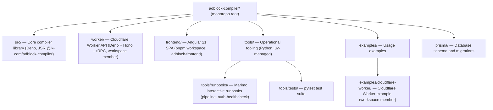

# Monorepo Structure

This repository is a monorepo containing multiple packages managed by a dual Deno + pnpm + uv toolchain.

## Workspace Layout



## Toolchain by Package

| Package | Runtime | Package Manager | Key Config |
|---|---|---|---|
| `src/` | Deno | deno.json | `deno.json` (root) |
| `worker/` | Deno | deno.json | `deno.json` (root workspace member) |
| `frontend/` | Node.js | pnpm | `frontend/package.json`, `pnpm-workspace.yaml` |
| `tools/` | Python 3.11+ | uv | `tools/pyproject.toml` |
| `examples/cloudflare-worker/` | Deno | deno.json | `examples/cloudflare-worker/deno.json` |

## Adding a New Package

### TypeScript/Node package (e.g., admin panel)

1. Create the package directory: `packages/admin-panel/` (or `admin/`)
2. Add a `package.json` with a unique `name`
3. Add the path to `pnpm-workspace.yaml`
4. Add a path filter to `.github/workflows/ci.yml` `changes` job
5. Add CI jobs for lint/test/build
6. Update this file

### Deno package

1. Create the package directory with a `deno.json` including a `name` field
2. Add the path to the `workspace` array in the root `deno.json`
3. Add a path filter to `.github/workflows/ci.yml`
4. Update this file

### Python package

1. Create the package directory under `tools/` (or add to `tools/pyproject.toml` dependencies)
2. Add `uv run --directory tools` tasks to `deno.json` if needed
3. Add path filters to `.github/workflows/ci.yml`
4. Update this file

## Running All Checks

```bash
# TypeScript/Deno (core)
deno task preflight:full

# Frontend (Angular)
pnpm --filter adblock-frontend run lint
pnpm --filter adblock-frontend run test

# Python tools
deno task runbook:lint
deno task runbook:fmt
deno task runbook:typecheck
deno task runbook:test

# All together
deno task preflight:full && pnpm --filter adblock-frontend run test && deno task runbook:test
```

## Version Management

- Core library and worker: versioned in `deno.json` via conventional commits + auto version-bump workflow
- Frontend: versioned in `frontend/package.json`, synced via `frontend-version-bump.yml` workflow
- Tools: versioned in `tools/pyproject.toml` (manual bumps; not published)
- Examples: versioned independently in their `package.json`/`deno.json`
