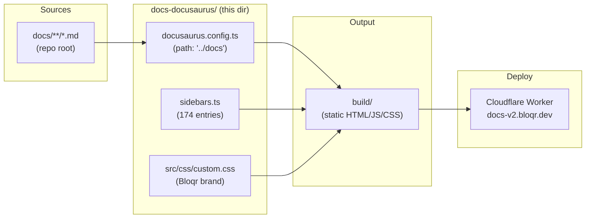

# Docusaurus Documentation Scaffold

This directory contains a **Docusaurus v3** documentation site for Bloqr —
scaffolded as a parallel alternative to the existing [mdBook](../book.toml)
setup.

> **Status:** Scaffold only. The site builds and deploys but has not replaced
> the primary mdBook site at `docs.bloqr.dev`. Content is read directly from
> `../docs/`.

---

## URLs

| Site                       | URL                         |
| -------------------------- | --------------------------- |
| mdBook (primary)           | <https://docs.bloqr.dev>    |
| Docusaurus (this scaffold) | <https://docs-v2.bloqr.dev> |

---

## Local Development

```bash
# From the repo root — install deps
pnpm --filter @bloqr/docs-docusaurus install

# Start dev server on http://localhost:3000
pnpm --filter @bloqr/docs-docusaurus run start

# Or from this directory
cd docs-docusaurus
pnpm install
pnpm start
```

## Build

```bash
# From the repo root
pnpm --filter @bloqr/docs-docusaurus run build
# or the root convenience alias:
pnpm run docs:docusaurus:build

# Output goes to docs-docusaurus/build/
```

## Deploy to Cloudflare Workers

CI deploys automatically on push to `main` when `docs/**` or
`docs-docusaurus/**` changes.

Manual deploy:

```bash
cd docs-docusaurus
pnpm run deploy
# runs: wrangler deploy --config wrangler.docs-docusaurus.toml
```

---

## Key Differences from mdBook

| Feature              | mdBook                        | Docusaurus                         |
| -------------------- | ----------------------------- | ---------------------------------- |
| Config language      | TOML                          | TypeScript                         |
| Sidebar              | Auto from `SUMMARY.md`        | Manual `sidebars.ts`               |
| Mermaid              | `mdbook-mermaid` preprocessor | `@docusaurus/theme-mermaid` plugin |
| Custom preprocessors | Deno script                   | remark / rehype plugins            |
| Search               | Built-in (basic)              | Algolia DocSearch (requires keys)  |
| OpenAPI playground   | Manual                        | `docusaurus-plugin-openapi-docs`   |
| Versioning           | Manual                        | Built-in                           |
| MDX components       | ❌                            | ✅                                 |
| React themes         | ❌                            | ✅                                 |
| Build tool           | Rust (`mdbook`)               | Node.js + webpack/swc              |

---

## Architecture



---

## File Structure

```
docs-docusaurus/
├── docusaurus.config.ts        # Main site configuration
├── sidebars.ts                 # Sidebar nav (mirrors docs/SUMMARY.md)
├── package.json                # @bloqr/docs-docusaurus
├── wrangler.docs-docusaurus.toml  # Cloudflare Worker deploy config
├── src/
│   └── css/
│       └── custom.css          # Bloqr brand CSS variables
└── README.md                   # This file
```

The Markdown source files remain in `docs/` — this scaffold only reads them.

---

## Migration Notes (What Still Needs Manual Attention)

### High priority

1. **Algolia search keys** — Replace placeholders in `docusaurus.config.ts`:
   ```ts
   algolia: {
     appId: 'REPLACE_WITH_ALGOLIA_APP_ID',
     apiKey: 'REPLACE_WITH_ALGOLIA_SEARCH_API_KEY',
   }
   ```
   Apply for [Algolia DocSearch](https://docsearch.algolia.com/apply/) (free for
   OSS).

2. **OpenAPI spec path** — The plugin is configured to load
   `../docs/api/openapi.yaml`. Verify this file exists and is valid:
   ```bash
   ls ../docs/api/openapi.yaml
   ```

3. **Favicon & social card** — Replace the placeholder `static/img/logo.svg`
   with the real brand SVG, and add `static/img/favicon.ico` and
   `static/img/bloqr-social-card.png` to this directory.

### Nice to have

4. **MDX components** — High-value docs pages (`api/BATCH_API_GUIDE.md`,
   `security/ZERO_TRUST_ARCHITECTURE.md`) can be enhanced with interactive MDX
   components once this scaffold is promoted to primary.

5. **Mermaid init config** — The existing mdBook `mermaid-init.js` sets custom
   Mermaid theme options. Port these to `docusaurus.config.ts` under
   `themeConfig.mermaid`.

6. **Custom Deno preprocessor** — The `scripts/mdbook-last-updated.ts`
   preprocessor adds last-updated timestamps. Replace with Docusaurus
   `showLastUpdateTime: true` (already enabled) or a custom remark plugin.

7. **Versioning** — When ready to publish v1.0, enable
   [Docusaurus versioning](https://docusaurus.io/docs/versioning):
   ```bash
   pnpm run docusaurus docs:version 1.0.0
   ```

8. **`docs/404.md`** — mdBook renders this as the 404 page. Docusaurus uses a
   React component at `src/pages/404.tsx` instead; create one if needed.

9. **Broken link audit** — Run `pnpm build` and review any `[WARNING]` messages
   about broken internal links. mdBook is more permissive than Docusaurus
   (`onBrokenLinks: 'warn'` is set but can be tightened to `'throw'` once links
   are cleaned up).
