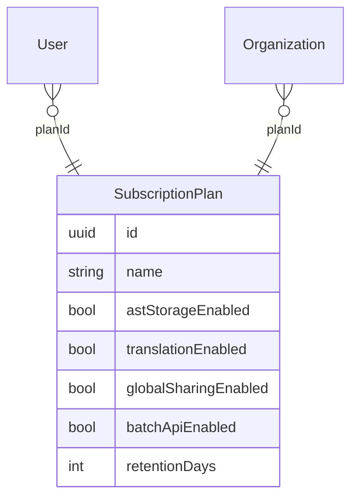
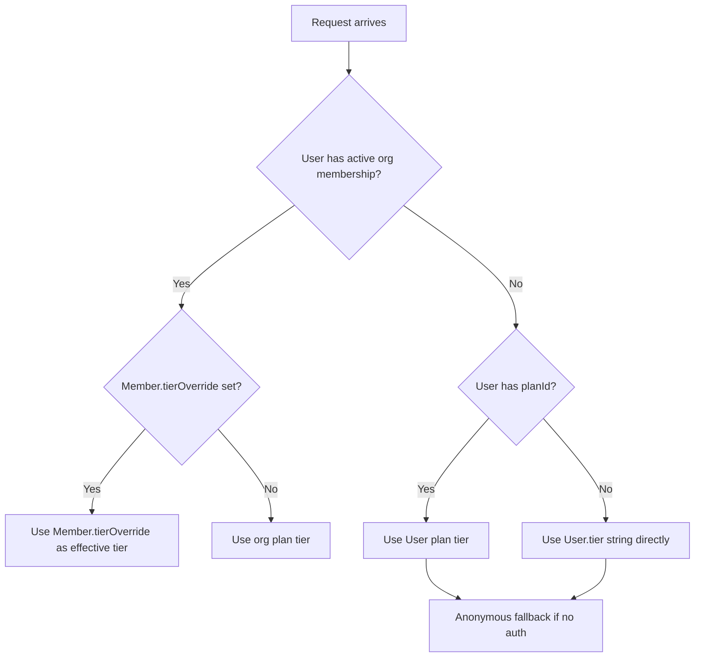

# Multi-Tenancy Architecture

## Architecture Decision: Shared-Schema Multi-Tenancy

Adblock Compiler uses a **multi-tenant, shared-schema** approach: all organisations and users share the same database tables. Rows are discriminated by `organizationId` (for org-owned resources) or `ownerUserId` (for user-owned resources), combined with a `visibility` field that controls access and discoverability.

### Why Not the Alternatives?

| Strategy | Description | Why Not Chosen |
|---|---|---|
| **Single-tenant** | One database / schema per customer | Cost-prohibitive at scale; no shared global resources (public lists, ranked configs) |
| **Schema-per-tenant** | Separate PostgreSQL schema per org | Prisma does not natively support schema-per-tenant; migrations would require custom tooling |
| **DB-per-tenant** | Separate Neon project per org | Reserved for future enterprise tier — see [Enterprise Isolation](#enterprise-isolation-pathway) |
| **Shared schema (chosen)** | All orgs in same tables, `organizationId` FK + `visibility` | Fits scale (dozens of orgs), enables global sharing, compatible with Prisma/Neon Hyperdrive |

---

## User Personas and Data Access

| Persona | Auth State | Storage | AST | Translation | Sharing | Rate Limits |
|---|---|---|---|---|---|---|
| **Anonymous** | No account | None | No | No | No | Strict (compile-only) |
| **Free** | Authenticated | Personal only | No | No | No | 60 req/min, 1000/day |
| **Pro** | Authenticated | Personal + public sharing | Yes | Yes | Global | 300 req/min, 10k/day |
| **Vendor** | Org account | Org-scoped + global sharing | Yes | Yes | Global + featured | 1000 req/min, 100k/day |
| **Enterprise** | Org account | Org-scoped + global sharing | Yes | Yes | Global + featured | Same as Vendor |

### Anonymous Users

Anonymous (unauthenticated) users can compile filter lists but:

- No persistent state — compilations are not saved
- No history, no AST storage, no translation
- Compilation events are logged with `userId = NULL`
- Rate limited by IP address (Cloudflare WAF rules) rather than API key

---

## Ownership Model

Every multi-tenant resource has one of the following ownership configurations:

| Configuration | Meaning |
|---|---|
| `ownerUserId` set, `organizationId` null | Personally owned by an individual user |
| `organizationId` set, `ownerUserId` null | Owned by an organisation (accessible to all members) |
| Both null | System-managed / global resource (e.g. public EasyList, Hagezi sources) |

This applies to: `FilterSource`, `Configuration`, `CompiledOutput`, `FilterListAst`.

---

## The `visibility` Enum

Resources have a `visibility` field that controls discoverability and access:

| Value | Meaning |
|---|---|
| `private` | Only the owner (user or org members) can see and use this resource |
| `org` | All members of the owning organisation can see and use it |
| `public` | Globally discoverable and usable by any authenticated user |
| `featured` | Admin-curated; pinned at the top of discovery UI (admin-set only) |

### Visibility by Resource Type

| Resource | `private` | `org` | `public` | `featured` |
|---|---|---|---|---|
| `FilterSource` | Owner only | Org members | Anyone authenticated | Pinned in discovery UI |
| `Configuration` | Owner only | Org members | Rankable, forkable | N/A (use `public` + admin pin) |
| `CompiledOutput` | Owner only | Org members | Anyone can reuse cached output | N/A |
| `FilterListAst` | Owner only | Org members | Anyone authenticated | N/A |

---

## SubscriptionPlan: Feature Gating

The `SubscriptionPlan` model is the single source of truth for what a user or organisation can do:

### Feature Flag Fields

| Field | Free | Pro | Vendor | Enterprise |
|---|---|---|---|---|
| `astStorageEnabled` | No | Yes | Yes | Yes |
| `translationEnabled` | No | Yes | Yes | Yes |
| `globalSharingEnabled` | No | Yes | Yes | Yes |
| `batchApiEnabled` | No | No | Yes | Yes |
| `isOrgOnly` | No | No | Yes | Yes |
| `retentionDays` | 90 | 180 | 365 | 730 |

The `isOrgOnly` flag prevents vendor/enterprise plans from being assigned to individual users (only organisations can hold these plans).

### Denormalized `tier` Field

Both `User.tier` and `Organization.tier` are denormalized caches of `plan.name`. They exist for fast reads on the Worker hot path without a JOIN. **The `planId` FK is authoritative** — keep `tier` in sync whenever `planId` changes.

---

## Organisation Tiers and Per-Member Overrides

When a user is a member of an organisation, their effective tier is derived from the org's plan:

`Member.tierOverride` allows org admins to limit a specific member to a lower tier than the org plan. For example, a vendor org can invite a contractor and restrict them to `pro` features only.

---

## Rate Limiting

Rate limits are enforced at two levels:

1. **Per-key** (`ApiKey.rateLimitPerMinute`): Fast path, checked in Worker middleware on every request
2. **Per-plan** (`SubscriptionPlan.rateLimitPerMinute` / `rateLimitPerDay`): Enforced as the ceiling for the user/org's plan tier

Org-level plans (vendor, enterprise) have limits unavailable to solo users (`free`, `pro`). Exceeding either limit results in `429 Too Many Requests`.

---

## Data Retention and Consent

Each user and organisation must accept the data retention policy before accessing persistent storage features. The `DataRetentionConsent` table is an **append-only** audit log:

- A new row is inserted each time the policy version changes and the user/org re-accepts
- Rows are **never deleted** — they form a compliance audit trail
- The `policyVersion` field (e.g. `"2026-04"`) is bumped whenever the retention policy changes materially
- Users and orgs are informed of `dataCategories` (what is stored), why it is stored, and `retentionDays` (how long)

---

## Enterprise Isolation Pathway

The current shared-schema architecture is designed to accommodate dozens of organisations efficiently. For future enterprise customers requiring hard database-level isolation (compliance, contractual, regulatory), the following pathway is available via [Neon branching](../database-setup/neon-branching.md):

1. A dedicated Neon **branch** (or project) is provisioned per enterprise org
2. The Worker reads the org's `metadata` field (JSON) to resolve which Hyperdrive binding or connection string to use
3. Prisma migrations are applied to the branch independently
4. Data is logically and physically isolated at the database level

This pathway is gated behind the `enterprise` tier with a custom contract. See [`docs/database-setup/neon-branching.md`](../database-setup/neon-branching.md) for Neon branching details.
