# System Architecture

This document describes the current (monolithic) architecture of the adblock-compiler service and the target architecture after the monolith is decomposed into discrete, independently deployable packages and services.

---

## Current Architecture

```mermaid
flowchart TD
    %% ── Clients ──────────────────────────────────────────────────────────────
    Browser["🌐 Browser"]
    CLIUser["💻 CLI User\n(Deno CLI)"]
    CICD["⚙️ CI/CD Pipeline"]
    MCPAgent["🤖 AI Agent / MCP Client"]

    %% ── Edge / Zero Trust perimeter ─────────────────────────────────────────
    CFAccess["☁️ Cloudflare Access\n(Zero Trust / WAF)"]
    CFTurnstile["🛡️ Cloudflare Turnstile\n(Human Verification)"]

    %% ── Angular Frontend (Pages) ─────────────────────────────────────────────
    Frontend["📱 Angular 21 SSR SPA\n(Cloudflare Pages)"]

    %% ── Monolithic Worker ────────────────────────────────────────────────────
    subgraph MonolithWorker["adblock-compiler Worker  (worker/worker.ts)"]
        WorkerEntry["worker.ts\n(fetch · queue · scheduled · tail)"]
        HonoApp["hono-app.ts\n(Hono Router)"]
        Handlers["handlers/\ncompile · admin · auth · metrics\nqueue · websocket · proxy"]
        Workflows["workflows/\nCompilation · Batch\nCacheWarming · HealthMonitoring"]
        MCPAgentWorker["mcp-agent.ts\n(Playwright / CF Browser Rendering)"]
        TailWorker["tail.ts\n(Tail Worker / Log Sink)"]

        subgraph CoreLib["src/  (Core Library — inlined in monolith)"]
            Compiler["compiler/\nFilterCompiler · SourceCompiler\nIncrementalCompiler · WorkerCompiler"]
            Transformations["transformations/\n15+ strategies"]
            Downloader["downloader/\nFilterDownloader · PreprocessorEvaluator"]
            Config["configuration/\nZod schemas · ConfigurationValidator"]
            Storage["storage/\nIStorageAdapter\nD1 · Hyperdrive · Prisma adapters"]
            Services["services/\nFilterService · AnalyticsService\nPipelineService"]
            Queue["queue/\nIQueueProvider\nCloudflareQueueProvider"]
            Diagnostics["diagnostics/\nTracingContext · OTel exporter"]
            Formatters["formatters/\nadblock · hosts · dnsmasq · domains"]
            Diff["diff/  DiffReport"]
            Plugins["plugins/  PluginRegistry"]
            Utils["utils/\nCircuitBreaker · AsyncRetry · Logger"]
        end

        WorkerEntry --> HonoApp
        HonoApp --> Handlers
        HonoApp --> Workflows
        HonoApp --> MCPAgentWorker
        Handlers --> CoreLib
        Workflows --> CoreLib
    end

    %% ── Cloudflare Platform Bindings ─────────────────────────────────────────
    subgraph CFBindings["Cloudflare Platform Bindings"]
        KV_Cache["KV: COMPILATION_CACHE"]
        KV_RateLimit["KV: RATE_LIMIT"]
        KV_Metrics["KV: METRICS"]
        D1["D1 (SQLite): DB"]
        CFQueues["Queues\nADBLOCK_COMPILER_QUEUE\nADBLOCK_COMPILER_QUEUE_HIGH_PRIORITY"]
        AnalyticsEngine["Analytics Engine"]
        CFAssets["Assets (Cloudflare Pages)"]
        BrowserRendering["CF Browser Rendering"]
    end

    %% ── External Services ────────────────────────────────────────────────────
    subgraph ExternalServices["External Services"]
        Clerk["🔑 Clerk\n(User Auth · JWT · Webhooks)"]
        Sentry["🔍 Sentry\n(Errors · Tracing)"]
        OTel["📊 OpenTelemetry\n(Spans · Exporters)"]
        PostgreSQL["🐘 PostgreSQL\n(via Hyperdrive)"]
        FilterSources["📋 Filter List Sources\n(EasyList · uBlock etc.)"]
    end

    %% ── Auth Stack ───────────────────────────────────────────────────────────
    LocalJWT["🔐 Local HS256 JWT\n(dev mode)"]
    APIKeys["🗝️ API Keys\n(PostgreSQL / Hyperdrive)"]

    %% ── Connections ──────────────────────────────────────────────────────────
    Browser --> CFAccess
    MCPAgent --> CFAccess
    CICD --> CFAccess
    Browser --> CFTurnstile
    CFAccess --> Frontend
    CFAccess --> MonolithWorker
    CFTurnstile --> MonolithWorker
    CLIUser --> CoreLib

    Frontend --> MonolithWorker

    MonolithWorker --> KV_Cache
    MonolithWorker --> KV_RateLimit
    MonolithWorker --> KV_Metrics
    MonolithWorker --> D1
    MonolithWorker --> CFQueues
    MonolithWorker --> AnalyticsEngine
    MonolithWorker --> BrowserRendering
    Frontend --> CFAssets

    MonolithWorker --> Clerk
    MonolithWorker --> Sentry
    MonolithWorker --> OTel
    MonolithWorker --> PostgreSQL
    MonolithWorker --> FilterSources
    MonolithWorker --> LocalJWT
    MonolithWorker --> APIKeys

    TailWorker --> Sentry
    TailWorker --> OTel

    %% ── Class Definitions ────────────────────────────────────────────────────
    classDef client        fill:#4A90D9,stroke:#2C5F8A,color:#fff
    classDef edge          fill:#7B68EE,stroke:#4B3FA0,color:#fff
    classDef worker        fill:#E8A838,stroke:#B07820,color:#fff
    classDef corelib       fill:#F0C040,stroke:#C09010,color:#333
    classDef storage       fill:#5BA85A,stroke:#3A7039,color:#fff
    classDef observability fill:#D9534F,stroke:#A02B28,color:#fff
    classDef auth          fill:#9B59B6,stroke:#6C3483,color:#fff
    classDef external      fill:#7F8C8D,stroke:#555F60,color:#fff

    class Browser,CLIUser,CICD,MCPAgent client
    class CFAccess,CFTurnstile edge
    class Frontend worker
    class WorkerEntry,HonoApp,Handlers,Workflows,MCPAgentWorker,TailWorker worker
    class Compiler,Transformations,Downloader,Config,Services,Formatters,Diff,Plugins,Utils corelib
    class Storage,D1,KV_Cache,KV_RateLimit,KV_Metrics,CFQueues,CFAssets,PostgreSQL storage
    class AnalyticsEngine,BrowserRendering,Sentry,OTel observability
    class Clerk,LocalJWT,APIKeys auth
    class FilterSources external
```

### Summary

The current system is a **monolith**: every concern — compilation, transformation, storage, queuing, diagnostics, plugins, and formatters — lives inside a single Cloudflare Worker alongside its Hono router and request handlers. The Angular SSR frontend is deployed as a Cloudflare Pages app that calls the same Worker. Cloudflare Access and Turnstile form the Zero Trust perimeter before any request reaches the Worker, and external services (Clerk, Sentry, OpenTelemetry, PostgreSQL, and filter-list sources) are consumed directly from within the single process. This coupling makes it difficult to evolve, version, or deploy individual capabilities independently.

---

## Target Architecture

```mermaid
flowchart TD
    %% ── Clients ──────────────────────────────────────────────────────────────
    Browser["🌐 Browser"]
    CLIUser["💻 CLI User\n(Deno CLI)"]
    CICD["⚙️ CI/CD Pipeline"]
    MCPAgent["🤖 AI Agent / MCP Client"]

    %% ── Edge / Zero Trust perimeter ─────────────────────────────────────────
    CFAccess["☁️ Cloudflare Access\n(Zero Trust / WAF)"]
    CFTurnstile["🛡️ Cloudflare Turnstile\n(Human Verification)"]

    %% ── Angular Frontend (Pages) ─────────────────────────────────────────────
    subgraph FrontendApp["adblock-compiler-frontend  (Cloudflare Pages)"]
        AngularSSR["Angular 21 SSR SPA"]
        HonoRPC["Hono RPC Client\nhc&lt;AppType&gt;()"]
        AngularSSR --> HonoRPC
    end

    %% ── Standalone CLI ───────────────────────────────────────────────────────
    DenoCliPkg["adblock-compiler-cli\n(Standalone Deno binary)"]

    %% ── Thin API Worker ──────────────────────────────────────────────────────
    subgraph APIWorker["adblock-compiler-api  (Cloudflare Worker — thin routing layer)"]
        HonoRouter["hono-app.ts\n(OpenAPIHono Router)"]
        APIHandlers["handlers/\ncompile · admin · auth\nmetrics · queue · websocket"]
    end

    %% ── Worker Service Bindings ──────────────────────────────────────────────
    subgraph WorkflowsWorker["adblock-compiler-workflows\n(Cloudflare Worker — service binding)"]
        DurableWorkflows["Durable Workflows\nCompilation · Batch\nCacheWarming · HealthMonitoring"]
    end

    subgraph MCPWorker["adblock-compiler-mcp\n(Cloudflare Worker — service binding)"]
        PlaywrightMCP["Playwright MCP Agent\n(CF Browser Rendering)"]
    end

    %% ── JSR Packages ─────────────────────────────────────────────────────────
    subgraph JSRPackages["JSR Packages  (independently published)"]
        CorePkg["@jk-com/adblock-compiler\n(core)\ncompiler · transformations\ndownloader · formatters\ndiff · plugins · utils"]
        StoragePkg["@jk-com/adblock-storage\nIStorageAdapter\nD1 · Hyperdrive · Prisma adapters"]
        QueuePkg["@jk-com/adblock-queue\nIQueueProvider\nCloudflareQueueProvider"]
        DiagnosticsPkg["@jk-com/adblock-diagnostics\nTracingContext · OTel exporter\nAnalyticsService"]
    end

    %% ── Cloudflare Platform Bindings ─────────────────────────────────────────
    subgraph CFBindings["Cloudflare Platform Bindings"]
        KV_Cache["KV: COMPILATION_CACHE"]
        KV_RateLimit["KV: RATE_LIMIT"]
        KV_Metrics["KV: METRICS"]
        D1["D1 (SQLite): DB"]
        CFQueues["Queues\nADBLOCK_COMPILER_QUEUE\nADBLOCK_COMPILER_QUEUE_HIGH_PRIORITY"]
        AnalyticsEngine["Analytics Engine"]
        CFAssets["Assets (Cloudflare Pages)"]
        BrowserRendering["CF Browser Rendering"]
    end

    %% ── External Services ────────────────────────────────────────────────────
    subgraph ExternalServices["External Services"]
        Clerk["🔑 Clerk\n(User Auth · JWT · Webhooks)"]
        Sentry["🔍 Sentry\n(Errors · Tracing)"]
        OTel["📊 OpenTelemetry\n(Spans · Exporters)"]
        PostgreSQL["🐘 PostgreSQL\n(via Hyperdrive)"]
        FilterSources["📋 Filter List Sources\n(EasyList · uBlock etc.)"]
    end

    %% ── Auth Stack ───────────────────────────────────────────────────────────
    LocalJWT["🔐 Local HS256 JWT\n(dev mode)"]
    APIKeys["🗝️ API Keys\n(PostgreSQL / Hyperdrive)"]

    %% ── Connections ──────────────────────────────────────────────────────────
    Browser --> CFAccess
    MCPAgent --> CFAccess
    CICD --> CFAccess
    Browser --> CFTurnstile
    CFAccess --> FrontendApp
    CFAccess --> APIWorker
    CFTurnstile --> APIWorker

    CLIUser --> DenoCliPkg
    DenoCliPkg --> CorePkg

    HonoRPC --> APIWorker
    FrontendApp --> CFAssets

    APIWorker --> WorkflowsWorker
    APIWorker --> MCPWorker
    MCPWorker --> BrowserRendering

    APIWorker --> CorePkg
    APIWorker --> StoragePkg
    APIWorker --> QueuePkg
    APIWorker --> DiagnosticsPkg

    WorkflowsWorker --> CorePkg
    WorkflowsWorker --> DiagnosticsPkg

    APIWorker --> KV_Cache
    APIWorker --> KV_RateLimit
    APIWorker --> KV_Metrics
    APIWorker --> D1
    APIWorker --> CFQueues
    APIWorker --> AnalyticsEngine

    StoragePkg --> D1
    StoragePkg --> PostgreSQL
    QueuePkg --> CFQueues
    DiagnosticsPkg --> AnalyticsEngine
    DiagnosticsPkg --> OTel
    DiagnosticsPkg --> Sentry

    APIWorker --> Clerk
    APIWorker --> LocalJWT
    APIWorker --> APIKeys
    APIWorker --> FilterSources

    %% ── Class Definitions ────────────────────────────────────────────────────
    classDef client        fill:#4A90D9,stroke:#2C5F8A,color:#fff
    classDef edge          fill:#7B68EE,stroke:#4B3FA0,color:#fff
    classDef worker        fill:#E8A838,stroke:#B07820,color:#fff
    classDef jsrpkg        fill:#F0C040,stroke:#C09010,color:#333
    classDef storage       fill:#5BA85A,stroke:#3A7039,color:#fff
    classDef observability fill:#D9534F,stroke:#A02B28,color:#fff
    classDef auth          fill:#9B59B6,stroke:#6C3483,color:#fff
    classDef external      fill:#7F8C8D,stroke:#555F60,color:#fff

    class Browser,CLIUser,CICD,MCPAgent client
    class CFAccess,CFTurnstile edge
    class AngularSSR,HonoRPC,DenoCliPkg,HonoRouter,APIHandlers,DurableWorkflows,PlaywrightMCP worker
    class CorePkg,StoragePkg,QueuePkg,DiagnosticsPkg jsrpkg
    class D1,KV_Cache,KV_RateLimit,KV_Metrics,CFQueues,CFAssets,PostgreSQL storage
    class AnalyticsEngine,BrowserRendering,Sentry,OTel observability
    class Clerk,LocalJWT,APIKeys auth
    class FilterSources external
```

### Summary

The target architecture **decomposes the monolith into independently deployable units**. The four core concerns — compilation/transformations, storage adapters, queue abstractions, and diagnostics/tracing — are extracted into dedicated JSR packages (`@jk-com/adblock-compiler`, `@jk-com/adblock-storage`, `@jk-com/adblock-queue`, `@jk-com/adblock-diagnostics`) that can be versioned and published independently. The Cloudflare Worker becomes a thin routing layer (`adblock-compiler-api`) that imports these packages as dependencies and delegates to two separate Worker service bindings — `adblock-compiler-workflows` for Durable Workflows and `adblock-compiler-mcp` for the Playwright MCP agent. The Angular SSR frontend remains on Cloudflare Pages but now uses the Hono RPC client (`hc<AppType>()`) for fully type-safe API calls, while the Deno CLI becomes its own standalone binary that depends only on the core library. The Zero Trust perimeter (Cloudflare Access + Turnstile), platform bindings, and external services remain unchanged — only the internal structure is simplified.
