# System Architecture

This document describes the current (monolithic) architecture of the bloqr-backend service and the target architecture after the monolith is decomposed into discrete, independently deployable packages and services.

---

## Current Architecture

```mermaid
flowchart TD
    %% ── Clients ──────────────────────────────────────────────────────────────
    Browser["Browser"]
    CLIUser["CLI User\n(Deno CLI)"]
    CICD["CI/CD Pipeline"]
    MCPAgent["AI Agent / MCP Client"]

    %% ── Edge / Zero Trust perimeter ─────────────────────────────────────────
    CFAccess["Cloudflare Access\n(Zero Trust / WAF)"]
    CFTurnstile["Cloudflare Turnstile\n(Human Verification)"]

    %% ── Angular Frontend (separate SSR Worker — bloqr-frontend) ──────
    subgraph FrontendWorker["bloqr-frontend  (separate SSR Worker)"]
        Frontend["Angular 21 SSR SPA\n(AngularAppEngine)"]
        FrontendAssets["ASSETS binding\n(JS/CSS/fonts — CDN)"]
        FrontendAPI["[[services]] API binding\n(wired in server.ts — routes /api/* internally)"]
    end

    %% ── Tail Worker (separate deployed service — bloqr-tail) ──────
    TailWorker["bloqr-tail\n(Tail Worker / Log Sink)"]

    %% ── Monolithic Worker ────────────────────────────────────────────────────
    subgraph MonolithWorker["bloqr-backend Worker  (worker/worker.ts)"]
        WorkerEntry["worker.ts\n(fetch · queue · scheduled · tail)"]
        HonoApp["hono-app.ts\n(Hono Router)"]
        Handlers["handlers/\ncompile · admin · auth · metrics\nqueue · websocket · proxy"]
        Workflows["workflows/\nCompilation · Batch\nCacheWarming · HealthMonitoring"]
        MCPAgentWorker["mcp-agent.ts\n(Playwright / CF Browser Rendering)"]
        BetterAuth["Better Auth\n(in-Worker · Neon / Hyperdrive)"]

        subgraph CoreLib["src/  (Core Library — inlined in monolith)"]
            Compiler["compiler/\nFilterCompiler · SourceCompiler\nIncrementalCompiler · WorkerCompiler"]
            Transformations["transformations/\n15+ strategies"]
            Downloader["downloader/\nFilterDownloader · PreprocessorEvaluator"]
            Config["configuration/\nZod schemas · ConfigurationValidator"]
            Storage["storage/\nIStorageAdapter\nD1 · Hyperdrive · Prisma adapters"]
            Services["services/\nFilterService · AnalyticsService\nPipelineService"]
            Queue["queue/\nIQueueProvider\nCloudflareQueueProvider"]
            Diagnostics["diagnostics/\nTracingContext · OTel exporter"]
            Formatters["formatters/\nadblock · hosts · dnsmasq · domains"]
            Diff["diff/  DiffReport"]
            Plugins["plugins/  PluginRegistry"]
            Utils["utils/\nCircuitBreaker · AsyncRetry · Logger"]
        end

        WorkerEntry --> HonoApp
        HonoApp --> Handlers
        HonoApp --> Workflows
        HonoApp --> MCPAgentWorker
        Handlers --> CoreLib
        Workflows --> CoreLib
    end

    %% ── Cloudflare Platform Bindings (key bindings — see wrangler.toml for full list) ──
    subgraph CFBindings["Cloudflare Platform Bindings (key — see wrangler.toml for full list)"]
        CFAssets["ASSETS binding\n(Angular SPA static files)"]
        KV_Cache["KV: COMPILATION_CACHE"]
        KV_RateLimit["KV: RATE_LIMIT"]
        KV_Metrics["KV: METRICS"]
        D1_DB["D1: DB\n(main database)"]
        D1_Admin["D1: ADMIN_DB"]
        R2_Filter["R2: FILTER_STORAGE"]
        R2_Logs["R2: COMPILER_LOGS"]
        CFQueues["Queues\nBLOQR_BACKEND_QUEUE\nBLOQR_BACKEND_QUEUE_HIGH_PRIORITY"]
        AnalyticsEngine["Analytics Engine\n(ANALYTICS_ENGINE · METRICS_PIPELINE)"]
        BrowserRendering["BROWSER\n(CF Browser Rendering)"]
        HyperdriveBinding["HYPERDRIVE\n(PostgreSQL connection pool)"]
        DOBindings["Durable Objects\nADBLOCK_COMPILER · MCP_AGENT"]
        WorkflowBindings["Workflow bindings\nCOMPILATION_WORKFLOW · BATCH_COMPILATION_WORKFLOW\nCACHE_WARMING_WORKFLOW · HEALTH_MONITORING_WORKFLOW"]
    end

    %% ── External Services ────────────────────────────────────────────────────
    subgraph ExternalServices["External Services"]
        Sentry["Sentry\n(Errors · Tracing)"]
        OTel["OpenTelemetry\n(Spans · Exporters)"]
        PostgreSQL["PostgreSQL\n(via Hyperdrive)"]
        FilterSources["Filter List Sources\n(EasyList · uBlock etc.)"]
    end

    %% ── Auth Stack ───────────────────────────────────────────────────────────
    LocalJWT["Local HS256 JWT\n(dev mode)"]
    APIKeys["API Keys\n(PostgreSQL / Hyperdrive)"]

    %% ── Connections ──────────────────────────────────────────────────────────
    Browser --> CFAccess
    MCPAgent --> CFAccess
    CICD --> CFAccess
    Browser --> CFTurnstile
    CFAccess --> FrontendWorker
    CFAccess --> MonolithWorker
    CFTurnstile --> MonolithWorker
    CLIUser --> CoreLib

    Frontend --> MonolithWorker
    FrontendAPI -->|"internal route\n(CF-Worker-Source: ssr)"| MonolithWorker

    MonolithWorker --> CFAssets
    MonolithWorker --> KV_Cache
    MonolithWorker --> KV_RateLimit
    MonolithWorker --> KV_Metrics
    MonolithWorker --> D1_DB
    MonolithWorker --> D1_Admin
    MonolithWorker --> R2_Filter
    MonolithWorker --> R2_Logs
    MonolithWorker --> CFQueues
    MonolithWorker --> AnalyticsEngine
    MonolithWorker --> BrowserRendering
    MonolithWorker --> HyperdriveBinding
    MonolithWorker --> DOBindings
    MonolithWorker --> WorkflowBindings

    MonolithWorker --> TailWorker
    MonolithWorker --> Sentry
    MonolithWorker --> OTel
    MonolithWorker --> FilterSources
    MonolithWorker --> LocalJWT
    MonolithWorker --> APIKeys

    HyperdriveBinding --> PostgreSQL

    TailWorker --> Sentry
    TailWorker --> OTel

    %% ── Class Definitions ────────────────────────────────────────────────────
    classDef client        fill:#1d6fbd,stroke:#0d4a8a,color:#fff
    classDef edge          fill:#6a1fa0,stroke:#4a1570,color:#fff
    classDef worker        fill:#b05a10,stroke:#7a3d08,color:#fff
    classDef corelib       fill:#b8860b,stroke:#8a6208,color:#fff
    classDef storage       fill:#2e7d32,stroke:#1a5421,color:#fff
    classDef observability fill:#c62828,stroke:#8e1c1c,color:#fff
    classDef auth          fill:#37474f,stroke:#1a2327,color:#fff
    classDef external      fill:#37474f,stroke:#1a2327,color:#fff

    class Browser,CLIUser,CICD,MCPAgent client
    class CFAccess,CFTurnstile edge
    class Frontend,FrontendAssets,FrontendAPI,TailWorker worker
    class WorkerEntry,HonoApp,Handlers,Workflows,MCPAgentWorker worker
    class Compiler,Transformations,Downloader,Config,Services,Formatters,Diff,Plugins,Utils corelib
    class Storage,D1_DB,D1_Admin,KV_Cache,KV_RateLimit,KV_Metrics,CFQueues,CFAssets,R2_Filter,R2_Logs,HyperdriveBinding,PostgreSQL storage
    class DOBindings,WorkflowBindings storage
    class AnalyticsEngine,BrowserRendering,Sentry,OTel observability
    class BetterAuth,LocalJWT,APIKeys auth
    class FilterSources external
```

### Summary

The current system is a **monolith**: every concern — compilation, transformation, storage, queuing, diagnostics, plugins, and formatters — lives inside a single Cloudflare Worker alongside its Hono router and request handlers. The Angular SSR frontend is deployed as its **own separate Worker** (`bloqr-frontend`) using `AngularAppEngine`; the `[[services]]` binding to the backend is wired in `server.ts`, routing SSR-time `/api/*` calls to the backend over the internal Cloudflare network with a `CF-Worker-Source: ssr` header. Cloudflare Access and Turnstile form the Zero Trust perimeter before any request reaches either Worker. External services (Sentry, OpenTelemetry, PostgreSQL, and filter-list sources) are consumed directly from within the single backend process. Authentication is handled by Better Auth, which runs entirely within the Worker backed by Neon PostgreSQL via Cloudflare Hyperdrive. A dedicated `bloqr-tail` Worker (configured via `[[tail_consumers]]`) acts as the log sink, forwarding structured logs to Sentry and OTel. This coupling makes it difficult to evolve, version, or deploy individual capabilities independently.

---

## Target Architecture

```mermaid
flowchart TD
    %% ── Clients ──────────────────────────────────────────────────────────────
    Browser["Browser"]
    CLIUser["CLI User\n(Deno CLI)"]
    CICD["CI/CD Pipeline"]
    MCPAgent["AI Agent / MCP Client"]

    %% ── Edge / Zero Trust perimeter ─────────────────────────────────────────
    CFAccess["Cloudflare Access\n(Zero Trust / WAF)"]
    CFTurnstile["Cloudflare Turnstile\n(Human Verification)"]

    %% ── Angular Frontend (served via API Worker STATIC_ASSETS binding) ─────────────
    subgraph FrontendApp["bloqr-frontend  (Worker STATIC_ASSETS binding)"]
        AngularSSR["Angular 21 SSR SPA"]
        HonoRPC["Hono RPC Client\nhc&lt;AppType&gt;()"]
        AngularSSR --> HonoRPC
    end

    %% ── Standalone CLI ───────────────────────────────────────────────────────
    DenoCliPkg["bloqr-backend-cli\n(Standalone Deno binary)"]

    %% ── Thin API Worker ──────────────────────────────────────────────────────
    subgraph APIWorker["bloqr-backend-api  (Cloudflare Worker — thin routing layer)"]
        HonoRouter["hono-app.ts\n(OpenAPIHono Router)"]
        APIHandlers["handlers/\ncompile · admin · auth\nmetrics · queue · websocket"]
        BetterAuth["Better Auth\n(in-Worker · Neon / Hyperdrive)"]
    end

    %% ── Worker Service Bindings ──────────────────────────────────────────────
    subgraph WorkflowsWorker["bloqr-backend-workflows\n(Cloudflare Worker — service binding)"]
        DurableWorkflows["Durable Workflows\nCompilation · Batch\nCacheWarming · HealthMonitoring"]
    end

    subgraph MCPWorker["bloqr-backend-mcp\n(Cloudflare Worker — service binding)"]
        PlaywrightMCP["Playwright MCP Agent\n(CF Browser Rendering)"]
    end

    %% ── JSR Packages ─────────────────────────────────────────────────────────
    subgraph JSRPackages["JSR Packages  (independently published)"]
        CorePkg["@jk-com/adblock-compiler\n(core)\ncompiler · transformations\ndownloader · formatters\ndiff · plugins · utils"]
        StoragePkg["@jk-com/adblock-storage\nIStorageAdapter\nD1 · Hyperdrive · Prisma adapters"]
        QueuePkg["@jk-com/adblock-queue\nIQueueProvider\nCloudflareQueueProvider"]
        DiagnosticsPkg["@jk-com/adblock-diagnostics\nTracingContext · OTel exporter\nAnalyticsService"]
    end

    %% ── Cloudflare Platform Bindings (key bindings — see wrangler.toml for full list) ──
    subgraph CFBindings["Cloudflare Platform Bindings (key — see wrangler.toml for full list)"]
        KV_Cache["KV: COMPILATION_CACHE"]
        KV_RateLimit["KV: RATE_LIMIT"]
        KV_Metrics["KV: METRICS"]
        D1["D1: DB / ADMIN_DB"]
        R2Buckets["R2: FILTER_STORAGE\nCOMPILER_LOGS"]
        CFQueues["Queues\nBLOQR_BACKEND_QUEUE\nBLOQR_BACKEND_QUEUE_HIGH_PRIORITY"]
        AnalyticsEngine["Analytics Engine\n(ANALYTICS_ENGINE · METRICS_PIPELINE)"]
        CFAssets["ASSETS binding\n(Angular SPA static files)"]
        BrowserRendering["BROWSER\n(CF Browser Rendering)"]
        HyperdriveBinding["HYPERDRIVE\n(PostgreSQL connection pool)"]
    end

    %% ── External Services ────────────────────────────────────────────────────
    subgraph ExternalServices["External Services"]
        Sentry["Sentry\n(Errors · Tracing)"]
        OTel["OpenTelemetry\n(Spans · Exporters)"]
        PostgreSQL["PostgreSQL\n(via Hyperdrive)"]
        FilterSources["Filter List Sources\n(EasyList · uBlock etc.)"]
    end

    %% ── Auth Stack ───────────────────────────────────────────────────────────
    LocalJWT["Local HS256 JWT\n(dev mode)"]
    APIKeys["API Keys\n(PostgreSQL / Hyperdrive)"]

    %% ── Connections ──────────────────────────────────────────────────────────
    Browser --> CFAccess
    MCPAgent --> CFAccess
    CICD --> CFAccess
    Browser --> CFTurnstile
    CFAccess --> FrontendApp
    CFAccess --> APIWorker
    CFTurnstile --> APIWorker

    CLIUser --> DenoCliPkg
    DenoCliPkg --> CorePkg

    HonoRPC --> APIWorker
    APIWorker --> CFAssets

    APIWorker --> WorkflowsWorker
    APIWorker --> MCPWorker
    MCPWorker --> BrowserRendering

    APIWorker --> CorePkg
    APIWorker --> StoragePkg
    APIWorker --> QueuePkg
    APIWorker --> DiagnosticsPkg

    WorkflowsWorker --> CorePkg
    WorkflowsWorker --> DiagnosticsPkg

    APIWorker --> KV_Cache
    APIWorker --> KV_RateLimit
    APIWorker --> KV_Metrics
    APIWorker --> D1
    APIWorker --> R2Buckets
    APIWorker --> CFQueues
    APIWorker --> AnalyticsEngine
    APIWorker --> HyperdriveBinding

    StoragePkg --> D1
    StoragePkg --> R2Buckets
    StoragePkg --> HyperdriveBinding
    HyperdriveBinding --> PostgreSQL
    QueuePkg --> CFQueues
    DiagnosticsPkg --> AnalyticsEngine
    DiagnosticsPkg --> OTel
    DiagnosticsPkg --> Sentry

    APIWorker --> LocalJWT
    APIWorker --> APIKeys
    APIWorker --> FilterSources

    %% ── Class Definitions ────────────────────────────────────────────────────
    classDef client        fill:#1d6fbd,stroke:#0d4a8a,color:#fff
    classDef edge          fill:#6a1fa0,stroke:#4a1570,color:#fff
    classDef worker        fill:#b05a10,stroke:#7a3d08,color:#fff
    classDef jsrpkg        fill:#b8860b,stroke:#8a6208,color:#fff
    classDef storage       fill:#2e7d32,stroke:#1a5421,color:#fff
    classDef observability fill:#c62828,stroke:#8e1c1c,color:#fff
    classDef auth          fill:#37474f,stroke:#1a2327,color:#fff
    classDef external      fill:#37474f,stroke:#1a2327,color:#fff

    class Browser,CLIUser,CICD,MCPAgent client
    class CFAccess,CFTurnstile edge
    class AngularSSR,HonoRPC,DenoCliPkg,HonoRouter,APIHandlers,DurableWorkflows,PlaywrightMCP worker
    class CorePkg,StoragePkg,QueuePkg,DiagnosticsPkg jsrpkg
    class D1,KV_Cache,KV_RateLimit,KV_Metrics,CFQueues,CFAssets,R2Buckets,HyperdriveBinding,PostgreSQL storage
    class AnalyticsEngine,BrowserRendering,Sentry,OTel observability
    class LocalJWT,APIKeys,BetterAuth auth
    class FilterSources external
```

### Summary

The target architecture **decomposes the monolith into independently deployable units**. The four core concerns — compilation/transformations, storage adapters, queue abstractions, and diagnostics/tracing — are extracted into dedicated JSR packages (`@jk-com/adblock-compiler`, `@jk-com/adblock-storage`, `@jk-com/adblock-queue`, `@jk-com/adblock-diagnostics`) that can be versioned and published independently. The Cloudflare Worker becomes a thin routing layer (`bloqr-backend-api`) that imports these packages as dependencies and delegates to two separate Worker service bindings: `bloqr-backend-workflows` for Durable Workflows and `bloqr-backend-mcp` for the Playwright MCP agent. The Angular SSR frontend continues to be served via the Worker `ASSETS` binding (not as a standalone Cloudflare Pages project), using the Hono RPC client (`hc<AppType>()`) for fully type-safe API calls. The Deno CLI becomes its own standalone binary that depends only on the core library. The Zero Trust perimeter (Cloudflare Access + Turnstile), platform bindings, and external services remain unchanged — only the internal structure is simplified. Better Auth replaces Clerk and runs entirely within the Worker backed by Neon PostgreSQL via Cloudflare Hyperdrive.
