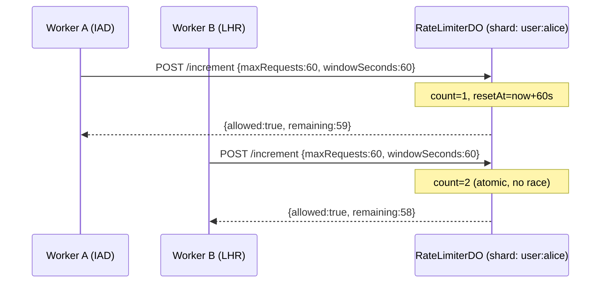
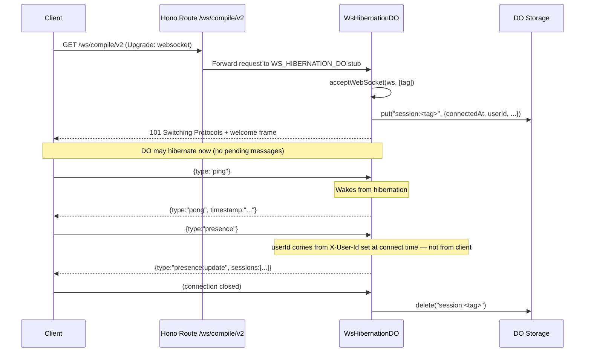

# Durable Objects

This document covers the Durable Objects (DOs) used in the Worker runtime and explains why each one exists, how it is structured, and when to use it.

## Overview

The Worker uses Durable Objects for three distinct concerns:

| Class | Binding | Purpose |
|---|---|---|
| `CompilationCoordinator` | `COMPILATION_COORDINATOR` | In-flight compile job deduplication |
| `RateLimiterDO` | `RATE_LIMITER_DO` | Atomic per-identity rate limiting |
| `WsHibernationDO` | `WS_HIBERNATION_DO` | Hibernatable WebSocket sessions + presence tracking |

All three Durable Objects are exported from `worker/worker.ts` and declared in `wrangler.toml`.

---

## `CompilationCoordinator`

**File:** `worker/compilation-coordinator.ts`

**Problem it solves:** When multiple Worker instances receive the same compilation request (same config hash) in quick succession, they would duplicate expensive work. The `CompilationCoordinator` ensures only one Worker performs the compilation while others wait for the result.

**How it works:**
- Uses an in-memory lock (`acquired: boolean`) per DO shard.
- First caller acquires the lock; subsequent callers block on `GET /wait` (long-poll with 30 s timeout).
- When compilation finishes the holder calls `POST /complete` or `POST /fail`; all waiters get the result.

**When to use:** Every async/queue compilation path routes through this DO to prevent thundering herd on popular filter lists.

---

## `RateLimiterDO`

**File:** `worker/rate-limiter-do.ts`

### Motivation

The original KV-based rate limiter uses `put`/`get` on Cloudflare KV which has **eventually consistent** read-after-write semantics. Under concurrent load (multiple Worker edge nodes), two Workers can read the same stale count and both allow a request that should be blocked.

A Durable Object is **strictly serialised**: every `fetch()` to the same DO instance runs one at a time. This makes the increment operation truly atomic — no race windows.

### Architecture



Each identity gets its own DO shard via `RATE_LIMITER_DO.idFromName(identity)`:
- Authenticated users: `ratelimit:user:<userId>`
- Anonymous: `ratelimit:ip:<clientIp>`

### Endpoints (internal — accessed via `DurableObjectStub.fetch()`)

| Method | Path | Description |
|---|---|---|
| `POST` | `/increment` | Atomic increment. Returns `{allowed, limit, remaining, resetAt}`. |
| `GET` | `/status` | Read current window state without incrementing. |
| `POST` | `/reset` | Force-reset the counter (admin / testing). |

### Alarm

After each new window is started, an `alarm()` is scheduled to fire 1 second after the window expires. This resets the in-memory counter and lets the DO hibernate immediately.

### Middleware Integration

`checkRateLimitTiered()` in `worker/middleware/index.ts` automatically prefers the DO path:

```
Request
  └─► Admin tier? → allowed:true (no DO/KV)
  └─► RATE_LIMITER_DO bound?
        ├─ Yes → POST /increment to DO shard
        │         ├─ 200 OK → return result
        │         └─ non-OK  → fall through to KV
        └─ No  → KV-based rate limiting (legacy)
```

### Zod Validation

All incoming request bodies are parsed with `IncrementRequestSchema`:

```ts
export const IncrementRequestSchema = z.object({
    maxRequests: z.number().int().positive(),
    windowSeconds: z.number().int().positive(),
});
```

Invalid bodies return `400 Bad Request`.

### Deployment

`RATE_LIMITER_DO` is declared in `wrangler.toml` under `[[durable_objects.bindings]]` and included in the `v4` migration (`new_sqlite_classes`). Deploy:

```sh
deno task wrangler:deploy
```

> **Note:** The DO binding is optional at the Worker binding level (`RATE_LIMITER_DO?: DurableObjectNamespace`). When absent, the middleware falls back to KV — this allows gradual rollout or local dev without a full Wrangler setup.

---

## `WsHibernationDO`

**File:** `worker/ws-hibernation-do.ts`

### Motivation

The original `handleWebSocketUpgrade()` (in `worker/websocket.ts`) calls `ws.accept()` and registers event listeners. This approach keeps the Worker isolate alive for the lifetime of each connection. For long-lived idle connections this wastes memory and incurs cost.

The Cloudflare **Hibernatable WebSocket API** lets a DO hibernate between messages: the DO's memory is freed when idle, but the underlying TCP/TLS connection is kept open by the Cloudflare edge. When the client sends a message, Cloudflare wakes the DO and dispatches `webSocketMessage()`.

Additionally, because each DO instance owns its connections, it can implement **session presence tracking** — knowing which users are currently connected.

### Key differences from `websocket.ts`

| | `websocket.ts` (`ws.accept()`) | `WsHibernationDO` |
|---|---|---|
| Idle cost | Isolate alive (memory + billing) | DO hibernates — zero idle cost |
| Connection limit | Bounded by isolate memory | Cloudflare-managed, scales further |
| State on wake-up | Fresh isolate, state lost | Restored from DO Storage |
| Session presence | None | `/sessions` endpoint |

### Architecture



### Endpoints (internal — accessed via `DurableObjectStub.fetch()`)

| Method | Path | Description |
|---|---|---|
| `GET` | `/ws` | WebSocket upgrade using the hibernatable API. Session tag is server-generated; `userId` is injected via `X-User-Id` header by the authenticated Worker route. |
| `GET` | `/sessions` | List all active session metadata from DO Storage. |
| `POST` | `/broadcast` | Push message to all (or tag-filtered) connected sockets. |
| `POST` | `/disconnect` | Force-close a tagged socket. |

### Hibernatable WebSocket Event Handlers

The DO implements three class-level methods that are called by the Cloudflare runtime:

```ts
webSocketMessage(ws, message)  // incoming message
webSocketClose(ws, code, reason, wasClean)  // client disconnected
webSocketError(ws, error)  // socket error
```

### Client Protocol

Clients connected to `/ws/compile/v2` communicate with JSON messages:

```ts
// Client → Server
{ type: "ping" }
{ type: "presence" }
{ type: "message", data: unknown }

// Server → Client
{ type: "welcome", tag: string, connectedAt: number }
{ type: "pong", timestamp: string }
{ type: "presence:update", sessions: SessionMeta[] }
{ type: "message:ack", data: unknown, timestamp: string }
{ type: "error", error: string }
```

All client messages are validated with `WsClientMessageSchema` (Zod discriminated union). Invalid messages receive an error frame.

### Session Presence

Session metadata is persisted in DO Storage under `session:<tag>`:

```ts
interface SessionMeta {
    tag: string;          // WebSocket tag / session ID
    connectedAt: number;  // Unix ms
    lastActivity: number; // Unix ms, updated on every message
    userId?: string;      // Authenticated user ID (optional)
}
```

Any Worker can query presence by calling `GET /sessions` on the DO stub for a given room.

### Route

The hibernatable endpoint is at `GET /ws/compile/v2` (registered in `compile.routes.ts`). The original `GET /ws/compile` remains unchanged for backward compatibility.

```sh
# Connect with a WebSocket client
wscat -c "wss://your-worker.example.com/api/ws/compile/v2"
```

### Deployment

`WS_HIBERNATION_DO` is declared in `wrangler.toml` alongside `RATE_LIMITER_DO` under the `v4` migration.

> **Note:** The binding is optional. If `WS_HIBERNATION_DO` is not bound, `GET /ws/compile/v2` returns `503 Service Unavailable`.

---

## Testing

Unit tests use lightweight in-memory stubs for `DurableObjectState` and `WebSocket`:

| File | Coverage |
|---|---|
| `worker/rate-limiter-do.test.ts` | Window management, atomic increment, alarm, reset, validation |
| `worker/ws-hibernation-do.test.ts` | Sessions, broadcast, disconnect, ping/pong, close/error lifecycle |
| `worker/middleware/index.test.ts` | DO path preferred, fallback to KV on DO error |

Run them with:

```sh
deno task test:worker
```

---

## ZTA Checklist

| Layer | Check |
|---|---|
| Auth | `/ws/compile/v2` goes through the existing Turnstile + JWT middleware before forwarding to the DO |
| Zod | All DO endpoint bodies validated with Zod; `400` on invalid |
| Secrets | No secrets inside DO code — DOs receive only the `Env` bindings |
| CORS | WebSocket upgrade requests are not subject to CORS (protocol upgrade) |
| Storage | DO Storage used only for session/window metadata — no PII beyond `userId` |
