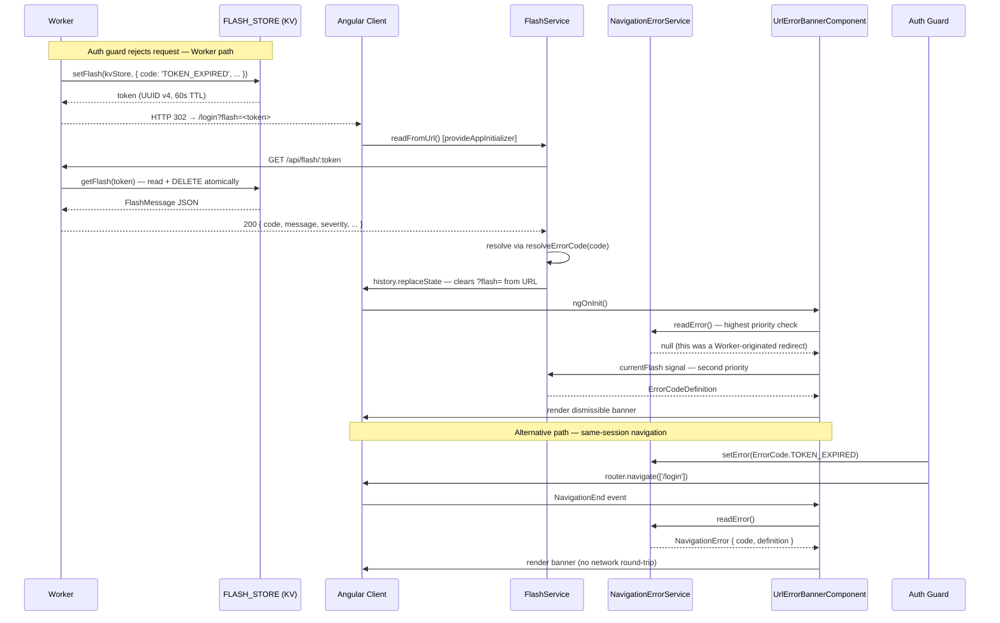

# Secure Error-Passing Architecture

The error-passing subsystem (PR #1748) provides a **zero-leakage** mechanism for surfacing structured, actionable error information from the Worker and authentication layer to the Angular frontend — without embedding sensitive implementation details in URLs, cookies, or browser history.

---

## Problem Statement

The naive approach to communicating errors across navigations is appending a query parameter to a redirect URL, for example `?error=TOKEN_EXPIRED`. This pattern is widely used but wrong for an authenticated application:

- **Leaks implementation details.** Error codes embedded in URLs are recorded in server access logs, browser history, CDN logs, and referrer headers. The error code string becomes part of your implicit API contract — renaming it is a breaking change.
- **No UX control.** The error state persists in the browser's address bar, history entries, and bookmarks. Users can share a link containing an error state; refreshing the page re-displays an error that may no longer be relevant.
- **Misuse potential.** Any user can craft a URL with `?error=FORBIDDEN` and navigate to it. While the display is cosmetic, it seeds confusion and can be weaponised in phishing attacks ("look, it says FORBIDDEN").
- **No structured metadata.** A query parameter is a single opaque string. There is no room for a severity level, a human-readable admin message, a call-to-action label, or a CTA route — all of which are required for a well-designed error UX.

The secure error-passing architecture solves this with three coordinated mechanisms:

1. **KV flash store** — one-time-read server-side tokens with a 60-second TTL.
2. **`NavigationErrorService`** — ephemeral in-process Router state for same-session navigations.
3. **`UrlErrorBannerComponent`** — a single unified banner that reads from all sources with a defined priority order.

---

## Full Architecture Overview

The sequence diagram below shows the full flow from Worker through KV to the Angular `FlashService`, as well as the alternative `NavigationErrorService` path for in-process navigation errors.



---

## KV Flash Store (`worker/lib/flash.ts`)

The flash store is a lightweight Cloudflare KV wrapper that enforces **consume-once** semantics. The token design makes flash messages safe to pass in redirect URLs:

- The token is an opaque UUID — it carries no information about the error, the user, or the session.
- The token is deleted from KV on the first successful read. Subsequent reads return `null`.
- The 60-second TTL ensures the token cannot be replayed after the immediate redirect window.

### `setFlash(kvStore, message)`

Generates a UUID v4 token, serialises the `message` payload as JSON, and stores it in KV under the key `flash:<uuid>` with a 60-second TTL. Returns the token string.

```typescript
// worker/lib/flash.ts
export async function setFlash(
    kvStore: KVNamespace,
    message: FlashMessage,
): Promise<string> {
    const token = crypto.randomUUID();           // 122-bit entropy, non-guessable
    await kvStore.put(
        `flash:${token}`,
        JSON.stringify(message),
        { expirationTtl: 60 },                  // 60-second TTL
    );
    return token;
}
```

**Design notes:**
- 60 seconds is long enough to survive a redirect + Angular bootstrap + app initializer.
- 60 seconds is short enough that a captured token URL cannot be replayed hours later.
- The `flash:` prefix namespaces the key to prevent collisions with other KV usage.

### `getFlash(kvStore, token)`

Reads and **immediately deletes** the flash entry (consume semantics). Returns the parsed `FlashMessage` on success, or `null` if the token is not found, already consumed, or expired.

```typescript
// worker/lib/flash.ts
export async function getFlash(
    kvStore: KVNamespace,
    token: string,
): Promise<FlashMessage | null> {
    const key  = `flash:${token}`;
    const raw  = await kvStore.get(key);

    if (!raw) return null;

    // Delete immediately — consume semantics
    // Non-blocking: we don't await the delete to avoid adding latency
    kvStore.delete(key);                        // fire-and-forget delete

    try {
        return JSON.parse(raw) as FlashMessage;
    } catch {
        return null;
    }
}
```

**Race condition note:** KV read and delete are not atomic operations. If two requests arrive simultaneously carrying the same token, one will receive the payload and the other will receive `null` (the token will already be deleted or the TTL will have expired by the time it retries). This is the correct behaviour — flash messages are intended for exactly one display. The window for this race is extremely small given the 60-second TTL and single-user redirect pattern.

---

## `GET /api/flash/:token` Endpoint (`worker/routes/flash.routes.ts`)

Exchanges a flash token for the corresponding error message payload.

| Property | Value |
|----------|-------|
| Auth | **None** — pre-auth endpoint (used on the login page before credentials exist) |
| Rate limiting | Applied at global middleware level via `checkRateLimitTiered` — do **not** apply a second rate limiter inside this route |
| Path parameter | `token` — UUID v4 string |

**Responses:**

| Status | Body | Condition |
|--------|------|-----------|
| `200` | `FlashMessage` JSON | Token found and consumed |
| `404` | `ProblemDetails` | Token not found, already consumed, or expired |
| `503` | `ProblemDetails` | `FLASH_STORE` KV binding not provisioned |

**Security note:** The `404` response is identical whether the token never existed, was already consumed, or has expired. This prevents timing-oracle attacks that could reveal token state. There is no `410 Gone` — the caller cannot distinguish "already consumed" from "never existed."

---

## `POST /api/log/frontend-error` Endpoint (`worker/routes/log.routes.ts`)

Persists Angular client-side errors to the `error_events` D1 table for offline analysis.

| Property | Value |
|----------|-------|
| Auth | **None** — pre-auth endpoint (captures errors that occur before login) |
| Body size | Enforced by `bodySizeMiddleware` (64 KB cap) |
| Schema | `FrontendErrorBodySchema` (Zod, see below) |
| Response | `204 No Content` on success |

### `FrontendErrorBodySchema`

```typescript
// worker/routes/log.routes.ts
const FrontendErrorBodySchema = z.object({
    source:     z.enum(['angular', 'worker', 'browser']),
    severity:   z.enum(['low', 'medium', 'high', 'critical']),
    message:    z.string().max(2048),
    stack:      z.string().max(8192).optional(),
    context:    z.record(z.unknown()).optional(),
    url:        z.string().url().optional(),
    userAgent:  z.string().max(512).optional(),
    sessionId:  z.string().max(128).optional(),
});
```

**Anti-spoofing:** Although `source` is present in the schema above for documentation purposes, the value written to D1 is **always hard-coded server-side** to `'angular'` (or the appropriate Worker-derived value). The client-submitted `source` field is accepted for schema validation but is **not** used in the D1 insert — the server overwrites it. This prevents clients from spoofing their source classification.

**Non-blocking write:** The D1 insert is scheduled via `c.executionCtx.waitUntil(...)`. The `204 No Content` response is returned before the write completes. This keeps the error-reporting path out of the hot path and ensures that a slow D1 write never delays the frontend UI.

---

## `error_events` D1 Table Schema

Schema introduced in `migrations/0012_error_events.sql` (repo root `migrations/` directory, co-located with `wrangler.toml`):

```sql
CREATE TABLE IF NOT EXISTS error_events (
    id         TEXT PRIMARY KEY DEFAULT (lower(hex(randomblob(16)))),
    source     TEXT NOT NULL,
    severity   TEXT NOT NULL CHECK(severity IN ('low','medium','high','critical')),
    message    TEXT NOT NULL,
    stack      TEXT,
    context    TEXT,
    url        TEXT,
    user_agent TEXT,
    session_id TEXT,
    created_at DATETIME NOT NULL DEFAULT (datetime('now'))
);

CREATE INDEX IF NOT EXISTS idx_error_events_created_at ON error_events(created_at DESC);
CREATE INDEX IF NOT EXISTS idx_error_events_severity    ON error_events(severity);
CREATE INDEX IF NOT EXISTS idx_error_events_source      ON error_events(source);
```

**Schema notes:**
- `id` uses `randomblob(16)` hex-encoded for a compact random primary key.
- `severity` is constrained to the four canonical levels; the Zod schema at the API boundary enforces the same constraint before the insert reaches D1.
- `context` is stored as JSON text (SQLite has no native JSON column type) — cast on read.
- `created_at` uses SQLite's `datetime('now')` which records UTC. All timestamps in the admin dashboard should be displayed with a UTC offset.

---

## Angular Error Code Registry (`frontend/src/app/error/error-codes.ts`)

All user-facing error codes are defined in a single registry file. This is the **single source of truth** for error display — no error string should be hard-coded in a component template.

### `ErrorCode` Enum

```typescript
export enum ErrorCode {
    TOKEN_EXPIRED        = 'TOKEN_EXPIRED',
    INVALID_CREDENTIALS  = 'INVALID_CREDENTIALS',
    ACCOUNT_LOCKED       = 'ACCOUNT_LOCKED',
    RATE_LIMITED         = 'RATE_LIMITED',
    FORBIDDEN            = 'FORBIDDEN',
    CORS_REJECTED        = 'CORS_REJECTED',
    SERVICE_UNAVAILABLE  = 'SERVICE_UNAVAILABLE',
    UNKNOWN              = 'UNKNOWN',
}
```

### `ErrorCodeDefinition` Shape

```typescript
export interface ErrorCodeDefinition {
    /** Human-readable message shown to all users. */
    message:       string;
    /** Severity level — drives banner colour and auto-dismiss behaviour. */
    severity:      'low' | 'medium' | 'high' | 'critical';
    /** Additional context shown only to admin users. */
    adminMessage?: string;
    /** Label for the call-to-action button (optional). */
    ctaLabel?:     string;
    /** Route to navigate when the CTA button is clicked (optional). */
    ctaRoute?:     string;
}
```

### `ERROR_CODES` Registry

```typescript
export const ERROR_CODES: Record<ErrorCode, ErrorCodeDefinition> = {
    [ErrorCode.TOKEN_EXPIRED]: {
        message:      'Your session has expired. Please sign in again.',
        severity:     'medium',
        adminMessage: 'JWT or Better Auth session token exceeded its TTL.',
        ctaLabel:     'Sign In',
        ctaRoute:     '/login',
    },
    [ErrorCode.INVALID_CREDENTIALS]: {
        message:      'Incorrect email or password.',
        severity:     'medium',
        adminMessage: 'Password hash comparison failed or user not found.',
    },
    [ErrorCode.ACCOUNT_LOCKED]: {
        message:      'Your account has been locked. Please contact support.',
        severity:     'high',
        adminMessage: 'Sentinel or admin lock applied to user account.',
        ctaLabel:     'Contact Support',
        ctaRoute:     '/support',
    },
    [ErrorCode.RATE_LIMITED]: {
        message:      'Too many requests. Please wait a moment.',
        severity:     'medium',
        adminMessage: 'Tier rate limit exceeded — check KV rate-limit counters.',
    },
    [ErrorCode.FORBIDDEN]: {
        message:      'You do not have permission to access this resource.',
        severity:     'high',
        adminMessage: 'Role or scope check failed in the auth middleware.',
    },
    [ErrorCode.CORS_REJECTED]: {
        message:      'This request was blocked by the security policy.',
        severity:     'high',
        adminMessage: 'Origin not in CORS_ALLOWED_ORIGINS allowlist.',
    },
    [ErrorCode.SERVICE_UNAVAILABLE]: {
        message:      'The service is temporarily unavailable. Please try again shortly.',
        severity:     'critical',
        adminMessage: 'Worker binding (D1, KV, or external service) unavailable.',
        ctaLabel:     'Retry',
        ctaRoute:     '/',
    },
    [ErrorCode.UNKNOWN]: {
        message:      'An unexpected error occurred.',
        severity:     'medium',
        adminMessage: 'Unclassified error — check Worker error logs.',
    },
};
```

### `resolveErrorCode(code?)`

```typescript
export function resolveErrorCode(code?: string): ErrorCodeDefinition {
    if (!code) return ERROR_CODES[ErrorCode.UNKNOWN];
    return ERROR_CODES[code as ErrorCode] ?? ERROR_CODES[ErrorCode.UNKNOWN];
}
```

Always returns a valid `ErrorCodeDefinition`. Safe to call with untrusted input (e.g., a `?error=` URL parameter or an API response body).

---

## `FlashService` (`frontend/src/app/services/flash.service.ts`)

Injectable service (`providedIn: 'root'`) that manages the current flash message state. Exposes a `currentFlash` signal consumed by `UrlErrorBannerComponent`.

**Storage contract:** Flash messages are **never** stored in `localStorage` or `sessionStorage`. They exist only in memory (Angular signal state) and are cleared on page reload or full navigation.

### Three Operating Modes

**Mode 1 — `set(code, extra?)`**

Called by auth guards or route guards that already have the error context in-process. Sets the flash message locally without a network round-trip. Used when navigating away before the Worker has responded:

```typescript
// In a guard — sets flash directly and navigates
this.flashService.set(ErrorCode.TOKEN_EXPIRED);
return this.router.parseUrl('/login');
```

**Mode 2 — `consume(token)`**

Makes an HTTP `GET` to `/api/flash/:token`, receives the raw `FlashMessage` JSON, resolves it through `resolveErrorCode()`, and sets `currentFlash`. Used after a Worker-originated redirect carrying `?flash=<token>`:

```typescript
// Called internally by readFromUrl()
const definition = await this.flashService.consume(token);
// currentFlash signal is updated; definition is also returned
```

Returns `null` if the token is not found (already consumed, expired, or invalid). Never throws — network errors are swallowed and treated as a consumed token.

**Mode 3 — `readFromUrl()`**

Reads the `?flash=` query parameter from the current URL. If present, calls `consume(token)` to exchange the token for an `ErrorCodeDefinition`. After the exchange (success or failure), clears the `?flash=` parameter from the URL bar using `history.replaceState` — **without triggering a new navigation**. This means the flash token never appears in browser history or bookmarks.

```typescript
// app.config.ts — called before first render
provideAppInitializer(() => {
    const flashService = inject(FlashService);
    return flashService.readFromUrl();
}),
```

---

## `NavigationErrorService` (`frontend/src/app/services/navigation-error.service.ts`)

Injectable service (`providedIn: 'root'`) that passes error context between Angular routes using **Router extras state** — the state is held in the browser's history entry and is never serialised into the URL bar.

### Why Router state instead of signals?

Angular's `router.navigate(['/route'], { state: { navError: {...} } })` stores the state in the browser's `history.state` for the new entry. The Angular Router makes this available via `router.lastSuccessfulNavigation?.extras.state`. Unlike a plain service signal:

- The state is tied to the specific navigation event, not to a shared mutable singleton.
- Refreshing the page clears the state (it is not persisted).
- The error code **never appears in the URL bar** — no `?error=` parameter.

### API

```typescript
// In a guard or service — set an error to display on the next route
this.navigationErrorService.setError(ErrorCode.TOKEN_EXPIRED, { extra: 'detail' });
this.router.navigate(['/login']);

// In the destination component or banner — read the error (one-time read)
const error: NavigationError | null = this.navigationErrorService.readError();

// Explicitly clear (called by the banner on dismiss)
this.navigationErrorService.clear();
```

### `setError(code, extra?)`

Stores the error code and resolved `ErrorCodeDefinition` in an internal signal. On the next `NavigationEnd` event, `UrlErrorBannerComponent` will read this value via `readError()`.

### `readError()`

Returns the current `NavigationError` and **clears** the internal state. This is a one-time read — subsequent calls return `null` until the next `setError()`. This ensures the error banner does not persist across additional navigations.

### `NavigationError` Interface

```typescript
export interface NavigationError {
    code:       ErrorCode;
    definition: ErrorCodeDefinition;
    extra?:     Record<string, unknown>;
    timestamp:  number;
}
```

### Use case

Navigation from one route to another within the same session — for example, an auth guard redirecting to `/login` and wanting to display a "Your session expired" banner on the login page. No server round-trip, no URL pollution.

---

## `UrlErrorBannerComponent` (`frontend/src/app/error/url-error-banner.component.ts`)

Standalone, fixed-top dismissible banner. Registered once in `AppComponent` and shared across all routes.

### Priority Order

On every `NavigationEnd` event, the banner checks three sources in descending priority:

1. **`NavigationErrorService.readError()`** — in-process Router state. Highest fidelity: set by the application's own guards and services in the same event loop, no network required.
2. **`FlashService.currentFlash`** — result of the KV token exchange. Set asynchronously by `readFromUrl()` in the app initializer after a Worker-originated redirect.
3. **`?error=CODE` URL parameter** — legacy fallback. Resolved via `resolveErrorCode()`. Supported for backward compatibility with older Worker redirect patterns. Not recommended for new code.

After reading from source 3, the `?error=` parameter is immediately removed from the URL using `history.replaceState` (no navigation triggered).

### Admin Chip

When `AuthFacadeService.isAdmin()` returns `true`, the banner renders an additional admin chip showing:

- The raw `ErrorCode` string (e.g., `RATE_LIMITED`).
- The `adminMessage` from the `ErrorCodeDefinition`.

Regular users see only the human-readable `message`.

### CTA Button

If `ErrorCodeDefinition.ctaLabel` and `ctaRoute` are both non-null, a button is rendered. Clicking it navigates to `ctaRoute` and dismisses the banner.

### Auto-Dismiss

Non-critical errors (`severity !== 'critical'`) are automatically dismissed after **10 seconds** via a `setTimeout` that calls the dismiss handler. Critical errors require explicit user dismissal.

### Error Logging

On mount, if a non-empty error is resolved from any source, the banner posts to `POST /api/log/frontend-error` asynchronously. This is fire-and-forget — a logging failure must never block or break the banner UI.

---

## `GlobalErrorHandler` (`frontend/src/app/error/global-error-handler.ts`)

Angular `ErrorHandler` implementation. Replaces the default handler that logs to the console.

Handles `AppError` instances with the following routing logic:

| `AppError.isFatal` | Action |
|--------------------|--------|
| `true` | `router.navigate(['/fatal-error'], { state: { error } })` — navigates to the full-page fatal error screen |
| `false` | `navigationErrorService.setError(error.code)` + emit to current route — displays inline banner |

All errors (both fatal and non-fatal) are:
1. Forwarded to Sentry via `Sentry.captureException()` for remote monitoring.
2. Posted to `POST /api/log/frontend-error` asynchronously via `FlashService`.

---

## `FatalErrorComponent` (`frontend/src/app/error/fatal-error.component.ts`)

Standalone, Bloqr-styled full-page error screen. Shown when `AppError.isFatal = true`.

**Behaviour:**
- Reads `AppError` from `router.lastSuccessfulNavigation?.extras.state`.
- Displays the Sentry event ID (`Sentry.lastEventId()`) for support correlation.
- Shows recovery actions: **Reload**, **Go Home**, **Contact Support**.

**Admin-only collapsible `<details>` panel** (gated on `AuthFacadeService.isAdmin()`):
- Error code and severity.
- `adminMessage` from the `ErrorCodeDefinition`.
- `context` object as pretty-printed JSON.
- Full stack trace.

---

## `NotFoundComponent` (`frontend/src/app/error/not-found.component.ts`)

Standalone, Bloqr-styled 404 page. Registered on the Angular wildcard route (`**`).

- Features an animated SVG 404 illustration.
- Recovery actions: **Go Home**, **Go Back**.
- **Admin-only path chip**: shows the attempted path for admins only, gated on `AuthFacadeService.isAdmin()`.

---

## `ErrorBoundaryComponent`

Inline non-fatal error overlay used within route boundaries. Wraps child components to contain rendering errors without navigating away.

```html
<!-- In a route component template -->
<app-error-boundary>
    <app-compilation-dashboard />
</app-error-boundary>
```

When a child throws during rendering, the boundary catches the error and displays a dark overlay with a user-facing message.

**Admin-only `<details>` panel**: shows the full JavaScript stack trace for admins. Used by default in lazy-loaded route boundaries.

---

## ZTA Considerations

| Concern | Implementation |
|---------|----------------|
| **Token opacity** | Flash tokens are UUID v4 — they carry no user, error, or session information. An attacker who intercepts a token URL gains nothing except a single error display. |
| **No PII in flash payloads** | `FlashMessage` contains only error codes and UX-safe strings. No email addresses, session IDs, or internal identifiers are stored in KV. |
| **Source hard-coded server-side** | The `source` field in `error_events` is set in the Worker handler, not taken from the client. Clients cannot spoof their source classification. |
| **All inputs Zod-validated** | Every field in `POST /api/log/frontend-error` is validated with `FrontendErrorBodySchema` at the trust boundary before any D1 write. |
| **Consume-once semantics** | `getFlash()` deletes the KV entry immediately after reading. Replaying the same flash URL yields a `404`. |
| **Identical 404 for expired and unknown tokens** | `GET /api/flash/:token` returns the same `404 ProblemDetails` whether the token never existed or was already consumed. No timing oracle. |
| **Rate limiting pre-auth** | All pre-auth endpoints (`/api/flash/*`, `/api/log/*`) go through `checkRateLimitTiered` at the global middleware level. Route handlers do not apply a second rate limiter. |

---

## Deployment Checklist

```
□ Provision FLASH_STORE KV namespace in Cloudflare dashboard
□ Provision ERROR_LOG_KV KV namespace (or reuse FLASH_STORE with distinct prefix)
□ Run migration: wrangler d1 execute DB --file=migrations/0012_error_events.sql
□ Uncomment FLASH_STORE and ERROR_LOG_KV entries in wrangler.toml
□ Deploy Worker: deno task wrangler:deploy
□ Verify GET /api/flash/nonexistent → 404
□ Verify POST /api/log/frontend-error → 204 with valid body
```

**Step-by-step:**

```bash
# 1. Provision KV namespaces
wrangler kv:namespace create FLASH_STORE
wrangler kv:namespace create ERROR_LOG_KV
# Note the namespace IDs returned

# 2. Update wrangler.toml with the IDs from step 1
# [[kv_namespaces]]
# binding = "FLASH_STORE"
# id      = "<id-from-step-1>"
#
# [[kv_namespaces]]
# binding = "ERROR_LOG_KV"
# id      = "<id-from-step-1>"

# 3. Apply the D1 migration
wrangler d1 execute DB --file=migrations/0012_error_events.sql --remote

# 4. Deploy
deno task wrangler:deploy

# 5. Smoke test the flash endpoint
curl -s https://api.bloqr.dev/api/flash/00000000-0000-0000-0000-000000000000
# Expected: 404 with ProblemDetails JSON

# 6. Smoke test the error log endpoint
curl -s -X POST https://api.bloqr.dev/api/log/frontend-error \
  -H "Content-Type: application/json" \
  -d '{"source":"angular","severity":"low","message":"deployment smoke test"}'
# Expected: 204 No Content
```

---

## Related Documentation

- [ZTA Developer Guide](../security/ZTA_DEVELOPER_GUIDE.md) — Zero Trust Architecture model, Zod at trust boundaries, rate limiting
- [Frontend Error UX](../frontend/ERROR_UX.md) — component surfaces, design tokens, TypeScript code examples
- [Worker Request Lifecycle](./worker-request-lifecycle.md) — `waitUntil` fire-and-forget write pattern, body-read rules
