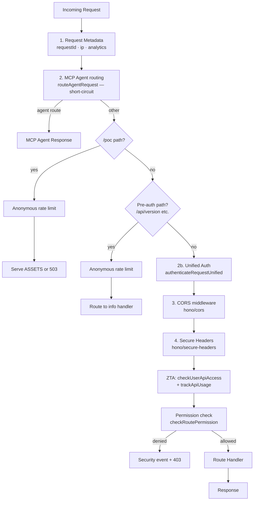
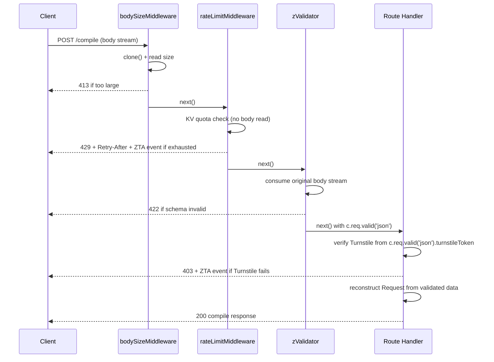

# Hono Routing Architecture

## Overview

The Cloudflare Worker request router was migrated from a 589-line imperative if/else chain
(`worker/handlers/router.ts`) to a declarative [Hono](https://hono.dev/) application
(`worker/hono-app.ts`) in Phase 1.  Phase 2 extracted the repeated inline middleware
into reusable factories defined in `worker/middleware/hono-middleware.ts`.

All **handler function signatures remain unchanged**. Only the dispatch layer (the routing
glue) was migrated to Hono.

---

## Middleware Pipeline



---

## Context Variables

These variables are set by middleware and available to all route handlers via `c.get(key)`:

| Variable      | Type               | Set by                       | Description                              |
|---------------|--------------------|------------------------------|------------------------------------------|
| `requestId`   | `string`           | Request metadata middleware  | Unique trace ID for the request          |
| `ip`          | `string`           | Request metadata middleware  | `CF-Connecting-IP` header or `'unknown'` |
| `analytics`   | `AnalyticsService` | Request metadata middleware  | Analytics/telemetry service instance     |
| `authContext` | `IAuthContext`     | Auth middleware              | Authenticated user context (or anonymous)|

---

## /api Prefix Handling

The frontend uses `API_BASE_URL = '/api'`, so all API requests from the frontend arrive
as `/api/compile`, `/api/rules`, etc.

Hono's `app.route()` is used to mount the same `routes` sub-app under both `/` and `/api`:

```typescript
// /api is mounted first — ensures correct prefix-stripping for /api/* requests
// before the root-mount sub-app intercepts them as unrecognised paths.
app.route('/api', routes);
app.route('/', routes);
```

This means `/compile` and `/api/compile` both reach the same handler. No path-stripping
logic is needed in route handlers.

---

## Phase 2: Middleware Extraction (complete)

Phase 2 eliminated repeated inline boilerplate by introducing four `MiddlewareHandler`
factories in `worker/middleware/hono-middleware.ts`:

| Factory                  | Concern                          | Error code |
|--------------------------|----------------------------------|------------|
| `bodySizeMiddleware()`   | Body size validation             | 413        |
| `rateLimitMiddleware()`  | Per-user/IP tiered rate limiting | 429        |
| `turnstileMiddleware()`  | Cloudflare Turnstile CAPTCHA     | 400 / 403  |
| `requireAuthMiddleware()`| Require authenticated caller     | 401        |

### Execution Order for write endpoints

The recommended order preserves correct body-stream semantics:



> **Why `zValidator` runs before Turnstile on `/compile`**: `turnstileMiddleware()` on other
> routes calls `Request.clone().json()` to extract the token while leaving the body intact.
> On the `/compile` route, `zValidator` would parse the body a second time — doubling the
> I/O for every compile request. By running `zValidator` first and reading
> `c.req.valid('json').turnstileToken` in the handler, the body is parsed exactly once.
> All other routes still use `turnstileMiddleware()` (clone-based) before any schema
> validation step.

### Before / After example

**Before (Phase 1 — inline):**

```typescript
routes.post('/compile', async (c) => {
    const sz = await validateRequestSize(c.req.raw, c.env);
    if (!sz.valid) return c.json({ success: false, error: sz.error || 'Request body too large' }, 413);
    const rl = await checkRateLimitTiered(c.env, c.get('ip'), c.get('authContext'));
    if (!rl.allowed) return rateLimitResponse(c, rl.limit, rl.resetAt);
    const tsErr = await checkTurnstile(c);
    if (tsErr) return tsErr;
    return handleCompileJson(c.req.raw, c.env, c.get('analytics'), c.get('requestId'));
});
```

**After (Phase 2 — factory stack with single-parse optimisation):**

```typescript
routes.post(
    '/compile',
    bodySizeMiddleware(),
    rateLimitMiddleware(),
    // zValidator runs before Turnstile to avoid double body parsing
    zValidator('json', CompileRequestSchema as any, (result, c) => {
        if (!result.success) return c.json({ success: false, error: 'Invalid request body', details: result.error }, 422);
    }),
    async (c) => {
        // Turnstile reads from already-validated body — no second clone/parse
        if (c.env.TURNSTILE_SECRET_KEY) {
            const token = (c.req.valid('json') as any).turnstileToken ?? '';
            const tsResult = await verifyTurnstileToken(c.env, token, c.get('ip'));
            if (!tsResult.success) {
                c.get('analytics').trackSecurityEvent({ eventType: 'turnstile_rejection', ... });
                return c.json({ success: false, error: tsResult.error ?? 'Turnstile verification failed' }, 403);
            }
        }
        const validatedBody = c.req.valid('json');
        const syntheticReq = new Request(c.req.url, { method: 'POST', headers: c.req.raw.headers, body: JSON.stringify(validatedBody) });
        return handleCompileJson(syntheticReq, c.env, c.get('analytics'), c.get('requestId'));
    },
);
```

---

## Zod Validation Integration

`POST /compile` uses [`@hono/zod-validator`](https://github.com/honojs/middleware/tree/main/packages/zod-validator)
to validate the request body against `CompileRequestSchema` before the handler runs.

### Module-identity note

This project uses `jsr:@zod/zod` (Zod v4 from JSR), while `@hono/zod-validator` imports
`npm:zod`. Both modules resolve to Zod v4 with an identical runtime API, but TypeScript
treats them as distinct module identities. The `as any` cast on the schema avoids a
compile-time type mismatch that has no runtime effect:

```typescript
zValidator('json', CompileRequestSchema as any, (result, c) => { ... })
```

### Body stream consumption and Turnstile ordering

`zValidator` consumes the original `c.req.raw` body stream. On the `/compile` route,
`zValidator` runs **before** Turnstile verification so the body is only parsed once.
The Turnstile token is then read from the already-cached validated data:

```typescript
async (c) => {
    // Turnstile from validated body — no second clone/parse
    if (c.env.TURNSTILE_SECRET_KEY) {
        const token = (c.req.valid('json') as any).turnstileToken ?? '';
        const tsResult = await verifyTurnstileToken(c.env, token, c.get('ip'));
        if (!tsResult.success) { ... return 403; }
    }
    // Reconstruct Request for legacy handler signature
    const validatedBody = c.req.valid('json');
    const syntheticReq = new Request(c.req.url, {
        method: 'POST',
        headers: c.req.raw.headers,
        body: JSON.stringify(validatedBody),
    });
    return handleCompileJson(syntheticReq, c.env, c.get('analytics'), c.get('requestId'));
},
```

---

## Phase 3 Roadmap

- Generate OpenAPI spec from route + schema definitions using `hono/openapi`
- Generate a type-safe RPC client with `hono/client` for the frontend
- Extend `zValidator` to additional endpoints (e.g. `/configuration/validate`, `/validate-rule`)
