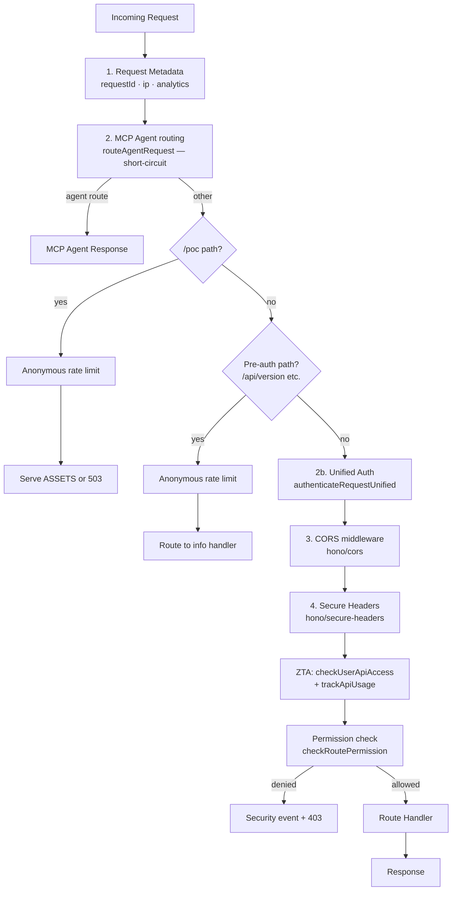

# Hono Routing Architecture

## Overview

The Cloudflare Worker request router was migrated from a 589-line imperative if/else chain
(`worker/handlers/router.ts`) to a declarative [Hono](https://hono.dev/) application
(`worker/hono-app.ts`) in Phase 1.

All **handler function signatures remain unchanged**. Only the dispatch layer (the routing
glue) was migrated to Hono.

---

## Middleware Pipeline



---

## Context Variables

These variables are set by middleware and available to all route handlers via `c.get(key)`:

| Variable      | Type               | Set by                       | Description                              |
|---------------|--------------------|------------------------------|------------------------------------------|
| `requestId`   | `string`           | Request metadata middleware  | Unique trace ID for the request          |
| `ip`          | `string`           | Request metadata middleware  | `CF-Connecting-IP` header or `'unknown'` |
| `analytics`   | `AnalyticsService` | Request metadata middleware  | Analytics/telemetry service instance     |
| `authContext` | `IAuthContext`     | Auth middleware              | Authenticated user context (or anonymous)|

---

## /api Prefix Handling

The frontend uses `API_BASE_URL = '/api'`, so all API requests from the frontend arrive
as `/api/compile`, `/api/rules`, etc.

Hono's `app.route()` is used to mount the same `routes` sub-app under both `/` and `/api`:

```typescript
// /api is mounted first — ensures correct prefix-stripping for /api/* requests
// before the root-mount sub-app intercepts them as unrecognised paths.
app.route('/api', routes);
app.route('/', routes);
```

This means `/compile` and `/api/compile` both reach the same handler. No path-stripping
logic is needed in route handlers.

---

## Phase 2 Roadmap

Extract inline middleware into reusable Hono middleware factories:

- `rateLimitMiddleware(options)` — extracted from every compile/rules route
- `bodySizeMiddleware()` — extracted from every POST route
- `turnstileMiddleware()` — extracted from compile/configuration routes
- `requireAuthMiddleware()` — extracted from rules/keys routes

---

## Phase 3 Roadmap

- Add `@hono/zod-validator` to validate request bodies declaratively
- Generate OpenAPI spec from route + schema definitions using `hono/openapi`
- Generate a type-safe RPC client with `hono/client` for the frontend
