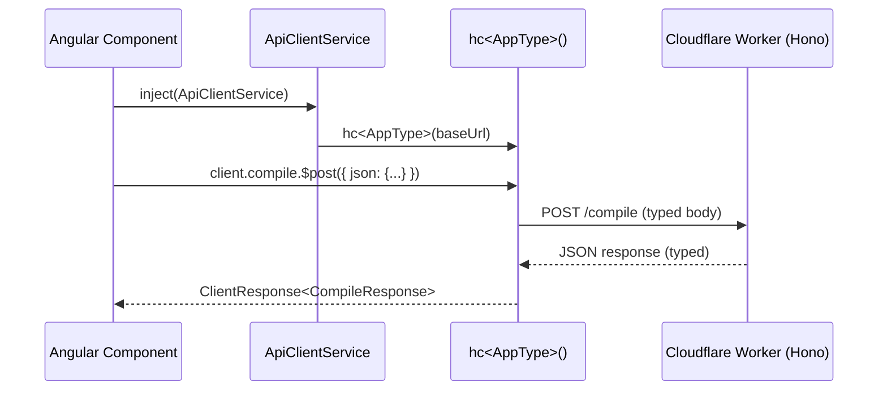

# Hono RPC Client — Typed API calls between Angular and Worker

## Overview

The Adblock Compiler uses [`hono/client`](https://hono.dev/docs/guides/rpc) to provide
end-to-end type-safe HTTP calls from the Angular frontend to the Cloudflare Worker.



## Architecture

| Layer | File | Role |
|---|---|---|
| **Worker** | `worker/hono-app.ts` | Exports `AppType = typeof app` |
| **Shared Types** | `AppType` | Request/response types inferred from routes |
| **Angular Service** | `frontend/src/app/services/api-client.ts` | Wraps `hc<AppType>()` with Angular DI |
| **Components** | Any component that needs typed API calls | Injects `ApiClientService` |

## Worker: Exporting `AppType`

The worker exports the app's type so the frontend can mirror it:

```typescript
// worker/hono-app.ts
export const app = new OpenAPIHono<{ Bindings: Env; Variables: Variables }>();

// ... route definitions ...

export type AppType = typeof app;
```

## Angular: Using the RPC Client

The `ApiClientService` in `frontend/src/app/services/api-client.ts` wraps the `hc<AppType>()` call
with Angular's dependency injection:

```typescript
import { ApiClientService } from './services/api-client';

@Component({ standalone: true, ... })
export class HealthComponent {
  private readonly apiClient = inject(ApiClientService);

  async checkHealth(): Promise<void> {
    // Fully typed request and response — no manual interface needed
    const res = await this.apiClient.client.api.health.$get();
    if (res.ok) {
      const data = await res.json();
      console.log(data.status);    // 'healthy' | 'degraded' | 'down'
      console.log(data.version);   // string
      console.log(data.timestamp); // string
    }
  }
}
```

### Compile endpoint example

```typescript
const res = await this.apiClient.client.compile.$post({
  json: {
    configuration: {
      name: 'my-filter',
      sources: [{ source: 'https://example.com/filter.txt' }],
      transformations: ['deduplicate'],
    },
    benchmark: false,
    turnstileToken: this.turnstileToken,
  },
});

if (res.ok) {
  const data = await res.json();
  console.log(`Compiled ${data.ruleCount} rules`);
}
```

### OpenAPI spec endpoint

```typescript
// Fetch the live OpenAPI spec document
const res = await this.apiClient.client.api['openapi.json'].$get();
const spec = await res.json();
```

## AppType Evolution

Currently `AppType` in `api-client.ts` is a minimal inline mirror of the three
routes the client covers.  As the project matures, replace it with the real type:

```typescript
// Option A: Direct cross-workspace path import (works during local dev)
import type { AppType } from '../../../../worker/hono-app';

// Option B: Published types package (recommended for production)
import type { AppType } from '@adblock-compiler/worker-types';
```

To share types across the monorepo without a published package, add a `paths`
mapping to the Angular `tsconfig.json`:

```json
{
  "compilerOptions": {
    "paths": {
      "@adblock-compiler/worker/*": ["../worker/*"]
    }
  }
}
```

## Server-Timing headers

The Hono worker adds `Server-Timing` headers to every response (via `hono/timing`).
The Angular `HttpClient`-based services expose these through the response headers:

```typescript
const res = await this.http.post('/api/compile', body, { observe: 'response' }).toPromise();
const timing = res?.headers.get('Server-Timing');
// "auth;dur=12.3, handler;dur=245.7"
```

## Route Coverage

The following routes are covered by the typed RPC client:

| Method | Path | `ApiClientService` method |
|---|---|---|
| `GET` | `/api/health` | `client.api.health.$get()` |
| `GET` | `/api/version` | `client.api.version.$get()` |
| `GET` | `/api/openapi.json` | `client.api['openapi.json'].$get()` |
| `POST` | `/compile` | `client.compile.$post({ json: {...} })` |

Additional routes can be added to `AppType` in `api-client.ts` as needed.

## References

- [Hono RPC Guide](https://hono.dev/docs/guides/rpc)
- [`hono/client` API](https://hono.dev/docs/guides/rpc#client)
- [Worker source — `worker/hono-app.ts`](../../worker/hono-app.ts)
- [Angular service — `frontend/src/app/services/api-client.ts`](../../frontend/src/app/services/api-client.ts)
