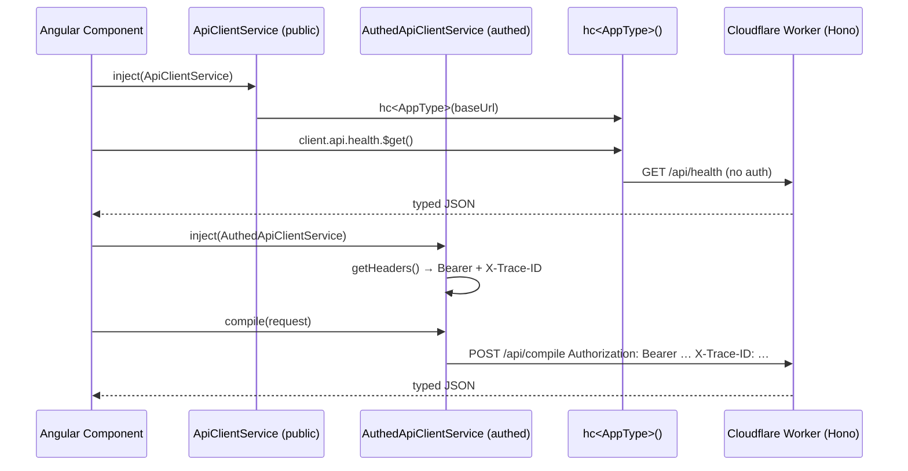

# Hono RPC Client — Typed API calls between Angular and Worker

## Overview

The Adblock Compiler uses [`hono/client`](https://hono.dev/docs/guides/rpc) to provide
end-to-end type-safe HTTP calls from the Angular frontend to the Cloudflare Worker.

Two services cover the full API surface:

| Service | File | Scope |
|---|---|---|
| `ApiClientService` | `frontend/src/app/services/api-client.ts` | Public (unauthenticated) endpoints |
| `AuthedApiClientService` | `frontend/src/app/services/authed-api-client.service.ts` | Authenticated endpoints (Bearer + Trace-ID) |



## Architecture

| Layer | File | Role |
|---|---|---|
| **Worker** | `worker/hono-app.ts` | Exports `AppType = typeof app` |
| **Shared Types** | `AppType` in `api-client.ts` | Request/response types for all routes |
| **Public client** | `frontend/src/app/services/api-client.ts` | `ApiClientService` — unauthenticated endpoints |
| **Authed client** | `frontend/src/app/services/authed-api-client.service.ts` | `AuthedApiClientService` — authenticated endpoints |
| **Components** | Any component that needs typed API calls | Injects one or both services |

## Worker: Exporting `AppType`

The worker exports the app's type so the frontend can mirror it:

```typescript
// worker/hono-app.ts
export const app = new OpenAPIHono<{ Bindings: Env; Variables: Variables }>();

// ... route definitions ...

export type AppType = typeof app;
```

## Angular: Public RPC Client (`ApiClientService`)

The `ApiClientService` in `frontend/src/app/services/api-client.ts` wraps the `hc<AppType>()` call
with Angular's dependency injection:

```typescript
import { ApiClientService } from './services/api-client';

@Component({ standalone: true, ... })
export class HealthComponent {
  private readonly apiClient = inject(ApiClientService);

  async checkHealth(): Promise<void> {
    // Fully typed request and response — no manual interface needed
    const res = await this.apiClient.client.api.health.$get();
    if (res.ok) {
      const data = await res.json();
      console.log(data.status);    // 'healthy' | 'degraded' | 'down'
      console.log(data.version);   // string
      console.log(data.timestamp); // string
    }
  }
}
```

### OpenAPI spec endpoint

```typescript
// Fetch the live OpenAPI spec document (public, no auth required)
const res = await this.apiClient.client.api['openapi.json'].$get();
const spec = await res.json();
```

## Angular: Authenticated RPC Client (`AuthedApiClientService`)

The `AuthedApiClientService` uses the same `hc<AppType>()` pattern but injects a
Bearer token and trace ID header before every call.  Tokens are resolved via
`AuthFacadeService.getToken()` (reads the Better Auth session cookie) — they are never
stored in component state or `localStorage`.

### Usage

```typescript
import { AuthedApiClientService } from './services/authed-api-client.service';

@Component({ standalone: true, ... })
export class CompileComponent {
  private readonly rpc = inject(AuthedApiClientService);

  async runCompile(): Promise<void> {
    // Bearer token + X-Trace-ID are injected automatically
    const result = await this.rpc.compile({
      configuration: {
        name: 'My List',
        sources: [{ source: 'https://easylist.to/easylist/easylist.txt' }],
        transformations: ['RemoveComments', 'Deduplicate'],
      },
    });
    console.log(result.ruleCount); // number
  }
}
```

### Available methods

| Method | HTTP | Path | Tier required |
|---|---|---|---|
| `compile(request)` | POST | `/api/compile` | Free |
| `validateRules(request)` | POST | `/api/validate` | Free |
| `validateRule(request)` | POST | `/api/validate-rule` | Free |
| `listRules()` | GET | `/api/rules` | Free |
| `createRuleSet(request)` | POST | `/api/rules` | Free |
| `compileAsync(request)` | POST | `/api/compile/async` | Pro |

### getHeaders() internals

```typescript
private async getHeaders(): Promise<Record<string, string>> {
    const headers: Record<string, string> = {
        'X-Trace-ID': this.log.sessionId,
    };
    if (!this.auth.isSignedIn()) return headers;

    const token = await this.auth.getToken();
    if (!token) throw new Error('Session token unavailable — please sign in again');

    headers['Authorization'] = `Bearer ${token}`;
    return headers;
}
```

### ZTA compliance

- Token resolved per-call (not cached in the service).
- Throws with a descriptive message on auth failure.
- `X-Trace-ID` always set for Worker-side log correlation.
- Never touches `localStorage` or component state.

### When to use `AuthedApiClientService` vs `HttpClient` services

| Scenario | Recommended service |
|---|---|
| Components in the browser + Angular HTTP lifecycle | Either — `AuthedApiClientService` is simpler |
| SSR / service workers / outside Angular DI | `AuthedApiClientService` (no `HttpClient` dep) |
| Streaming / WebSocket upgrades | `HttpClient` with `reportProgress: true` |
| Batch observables / reactive pipelines | `HttpClient` + RxJS (`CompilerService`) |

## AppType

`AppType` in `api-client.ts` covers **all** routes — both public and authenticated.
This single type is shared by both `ApiClientService` and `AuthedApiClientService`.

```typescript
export type AppType = {
    api: {
        // Public routes
        health: { $get: () => TypedResponse<HealthResponse> };
        version: { $get: () => TypedResponse<VersionResponse> };
        'openapi.json': { $get: () => TypedResponse<Record<string, unknown>> };
        // Authenticated routes
        compile: { $post: (opts: { json: CompileRequest }) => TypedResponse<CompileResponse> };
        validate: { $post: (opts: { json: ValidateRequest }) => TypedResponse<ValidateResponse> };
        'validate-rule': { $post: (opts: { json: ValidateRuleRequest }) => TypedResponse<ValidateRuleResponse> };
        rules: {
            $get: () => TypedResponse<RulesListData>;
            $post: (opts: { json: RuleSetCreate }) => TypedResponse<{ success: boolean; ruleSet: RuleSetData }>;
        };
    };
};
```

### AppType evolution

To replace the inline `AppType` with the real worker type:

```typescript
// Option A: Direct cross-workspace path import (works during local dev)
import type { AppType } from '../../../../worker/hono-app';

// Option B: Published types package (recommended for production)
import type { AppType } from '@bloqr-backend/worker-types';
```

To share types across the monorepo without a published package, add a `paths`
mapping to the Angular `tsconfig.json`:

```json
{
  "compilerOptions": {
    "paths": {
      "@bloqr-backend/worker/*": ["../worker/*"]
    }
  }
}
```

## Server-Timing headers

The Hono worker adds `Server-Timing` headers to every response (via `hono/timing`).

For `HttpClient`-based services:

```typescript
const res = await this.http.post('/api/compile', body, { observe: 'response' }).toPromise();
const timing = res?.headers.get('Server-Timing');
// "auth;dur=12.3, handler;dur=245.7"
```

For `AuthedApiClientService`, use the raw `ClientResponse`:

```typescript
const rawRes = await this.rpcClient.api.compile.$post({ json: body }, { headers });
const timing = rawRes.headers.get('Server-Timing');
```

## Route Coverage

### Public routes (`ApiClientService`)

| Method | Path | Client method |
|---|---|---|
| `GET` | `/api/health` | `client.api.health.$get()` |
| `GET` | `/api/version` | `client.api.version.$get()` |
| `GET` | `/api/openapi.json` | `client.api['openapi.json'].$get()` |

### Authenticated routes (`AuthedApiClientService`)

| Method | Path | Service method | Tier |
|---|---|---|---|
| `POST` | `/api/compile` | `rpc.compile(request)` | Free |
| `POST` | `/api/validate` | `rpc.validateRules(request)` | Free |
| `POST` | `/api/validate-rule` | `rpc.validateRule(request)` | Free |
| `GET` | `/api/rules` | `rpc.listRules()` | Free |
| `POST` | `/api/rules` | `rpc.createRuleSet(request)` | Free |
| `POST` | `/api/compile/async` | `rpc.compileAsync(request)` | Pro |

## References

- [Hono RPC Guide](https://hono.dev/docs/guides/rpc)
- [`hono/client` API](https://hono.dev/docs/guides/rpc#client)
- [Worker source — `worker/hono-app.ts`](../../worker/hono-app.ts)
- [Public client — `frontend/src/app/services/api-client.ts`](../../frontend/src/app/services/api-client.ts)
- [Authed client — `frontend/src/app/services/authed-api-client.service.ts`](../../frontend/src/app/services/authed-api-client.service.ts)
