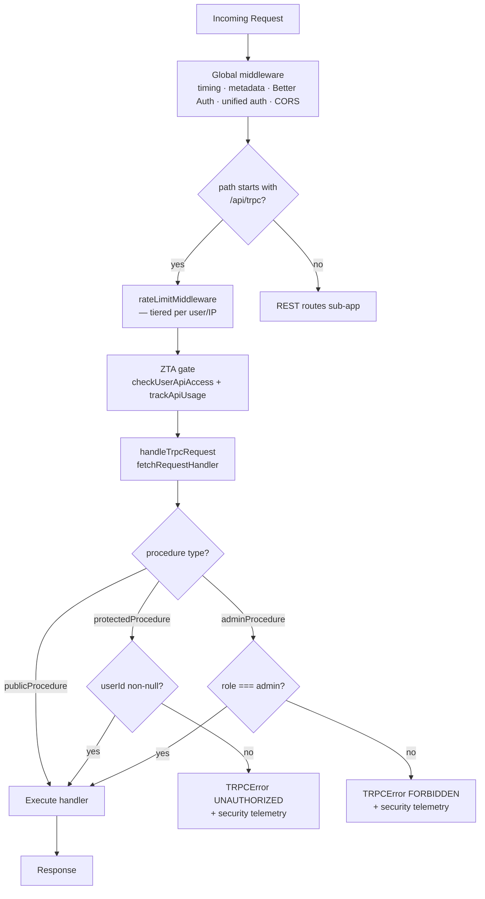

# tRPC API Layer

## Overview

The adblock-compiler Worker exposes a typed [tRPC v11](https://trpc.io) API alongside the
existing REST endpoints. All tRPC procedures live at `/api/trpc/*` and share the same global
middleware chain (timing, Better Auth, unified auth, CORS) that protects REST routes.

---

## File layout

```
worker/trpc/
  init.ts               ← t = initTRPC; exports publicProcedure, protectedProcedure, adminProcedure
  context.ts            ← TrpcContext interface + createTrpcContext(c) factory
  router.ts             ← top-level appRouter (v1: v1Router); exports AppRouter type
  handler.ts            ← handleTrpcRequest — Hono adapter, ZTA onError telemetry
  client.ts             ← createTrpcClient(baseUrl, getToken?) — httpBatchLink client
  routers/v1/
    index.ts            ← v1Router = { health, compile, version }
    health.router.ts    ← v1.health.get (query, public)
    compile.router.ts   ← v1.compile.json (mutation, protectedProcedure)
    version.router.ts   ← v1.version.get (query, public)
  trpc.test.ts          ← unit tests via createCallerFactory (no HTTP overhead)
```

---

## Versioning

Procedures are namespaced by version: `v1.*`. The `v1` namespace is stable.
Breaking changes (removed procedures, changed input shapes) will be introduced under `v2`
without removing `v1`.

---

## Procedure catalogue

### v1.health.get (query, public)

Returns the same payload as `GET /api/health`. No authentication required.

### v1.compile.json (mutation, authenticated)

Accepts a `CompileRequestSchema` body (same schema as `POST /api/compile`). Returns the
compiled ruleset JSON. Requires an authenticated context (`protectedProcedure`; user session or API key).

### v1.version.get (query, public)

Returns `{ version: string, apiVersion: string }`. No authentication required.

---

## Context

Every procedure receives a `TrpcContext` populated from the Hono request context by
`createTrpcContext(c)` in `worker/trpc/context.ts`:

```typescript
interface TrpcContext {
  env: Env;               // Cloudflare Worker bindings (KV, D1, Queue, …)
  authContext: IAuthContext; // Populated by the global unified-auth middleware
  requestId: string;      // Unique trace ID for the request
  ip: string;             // CF-Connecting-IP or ''
  analytics: AnalyticsService; // Telemetry / security-event emitter
}
```

Because the global middleware chain already runs before tRPC is reached, `authContext` is
fully resolved (Better Auth session, API key, or anonymous) and available to all procedures
without extra auth wiring.

---

## Procedure builders

Defined in `worker/trpc/init.ts`:

| Builder | Auth requirement | Error on failure |
|---------|-----------------|------------------|
| `publicProcedure` | None | — |
| `protectedProcedure` | `authContext.userId` non-null | `TRPCError UNAUTHORIZED` |
| `adminProcedure` | `protectedProcedure` + `role === 'admin'` | `TRPCError FORBIDDEN` |

---

## Client

`worker/trpc/client.ts` exports `createTrpcClient`, which wraps the tRPC fetch client with
`httpBatchLink`. Requests made in the same JavaScript microtask queue tick are automatically
batched into a single HTTP request.

```typescript
// Adjust the relative import depth to match your Angular service file location.
// Example for a service at frontend/src/app/services/compile.service.ts:
import { createTrpcClient } from '../../../../worker/trpc/client';

// Angular service (inject auth token from BetterAuthService):
const client = createTrpcClient(
  environment.apiBaseUrl,
  () => authService.getToken(),   // async token getter — attached as Authorization: Bearer ...
);

// Public query — no auth needed
const { version, apiVersion } = await client.v1.version.get.query();

// Public query — health check
const health = await client.v1.health.get.query();

// Authenticated mutation — requires Better Auth session or API key
const result = await client.v1.compile.json.mutate({
  configuration: {
    sources: [{ url: 'https://example.com/easylist.txt' }],
  },
});
```

> **Batching note:** Multiple `query()`/`mutate()` calls in the same tick are automatically
> batched by `httpBatchLink`. To disable batching for a specific call, use
> `httpLink` from `@trpc/client` instead.

### `AppRouter` type for TypeScript inference

Import `AppRouter` to get full end-to-end type safety without running the server:

```typescript
// Adjust the relative import depth to match your consuming file location.
// Example for a service at frontend/src/app/services/trpc.service.ts:
import type { AppRouter } from '../../../../worker/trpc/router';
import { createTRPCClient, httpBatchLink } from '@trpc/client';

const client = createTRPCClient<AppRouter>({
  links: [httpBatchLink({ url: `${baseUrl}/api/trpc` })],
});
```

---

## Mount point

The tRPC handler is mounted directly on the top-level `app` (not the `routes` sub-app)
so that the `compress` and `logger` middleware scoped to business routes do not wrap
tRPC responses. Tiered rate-limiting (`rateLimitMiddleware()`) and the ZTA access gate
(`checkUserApiAccess()` + `trackApiUsage()`) are registered on the top-level `app` at
`/api/trpc/*` before `handleTrpcRequest`.

See [`hono-routing.md`](./hono-routing.md#trpc-endpoint) for the full middleware ordering
rationale.



---

## Adding a new procedure

1. Create (or extend) a router file in `worker/trpc/routers/v1/`.
2. Add it to `worker/trpc/routers/v1/index.ts`.
3. No changes to `hono-app.ts` required — the tRPC handler is already mounted.

Example skeleton:

```typescript
// worker/trpc/routers/v1/rules.router.ts
import { publicProcedure, router } from '../../init.ts';

export const rulesRouter = router({
  list: publicProcedure.query(async ({ ctx }) => {
    // ctx.env, ctx.authContext, ctx.analytics all available
    return [];
  }),
});
```

Then register it in `v1/index.ts`:

```typescript
export const v1Router = router({
  health: healthRouter,
  compile: compileRouter,
  version: versionRouter,
  rules: rulesRouter, // ← add here
});
```

---

## Testing

Procedures can be unit-tested without an HTTP server using `createCallerFactory`:

```typescript
// Relative imports from a test file co-located in worker/trpc/:
import { createCallerFactory } from './init.ts';
import { appRouter } from './router.ts';
import type { TrpcContext } from './context.ts';

const createCaller = createCallerFactory(appRouter);

// Anonymous context
const anonCtx: TrpcContext = {
  env: makeEnv(),
  authContext: { userId: null, tier: UserTier.Anonymous, role: 'anonymous', ... },
  requestId: 'test-id',
  ip: '127.0.0.1',
  analytics: { trackSecurityEvent: () => {}, ... } as AnalyticsService,
};

const caller = createCaller(anonCtx);
const { version } = await caller.v1.version.get();
```

See `worker/trpc/trpc.test.ts` for the full test suite covering auth enforcement,
`protectedProcedure`, and `adminProcedure` role gating.

---

## ZTA notes

- `protectedProcedure` enforces non-anonymous auth (returns `UNAUTHORIZED` if
  `authContext.userId` is null).
- `adminProcedure` additionally enforces `role === 'admin'` (returns `FORBIDDEN`).
- Auth failures emit `AnalyticsService.trackSecurityEvent()` via the `onError` hook
  in `worker/trpc/handler.ts`.
- `/api/trpc/*` has its own `rateLimitMiddleware()` registered directly on `app`,
  enforcing tiered rate limits (including `rate_limit` security telemetry) for all tRPC calls.
- `/api/trpc/*` has its own ZTA access-gate middleware that calls `checkUserApiAccess()`
  (blocks banned/suspended users) and `trackApiUsage()` (billing/analytics) —
  matching the same checks applied to REST routes by `routes.use('*', ...)`.
- CORS is inherited from the global `cors()` middleware already in place on `app`.
