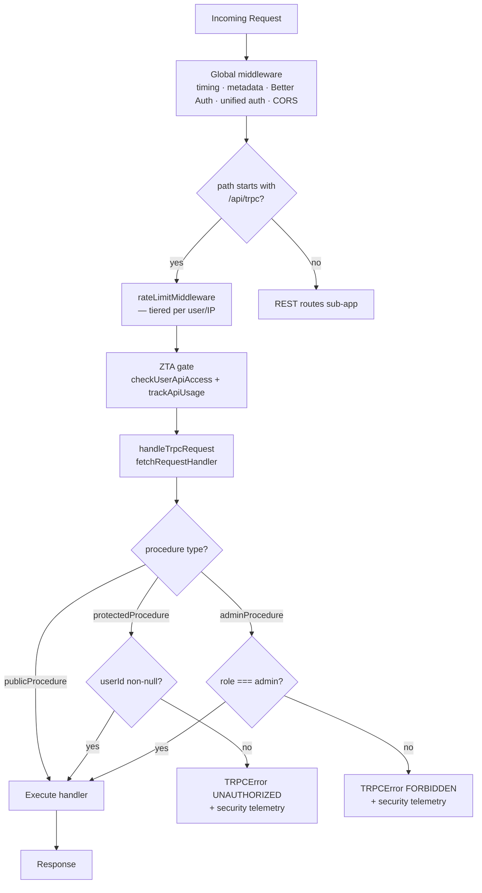
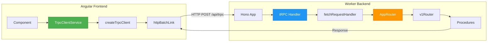
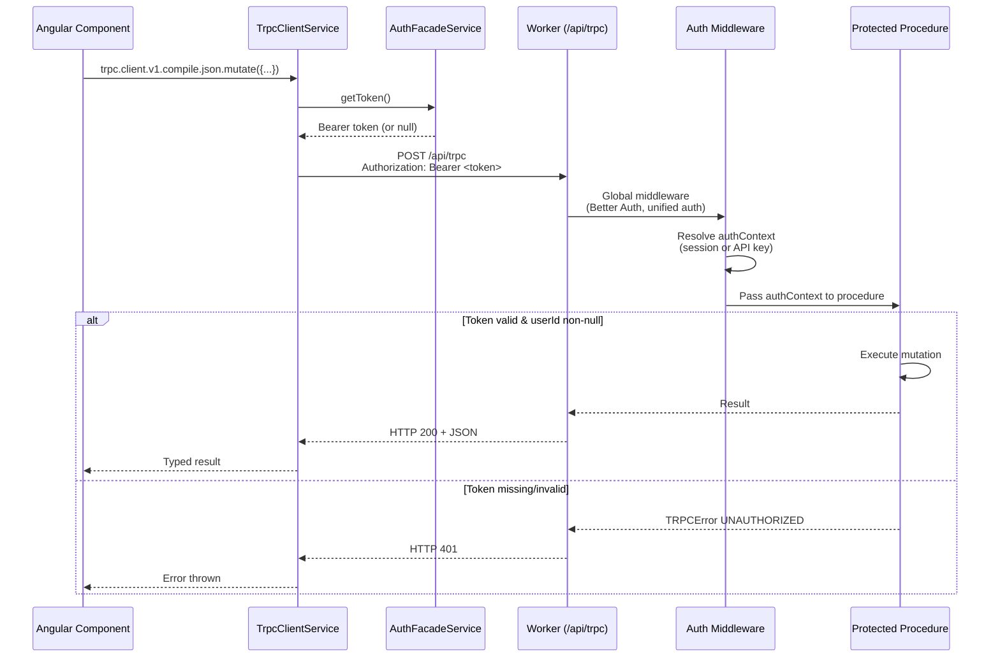
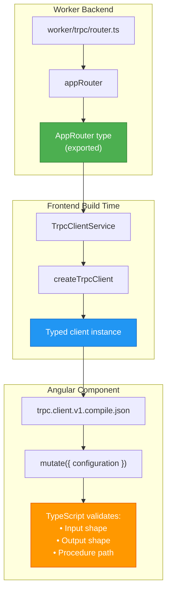

# tRPC API Layer

## Overview

The adblock-compiler Worker exposes a typed [tRPC v11](https://trpc.io) API alongside the
existing REST endpoints. All tRPC procedures live at `/api/trpc/*` and share the same global
middleware chain (timing, Better Auth, unified auth, CORS) that protects REST routes.

---

## File layout

```
worker/trpc/
  init.ts               ← t = initTRPC; exports publicProcedure, protectedProcedure, adminProcedure
  context.ts            ← TrpcContext interface + createTrpcContext(c) factory
  router.ts             ← top-level appRouter (v1: v1Router); exports AppRouter type
  handler.ts            ← handleTrpcRequest — Hono adapter, ZTA onError telemetry
  client.ts             ← createTrpcClient(baseUrl, getToken?) — httpBatchLink client
  routers/v1/
    index.ts            ← v1Router = { health, compile, version }
    health.router.ts    ← v1.health.get (query, public)
    compile.router.ts   ← v1.compile.json (mutation, protectedProcedure)
    version.router.ts   ← v1.version.get (query, public)
  trpc.test.ts          ← unit tests via createCallerFactory (no HTTP overhead)
```

---

## Versioning

Procedures are namespaced by version: `v1.*`. The `v1` namespace is stable.
Breaking changes (removed procedures, changed input shapes) will be introduced under `v2`
without removing `v1`.

---

## Procedure catalogue

### v1.health.get (query, public)

Returns the same payload as `GET /api/health`. No authentication required.

### v1.compile.json (mutation, authenticated)

Accepts a `CompileRequestSchema` body (same schema as `POST /api/compile`). Returns the
compiled ruleset JSON. Requires an authenticated context (`protectedProcedure`; user session or API key).

### v1.version.get (query, public)

Returns `{ version: string, apiVersion: string }`. No authentication required.

---

## Context

Every procedure receives a `TrpcContext` populated from the Hono request context by
`createTrpcContext(c)` in `worker/trpc/context.ts`:

```typescript
interface TrpcContext {
  env: Env;               // Cloudflare Worker bindings (KV, D1, Queue, …)
  authContext: IAuthContext; // Populated by the global unified-auth middleware
  requestId: string;      // Unique trace ID for the request
  ip: string;             // CF-Connecting-IP or ''
  analytics: AnalyticsService; // Telemetry / security-event emitter
}
```

Because the global middleware chain already runs before tRPC is reached, `authContext` is
fully resolved (Better Auth session, API key, or anonymous) and available to all procedures
without extra auth wiring.

---

## Procedure builders

Defined in `worker/trpc/init.ts`:

| Builder | Auth requirement | Error on failure |
|---------|-----------------|------------------|
| `publicProcedure` | None | — |
| `protectedProcedure` | `authContext.userId` non-null | `TRPCError UNAUTHORIZED` |
| `adminProcedure` | `protectedProcedure` + `role === 'admin'` | `TRPCError FORBIDDEN` |

---

## Client

`worker/trpc/client.ts` exports `createTrpcClient`, which wraps the tRPC fetch client with
`httpBatchLink`. Requests made in the same JavaScript microtask queue tick are automatically
batched into a single HTTP request.

### Angular Integration (Recommended)

**For Angular applications, use `TrpcClientService` instead of directly calling `createTrpcClient`.**

The Angular frontend includes a pre-configured `TrpcClientService` at
`frontend/src/app/services/trpc-client.service.ts` that:

- Wraps `createTrpcClient` as a proper Angular service (`providedIn: 'root'`)
- Automatically injects `API_BASE_URL` and derives the Worker origin
- Automatically injects `AuthFacadeService` and attaches Bearer tokens per-call
- Provides full `AppRouter` type inference
- Follows ZTA best practices (no token storage, per-call auth resolution)

**Usage in Angular components:**

```typescript
import { Component, inject } from '@angular/core';
import { TrpcClientService } from './services/trpc-client.service';

@Component({
  selector: 'app-my-component',
  template: `...`,
})
export class MyComponent {
  private readonly trpc = inject(TrpcClientService);

  async checkHealth(): Promise<void> {
    // Public query — no auth needed
    const health = await this.trpc.client.v1.health.get.query();
    console.log('Worker healthy:', health.healthy);
  }

  async compile(): Promise<void> {
    // Authenticated mutation — requires Free tier+
    const result = await this.trpc.client.v1.compile.json.mutate({
      configuration: {
        sources: [{ url: 'https://easylist.to/easylist/easylist.txt' }],
      },
    });
    console.log('Compiled rules:', result.ruleCount);
  }
}
```

**Why use `TrpcClientService`?**

- **Automatic DI**: No need to manually wire `API_BASE_URL` or `AuthFacadeService`.
- **ZTA compliance**: Token resolution is handled per-call via `AuthFacadeService.getToken()`;
  never stored in component state.
- **Base URL normalization**: Handles both browser (`/api`) and SSR (absolute URL) cases.
- **Type safety**: Full `AppRouter` inference out of the box.

### Manual Integration (Non-Angular)

For non-Angular clients (CLI tools, Node.js scripts, other frontends), use `createTrpcClient` directly:

```typescript
import { createTrpcClient } from './worker/trpc/client';

// Manual instantiation (inject auth token from your auth provider):
const client = createTrpcClient(
  'https://adblock-compiler.<account>.workers.dev',
  () => authService.getToken(),   // async token getter — attached as Authorization: Bearer ...
);

// Public query — no auth needed
const { version, apiVersion } = await client.v1.version.get.query();

// Public query — health check
const health = await client.v1.health.get.query();

// Authenticated mutation — requires Better Auth session or API key
const result = await client.v1.compile.json.mutate({
  configuration: {
    sources: [{ url: 'https://example.com/easylist.txt' }],
  },
});
```

> **Batching note:** Multiple `query()`/`mutate()` calls in the same tick are automatically
> batched by `httpBatchLink`. To disable batching for a specific call, use
> `httpLink` from `@trpc/client` instead.

### `AppRouter` type for TypeScript inference

Import `AppRouter` to get full end-to-end type safety without running the server:

```typescript
import type { AppRouter } from './worker/trpc/router';
import { createTRPCClient, httpBatchLink } from '@trpc/client';

const client = createTRPCClient<AppRouter>({
  links: [httpBatchLink({ url: `${baseUrl}/api/trpc` })],
});
```

---

## Mount point

The tRPC handler is mounted directly on the top-level `app` (not the `routes` sub-app)
so that the `compress` and `logger` middleware scoped to business routes do not wrap
tRPC responses. Tiered rate-limiting (`rateLimitMiddleware()`) and the ZTA access gate
(`checkUserApiAccess()` + `trackApiUsage()`) are registered on the top-level `app` at
`/api/trpc/*` before `handleTrpcRequest`.

See [`hono-routing.md`](./hono-routing.md#trpc-endpoint) for the full middleware ordering
rationale.



---

## Benefits of tRPC Integration

### 1. End-to-End Type Safety

tRPC eliminates the need for manual type definitions between frontend and backend. The `AppRouter`
type is automatically inferred from the Worker's procedure definitions, ensuring compile-time
safety for all API calls.

**Before (REST with manual types):**

```typescript
// Manual type definition — can drift from backend
interface CompileResponse {
  success: boolean;
  ruleCount: number;
  compiledAt: string;
  // ... what if the backend adds a field?
}

// No compile-time validation of request shape
const response = await fetch('/api/compile', {
  method: 'POST',
  body: JSON.stringify({
    configuration: { sources: [...] },
  }),
});
const data = await response.json() as CompileResponse; // Unsafe cast
```

**After (tRPC with inferred types):**

```typescript
// Types are automatically inferred from AppRouter
const result = await trpc.client.v1.compile.json.mutate({
  configuration: { sources: [...] },
  // TypeScript error if required fields are missing!
});
// result.ruleCount is typed as number — no unsafe casts needed
```

### 2. Automatic Request Batching

Multiple tRPC calls made in the same JavaScript tick are automatically batched into a single
HTTP request, reducing network overhead and improving performance.

**Example:**

```typescript
// These three calls in the same tick become ONE HTTP request:
const [health, version, compileResult] = await Promise.all([
  trpc.client.v1.health.get.query(),
  trpc.client.v1.version.get.query(),
  trpc.client.v1.compile.json.mutate({ configuration: {...} }),
]);
// Network: single POST to /api/trpc with batched payload
```

### 3. Procedure-Level Auth Enforcement

tRPC procedures are tagged with auth requirements (`publicProcedure`, `protectedProcedure`,
`adminProcedure`). Auth checks happen at the procedure level, not the route level, providing
fine-grained control without fragile middleware chains.

**Example:**

```typescript
// Public procedure — anyone can call
export const versionRouter = router({
  get: publicProcedure.query(async () => {
    return { version: '0.79.4', apiVersion: 'v1' };
  }),
});

// Protected procedure — requires authenticated session
export const compileRouter = router({
  json: protectedProcedure
    .input(CompileRequestSchema)
    .mutation(async ({ ctx, input }) => {
      // ctx.authContext.userId is guaranteed non-null here
      return compileFilters(input, ctx);
    }),
});

// Admin procedure — requires admin role
export const adminRouter = router({
  clearCache: adminProcedure.mutation(async ({ ctx }) => {
    // ctx.authContext.role === 'admin' is guaranteed
    await ctx.env.COMPILATION_CACHE.delete('all');
  }),
});
```

### 4. No Code Generation

Unlike OpenAPI/Swagger clients, tRPC requires no code generation step. The `AppRouter` type is
directly imported and used for inference — no `npm run generate-client` required.

### 5. Versioned API with Zero Breaking Changes

All procedures are namespaced under `v1`. Future breaking changes will be introduced under `v2`
without removing `v1`, allowing gradual migration.

```typescript
// v1 procedures remain stable
await trpc.client.v1.compile.json.mutate({...});

// Future v2 procedures can coexist
await trpc.client.v2.compile.json.mutate({...}); // (when v2 is released)
```

---

## Architecture Diagrams

### High-Level tRPC Integration Flow



### Request Flow with Auth Middleware



### Type Inference Flow



### CLI Integration Pattern

```mermaid
flowchart TD
    subgraph CLI Tool
        A[CLI Script] --> B[createTrpcClient]
        B --> C[Auth Provider<br/>API key or session]
        C --> D["client.v1.compile.json.mutate(...)"]
    end

    subgraph Worker
        E[/api/trpc/*] --> F[tRPC Handler]
        F --> G{Auth Check}
        G -->|Token valid| H[Execute Procedure]
        G -->|Token invalid| I[Return 401]
    end

    D -->|HTTP POST| E
    H -->|Result| D
    I -->|Error| D

    style B fill:#4CAF50,stroke:#2E7D32,color:#fff
    style F fill:#2196F3,stroke:#1565C0,color:#fff
```

---

## Hooking Up Other Frontends / CLI Tools

### Node.js / Deno CLI Example

For CLI tools or Node.js scripts, use `createTrpcClient` directly without Angular DI:

**Option 1 — API key from environment variable:**

```typescript
#!/usr/bin/env node

import { createTrpcClient } from './worker/trpc/client.ts';

const client = createTrpcClient(
  'https://adblock-compiler.<account>.workers.dev',
  async () => process.env.ADBLOCK_API_KEY || null,
);

const health = await client.v1.health.get.query();
console.log('Worker healthy:', health.healthy);

const result = await client.v1.compile.json.mutate({
  configuration: {
    sources: [
      { url: 'https://easylist.to/easylist/easylist.txt' },
      { url: 'https://easylist.to/easylist/easyprivacy.txt' },
    ],
  },
});
console.log(`Compiled ${result.ruleCount} rules`);
```

**Option 2 — Interactive session token (via Better Auth):**

```typescript
#!/usr/bin/env node

import { readFile } from 'fs/promises';
import { createTrpcClient } from './worker/trpc/client.ts';

const sessionToken = await readFile('.adblock-session', 'utf-8');

const client = createTrpcClient(
  'https://adblock-compiler.<account>.workers.dev',
  async () => sessionToken,
);

const health = await client.v1.health.get.query();
console.log('Worker healthy:', health.healthy);
```

### React / Vue / Svelte Example

For non-Angular frontends, the pattern is similar. Install `@trpc/client` and import the
`createTrpcClient` factory:

**React example:**

```typescript
import { createTrpcClient } from './worker/trpc/client';
import { useAuth } from './hooks/useAuth'; // Your auth hook

function useTrpcClient() {
  const { getToken } = useAuth();

  return useMemo(
    () => createTrpcClient(
      import.meta.env.VITE_API_BASE_URL,
      () => getToken(),
    ),
    [getToken],
  );
}

function MyComponent() {
  const trpc = useTrpcClient();

  const [health, setHealth] = useState(null);

  useEffect(() => {
    trpc.v1.health.get.query().then(setHealth);
  }, [trpc]);

  return <div>Worker healthy: {health?.healthy}</div>;
}
```

**Vue 3 (Composition API) example:**

```typescript
import { ref, onMounted } from 'vue';
import { createTrpcClient } from './worker/trpc/client';
import { useAuth } from './composables/useAuth';

export default {
  setup() {
    const { getToken } = useAuth();
    const client = createTrpcClient(
      import.meta.env.VITE_API_BASE_URL,
      () => getToken(),
    );

    const health = ref(null);

    onMounted(async () => {
      health.value = await client.v1.health.get.query();
    });

    return { health };
  },
};
```

**Svelte example:**

```typescript
<script lang="ts">
  import { onMount } from 'svelte';
  import { createTrpcClient } from './worker/trpc/client';
  import { authStore } from './stores/auth';

  const client = createTrpcClient(
    import.meta.env.VITE_API_BASE_URL,
    () => $authStore.getToken(),
  );

  let health = null;

  onMount(async () => {
    health = await client.v1.health.get.query();
  });
</script>

<div>Worker healthy: {health?.healthy}</div>
```

### Mobile (React Native / Flutter) Example

**React Native:**

> **Security Warning**
> Do **not** store bearer tokens in `AsyncStorage`, `localStorage`, `sessionStorage`,
> or any other plaintext persistent storage. On mobile, use platform secure storage
> (Keychain on iOS, Keystore on Android) via
> [`react-native-keychain`](https://github.com/oblador/react-native-keychain) and prefer
> short-lived access tokens with refresh/re-auth flows instead of long-lived credentials.
> On web, use HttpOnly cookies managed server-side rather than client-accessible storage.

```typescript
import { createTrpcClient } from './worker/trpc/client';
import * as Keychain from 'react-native-keychain';

// Retrieve the token from platform secure storage (Keychain/Keystore),
// NOT AsyncStorage, which is unencrypted plaintext.
const client = createTrpcClient(
  'https://adblock-compiler.<account>.workers.dev',
  async () => {
    const credentials = await Keychain.getGenericPassword({ service: 'adblock-session' });
    return credentials ? credentials.password : null;
  },
);

// Use in components
const health = await client.v1.health.get.query();
```

**Flutter (Dart) — Manual HTTP Client:**

Flutter doesn't support TypeScript imports, so you'll need to use raw HTTP with the tRPC
protocol. The tRPC wire format is straightforward:

```dart
import 'dart:convert';
import 'package:http/http.dart' as http;

class TrpcClient {
  final String baseUrl;
  final Future<String?> Function() getToken;

  TrpcClient(this.baseUrl, this.getToken);

  Future<Map<String, dynamic>> query(String path) async {
    final token = await getToken();
    final headers = {
      'Content-Type': 'application/json',
      if (token != null) 'Authorization': 'Bearer $token',
    };

    final response = await http.post(
      Uri.parse('$baseUrl/api/trpc/$path'),
      headers: headers,
      body: jsonEncode({'id': 1, 'method': 'query'}),
    );

    final data = jsonDecode(response.body) as List;
    return data[0]['result']['data'] as Map<String, dynamic>;
  }
}

// Usage
final client = TrpcClient(
  'https://adblock-compiler.<account>.workers.dev',
  () async => await storage.read(key: 'auth_token'),
);

final health = await client.query('v1.health.get');
print('Worker healthy: ${health['healthy']}');
```

---

## Adding New tRPC Procedures

1. Create (or extend) a router file in `worker/trpc/routers/v1/`.
2. Add it to `worker/trpc/routers/v1/index.ts`.
3. No changes to `hono-app.ts` required — the tRPC handler is already mounted.

Example skeleton:

```typescript
// worker/trpc/routers/v1/rules.router.ts
import { publicProcedure, router } from '../../init.ts';

export const rulesRouter = router({
  list: publicProcedure.query(async ({ ctx }) => {
    // ctx.env, ctx.authContext, ctx.analytics all available
    return [];
  }),
});
```

Then register it in `v1/index.ts`:

```typescript
export const v1Router = router({
  health: healthRouter,
  compile: compileRouter,
  version: versionRouter,
  rules: rulesRouter, // ← add here
});
```

---

## Testing

Procedures can be unit-tested without an HTTP server using `createCallerFactory`:

```typescript
// Relative imports from a test file co-located in worker/trpc/:
import { createCallerFactory } from './init.ts';
import { appRouter } from './router.ts';
import type { TrpcContext } from './context.ts';

const createCaller = createCallerFactory(appRouter);

// Anonymous context
const anonCtx: TrpcContext = {
  env: makeEnv(),
  authContext: { userId: null, tier: UserTier.Anonymous, role: 'anonymous', ... },
  requestId: 'test-id',
  ip: '127.0.0.1',
  analytics: { trackSecurityEvent: () => {}, ... } as AnalyticsService,
};

const caller = createCaller(anonCtx);
const { version } = await caller.v1.version.get();
```

See `worker/trpc/trpc.test.ts` for the full test suite covering auth enforcement,
`protectedProcedure`, and `adminProcedure` role gating.

---

## ZTA notes

- `protectedProcedure` enforces non-anonymous auth (returns `UNAUTHORIZED` if
  `authContext.userId` is null).
- `adminProcedure` additionally enforces `role === 'admin'` (returns `FORBIDDEN`).
- Auth failures emit `AnalyticsService.trackSecurityEvent()` via the `onError` hook
  in `worker/trpc/handler.ts`.
- `/api/trpc/*` has its own `rateLimitMiddleware()` registered directly on `app`,
  enforcing tiered rate limits (including `rate_limit` security telemetry) for all tRPC calls.
- `/api/trpc/*` has its own ZTA access-gate middleware that calls `checkUserApiAccess()`
  (blocks banned/suspended users) and `trackApiUsage()` (billing/analytics) —
  matching the same checks applied to REST routes by `routes.use('*', ...)`.
- CORS is inherited from the global `cors()` middleware already in place on `app`.
