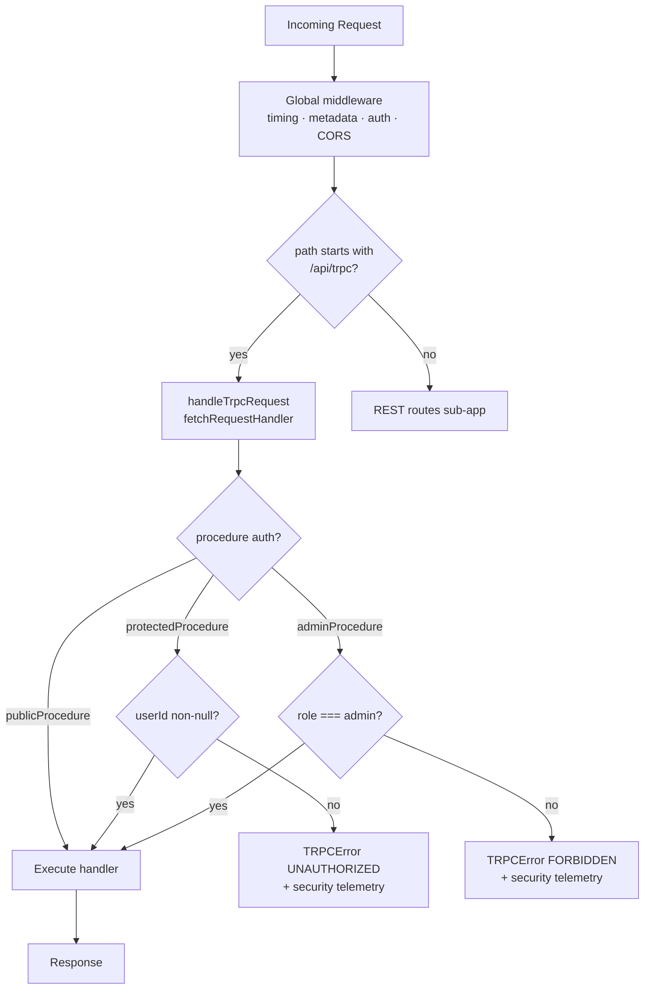

# tRPC API Layer

## Overview

The adblock-compiler Worker exposes a typed tRPC v11 API alongside the existing REST endpoints.
All tRPC procedures are available at `/api/trpc/*`.

## Versioning

Procedures are namespaced by version: `v1.*`. The `v1` namespace is stable.
Breaking changes (removed procedures, changed input shapes) will be introduced under `v2`
without removing `v1`.

## Procedure catalogue

### v1.health.get (query, public)

Returns the same payload as `GET /api/health`.

### v1.compile.json (mutation, authenticated)

Accepts a `CompileRequestSchema` body. Returns the compiled ruleset JSON.

### v1.version.get (query, public)

Returns `{ version, apiVersion }`.

## Angular client

```typescript
import { createTrpcClient } from 'worker/trpc/client';

const client = createTrpcClient(environment.apiBaseUrl, () => authService.getToken());
const result = await client.v1.compile.json.mutate({
  configuration: {
    sources: [
      {
        url: 'https://example.com/easylist.txt',
      },
    ],
  },
  preFetchedContent: {},
});
```

## Adding a new procedure

1. Create (or extend) a router file in `worker/trpc/routers/v1/`.
2. Add it to `worker/trpc/routers/v1/index.ts`.
3. No changes to `hono-app.ts` required — the tRPC handler is already mounted.

## Mount point

The tRPC handler is mounted directly on the top-level `app` (not the `routes` sub-app)
so that the `compress` and `logger` middleware scoped to business routes do not wrap
tRPC responses. See [`hono-routing.md`](./hono-routing.md#trpc-endpoint) for details.



## ZTA notes

- `protectedProcedure` enforces non-anonymous auth (returns `UNAUTHORIZED` if
  `authContext.userId` is null).
- `adminProcedure` additionally enforces `role === 'admin'` (returns `FORBIDDEN`).
- Auth failures emit `AnalyticsService.trackSecurityEvent()` via the `onError` hook
  in `worker/trpc/handler.ts`.
- `/api/trpc/*` has its own `app.use('/api/trpc/*', rateLimitMiddleware())` middleware
  applied directly on `app` before `handleTrpcRequest`, enforcing tiered rate limits
  (including `rate_limit` security telemetry) for all tRPC calls.
- `/api/trpc/*` has its own ZTA access-gate middleware that calls `checkUserApiAccess()`
  (blocks banned/suspended users) and `trackApiUsage()` (billing/analytics) —
  matching the same checks applied to REST routes by `routes.use('*', ...)`.
- CORS is inherited from the global `cors()` middleware already in place on `app`.
