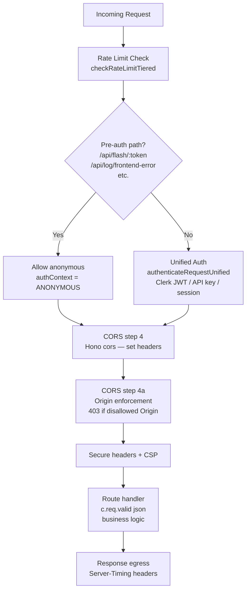

# Worker Request Lifecycle

This document describes the full lifecycle of an HTTP request through the Bloqr Cloudflare Worker — from initial receipt at the Hono entry point through middleware, authentication, route handling, and response egress. It also documents three common crash patterns and their fixes.

---

## Pipeline Overview



The real middleware order in `worker/hono-app.ts` (abbreviated):

1. **Server-Timing, Request ID, IP detection** — `timing()`, `generateRequestId()`, IP extraction
2. **Rate limiting + pre-auth** — anonymous `checkRateLimitTiered` for `/poc/*` and pre-auth paths; pre-auth paths (`/api/flash/:token`, `/api/log/frontend-error`, etc.) bypass authentication
3. **Unified auth** — `authenticateRequestUnified()` for all other paths; stores `authContext` on `c`
4. **CORS** — Hono `cors()` sets `Access-Control-*` headers; origin enforcement step returns `403 ProblemDetails` for disallowed browser origins
5. **Secure headers + CSP** — `secureHeaders()`, `contentSecurityPolicyMiddleware()`
6. **Route handler** — parses and validates request body via `c.req.valid('json')` (from `@hono/zod-openapi`), performs business logic, returns response

---

## Request Body Lifecycle

The `Request` body is a **single-use readable stream**. Consuming it once (e.g., `await req.json()`) marks it as "used". Any subsequent call to `req.json()`, `req.text()`, or `req.arrayBuffer()` returns an error or empty value.

In this Worker, route handlers avoid double-consuming the body by relying on **`@hono/zod-openapi` validation**. Each route declares a Zod schema, and Hono parses and validates the body once, storing the result on the context. Handlers read the validated body via `c.req.valid('json')`:

```typescript
// worker/routes/rules.routes.ts
import { createRoute, z } from '@hono/zod-openapi';

const CreateRuleRoute = createRoute({
    method: 'post',
    path: '/api/rules',
    request: {
        body: {
            content: {
                'application/json': {
                    schema: CreateRuleSchema,
                },
            },
        },
    },
    responses: { /* ... */ },
});

routes.openapi(CreateRuleRoute, async (c) => {
    const body = c.req.valid('json');   // ✅ parsed once by Hono; stream not re-consumed
    // body is fully typed as CreateRuleSchema output
    await createRule(c.env.DB, body);
    return c.json({ success: true }, 201);
});
```

Where a route needs to clone the raw request (e.g., when calling Turnstile on the WebSocket upgrade path), it calls `c.req.raw.clone()` **before** the body has been consumed — not after.

> **Important:** Never call `c.req.json()` directly in a handler that also runs after a middleware that called `c.req.json()`. Use `c.req.valid('json')` for OpenAPI-registered routes, or ensure the body is only read once and stored on the Hono context.

---

## Crash Pattern 1 — "Body Already Used"

**Symptom:** Route handler returns empty body or throws `TypeError: Body is unusable` at the second `await c.req.json()` call.

**Cause:** A middleware or earlier handler called `await c.req.json()` (or `.text()`, `.arrayBuffer()`) before the route handler.

**Fix:** Use `c.req.valid('json')` for OpenAPI-registered routes. For custom middleware that must inspect the body, clone the raw request **before** any consumption: `const cloned = c.req.raw.clone(); const body = await cloned.json();` and store the result on the Hono context via `c.set(...)`. Downstream handlers then read from the context, not from the request stream.

---

## Crash Pattern 2 — KV Binding Not Guarded

**Symptom:** Worker throws `TypeError: Cannot read properties of undefined (reading 'get')` in a route that uses `env.CACHE_KV`.

**Cause:** `CACHE_KV` is a KV namespace binding that may not be present in all environments (e.g., local `wrangler dev` without a `--kv` flag). Code that calls `env.CACHE_KV.get(key)` unconditionally crashes when the binding is absent.

**Fix:** Guard all KV operations against an absent binding:

```typescript
// ❌ Crashes when CACHE_KV binding is absent
const cached = await c.env.CACHE_KV.get(cacheKey);

// ✅ Safe — returns null if binding is absent
const cached = c.env.CACHE_KV
    ? await c.env.CACHE_KV.get(cacheKey)
    : null;

if (cached) {
    return c.json(JSON.parse(cached));
}
```

Apply this pattern for every KV, R2, D1, and Durable Object binding that is optional in some deployment environments. Required bindings (those that must always be present) should be declared in the `Env` interface as non-optional so that TypeScript catches the absence at compile time.

---

## Crash Pattern 3 — Unsafe `event.params` Cast

**Symptom:** Workflow step handler or Durable Object alarm throws a runtime error because `event.params` fields have unexpected types or are missing.

**Cause:** Code casts `event.params` directly to a typed interface:

```typescript
// ❌ Unsafe — no validation, will crash if params are malformed
const config = event.params as WorkflowConfig;
```

**Fix:** Parse with `WorkflowConfigSchema.safeParse`:

```typescript
// ✅ Safe — rejects malformed params with a clear error before any business logic
const result = WorkflowConfigSchema.safeParse(event.params);
if (!result.success) {
    console.error('Invalid workflow params', result.error.issues);
    // In a Workflow step, throwing aborts this step attempt and triggers retry logic
    throw new Error(`Invalid workflow params: ${result.error.message}`);
}
const config: WorkflowConfig = result.data;
```

This applies to:
- `WorkflowEntrypoint.run()` — validate `event.params` before use
- Durable Object `alarm()` — parse any stored state retrieved from `this.state.storage`
- Queue consumer `queue.messages` — parse each message body before processing

---

## `waitUntil` — Non-Blocking Side Effects

Use `c.executionCtx.waitUntil(promise)` for operations that must not block the response but must complete before the Worker is torn down. The canonical example is writing to D1 after returning `204`:

```typescript
// worker/routes/log.routes.ts
app.post('/api/log/frontend-error', async (c) => {
    const body  = LogFrontendErrorSchema.parse(c.get('body'));
    const now   = new Date().toISOString();

    // Non-blocking D1 write — response returns immediately
    c.executionCtx.waitUntil(
        c.env.DB.prepare(
            `INSERT INTO error_events (id, timestamp, code, message, severity, source, url, user_agent)
             VALUES (?, ?, ?, ?, ?, 'angular', ?, ?)`,
        )
        .bind(
            crypto.randomUUID(),
            now,
            body.code,
            body.message,
            body.severity,
            body.url,
            body.userAgent,
        )
        .run(),
    );

    return c.body(null, 204);
});
```

> **Important:** `waitUntil` promises run to completion even after the response is sent, but only while the Worker isolate is alive. Do not use `waitUntil` for operations that require a response (e.g., redirects based on write results). Use `await` for those.

---

## Environment Bindings Reference

All Worker bindings are accessed via the `Env` typed object. `process.env` is **not available** in the Cloudflare Workers runtime.

```typescript
// worker/types/env.ts
export interface Env {
    // KV namespaces (optional in some environments)
    FLASH_STORE:  KVNamespace;
    CACHE_KV?:    KVNamespace;     // optional — guard before use

    // D1 database
    DB:           D1Database;

    // R2 bucket
    RULE_STORE:   R2Bucket;

    // Secrets (plain string bindings)
    TURNSTILE_SECRET_KEY:   string;
    BETTER_AUTH_SECRET:     string;
    CORS_ALLOWED_ORIGINS:   string;
    TRUSTED_ORIGINS:        string;
    SENTINEL_ENABLED:       string;   // 'true' | 'false'
}
```

Never use `process.env.SOME_KEY` — it will be `undefined` at runtime. Always read from `c.env.SOME_KEY` (in a Hono handler) or `env.SOME_KEY` (in a raw `fetch` / `scheduled` handler).

---

## Middleware Registration Order

Middleware is registered in this order in `worker/hono-app.ts`:

```typescript
// worker/hono-app.ts (abbreviated)
const app = new OpenAPIHono<{ Bindings: Env }>();

// 1. Instrumentation: Server-Timing, request ID, IP detection
app.use('*', timing());
app.use('*', async (c, next) => { c.set('requestId', generateRequestId()); /* ... */ await next(); });

// 2. Rate limiting + pre-auth paths (anonymous tier)
app.use('*', async (c, next) => {
    // /poc/* — anonymous rate limit only
    // pre-auth paths (/api/flash/:token, /api/log/frontend-error, etc.) — rate limit then allow through
    // all other paths — full unified auth (step 3)
    // ...
    await next();
});

// 3. Unified auth (for non-pre-auth paths)
// (inline in the same middleware as step 2 — see worker/hono-app.ts)

// 4. CORS — Hono cors() sets Access-Control-* headers
app.use('*', cors({ /* ... */ }));

// 4a. CORS origin enforcement — 403 ProblemDetails for disallowed browser Origins
app.use('*', async (c, next) => { /* ... */ await next(); });

// 5. Secure headers
app.use('*', secureHeaders());

// 5a. Content Security Policy
app.use('*', contentSecurityPolicyMiddleware());

// Routes (via sub-app)
const routes = new OpenAPIHono<{ Bindings: Env }>();
routes.route('/api/auth',     authRoutes);
routes.route('/api/keys',     apiKeysRoutes);
routes.route('/api/compile',  compileRoutes);
routes.route('/api/flash',    flashRoutes);
routes.route('/api/log',      logRoutes);
// ... (see worker/hono-app.ts for full list)

app.route('/', routes);
```

Order is significant:
1. **Rate limiting** runs first (even before auth) so bot floods are rejected cheaply.
2. **Pre-auth paths** skip authentication to allow anonymous access for flash token redemption and frontend error logging.
3. **Auth** runs before CORS so that `authContext` is available to CORS helpers that may inspect it.
4. **CORS** runs after auth so preflight `OPTIONS` responses carry CORS headers; the enforcement step rejects disallowed origins before they reach route handlers.
5. **Route handlers** parse and validate bodies via `c.req.valid('json')` — Hono/Zod-OpenAPI consumes the request stream exactly once.

---

## Related Documentation

- [CORS Policy](../middleware/cors.md) — `corsMiddleware()` details
- [Turnstile Middleware](../middleware/turnstile.md) — `turnstileMiddleware()` details and API key bypass
- [Secure Error-Passing Architecture](./error-passing.md) — `waitUntil` usage for D1 error event logging
- [Better Auth Security Audit](../auth/better-auth-audit-2026-05.md) — `authMiddleware` session validation findings
