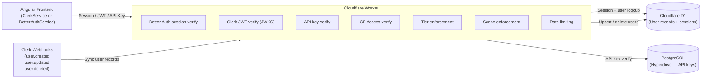

# Authentication & Authorization

The adblock-compiler uses a two-provider auth system: **Better Auth** (with Cloudflare D1) is the default provider, with [Clerk](https://clerk.com) ready to activate via a single environment variable when needed. Both providers are pluggable implementations of the `IAuthProvider` interface — no code changes are required to switch.

> **Not sure which provider is active?** See [Auth Provider Selection](auth-provider-selection.md).

## Documentation

| Document | Audience | Description |
|----------|----------|-------------|
| [Auth Provider Selection](auth-provider-selection.md) | All | How the system chooses Clerk vs Better Auth, and how to switch |
| [Clerk Dashboard Setup](clerk-setup.md) | Operators | Step-by-step Clerk application configuration |
| [Configuration Guide](configuration.md) | Operators / DevOps | Environment variables, secrets, and deployment setup |
| [Developer Guide](developer-guide.md) | Developers | Architecture, extensibility, and code patterns |
| [API Authentication](api-authentication.md) | API Consumers | How to authenticate API requests |
| [Postman Testing](postman-testing.md) | Developers / API Consumers | How to set up Postman to test authenticated API requests |
| [Removing Anonymous Access](removing-anonymous-access.md) | All | Migration plan for mandatory authentication |
| [Admin Access](admin-access.md) | Operators | Admin endpoint protection and dashboard access |
| [Cloudflare Access](cloudflare-access.md) | Operators / DevOps | Cloudflare Zero Trust Access setup for admin routes |
| [CLI Authentication](cli-authentication.md) | CLI Users / DevOps | Using the CLI with authenticated queue endpoints |
| [Clerk + Cloudflare Integration](clerk-cloudflare-integration.md) | Developers / DevOps | How Clerk integrates with Workers, KV, D1, Hyperdrive, Turnstile |
| [ZTA Review Fixes](zta-review-fixes.md) | Developers | PR #1273 follow-up: telemetry, rate-limit, schema, and admin hardening fixes |

## Architecture Overview

## Authentication Methods

The system supports four authentication methods. The active session/JWT provider (Clerk or
Better Auth) is determined by the `CLERK_JWKS_URL` environment variable — see
[Auth Provider Selection](auth-provider-selection.md) for details.

1. **Better Auth** *(default)* — Session-based auth using D1 for storage. Supports both cookie
   and bearer token authentication. Active when `CLERK_JWKS_URL` is **not** set and
   `BETTER_AUTH_SECRET` is configured. Frontend shows a native sign-in/sign-up form.
2. **Clerk JWT** *(alternative)* — JWT issued by Clerk, verified via JWKS. Active when
   `CLERK_JWKS_URL` is set. Frontend mounts the hosted Clerk widget.
3. **API Key** — For programmatic access. Users create API keys via the dashboard; sent as
   `Authorization: Bearer abc_...`.
4. **Anonymous** — Unauthenticated access with lowest rate limits. Will be removed in a future release.

## Tier System

| Tier | Rate Limit | Description |
|------|-----------|-------------|
| Anonymous | 10 req/min | Unauthenticated — basic access (being deprecated) |
| Free | 60 req/min | Registered user — standard access |
| Pro | 300 req/min | Paid subscriber — higher limits |
| Admin | Unlimited | Administrator — full system access |

## Quick Links

- **Better Auth Docs**: [better-auth.com/docs](https://www.better-auth.com/docs)
- **Clerk Dashboard**: [dashboard.clerk.com](https://dashboard.clerk.com)
- **Clerk Docs**: [clerk.com/docs](https://clerk.com/docs)
- **Cloudflare Access**: [Cloudflare Zero Trust](https://one.dash.cloudflare.com)
- **GitHub Issue**: [#1241 — Better Auth Migration](https://github.com/jaypatrick/adblock-compiler/issues/1241)
