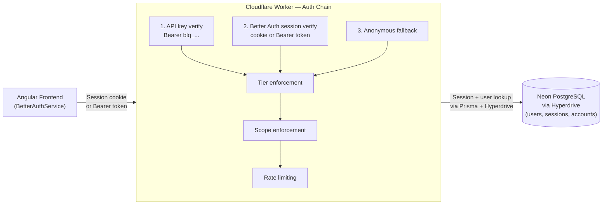

# Authentication & Authorization

The adblock-compiler uses **Better Auth** as its sole authentication provider. Better Auth runs
entirely within the Cloudflare Worker, backed by Neon PostgreSQL via Cloudflare Hyperdrive and
the Prisma ORM. No third-party auth service is required at runtime.

## Documentation

| Document | Audience | Description |
|----------|----------|-------------|
| [Bootstrap Runbook](bootstrap-runbook.md) | Operators | Step-by-step: first admin setup, smoke test, API key creation, Postman config |
| [Better Auth User Guide](better-auth-user-guide.md) | All users | Sign-up, sign-in, 2FA, session management, API keys |
| [Better Auth Admin Guide](better-auth-admin-guide.md) | Operators | User management, banning, secret rotation, migrations |
| [Better Auth Developer Guide](better-auth-developer-guide.md) | Developers | Plugin catalogue, adapter swapping, custom providers |
| [Developer Guide](developer-guide.md) | Developers | Architecture overview, IAuthProvider interface, bindings |
| [Auth Provider Selection](auth-provider-selection.md) | All | How provider selection works and how to extend it |
| [Configuration Guide](configuration.md) | Operators / DevOps | Environment variables, secrets, and deployment |
| [Better Auth Prisma Setup](better-auth-prisma.md) | Developers / DevOps | Prisma adapter, Neon, and Hyperdrive configuration |
| [Social Providers](social-providers.md) | Operators | GitHub and Google OAuth setup |
| [API Authentication](api-authentication.md) | API Consumers | How to authenticate API requests programmatically |
| [Postman Testing](postman-testing.md) | Developers / API Consumers | Postman setup for authenticated API testing |
| [Admin Access](admin-access.md) | Operators | Admin endpoint protection and dashboard access |
| [Cloudflare Access](cloudflare-access.md) | Operators / DevOps | Cloudflare Zero Trust Access for admin routes |
| [CLI Authentication](cli-authentication.md) | CLI Users / DevOps | CLI authentication with queue endpoints |
| [Email Architecture](email-architecture.md) | Developers / Operators | Hybrid email delivery: Resend (auth critical) + CF Email Service REST (transactional), provider selector, flows, env setup |
| [ZTA Review Fixes](zta-review-fixes.md) | Developers | ZTA hardening: telemetry, rate-limit, schema, admin fixes |
| [Removing Anonymous Access](removing-anonymous-access.md) | All | Migration plan for mandatory authentication |

> **Deprecated (historical reference only):**
> [Clerk Setup](clerk-setup.md) · [Clerk + Cloudflare Integration](clerk-cloudflare-integration.md) · [Migration: Clerk → Better Auth](migration-clerk-to-better-auth.md)

---

## Architecture Overview

---

## Authentication Methods

The system supports three authentication methods:

1. **Better Auth session** — Cookie or bearer session token. Created on sign-up/sign-in.
   Supports email+password and GitHub OAuth. Active when a valid session exists in the database.

2. **API key** — Long-lived programmatic access key (`blq_` prefix). Created via the API keys
   dashboard. Verified by hashing and database lookup on every request.

3. **Anonymous** — No credentials. Lowest rate limits. Access to public endpoints only.

---

## Tier System

| Tier | Rate Limit | Description |
|------|-----------|-------------|
| `anonymous` | 10 req/min | Unauthenticated — public endpoints only |
| `free` | 60 req/min | Registered user — standard access |
| `pro` | 300 req/min | Paid subscriber — higher limits |
| `admin` | Unlimited | Administrator — full system access |

Tiers are resolved from the database `user.tier` field on every request. They are never
trusted from JWT claims (Zero Trust principle).

---

## Quick Links

- **Better Auth Docs**: [better-auth.com/docs](https://www.better-auth.com/docs)
- **Cloudflare Hyperdrive**: [developers.cloudflare.com/hyperdrive](https://developers.cloudflare.com/hyperdrive/)
- **Neon PostgreSQL**: [neon.tech](https://neon.tech)
- **Cloudflare Access**: [Cloudflare Zero Trust](https://one.dash.cloudflare.com)
