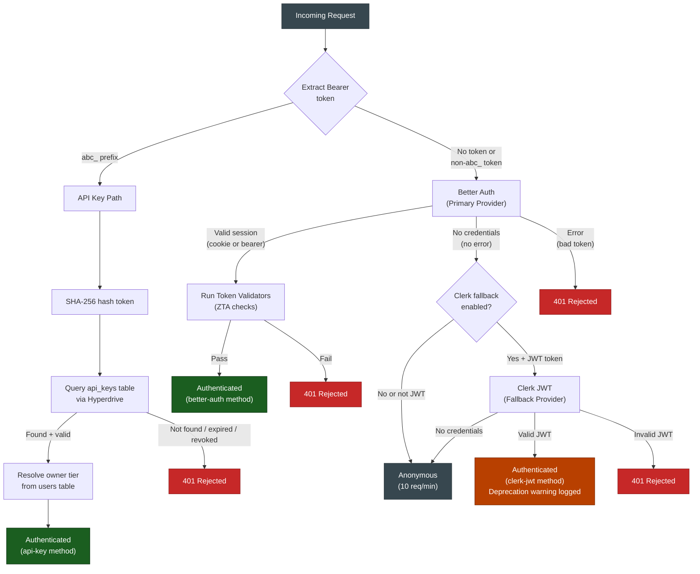
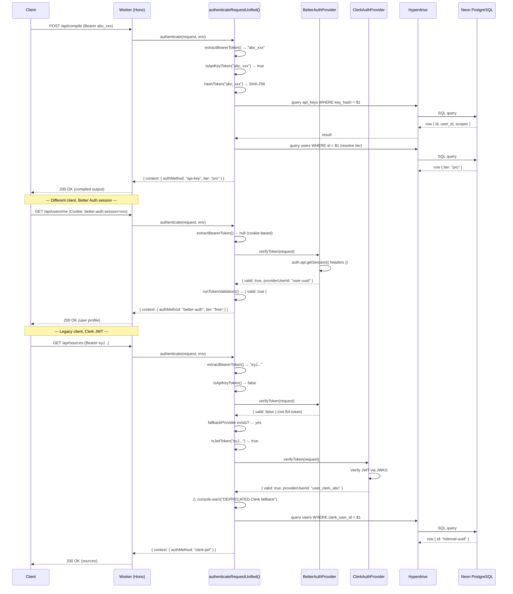
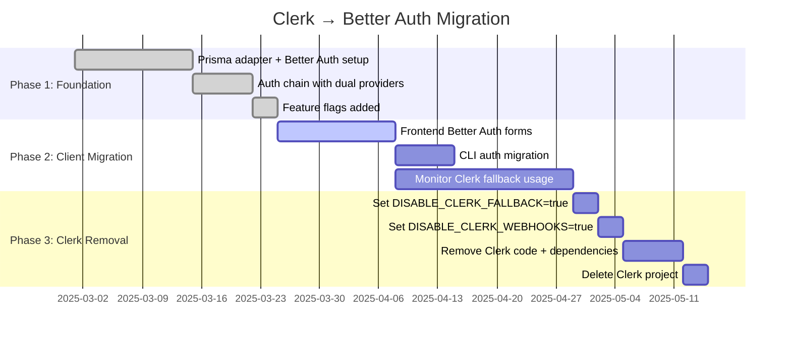

# Auth Chain Reference

> **Runtime authentication flow** — How the four-tier auth chain works,
> the Better Auth ↔ Clerk fallback mechanism, feature flags, and migration
> timeline.

---

## Table of Contents

- [Overview](#overview)
- [Auth Chain Priority](#auth-chain-priority)
- [Sequence Diagram](#sequence-diagram)
- [Token Disambiguation](#token-disambiguation)
- [Better Auth (Primary Provider)](#better-auth-primary-provider)
- [Clerk JWT (Deprecated Fallback)](#clerk-jwt-deprecated-fallback)
- [Feature Flags](#feature-flags)
- [Auth Guards](#auth-guards)
- [Migration Timeline](#migration-timeline)
- [When to Use Which Provider](#when-to-use-which-provider)

---

## Overview

Every request to the Cloudflare Worker is authenticated through a **four-tier chain**
implemented in `worker/middleware/auth.ts`. The chain evaluates providers in strict
priority order and short-circuits on the first successful match:

| Priority | Method | Token Format | Provider |
|---|---|---|---|
| 1 | **API Key** | `abc_...` prefix | Direct PostgreSQL lookup via Hyperdrive |
| 2 | **Better Auth** | Cookie or bearer session ID | `BetterAuthProvider` (primary) |
| 3 | **Clerk JWT** | `header.payload.signature` | `ClerkAuthProvider` (deprecated fallback) |
| 4 | **Anonymous** | No credentials | Falls through to anonymous context |

The chain **never throws** — all failures are communicated via the `response` field
on `IAuthMiddlewareResult`.

---

## Auth Chain Priority



---

## Sequence Diagram



---

## Token Disambiguation

The auth middleware determines the token type by pattern matching:

```typescript
// worker/middleware/auth.ts

/** API keys always start with the "abc_" prefix */
function isApiKeyToken(token: string): boolean {
    return token.startsWith('abc_');
}

/** JWTs have three dot-separated base64 segments */
function isJwtToken(token: string): boolean {
    const parts = token.split('.');
    return parts.length === 3 && parts.every((p) => p.length > 0);
}
```

| Token | Pattern | Route |
|---|---|---|
| `abc_sk_live_xxxx...` | Starts with `abc_` | → API Key path |
| `eyJhbGci.eyJzdWI.xxxxx` | Three dot-separated segments | → JWT path (Clerk fallback) |
| `sess_abc123xyz` | Better Auth session token | → Better Auth (via cookie or bearer plugin) |
| *(none)* | No Authorization header | → Better Auth (checks cookies) → Anonymous |

---

## Better Auth (Primary Provider)

**Implementation:** `worker/middleware/better-auth-provider.ts`

Better Auth is always the **first** provider consulted for non-API-key requests.
It handles both cookie-based browser sessions and bearer-token API sessions
(via the `bearer()` plugin).

```typescript
// worker/lib/auth.ts — createAuth()

export function createAuth(env: Env, baseURL?: string) {
    const prisma = createPrismaClient(env.HYPERDRIVE!.connectionString);

    return betterAuth({
        database: prismaAdapter(prisma, { provider: 'postgresql' }),
        secret: env.BETTER_AUTH_SECRET!,
        basePath: '/api/auth',
        baseURL,
        emailAndPassword: { enabled: true },
        user: {
            additionalFields: {
                tier:  { type: 'string', required: false, defaultValue: 'free', input: false },
                role:  { type: 'string', required: false, defaultValue: 'user', input: false },
            },
        },
        session: {
            expiresIn: 60 * 60 * 24 * 7,   // 7 days
            updateAge: 60 * 60 * 24,         // refresh within 1 day of expiry
        },
        plugins: [bearer()],
    });
}
```

### Session Resolution

Better Auth resolves sessions using `auth.api.getSession()`, which checks:
1. `Cookie: better-auth.session_token=...` — browser sessions
2. `Authorization: Bearer <session-id>` — API sessions (bearer plugin)

### Tier Resolution (ZTA)

Tier and role are read from the database on **every request** — not cached in the
session token. This enables Zero Trust Architecture: revoking a user's `admin` role
takes effect immediately without waiting for token expiry.

---

## Clerk JWT (Deprecated Fallback)

**Implementation:** `worker/middleware/clerk-auth-provider.ts`

The Clerk fallback is **only attempted** when all of these conditions are true:

1. The primary provider (Better Auth) returned `{ valid: false }` **without** an error
2. A `fallbackProvider` was supplied to `authenticateRequestUnified()`
3. The Bearer token looks like a JWT (three dot-separated segments)
4. `DISABLE_CLERK_FALLBACK` is not `"true"`

When the fallback authenticates a request, a deprecation warning is logged:

```
[auth] Request authenticated via DEPRECATED Clerk fallback.
Migrate this client to Better Auth. Set DISABLE_CLERK_FALLBACK=true to remove this path.
```

---

## Feature Flags

### `DISABLE_CLERK_FALLBACK`

| Value | Behavior |
|---|---|
| `undefined` or `"false"` | Clerk JWT fallback is **enabled** (default during migration) |
| `"true"` | Clerk JWT fallback is **skipped** — only API Key → Better Auth → Anonymous |

**Where it's checked:**

```typescript
// worker/hono-app.ts
const clerkFallbackEnabled =
    c.env.CLERK_JWKS_URL && c.env.DISABLE_CLERK_FALLBACK !== 'true';

const fallbackProvider = clerkFallbackEnabled
    ? new ClerkAuthProvider(c.env)
    : undefined;
```

**When to enable:** Set `DISABLE_CLERK_FALLBACK=true` when all clients have been migrated
to Better Auth. This removes an unnecessary network call and simplifies the auth chain.

### `DISABLE_CLERK_WEBHOOKS`

| Value | Behavior |
|---|---|
| `undefined` or `"false"` | `/api/webhooks/clerk` endpoint is **active** |
| `"true"` | Endpoint returns `410 Gone` with `{ error: "Clerk webhooks are disabled" }` |

**Where it's checked:**

```typescript
// worker/hono-app.ts
routes.post('/webhooks/clerk', (c) => {
    if (c.env.DISABLE_CLERK_WEBHOOKS === 'true') {
        return c.json({ error: 'Clerk webhooks are disabled' }, { status: 410 });
    }
    return handleClerkWebhook(c.env);
});
```

**When to enable:** Set `DISABLE_CLERK_WEBHOOKS=true` after removing the Clerk webhook
from the Clerk dashboard. The `410 Gone` response signals to any remaining callers that
the endpoint is permanently retired.

### Setting Feature Flags

```bash
# Local development (.dev.vars)
DISABLE_CLERK_FALLBACK=true
DISABLE_CLERK_WEBHOOKS=true

# Production (Cloudflare dashboard or wrangler)
npx wrangler secret put DISABLE_CLERK_FALLBACK
# Enter: true

npx wrangler secret put DISABLE_CLERK_WEBHOOKS
# Enter: true
```

---

## Auth Guards

The auth middleware provides helper functions for route-level access control:

```typescript
// worker/middleware/auth.ts

// Require any authenticated user (rejects anonymous)
const authCheck = requireAuth(context);
if (authCheck) return authCheck; // 401

// Require minimum tier (e.g., Pro)
const tierCheck = requireTier(context, UserTier.Pro);
if (tierCheck) return tierCheck; // 403

// Require specific API key scope
const scopeCheck = requireScope(context, 'compile', 'admin');
if (scopeCheck) return scopeCheck; // 403
```

### Scope Bypass Rules

| Auth Method | Scope Check |
|---|---|
| `better-auth` | **Bypassed** — session-authenticated users own the account |
| `clerk-jwt` | **Bypassed** — same reasoning |
| `api-key` | **Enforced** — scopes from the `api_keys.scopes` array |
| `anonymous` | **Rejected** — anonymous users have no scopes |

---

## Migration Timeline

The Clerk → Better Auth migration follows a phased approach:



### Current State

- **Better Auth** is the primary provider and handles all new sign-ups
- **Clerk fallback** remains enabled for clients not yet migrated
- **Clerk webhooks** still sync user data to the PostgreSQL `users` table
- The deprecation warning in logs tracks how many requests still use Clerk

### Monitoring Fallback Usage

To check whether any clients still use Clerk, search Worker logs for:

```
[auth] Request authenticated via DEPRECATED Clerk fallback
```

When this message stops appearing, it's safe to proceed to Phase 3.

---

## When to Use Which Provider

| Scenario | Provider | Why |
|---|---|---|
| **New API integration** | API Key (`abc_` prefix) | Scoped, revocable, rate-limited per key |
| **Browser app (new)** | Better Auth (cookie) | Server-side sessions, no JWTs in localStorage |
| **Programmatic API calls** | Better Auth (bearer plugin) | Session-based auth without cookies |
| **Legacy integration** | Clerk JWT (temporary) | Only for clients not yet migrated |
| **Public/unauthenticated** | Anonymous | 10 req/min rate limit, basic features only |

### Recommendation

For all new development, use **Better Auth**:

```typescript
// Browser: Better Auth handles cookies automatically via /api/auth/*
// See: worker/lib/auth.ts → basePath: '/api/auth'

// API: Use the bearer plugin
fetch('/api/compile', {
    headers: {
        'Authorization': `Bearer ${sessionToken}`,
    },
});

// Or use an API key for server-to-server
fetch('/api/compile', {
    headers: {
        'Authorization': `Bearer abc_sk_live_...`,
    },
});
```

---

## Further Reading

- [Auth Provider Selection](./auth-provider-selection.md) — Environment variable-based provider switching
- [Better Auth + Prisma](./better-auth-prisma.md) — Prisma adapter configuration
- [Migration Guide](./migration-clerk-to-better-auth.md) — Step-by-step Clerk → Better Auth migration
- [API Authentication](./api-authentication.md) — API key creation and management
- [Developer Guide](./developer-guide.md) — Full auth integration tutorial
