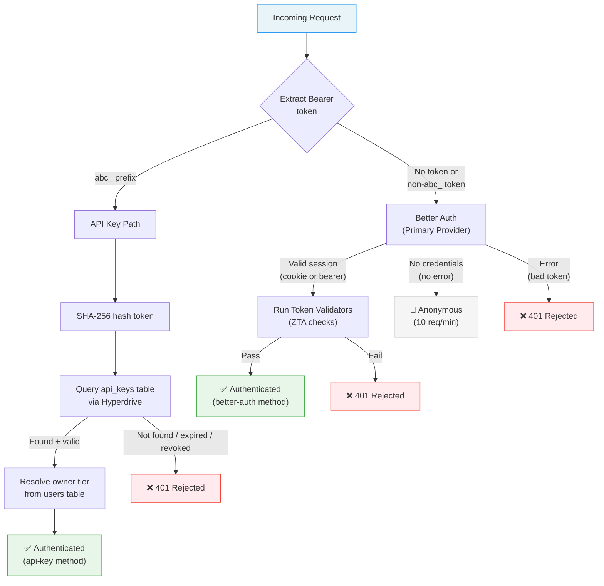
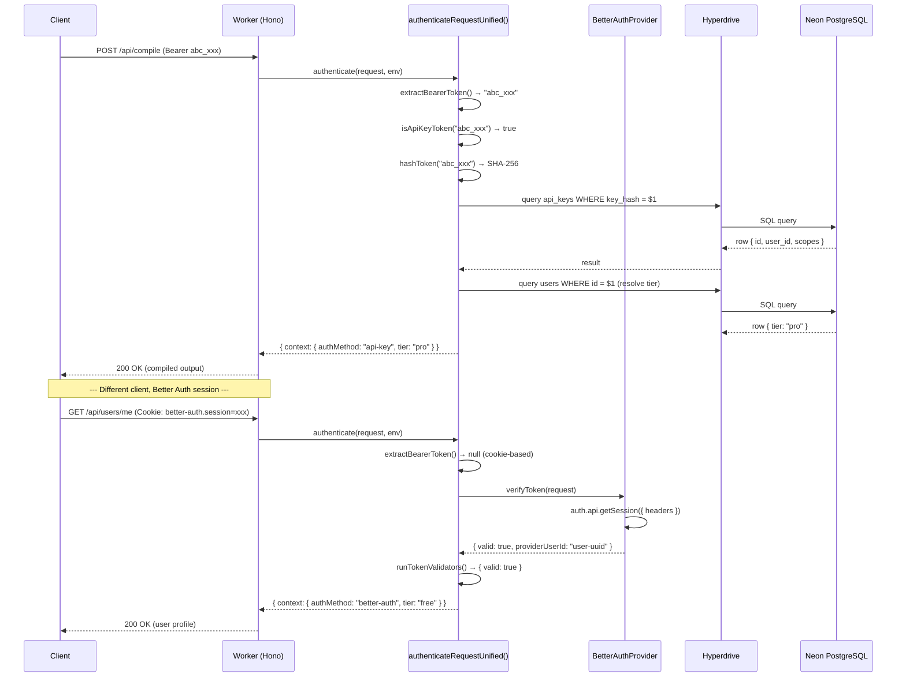

# Auth Chain Reference

> **Runtime authentication flow** — How the three-tier auth chain works,
> feature flags, and the completed Clerk → Better Auth migration.

---

## Table of Contents

- [Overview](#overview)
- [Auth Chain Priority](#auth-chain-priority)
- [Sequence Diagram](#sequence-diagram)
- [Token Disambiguation](#token-disambiguation)
- [Better Auth (Primary Provider)](#better-auth-primary-provider)
- [Auth Guards](#auth-guards)
- [When to Use Which Provider](#when-to-use-which-provider)

---

## Overview

Every request to the Cloudflare Worker is authenticated through a **three-tier chain**
implemented in `worker/middleware/auth.ts`. The chain evaluates providers in strict
priority order and short-circuits on the first successful match:

| Priority | Method | Token Format | Provider |
|---|---|---|---|
| 1 | **API Key** | `abc_...` prefix | Direct PostgreSQL lookup via Hyperdrive |
| 2 | **Better Auth** | Cookie or bearer session ID | `BetterAuthProvider` (primary) |
| 3 | **Anonymous** | No credentials | Falls through to anonymous context |

The chain **never throws** — all failures are communicated via the `response` field
on `IAuthMiddlewareResult`.

---

## Auth Chain Priority



---

## Sequence Diagram



---

## Token Disambiguation

The auth middleware determines the token type by pattern matching:

```typescript
// worker/middleware/auth.ts

/** API keys always start with the "abc_" prefix */
function isApiKeyToken(token: string): boolean {
    return token.startsWith('abc_');
}
```

| Token | Pattern | Route |
|---|---|---|
| `abc_sk_live_xxxx...` | Starts with `abc_` | → API Key path |
| `sess_abc123xyz` | Better Auth session token | → Better Auth (via cookie or bearer plugin) |
| *(none)* | No Authorization header | → Better Auth (checks cookies) → Anonymous |

---

## Better Auth (Primary Provider)

**Implementation:** `worker/middleware/better-auth-provider.ts`

Better Auth is always the **first** provider consulted for non-API-key requests.
It handles both cookie-based browser sessions and bearer-token API sessions
(via the `bearer()` plugin).

```typescript
// worker/lib/auth.ts — createAuth()

export function createAuth(env: Env, baseURL?: string) {
    const prisma = createPrismaClient(env.HYPERDRIVE!.connectionString);

    return betterAuth({
        database: prismaAdapter(prisma, { provider: 'postgresql' }),
        secret: env.BETTER_AUTH_SECRET!,
        basePath: '/api/auth',
        baseURL,
        emailAndPassword: { enabled: true },
        user: {
            additionalFields: {
                tier:  { type: 'string', required: false, defaultValue: 'free', input: false },
                role:  { type: 'string', required: false, defaultValue: 'user', input: false },
            },
        },
        session: {
            expiresIn: 60 * 60 * 24 * 7,   // 7 days
            updateAge: 60 * 60 * 24,         // refresh within 1 day of expiry
        },
        plugins: [bearer()],
    });
}
```

### Session Resolution

Better Auth resolves sessions using `auth.api.getSession()`, which checks:
1. `Cookie: better-auth.session_token=...` — browser sessions
2. `Authorization: Bearer <session-id>` — API sessions (bearer plugin)

### Tier Resolution (ZTA)

Tier and role are read from the database on **every request** — not cached in the
session token. This enables Zero Trust Architecture: revoking a user's `admin` role
takes effect immediately without waiting for token expiry.

---

## Auth Guards

The auth middleware provides helper functions for route-level access control:

```typescript
// worker/middleware/auth.ts

// Require any authenticated user (rejects anonymous)
const authCheck = requireAuth(context);
if (authCheck) return authCheck; // 401

// Require minimum tier (e.g., Pro)
const tierCheck = requireTier(context, UserTier.Pro);
if (tierCheck) return tierCheck; // 403

// Require specific API key scope
const scopeCheck = requireScope(context, 'compile', 'admin');
if (scopeCheck) return scopeCheck; // 403
```

### Scope Bypass Rules

| Auth Method | Scope Check |
|---|---|
| `better-auth` | **Bypassed** — session-authenticated users own the account |
| `api-key` | **Enforced** — scopes from the `api_keys.scopes` array |
| `anonymous` | **Rejected** — anonymous users have no scopes |

---

## When to Use Which Provider

| Scenario | Provider | Why |
|---|---|---|
| **New API integration** | API Key (`abc_` prefix) | Scoped, revocable, rate-limited per key |
| **Browser app** | Better Auth (cookie) | Server-side sessions, no JWTs in localStorage |
| **Programmatic API calls** | Better Auth (bearer plugin) | Session-based auth without cookies |
| **Public/unauthenticated** | Anonymous | 10 req/min rate limit, basic features only |

### Recommendation

For all new development, use **Better Auth**:

```typescript
// Browser: Better Auth handles cookies automatically via /api/auth/*
// See: worker/lib/auth.ts → basePath: '/api/auth'

// API: Use the bearer plugin
fetch('/api/compile', {
    headers: {
        'Authorization': `Bearer ${sessionToken}`,
    },
});

// Or use an API key for server-to-server
fetch('/api/compile', {
    headers: {
        'Authorization': `Bearer abc_sk_live_...`,
    },
});
```

---

## Further Reading

- [Better Auth User Guide](./better-auth-user-guide.md) — End-user sign-up, sign-in, and account management
- [Better Auth Developer Guide](./better-auth-developer-guide.md) — Integration reference for backend and frontend
- [Better Auth + Prisma](./better-auth-prisma.md) — Prisma adapter configuration
- [API Authentication](./api-authentication.md) — API key creation and management
- [Clerk → Better Auth Migration Guide](./migration-clerk-to-better-auth.md) — Historical reference for the completed migration
- [Developer Guide](./developer-guide.md) — Full auth integration tutorial
