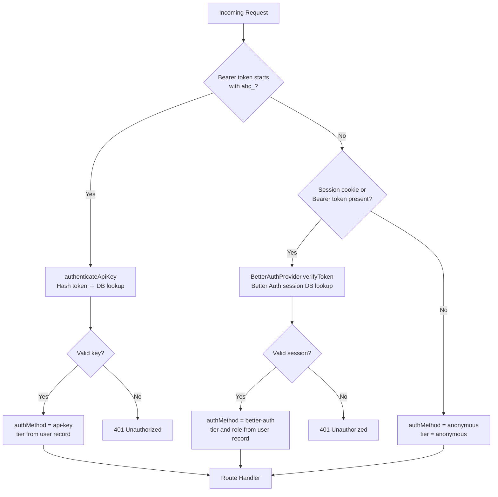
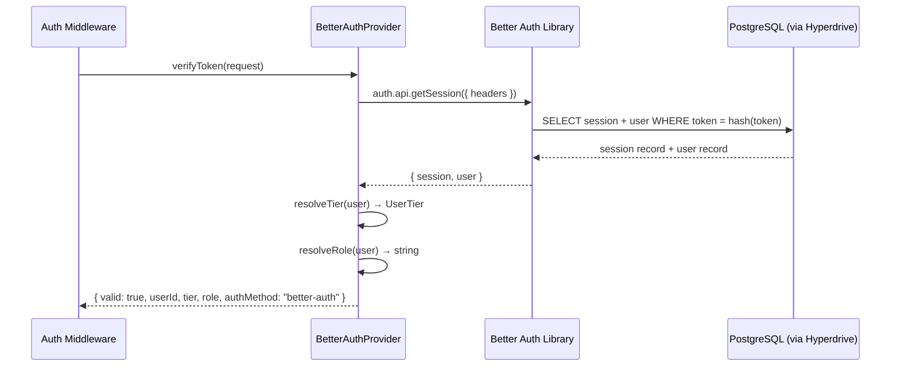

# Auth Provider Selection

The adblock-compiler uses **Better Auth exclusively** as its authentication provider. There is
no runtime provider switching — authentication is handled by the `BetterAuthProvider` class in
`worker/middleware/better-auth-provider.ts`.

This document explains how the provider was selected, how authentication resolves on every
request, and how to extend or replace the provider in the future.

---

## Provider Selection Rationale

| Factor | Better Auth |
|--------|-------------|
| **Open source** | Yes — MIT licensed |
| **Self-hosted** | Yes — runs entirely within the Cloudflare Worker |
| **No external dependencies at runtime** | Yes — all auth logic is in-process |
| **Prisma / PostgreSQL support** | Yes — `prismaAdapter` with Neon via Hyperdrive |
| **Plugin system** | Yes — bearer, 2FA, multi-session, admin, and more |
| **Email + password** | Yes |
| **OAuth (GitHub, Google)** | Yes |
| **TOTP / 2FA** | Yes — `twoFactor()` plugin |
| **Admin management API** | Yes — `admin()` plugin |

---

## Request Authentication Flow

Every authenticated API request goes through a three-tier chain in
`worker/middleware/auth.ts`:



### `authMethod` Values

| `authMethod` | Trigger | Notes |
|---|---|---|
| `api-key` | `Authorization: Bearer abc_...` | Long-lived programmatic access keys |
| `better-auth` | Session cookie or Bearer session token | Browser sessions and short-lived tokens |
| `anonymous` | No credentials | Read-only access to public endpoints |

---

## How the Active Provider Is Chosen

There is no dynamic switching at runtime. The Worker instantiates `BetterAuthProvider`
unconditionally:

```typescript
// worker/middleware/auth.ts
const provider = new BetterAuthProvider(env);
const result = await provider.verifyToken(request);
```

The `BetterAuthProvider` class wraps the Better Auth library and resolves tier and role from
the database on every request (Zero Trust — no JWT claim trust).

---

## Replacing or Extending the Provider

If you need to swap in a different identity provider (Auth0, custom JWKS, etc.), implement
the `IAuthProvider` interface from `worker/types.ts`:

```typescript
export interface IAuthProvider {
  verifyToken(request: Request): Promise<IAuthProviderResult>;
}
```

**Rules:**
- Return `{ valid: false }` (no `error`) when no credentials are present in the request.
- Return `{ valid: false, error: 'reason' }` when credentials are present but invalid.
- Return `{ valid: true, userId, tier, role, authMethod, providerUserId }` on success.
- Never throw from `verifyToken` — return an invalid result instead.

See [Better Auth Developer Guide](better-auth-developer-guide.md#creating-a-custom-iauthprovider)
for a full example with Auth0.

---

## What `BetterAuthProvider` Does



Tier and role are **always resolved from the database user record**, not from JWT claims.
This is the Zero Trust Architecture (ZTA) principle applied to authentication.

---

## Environment Variables That Control Provider Behaviour

| Variable | Effect |
|----------|--------|
| `BETTER_AUTH_SECRET` | HMAC signing key for session tokens — **required** |
| `BETTER_AUTH_URL` | Base URL for OAuth callbacks — required for social sign-in |
| `HYPERDRIVE` | Cloudflare Hyperdrive binding for Neon PostgreSQL — **required** |
| `GITHUB_CLIENT_ID` + `GITHUB_CLIENT_SECRET` | Enables GitHub OAuth — optional |
| `GOOGLE_CLIENT_ID` + `GOOGLE_CLIENT_SECRET` | Enables Google OAuth — optional (reserved) |

If `BETTER_AUTH_SECRET` or `HYPERDRIVE` is missing, the Worker throws a
`WorkerConfigurationError` at startup.

---

## Related Documentation

- [Better Auth Developer Guide](better-auth-developer-guide.md) — Custom providers, plugins
- [Configuration Guide](configuration.md) — Full environment variable reference
- [Developer Guide](developer-guide.md) — Architecture overview
