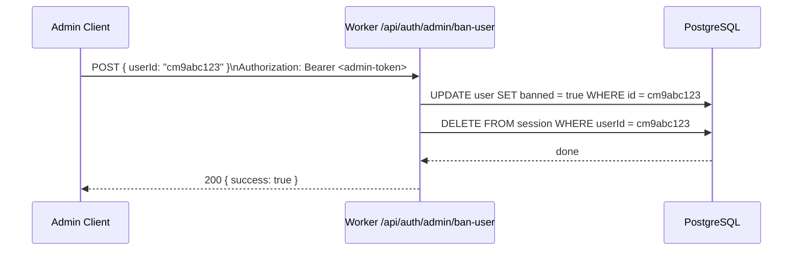
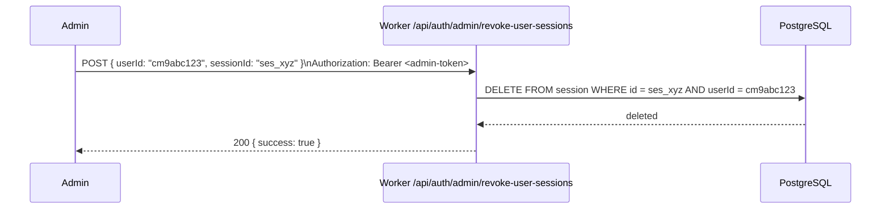

# Better Auth Admin Guide

Operations reference for administrators managing users, sessions, secrets, and database
migrations in the bloqr-backend authentication system.

---

## Bootstrapping the First Admin User

There is no hardcoded admin account. Use one of the following methods to create the first
admin after the initial database migration.

### Method A — Better Auth Admin Plugin API

Sign up normally, then promote the user using the admin plugin's `set-role` endpoint.
You need a temporary way to make the first call — use the `INITIAL_ADMIN_EMAIL` bootstrap
mechanism (see Method B) or call from a trusted network context.

```bash
# Sign up the first user
curl -X POST https://your-worker.workers.dev/api/auth/sign-up/email \
  -H "Content-Type: application/json" \
  -d '{ "name": "Admin User", "email": "admin@example.com", "password": "strong-password" }'

# Save the returned userId, then promote via Prisma CLI (one-time bootstrap):
deno task db:studio
# In Prisma Studio → User table → set role = "admin" and tier = "admin" for the user
```

### Method B — Prisma Studio (Recommended for First Admin)

```bash
# Start Prisma Studio against your local database
deno task db:studio
# OR against production (requires DIRECT_DATABASE_URL):
DIRECT_DATABASE_URL="postgresql://..." deno run -A npm:prisma studio
```

In Prisma Studio:

1. Navigate to the **User** table.
2. Find your user by email.
3. Set `role` → `admin` and `tier` → `admin`.
4. Save.

### Method C — Better Auth CLI (if the user exists)

```bash
# Using the Better Auth admin API — requires an existing admin session
curl -X POST https://your-worker.workers.dev/api/auth/admin/set-role \
  -H "Authorization: Bearer <existing-admin-session-token>" \
  -H "Content-Type: application/json" \
  -d '{ "userId": "cm9abc123", "role": "admin" }'
```

---

## Managing Users via the Admin Panel

Navigate to **`/admin/users`** in the Angular frontend. You must be signed in with an account
whose `role` is `admin`.

### What the Panel Shows

| Column | Source | Notes |
|--------|--------|-------|
| ID | `user.id` | Truncated display; click to copy full ID |
| Name | `user.name` | |
| Email | `user.email` | |
| Tier | `user.tier` | `anonymous`, `free`, `pro`, `admin` |
| Role | `user.role` | `user`, `admin` |
| Status | `user.banned` | `active` or `banned` |
| Created | `user.createdAt` | ISO timestamp |
| Last seen | `session.updatedAt` | From most recent session |

### Available Actions

- **Set tier** — promotes or demotes a user's tier (controls rate limits and feature access)
- **Set role** — makes a user an admin or revokes admin status
- **Ban user** — prevents the user from signing in
- **Revoke all sessions** — signs the user out of all devices immediately

---

## Auth Settings Panel

Navigate to **`/admin/auth-settings`** to see the current authentication configuration.

### What It Shows

| Section | Fields |
|---------|--------|
| **Provider Status** | Active auth method (`better-auth`), version |
| **Social Providers** | GitHub (configured / not configured), Google (reserved) |
| **MFA** | TOTP enabled (`true` — always on via `twoFactor()` plugin) |
| **Session Config** | TTL (7 days), cookie cache duration (5 min), update age (1 day) |
| **Database** | Adapter (`prisma/postgresql`), Hyperdrive binding status |

The panel reads from `GET /api/auth/providers` and the Worker's live environment — it never
exposes secret values.

---

## Banning and Unbanning Users



### Ban a User (API)

```bash
curl -X POST https://your-worker.workers.dev/api/auth/admin/ban-user \
  -H "Authorization: Bearer <admin-session-token>" \
  -H "Content-Type: application/json" \
  -d '{ "userId": "cm9abc123" }'
```

Banning a user also revokes all their active sessions immediately.

### Unban a User (API)

```bash
curl -X POST https://your-worker.workers.dev/api/auth/admin/unban-user \
  -H "Authorization: Bearer <admin-session-token>" \
  -H "Content-Type: application/json" \
  -d '{ "userId": "cm9abc123" }'
```

---

## Revoking Sessions

### Revoke a Specific Session



```bash
curl -X POST https://your-worker.workers.dev/api/auth/admin/revoke-user-sessions \
  -H "Authorization: Bearer <admin-session-token>" \
  -H "Content-Type: application/json" \
  -d '{ "userId": "cm9abc123" }'
```

This endpoint revokes **all** sessions for the specified user. To revoke a single session,
use the self-service endpoint as that user, or delete directly via Prisma Studio.

### Revoke All Sessions for a User (Self-Service)

Users can revoke their own other sessions via:

```bash
curl -X POST https://your-worker.workers.dev/api/auth/revoke-other-sessions \
  -b cookies.txt
```

---

## Configuring `BETTER_AUTH_SECRET`

The `BETTER_AUTH_SECRET` is the HMAC signing key for all session tokens. Changing it
immediately invalidates all existing sessions — all users are signed out.

### Generate a New Secret

```bash
openssl rand -base64 32
# Example output: Tq+7dXk1RovfTH3bI4JlqAeHp8sWmKzVcNxYuBrGdDE=
```

### Set for Local Development

```ini
# .dev.vars
BETTER_AUTH_SECRET=Tq+7dXk1RovfTH3bI4JlqAeHp8sWmKzVcNxYuBrGdDE=
```

### Set for Production

```bash
wrangler secret put BETTER_AUTH_SECRET
# Paste the generated value when prompted
```

### Rotate the Secret (Emergency Procedure)

1. Generate a new secret: `openssl rand -base64 32`
2. Update in production: `wrangler secret put BETTER_AUTH_SECRET`
3. Deploy: `wrangler deploy`
4. All existing sessions are immediately invalidated — users must sign in again.
5. Communicate the disruption to users if planned maintenance is not possible.

> **Never rotate the secret routinely** — only do this if the current secret is compromised.
> Treat `BETTER_AUTH_SECRET` like a database password.

---

## Running Database Migrations

Better Auth uses Prisma for schema management. The canonical schema is `prisma/schema.prisma`.

### Better Auth Tables

| Table | Contents |
|-------|----------|
| `user` | User accounts — `id`, `name`, `email`, `tier`, `role`, `banned` |
| `session` | Active sessions — `id`, `userId`, `token`, `expiresAt`, `ipAddress` |
| `account` | OAuth provider links — `userId`, `providerId`, `accessToken` |
| `verification` | Email verification and password-reset tokens |
| `twoFactor` | TOTP secrets per user (added by `twoFactor()` plugin) |

### Generate Prisma Client After Schema Changes

```bash
deno task db:generate
```

This runs `prisma generate`, updating `node_modules/.prisma/client` to match the schema.
Run this whenever you add a new plugin (which may add tables) or modify `schema.prisma`.

### Apply Migrations (Development)

```bash
deno task db:migrate
```

This runs `prisma migrate dev` against the database pointed to by `DIRECT_DATABASE_URL` in
`.env.local`. It creates a new timestamped migration file in `migrations/` and applies it.

### Apply Migrations (Production / CI)

```bash
deno task db:migrate:deploy
```

This runs `prisma migrate deploy` — applies all pending migrations without prompting.
Use in CI pipelines. Set `DIRECT_DATABASE_URL` to the production database URL (not Hyperdrive).

### Full Migration Workflow

```bash
# 1. Edit prisma/schema.prisma (add column, table, etc.)
# 2. Generate the migration file
deno task db:migrate       # creates migrations/<timestamp>_<name>.sql

# 3. Verify the generated SQL is correct
cat migrations/<timestamp>_<name>.sql

# 4. Generate updated Prisma client
deno task db:generate

# 5. Run tests to ensure nothing broke
deno task test:worker

# 6. Deploy to production
wrangler deploy
deno task db:migrate:deploy  # apply migration to production DB
```

---

## GitHub OAuth Setup

A short reference — for full setup instructions, see [Social Providers](social-providers.md).

1. Create an OAuth App at **GitHub → Settings → Developer Settings → OAuth Apps**
2. Set the callback URL: `https://your-worker.workers.dev/api/auth/callback/github`
3. Copy the Client ID and generate a Client Secret
4. Set the secrets:
   ```bash
   wrangler secret put GITHUB_CLIENT_ID
   wrangler secret put GITHUB_CLIENT_SECRET
   ```
5. Deploy: `wrangler deploy`

The GitHub sign-in button appears automatically — `GET /api/auth/providers` returns `github: true`
when both secrets are present, and the Angular frontend renders the button.

---

## Admin API Reference

All admin endpoints are under `/api/auth/admin/*` and require an authenticated session with
`role: admin`.

| Endpoint | Method | Description |
|----------|--------|-------------|
| `/api/auth/admin/list-users` | GET | List all users with pagination |
| `/api/auth/admin/set-role` | POST | Change user role (`admin` / `user`) |
| `/api/auth/admin/ban-user` | POST | Ban a user (revokes sessions) |
| `/api/auth/admin/unban-user` | POST | Remove a ban |
| `/api/auth/admin/impersonate-user` | POST | Create a session as another user |
| `/api/auth/admin/revoke-user-sessions` | POST | Revoke all sessions for a user |

---

## Related Documentation

- [Better Auth User Guide](better-auth-user-guide.md) — End-user authentication flows
- [Better Auth Developer Guide](better-auth-developer-guide.md) — Plugin/extensibility guide
- [Configuration Guide](configuration.md) — Full environment variable reference
- [Social Providers](social-providers.md) — GitHub/Google OAuth setup
- [Better Auth Prisma](better-auth-prisma.md) — Prisma adapter technical details
