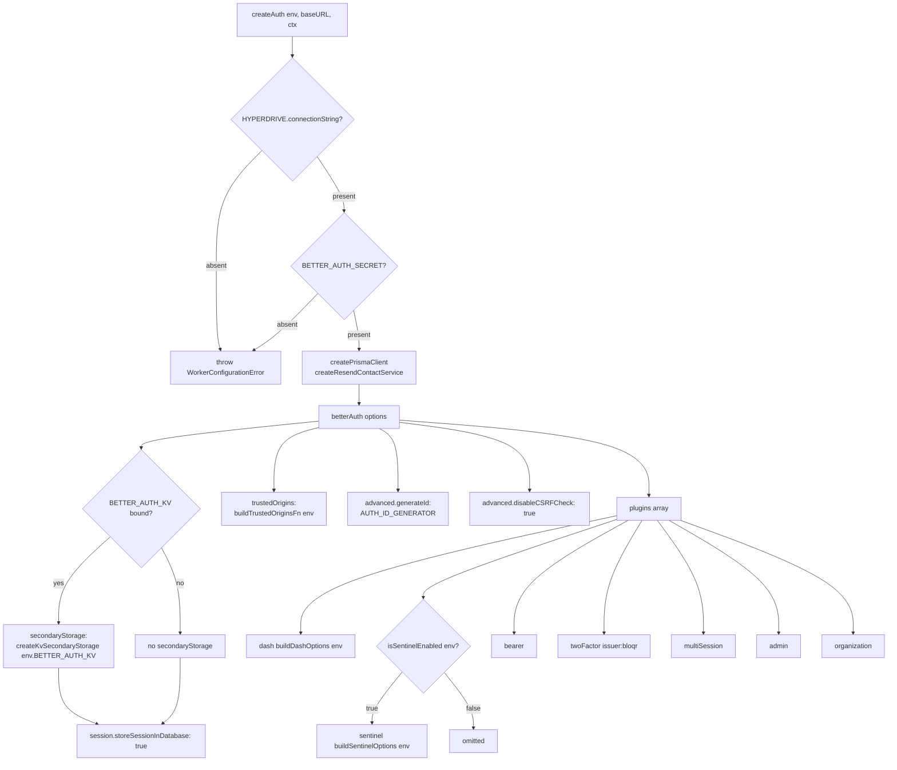

# Better Auth Configuration Audit — May 2026

This document catalogues thirteen configuration and integration issues discovered
during the initial Better Auth factory review, together with the fixes applied and
the regression tests that guard each fix. Every finding is grounded in
`worker/lib/auth.ts` and the companion test suite `worker/lib/auth.test.ts`.

Related documents:
- [`docs/auth/configuration.md`](./configuration.md) — reference for all `betterAuth()` options
- [`docs/auth/zta-review-fixes.md`](./zta-review-fixes.md) — six follow-up fixes from the ZTA review (PR #1273/1275)
- [`docs/auth/better-auth-developer-guide.md`](./better-auth-developer-guide.md) — developer guide for adding plugins and env vars

---

## Summary Table

| # | Constant / Function | Root Cause | Resolution | PR |
|---|--------------------|-----------|-----------|----|
| 1 | `AUTH_ID_GENERATOR` | BA default IDs fail PostgreSQL `uuid` columns | `crypto.randomUUID()` | #1692 |
| 2 | `USER_FIELD_MAPPING` | BA writes `name`/`image`; Prisma uses `displayName`/`imageUrl` | explicit field map | #1685 |
| 3 | `AUTH_DISABLE_CSRF_CHECK` | BA 1.5.x throws `MISSING_OR_NULL_ORIGIN` for non-browser clients | `disableCSRFCheck: true` | — |
| 4 | `AUTH_SESSION_STORE_IN_DATABASE` | BA 1.6.x drops session table from schema when KV secondary storage is present | `storeSessionInDatabase: true` | — |
| 5 | `isSentinelEnabled` | `sentinel()` hangs sign-in on free/pilot tier | feature-flag gate | — |
| 6 | `buildDashOptions` / `buildSentinelOptions` | Worker Secrets absent from `process.env`; plugins fail silently | explicit `env.*` passthrough | #1700 |
| 7 | `auditLogs` (pending) | `@better-auth/infra@0.2.5` does not export `auditLogs` | TODO comment + tracking | — |
| 8 | `@better-auth/infra` import | wrangler/esbuild cannot resolve `https://` CDN specifiers | `package.json` + `pnpm install` | #1702 |
| 9 | `createKvSecondaryStorage` | `expirationTtl ≤ 0` is invalid for Cloudflare KV | guard in `set()` adapter | — |
| 10 | `buildTrustedOriginsFn` | BA trusted-origins list out of sync with CORS allowlist | shared `parseAllowedOrigins(env)` | — |
| 11 | `WorkerConfigurationError` | generic `Error` indistinguishable from auth errors by callers | named Error subclass | #1268 |
| 12 | `PRISMA_SCHEMA_CONFIG` | `provider` could be accidentally changed to `'sqlite'` | named constant + regression test | — |
| 13 | body-already-used crash | BA middleware consumed `request.body` before workflow route handlers | registration order + `c.req.valid('json')` | #1695 |

---

## Factory Architecture

The `createAuth()` function is a per-request factory that assembles all options
and conditionally loads optional plugins based on environment bindings.



---

## Issue 1 — UUID ID Generator

**File:** `worker/lib/auth.ts` · **Constant:** `AUTH_ID_GENERATOR`
**Tests:** `worker/lib/auth.test.ts` lines 152–193

### Root Cause

Better Auth's built-in ID generator produces opaque alphanumeric strings such as
`9hrbjIfqhl2sTXOhzrWSNwL9i2kipz51`. When these are written to a PostgreSQL column
declared as `uuid`, the database rejects them immediately:

```
ERROR: invalid input syntax for type uuid: "9hrbjIfqhl2sTXOhzrWSNwL9i2kipz51"
```

### Fix

`advanced.generateId` is set to `AUTH_ID_GENERATOR`, which delegates to the
native `crypto.randomUUID()` available in Cloudflare Workers:

```typescript
// worker/lib/auth.ts
// Better Auth 1.5+ passes `{ model }` as an argument to generateId.
// Optional parameter ensures compatibility with both the legacy no-arg calling
// convention and the newer object-parameter form.
export const AUTH_ID_GENERATOR = (_opts?: { model?: string }) => crypto.randomUUID();

export const UUID_V4_REGEX =
    /^[0-9a-f]{8}-[0-9a-f]{4}-4[0-9a-f]{3}-[89ab][0-9a-f]{3}-[0-9a-f]{12}$/i;
```

In `createAuth()`:

```typescript
advanced: {
    generateId: AUTH_ID_GENERATOR,
    ...
}
```

### Belt-and-Suspenders

A `$extends` Prisma query extension in `worker/lib/prisma.ts` intercepts every
`create` operation and replaces any non-UUID `id` values before they reach the
database. This covers code paths where Better Auth calls Prisma directly without
going through `generateId`. PR #1693 added this second layer.

### Regression Test

```typescript
// auth.test.ts: "AUTH_ID_GENERATOR produces a valid UUID v4"
const id = AUTH_ID_GENERATOR();
assertMatch(id, UUID_V4_REGEX, `expected UUID v4, got: ${id}`);
```

---

## Issue 2 — User Field Mapping

**File:** `worker/lib/auth.ts` · **Constant:** `USER_FIELD_MAPPING`
**Tests:** `worker/lib/auth.test.ts` lines 121–150

### Root Cause

Better Auth's canonical `User` shape uses the field names `name` and `image`.
The Prisma `User` model uses `displayName` (column `display_name`) and
`imageUrl` (column `image_url`). Without an explicit mapping every sign-up and
OAuth profile-sync fails:

```
PrismaClientValidationError: Unknown argument 'name'.
  Did you mean 'displayName'? Available options are marked with ?.
```

### Fix

```typescript
// worker/lib/auth.ts
export const USER_FIELD_MAPPING = {
    name: 'displayName', // Better Auth 'name'  → Prisma 'displayName' (display_name column)
    image: 'imageUrl',   // Better Auth 'image' → Prisma 'imageUrl'     (image_url column)
} as const;
```

In `createAuth()`:

```typescript
user: {
    fields: USER_FIELD_MAPPING,
    ...
}
```

### Regression Test

```typescript
// auth.test.ts: "USER_FIELD_MAPPING maps name → displayName and image → imageUrl"
assertEquals(USER_FIELD_MAPPING.name, 'displayName');
assertEquals(USER_FIELD_MAPPING.image, 'imageUrl');
```

---

## Issue 3 — CSRF Check Disabled for Non-Browser Clients

**File:** `worker/lib/auth.ts` · **Constant:** `AUTH_DISABLE_CSRF_CHECK`
**Tests:** `worker/lib/auth.test.ts` lines 195–220

### Root Cause

Better Auth 1.5.x throws `MISSING_OR_NULL_ORIGIN` whenever a request carries a
`Cookie` header but no `Origin` header. Non-browser clients (Postman, curl, SDKs,
mobile apps) that have acquired a session cookie from a prior request do not send
an `Origin` header on subsequent calls. This is not a CSRF attack — CSRF requires
a browser to silently forward cookies cross-site, which only applies to
browser-based flows.

### Fix

```typescript
// worker/lib/auth.ts
export const AUTH_DISABLE_CSRF_CHECK = true;
```

In `createAuth()`:

```typescript
advanced: {
    disableCSRFCheck: AUTH_DISABLE_CSRF_CHECK,
    defaultCookieAttributes: {
        httpOnly: true,
        secure: true,
        sameSite: 'lax', // actual CSRF mitigation for browser flows
        path: '/',
    },
    ...
}
```

`sameSite: 'lax'` on all `bloqr.*` cookies remains the active CSRF mitigation
for browser-based flows: browsers do not send `lax` cookies on typical cross-site
POST requests.

### Regression Test

```typescript
// auth.test.ts: "AUTH_DISABLE_CSRF_CHECK is true"
assertEquals(AUTH_DISABLE_CSRF_CHECK, true,
    'AUTH_DISABLE_CSRF_CHECK must be true — changing it to false breaks Postman/curl/SDK flows');
```

---

## Issue 4 — `storeSessionInDatabase` + KV Secondary Storage Conflict

**File:** `worker/lib/auth.ts` · **Constant:** `AUTH_SESSION_STORE_IN_DATABASE`
**Tests:** `worker/lib/auth.test.ts` lines 222–257

### Root Cause

Better Auth 1.6.x changed `getAuthTables()` to conditionally exclude the
`session` model from its internal DB schema when `secondaryStorage` is present:

```typescript
// Better Auth source (simplified)
...(!options.secondaryStorage || options.session?.storeSessionInDatabase
    ? sessionTable
    : {}),
```

When `BETTER_AUTH_KV` is bound and `secondaryStorage` is wired, `!secondaryStorage`
evaluates to `false`. Without `storeSessionInDatabase: true`, the session table is
dropped from the Prisma adapter schema, causing every sign-in to fail:

```
BetterAuthError: Model "session" not found in schema
```

### Fix

```typescript
// worker/lib/auth.ts
export const AUTH_SESSION_STORE_IN_DATABASE = true as const;
```

In `createAuth()`:

```typescript
session: {
    storeSessionInDatabase: AUTH_SESSION_STORE_IN_DATABASE,
    cookieCache: {
        enabled: true,
        maxAge: AUTH_SESSION_CONFIG.cookieCacheMaxAge, // 5 minutes
    },
},

// KV secondary storage — conditionally applied
...(env.BETTER_AUTH_KV
    ? { secondaryStorage: createKvSecondaryStorage(env.BETTER_AUTH_KV) }
    : {}),
```

With this flag, KV acts as a fast edge cache (sessions, rate-limit counters,
short-lived tokens) while Neon PostgreSQL remains the authoritative session store.

### Session Duration Constants

```typescript
export const AUTH_SESSION_CONFIG = {
    expiresIn: 60 * 60 * 24 * 7,  // 7 days
    updateAge: 60 * 60 * 24,       // 1 day
    cookieCacheMaxAge: 60 * 5,     // 5 minutes
} as const;
```

### Regression Test

```typescript
// auth.test.ts: "AUTH_SESSION_STORE_IN_DATABASE is true"
assertEquals(AUTH_SESSION_STORE_IN_DATABASE, true,
    'AUTH_SESSION_STORE_IN_DATABASE must be true — setting to false while ' +
    'BETTER_AUTH_KV is bound will break sign-in with "Model session not found"');
```

---

## Issue 5 — Sentinel Feature Flag

**File:** `worker/lib/auth.ts` · **Function:** `isSentinelEnabled`
**Tests:** `worker/lib/auth.test.ts` lines 616–654

### Root Cause

`sentinel()` is a **Better Auth Pro tier** feature. Loading it on the free or
pilot tier causes sign-in requests to hang indefinitely — no response is returned
and no error is thrown.

### Fix

```typescript
// worker/lib/auth.ts
export function isSentinelEnabled(env: Pick<Env, 'BETTER_AUTH_SENTINEL_ENABLED'>): boolean {
    return env.BETTER_AUTH_SENTINEL_ENABLED === 'true';
}
```

Only the exact string `"true"` enables the plugin. Any other value — including
`"1"`, `"false"`, `undefined`, or the key being absent from `wrangler.toml [vars]`
— leaves it disabled.

In `createAuth()`:

```typescript
plugins: [
    dash(buildDashOptions(env)),
    // Sentinel is only loaded when BETTER_AUTH_SENTINEL_ENABLED=true (Pro tier)
    ...(isSentinelEnabled(env) ? [sentinel(buildSentinelOptions(env))] : []),
    bearer(),
    twoFactor({ issuer: 'bloqr' }),
    multiSession(),
    admin(),
    organization({ allowUserToCreateOrganization: true, organizationLimit: 3 }),
],
```

To enable Sentinel in production, add to `wrangler.toml [vars]`:

```toml
BETTER_AUTH_SENTINEL_ENABLED = "true"
```

No code change is required when upgrading to Better Auth Pro.

### Regression Tests

```typescript
// auth.test.ts: "isSentinelEnabled returns true only for exact string 'true'"
assertEquals(isSentinelEnabled({ BETTER_AUTH_SENTINEL_ENABLED: 'true' }), true);
assertEquals(isSentinelEnabled({ BETTER_AUTH_SENTINEL_ENABLED: 'false' }), false);
assertEquals(isSentinelEnabled({ BETTER_AUTH_SENTINEL_ENABLED: '1' }), false);
assertEquals(isSentinelEnabled({ BETTER_AUTH_SENTINEL_ENABLED: undefined }), false);
```

---

## Issue 6 — Explicit API Key Pass for `dash()` and `sentinel()`

**File:** `worker/lib/auth.ts` · **Functions:** `buildDashOptions`, `buildSentinelOptions`
**Tests:** `worker/lib/auth.test.ts` lines 455–614

### Root Cause

Cloudflare Worker Secrets set via `wrangler secret put` are only accessible
through the `env` binding inside the fetch handler. They are **never** available
on `process.env`, even when `nodejs_compat` is enabled. Both `dash()` and
`sentinel()` from `@better-auth/infra` look for `BETTER_AUTH_API_KEY` via
`process.env.BETTER_AUTH_API_KEY` internally; because this is always `undefined`
in a Worker, the plugins silently no-op without error.

### Fix

Two helper functions build the options objects, using conditional spread to
include the key **only when defined** — deliberately omitting it (not passing
`undefined`) when absent so that the plugins remain in their default no-op state
during local dev without secrets configured.

```typescript
// worker/lib/auth.ts
export function buildDashOptions(
    env: Pick<Env, 'BETTER_AUTH_API_KEY' | 'BETTER_AUTH_KV_URL'>
): { apiKey?: string; kvUrl?: string } {
    return {
        ...(env.BETTER_AUTH_API_KEY ? { apiKey: env.BETTER_AUTH_API_KEY } : {}),
        ...(env.BETTER_AUTH_KV_URL  ? { kvUrl:  env.BETTER_AUTH_KV_URL  } : {}),
    };
}

export function buildSentinelOptions(
    env: Pick<Env, 'BETTER_AUTH_API_KEY' | 'BETTER_AUTH_KV_URL'>
): { apiKey?: string; kvUrl?: string; security: { ... } } {
    return {
        ...(env.BETTER_AUTH_API_KEY ? { apiKey: env.BETTER_AUTH_API_KEY } : {}),
        ...(env.BETTER_AUTH_KV_URL  ? { kvUrl:  env.BETTER_AUTH_KV_URL  } : {}),
        security: {
            credentialStuffing: {
                enabled: true,
                thresholds: { challenge: 3, block: 5 },
                windowSeconds: 3600,
                cooldownSeconds: 900,
            },
            impossibleTravel: { enabled: true, maxSpeedKmh: 1200, action: 'challenge' },
            unknownDeviceNotification: true,
            botBlocking: true,
            suspiciousIpBlocking: true,
        },
    };
}
```

### Key Distinction: Omit vs. Undefined

The test asserts structural absence, not just value equality, because passing
`{ apiKey: undefined }` is semantically different from omitting the key entirely
for some SDK consumers:

```typescript
// auth.test.ts: "buildDashOptions omits apiKey when BETTER_AUTH_API_KEY is absent"
const opts = buildDashOptions({ BETTER_AUTH_API_KEY: undefined, BETTER_AUTH_KV_URL: undefined });
assertEquals('apiKey' in opts, false,
    'apiKey must be absent (not just undefined) when BETTER_AUTH_API_KEY is not set');
```

---

## Issue 7 — `auditLogs` Not Exported in `@better-auth/infra@0.2.5`

**File:** `worker/lib/auth.ts` lines 79–81

### Root Cause

`auditLogs` was planned as a first-class export of `@better-auth/infra`. As of
version `0.2.5` (the latest published release at the time of the audit) the
export does not exist. Any `import { auditLogs } from '@better-auth/infra'`
causes a build error.

### Current State

```typescript
// worker/lib/auth.ts
// NOTE: auditLogs is NOT exported in @better-auth/infra@0.2.5 (the latest published version).
// TODO(auth): import { auditLogs } from '@better-auth/infra' once the package publishes it.
//             Track: https://github.com/better-auth/better-auth/issues?q=is%3Aissue+auditLogs+infra
import { dash, sentinel } from '@better-auth/infra';
```

In the `plugins` array:

```typescript
// TODO(auth): enable auditLogs() once @better-auth/infra exports it.
//             auditLogs is NOT in @better-auth/infra@0.2.5 (latest as of 2026-04).
//             Uncomment once the package publishes the export:
//   auditLogs({ retention: 90 }),
```

### When to Activate

When `@better-auth/infra` publishes the `auditLogs` export:

1. Add `auditLogs` to the import on line 82 of `auth.ts`.
2. Uncomment `auditLogs({ retention: 90 })` in the `plugins` array.
3. Add a regression test asserting the export is callable.
4. Verify the `auditLog` Prisma model is present in `prisma/schema.prisma`.

---

## Issue 8 — `@better-auth/infra` ESM / CDN Compatibility

**File:** `worker/lib/auth.ts` lines 32–60 (module JSDoc)
**Related:** `package.json`, `deno.json`

### Root Cause

Four import strategies were evaluated before settling on the correct approach.

| Approach | Result | Reason |
|----------|--------|--------|
| CDN ESM import (`https://esm.sh/…`) | ❌ Build error | wrangler uses esbuild, which does not resolve `https://` URL specifiers |
| Wrangler alias config `[build.alias]` | ❌ Build error | aliases map to local file paths only; does not support CDN URLs |
| Vendor package locally into `worker/vendor/` | ❌ Impractical | `@better-auth/infra@0.2.5/dist/index.mjs` is ~7,900 lines; vendoring all transitive deps effectively requires a sub-registry |
| `package.json` + `pnpm install` | ✅ Chosen | declares package in both `deno.json` (for `deno task`) and `package.json` (for wrangler/esbuild); both see the same version from `node_modules` |

### Resolution

`deno.json` declares the import map entry:

```json
"@better-auth/infra": "npm:@better-auth/infra@^0.2.5"
```

`package.json` adds the same package so wrangler's esbuild resolver finds it in
`node_modules`:

```json
"dependencies": {
    "@better-auth/infra": "^0.2.5"
}
```

No secrets or auth logic changed — `BETTER_AUTH_API_KEY` remains a Worker Secret.
PR #1702.

---

## Issue 9 — KV Secondary Storage TTL Edge Cases

**File:** `worker/lib/auth.ts` · **Function:** `createKvSecondaryStorage`
**Tests:** `worker/lib/auth.test.ts` lines 303–425

### Root Cause

Cloudflare KV requires `expirationTtl` to be a **positive integer**:
- Production: minimum 60 seconds
- Dev / local wrangler: minimum 1 second

Better Auth's `secondaryStorage` interface defines `set(key, value, ttl?)` where
`ttl` is an optional number. If Better Auth ever passes `ttl = 0` or a negative
value, a naive `{ expirationTtl: ttl }` would cause a KV put error. While Better
Auth does not currently emit `ttl ≤ 0` in practice, the guard is a safety net.

### Fix

```typescript
// worker/lib/auth.ts
export function createKvSecondaryStorage(kv: KVNamespace): {
    get(key: string): Promise<string | null>;
    set(key: string, value: string, ttl?: number): Promise<void>;
    delete(key: string): Promise<void>;
} {
    return {
        get: (key) => kv.get(key),
        // ttl ≤ 0 → no TTL (options omitted entirely, not passed as undefined)
        // ttl > 0 → clamp to ≥ 60 s for production KV compatibility
        set: (key, value, ttl?) =>
            kv.put(key, value,
                ttl !== undefined && ttl > 0
                    ? { expirationTtl: Math.max(60, ttl) }
                    : undefined,
            ),
        delete: (key) => kv.delete(key),
    };
}
```

### Regression Tests

```typescript
// auth.test.ts KV adapter tests (lines 303–425):
// "set with positive TTL calls kv.put with expirationTtl"
// "set with TTL below 60 clamps to 60"
// "set with TTL = 0 omits expirationTtl"
// "set with negative TTL omits expirationTtl"
// "set with no TTL omits expirationTtl"
// "get delegates to kv.get"
// "delete delegates to kv.delete"
```

---

## Issue 10 — Trusted Origins Sync with CORS Allowlist

**File:** `worker/lib/auth.ts` · **Function:** `buildTrustedOriginsFn`
**Tests:** `worker/lib/auth.test.ts` lines 259–301

### Root Cause

Better Auth validates callback URLs, redirect URLs, and (when CSRF check is
enabled) the `Origin` request header against a `trustedOrigins` allowlist. If
this list is managed independently of the CORS allowlist (`CORS_ALLOWED_ORIGINS`
env var), they can drift: a domain added to CORS but not to Better Auth's list
causes OAuth redirects to fail; a domain removed from CORS but left in Better
Auth's list leaves a stale callback target.

### Fix

`buildTrustedOriginsFn` reads from `parseAllowedOrigins(env)` — the same source
used by the CORS middleware — creating a single source of truth.

```typescript
// worker/lib/auth.ts
export function buildTrustedOriginsFn(env: Env): (_request?: Request) => string[] {
    const trustedOrigins = parseAllowedOrigins(env);
    // _request prefix: the allowlist is env-based, not request-dependent
    return (_request?: Request): string[] => trustedOrigins;
}
```

In `createAuth()`:

```typescript
trustedOrigins: buildTrustedOriginsFn(env),
```

The `CORS_ALLOWED_ORIGINS` env var is the single configuration point for both
the CORS middleware and Better Auth's URL validation.

### Regression Tests

```typescript
// auth.test.ts (lines 259–301):
// "buildTrustedOriginsFn returns a function"
// "returned function produces the origins from parseAllowedOrigins"
// "returned function ignores its request argument"
```

---

## Issue 11 — `WorkerConfigurationError` Named Error Class

**File:** `worker/lib/auth.ts` · **Class:** `WorkerConfigurationError`
**Tests:** `worker/lib/auth.test.ts` lines 53–101

### Root Cause

`createAuth()` must validate two required bindings before attempting to create a
Prisma client or configure Better Auth. Throwing a generic `Error` makes it
impossible for callers that only inspect `error.name` (e.g. `BetterAuthProvider`
in `worker/middleware/better-auth-provider.ts`) to distinguish configuration
failures from authentication failures without parsing the message string.

### Fix

```typescript
// worker/lib/auth.ts
export class WorkerConfigurationError extends Error {
    constructor(message: string) {
        super(message);
        this.name = 'WorkerConfigurationError';
    }
}
```

The factory validates both required bindings before any async work:

```typescript
export function createAuth(env: Env, baseURL?: string, ctx?: ...) {
    if (!env.HYPERDRIVE?.connectionString) {
        throw new WorkerConfigurationError(
            'HYPERDRIVE binding is not configured.\n' +
            '  → Production: add [[hyperdrive]] to wrangler.toml\n' +
            '  → Local dev:  set WRANGLER_HYPERDRIVE_LOCAL_CONNECTION_STRING_HYPERDRIVE ' +
                             '(preferred)\n' +
            '                or CLOUDFLARE_HYPERDRIVE_LOCAL_CONNECTION_STRING_HYPERDRIVE ' +
                             'in .dev.vars',
        );
    }
    if (!env.BETTER_AUTH_SECRET) {
        throw new WorkerConfigurationError(
            'BETTER_AUTH_SECRET is required but not set.\n' +
            '  → Generate one: openssl rand -base64 32\n' +
            '  → Then add it to .dev.vars (local) or ' +
                'wrangler secret put BETTER_AUTH_SECRET (production)',
        );
    }
    ...
}
```

### Regression Tests

```typescript
// auth.test.ts (lines 53–101):
// "createAuth throws WorkerConfigurationError when HYPERDRIVE is absent"
// "createAuth throws WorkerConfigurationError when BETTER_AUTH_SECRET is absent"
// "WorkerConfigurationError has name === 'WorkerConfigurationError'"
// "error message includes actionable hint for missing HYPERDRIVE"
// "error message includes openssl hint for missing BETTER_AUTH_SECRET"
```

---

## Issue 12 — `PRISMA_SCHEMA_CONFIG` Provider Lock

**File:** `worker/lib/auth.ts` · **Constant:** `PRISMA_SCHEMA_CONFIG`
**Tests:** `worker/lib/auth.test.ts` lines 590–596

### Root Cause

The `provider` value passed to `prismaAdapter()` controls which SQL dialect the
adapter generates. Accidentally changing it to `'sqlite'` (the common dev default)
causes silent query failures against a PostgreSQL database. Because the value is
a string literal typed directly in the `betterAuth()` call, there is no compile-time
protection.

### Fix

Extract it as a named export with an inline comment that warns against changing
the value:

```typescript
// worker/lib/auth.ts
export const PRISMA_SCHEMA_CONFIG = {
    /** Database provider.  Changing this value breaks the Prisma adapter — update tests too. */
    provider: 'postgresql',
} as const;
```

The `as const` assertion prevents TypeScript from widening `'postgresql'` to
`string`, so any inadvertent reassignment to a broader type fails at compile time.

### Regression Test

```typescript
// auth.test.ts: "PRISMA_SCHEMA_CONFIG.provider is 'postgresql'"
assertEquals(PRISMA_SCHEMA_CONFIG.provider, 'postgresql',
    "PRISMA_SCHEMA_CONFIG.provider must be 'postgresql' — changing it breaks the Prisma adapter");
```

---

## Issue 13 — Body-Already-Used Crash on Workflow Routes

**File:** `worker/routes/workflow.routes.test.ts` lines 80–146
**Related:** `worker/routes/workflow.routes.ts`

### Root Cause

The Better Auth handler was registered at the application level — before the
workflow route handlers. On `POST /api/workflow/*` requests with a JSON body,
Better Auth middleware consumed `request.body` (the readable stream) while
attempting to parse the request. When the workflow handler subsequently called
`request.json()`, the stream had already been drained:

```
TypeError: Body has already been used.
    It can only be read once. Use tee() first if you need to read it twice.
```

This produced an unhandled exception and an HTTP 500 response.

### Fix

Two changes were applied together:

1. **Registration order**: The Better Auth handler is now scoped exclusively to
   `/api/auth/*` paths so it does not run for `/api/workflow/*` requests.

2. **Parsed body pattern**: Workflow route handlers retrieve the already-parsed
   body via `c.req.valid('json')` (the result of Hono + Zod/OpenAPI validation)
   rather than calling `request.json()` directly. This eliminates the double-read
   regardless of middleware ordering.

### Regression Tests

```typescript
// workflow.routes.test.ts (lines 90–146):
// "POST /api/workflow/compile - valid body returns 401, not 500 'Body has already been used'"
// "POST /api/workflow/batch   - valid body returns 401, not 500 'Body has already been used'"
// "POST /api/workflow/cache-warm - valid body returns 401, not 500 'Body has already been used'"
// "POST /api/workflow/health-check - valid body returns 401, not 500 'Body has already been used'"
```

All four tests verify:
- `res.status === 401` (auth required, unauthenticated request rejected)
- Response body does **not** contain `"body has already been used"`
- Response body does **not** contain `"internal server error"`

---

## Related Fixes Not Covered Here

The following issues were discovered in the same review cycle but are documented
separately because they affect different layers:

| Fix | Document |
|-----|----------|
| Prisma one-to-one TwoFactor relation | [`docs/auth/zta-review-fixes.md`](./zta-review-fixes.md) §1 |
| `.trim()` on 2FA validation schemas | [`docs/auth/zta-review-fixes.md`](./zta-review-fixes.md) §2 |
| Disabled API key semantics (rate limit `0`) | [`docs/auth/zta-review-fixes.md`](./zta-review-fixes.md) §3 |
| Auth telemetry gaps (`authMethod` field) | [`docs/auth/zta-review-fixes.md`](./zta-review-fixes.md) §4 |
| Better Auth provider telemetry enrichment | [`docs/auth/zta-review-fixes.md`](./zta-review-fixes.md) §5 |
| Admin session revocation hardening | [`docs/auth/zta-review-fixes.md`](./zta-review-fixes.md) §6 |

---

← [Back to auth README](./README.md)
