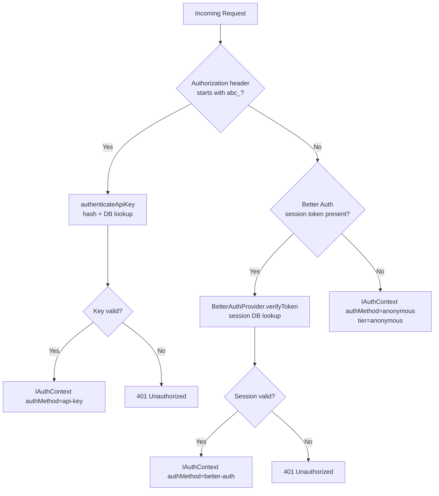

# Better Auth Developer Guide

Plugin catalogue, adapter swapping, custom provider creation, and social provider
integration for the adblock-compiler authentication system.

---

## Plugin Catalogue

Better Auth is plugin-based. Each plugin adds database tables, routes, and/or token
processing. Plugins are registered in `worker/lib/auth.ts`.

### Active Plugins

| Plugin | Package | Route Prefix | What It Adds |
|--------|---------|-------------|--------------|
| `dash()` | `@better-auth/infra` | — | Better Auth Dash dashboard integration; requires `BETTER_AUTH_API_KEY` |
| `sentinel({ kvUrl, security })` | `@better-auth/infra` | — | Credential stuffing protection, impossible travel detection, bot/IP blocking, device notifications; reads `BETTER_AUTH_API_KEY` automatically (same as `dash()`) |
| `bearer()` | `better-auth/plugins` | — | `Authorization: Bearer <token>` header auth (session tokens + API keys) |
| `twoFactor({ issuer })` | `better-auth/plugins` | `/api/auth/two-factor/*` | TOTP-based 2FA; `twoFactor` DB table |
| `multiSession()` | `better-auth/plugins` | `/api/auth/list-sessions`, `/revoke-session`, `/revoke-other-sessions` | Concurrent sessions per user |
| `admin()` | `better-auth/plugins` | `/api/auth/admin/*` | User management endpoints; `banned`, `role` fields on `user` |
| `organization()` | `better-auth/plugins` | `/api/auth/organization/*` | Multi-tenant organizations, members, roles |

### Pending Plugins

These plugins are not currently wired at runtime. Enable them once the prerequisite is met.

| Plugin | Package | Prerequisite | What It Adds |
|--------|---------|-------------|--------------|
| `auditLogs({ retention })` | `@better-auth/infra` | `@better-auth/infra` must publish this export (not available in `0.2.5`). Track: [`github.com/better-auth/better-auth/issues?q=auditLogs+infra`](https://github.com/better-auth/better-auth/issues?q=is%3Aissue+auditLogs+infra) | Records all auth events to DB; visual audit trail in Dash; 90-day retention |

### How to Add a Plugin

**Step 1 — Add the plugin import to `worker/lib/auth.ts`:**

```typescript
import { betterAuth } from 'better-auth';
import { bearer, twoFactor, multiSession, admin, apiKey } from 'better-auth/plugins';
```

**Step 2 — Register it in the `plugins` array:**

```typescript
export const createAuth = (env: Env, baseURL?: string) => {
  return betterAuth({
    // ...
    plugins: [
      bearer(),
      twoFactor({ issuer: 'adblock-compiler' }),
      multiSession(),
      admin(),
      apiKey(),      // ← new plugin
    ],
  });
};
```

**Step 3 — Generate the Prisma migration (plugins that add tables):**

```bash
# After adding the plugin, regenerate the Prisma schema:
deno task db:generate
# Check if new tables were added to schema.prisma, then:
deno task db:migrate
```

**Step 4 — Run the tests:**

```bash
deno task test:worker
```

### Optional Plugins (Not Currently Active)

These plugins are available in Better Auth but not yet enabled. Follow the steps above to
activate any of them.

| Plugin | Package | What It Adds |
|--------|---------|--------------|
| `apiKey()` | `better-auth/plugins` | Long-lived API keys with scopes and expiry |
| `passkey()` | `better-auth/plugins` | WebAuthn / passkey authentication |
| `magicLink()` | `better-auth/plugins` | Passwordless sign-in via email link |
| `phoneNumber()` | `better-auth/plugins` | Phone number sign-up/sign-in + OTP |
| `anonymous()` | `better-auth/plugins` | Persist anonymous sessions before sign-up |
| `oneTap()` | `better-auth/plugins` | Google One Tap sign-in |

---

## User Model Extension

The `user` block in `worker/lib/auth.ts` configures two things:

1. **`fields`** — maps Better Auth's canonical field names to the Prisma model's field names.
2. **`additionalFields`** — declares custom columns that extend the built-in user schema.

### Field Name Mapping (`fields`)

Better Auth's internal user object uses `name` (display name) and `image` (avatar URL).
The Prisma `User` model uses `displayName` (column `display_name`) and `imageUrl`
(column `image_url`) to follow the project's database naming conventions.

Without this mapping, Better Auth passes `name` and `image` directly to Prisma on every
sign-up and OAuth profile-sync, causing `PrismaClientValidationError: Unknown argument 'name'`
and a 500 to the client.

The mapping is declared in `worker/lib/auth.ts` and exported as `USER_FIELD_MAPPING` so
regression tests can assert it without requiring a database connection:

```typescript
// worker/lib/auth.ts
export const USER_FIELD_MAPPING = {
    name: 'displayName', // Better Auth 'name'  → Prisma 'displayName' (display_name column)
    image: 'imageUrl',   // Better Auth 'image' → Prisma 'imageUrl'    (image_url column)
} as const;

// Inside createAuth():
user: {
    fields: USER_FIELD_MAPPING,  // ← required; prevents PrismaClientValidationError on sign-up
    additionalFields: {
        tier: { ... },
        role: { ... },
    },
},
```

> **⚠️ Regression risk:** If `fields` is removed or the Prisma model fields are renamed,
> every sign-up and OAuth sign-in will return a 500. The exported `USER_FIELD_MAPPING`
> constant and its associated regression test guard against this.

### Additional Fields (`additionalFields`)

Two custom fields are added to the `user` table:

```typescript
user: {
  fields: USER_FIELD_MAPPING,
  additionalFields: {
    tier: {
      type: 'string',
      required: false,
      defaultValue: 'free',
      input: false,   // ← users cannot self-assign their tier
    },
    role: {
      type: 'string',
      required: false,
      defaultValue: 'user',
      input: false,   // ← users cannot self-assign admin role
    },
  },
},
```

`input: false` means these fields are excluded from sign-up/sign-in request parsing — they
can only be written by server-side code (migrations, admin endpoints, Prisma Studio).

### Adding a New Field to the User Model

1. Edit `worker/lib/auth.ts`, add the field to `user.additionalFields`:

```typescript
additionalFields: {
  tier: { type: 'string', required: false, defaultValue: 'free', input: false },
  role: { type: 'string', required: false, defaultValue: 'user', input: false },
  // New field:
  companyName: { type: 'string', required: false, defaultValue: null, input: true },
},
```

2. Add the column to `prisma/schema.prisma`:

```prisma
model User {
  id          String   @id @default(uuid()) @db.Uuid
  displayName String?  @map("display_name")   // ← mapped via USER_FIELD_MAPPING
  email       String?  @unique
  tier        String   @default("free")
  role        String   @default("user")
  companyName String?                         // ← new column
  // ...
}
```

> **Note:** Do not use `name` as a column name in the `user` model — it conflicts with
> Better Auth's internal `name` field. Use `displayName` (mapped via `USER_FIELD_MAPPING`)
> instead.

3. Run the migration:

```bash
deno task db:migrate     # creates and applies migration
deno task db:generate    # regenerates Prisma client
```

4. Update `worker/types.ts` if you reference the field from middleware:

```typescript
export interface IAuthProviderResult {
  valid: boolean;
  userId?: string;
  tier?: UserTier;
  role?: string;
  companyName?: string;   // ← new field
  // ...
}
```

---

## Database Adapter Swapping

Better Auth's adapter layer is swappable. The production adapter is `prismaAdapter`.

### Current Adapter — Neon PostgreSQL via Hyperdrive

```typescript
// worker/lib/auth.ts
import { prismaAdapter } from 'better-auth/adapters/prisma';
import { createPrismaClientForWorker } from '../lib/prisma.ts';

export const createAuth = (env: Env, baseURL?: string) => {
  const prisma = createPrismaClientForWorker(env);
  return betterAuth({
    database: prismaAdapter(prisma, { provider: 'postgresql' }),
    // ...
  });
};
```

A new `PrismaClient` is created per request (cheap due to Hyperdrive's local connection pool).

### Adapter Comparison

| Adapter | Package | When to Use |
|---------|---------|-------------|
| `prismaAdapter` (current) | `better-auth/adapters/prisma` | Neon/Supabase PostgreSQL via Cloudflare Hyperdrive |
| `d1Adapter` | `better-auth/adapters/d1` | Cloudflare D1 (SQLite) — simpler, no Hyperdrive |
| `drizzleAdapter` | `better-auth/adapters/drizzle` | Drizzle ORM with D1, Turso, or LibSQL |
| `kysely` | `better-auth/adapters/kysely` | Raw Kysely query builder |

### Switching to D1 (Example)

```typescript
// worker/lib/auth.ts (hypothetical D1 migration)
import { d1Adapter } from 'better-auth/adapters/d1';

export const createAuth = (env: Env) => {
  return betterAuth({
    database: d1Adapter(env.DB),          // env.DB = D1Database binding
    // ...
  });
};
```

Add to `wrangler.toml`:

```toml
[[d1_databases]]
binding = "DB"
database_name = "adblock-auth"
database_id   = "<your-d1-id>"
```

> **Note:** The project currently uses Neon PostgreSQL via Hyperdrive and Prisma.
> Switching to D1 requires migrating all existing user/session data.

---

## Creating a Custom `IAuthProvider`

The `IAuthProvider` interface (in `worker/types.ts`) is the contract between the auth
middleware and any provider implementation.

### Interface Contract

```typescript
export interface IAuthProvider {
  /**
   * Verify the token or session from the request.
   * - Returns { valid: false } (not an error) when no credentials are present.
   * - Returns { valid: false, error } when credentials are present but invalid.
   * - Returns { valid: true, userId, tier, role, authMethod, providerUserId } on success.
   */
  verifyToken(request: Request): Promise<IAuthProviderResult>;
}

export interface IAuthProviderResult {
  valid: boolean;
  userId?: string;           // internal DB id
  providerUserId?: string;   // id in the external provider (e.g., auth0|abc123)
  tier?: UserTier;
  role?: string;
  authMethod?: IAuthContext['authMethod'];
  error?: string;
}
```

### Example — Auth0 Custom Provider

```typescript
// worker/middleware/auth0-provider.ts
import type { IAuthProvider, IAuthProviderResult, Env } from '../types.ts';
import * as jose from 'jose';

export class Auth0Provider implements IAuthProvider {
  private readonly jwksUri: string;
  private readonly audience: string;

  constructor(private readonly env: Env) {
    // Auth0 JWKS endpoint
    this.jwksUri = `https://${env.AUTH0_DOMAIN}/.well-known/jwks.json`;
    this.audience = env.AUTH0_AUDIENCE;
  }

  async verifyToken(request: Request): Promise<IAuthProviderResult> {
    const authHeader = request.headers.get('Authorization');
    if (!authHeader?.startsWith('Bearer ')) {
      return { valid: false };  // no credentials — not an error
    }

    const token = authHeader.slice(7);
    try {
      const JWKS = jose.createRemoteJWKSet(new URL(this.jwksUri));
      const { payload } = await jose.jwtVerify(token, JWKS, {
        audience: this.audience,
        issuer: `https://${this.env.AUTH0_DOMAIN}/`,
      });

      return {
        valid: true,
        providerUserId: payload.sub,
        tier: 'free',          // map from token claims or DB lookup
        role: 'user',
        authMethod: 'better-auth',  // reuse the discriminated union
      };
    } catch (err) {
      return { valid: false, error: (err as Error).message };
    }
  }
}
```

Register in `worker/middleware/auth.ts`:

```typescript
function buildProvider(env: Env): IAuthProvider {
  // Switch by environment variable to choose the provider at startup:
  if (env.USE_AUTH0 === 'true') {
    return new Auth0Provider(env);
  }
  return new BetterAuthProvider(env);
}
```

---

## Authentication Request Flow

The three-tier chain in `worker/middleware/auth.ts`:



### Guard Functions

```typescript
import { requireAuth, requireTier, requireScope } from './middleware/auth.ts';

// Require any valid session (Better Auth or API key — not anonymous)
app.use('/api/compile', requireAuth());

// Require at minimum the "pro" tier
app.use('/api/export/bulk', requireTier(UserTier.PRO));

// Require a specific scope
app.use('/api/compile', requireScope(AuthScope.COMPILE));
```

---

## Adding a Social Provider

### Step 1 — Register the OAuth App

For GitHub:

1. Go to **GitHub → Settings → Developer Settings → OAuth Apps → New OAuth App**
2. Set Authorization callback URL:
   `https://your-worker.workers.dev/api/auth/callback/github`
3. Copy the Client ID and generate a Client Secret

### Step 2 — Add Wrangler Secrets

```bash
wrangler secret put GITHUB_CLIENT_ID
wrangler secret put GITHUB_CLIENT_SECRET
```

### Step 3 — Enable in `worker/lib/auth.ts`

GitHub is already conditionally enabled:

```typescript
socialProviders: {
  ...(env.GITHUB_CLIENT_ID && env.GITHUB_CLIENT_SECRET
    ? {
        github: {
          clientId: env.GITHUB_CLIENT_ID,
          clientSecret: env.GITHUB_CLIENT_SECRET,
        },
      }
    : {}),
},
```

To add Google, uncomment the existing block:

```typescript
socialProviders: {
  ...(env.GITHUB_CLIENT_ID && env.GITHUB_CLIENT_SECRET
    ? { github: { clientId: env.GITHUB_CLIENT_ID, clientSecret: env.GITHUB_CLIENT_SECRET } }
    : {}),
  // Uncomment and set GOOGLE_CLIENT_ID + GOOGLE_CLIENT_SECRET to enable Google:
  ...(env.GOOGLE_CLIENT_ID && env.GOOGLE_CLIENT_SECRET
    ? {
        google: {
          clientId: env.GOOGLE_CLIENT_ID,
          clientSecret: env.GOOGLE_CLIENT_SECRET,
        },
      }
    : {}),
},
```

```bash
wrangler secret put GOOGLE_CLIENT_ID
wrangler secret put GOOGLE_CLIENT_SECRET
```

### Step 4 — Deploy and Verify

```bash
wrangler deploy
curl https://your-worker.workers.dev/api/auth/providers
# { "emailPassword": true, "github": true, "google": true, "mfa": true }
```

---

## Writing Tests

Auth test files are in `worker/`. Use Deno's built-in test runner.

### Test File Locations

| File | What It Tests |
|------|---------------|
| `worker/lib/auth.test.ts` | `createAuth()` factory — missing secrets, config validation |
| `worker/middleware/auth.test.ts` | `authenticateRequestUnified()`, `requireAuth()`, `requireTier()`, `requireScope()` |
| `worker/middleware/better-auth-provider.test.ts` | `BetterAuthProvider.verifyToken()` — valid sessions, expired sessions, missing headers |
| `worker/middleware/auth-extensibility.test.ts` | `IAuthProvider` contract compliance |
| `worker/middleware/zta-auth-gates.test.ts` | ZTA tier/scope enforcement — no trust from JWT claims |
| `worker/handlers/auth-config.test.ts` | `GET /api/auth/providers` response |
| `worker/handlers/auth-admin.test.ts` | Admin endpoints — list users, ban, revoke |

### Running Auth Tests

```bash
# All tests
deno task test:worker

# A specific file
deno test --allow-read --allow-write --allow-net --allow-env worker/middleware/auth.test.ts

# With coverage
deno task test:coverage
```

### Test Pattern — BetterAuthProvider

```typescript
// worker/middleware/better-auth-provider.test.ts (example shape)
import { assertEquals } from '@std/assert';
import { BetterAuthProvider } from './better-auth-provider.ts';

Deno.test('BetterAuthProvider returns valid=false with no Authorization header', async () => {
  const provider = new BetterAuthProvider(mockEnv);
  const request = new Request('https://example.com/api/test');
  const result = await provider.verifyToken(request);
  assertEquals(result.valid, false);
  assertEquals(result.error, undefined); // no header is not an error
});
```

---

## Key Files Reference

| File | Purpose |
|------|---------|
| `worker/lib/auth.ts` | Better Auth factory — all plugins, adapters, social providers, additionalFields |
| `worker/middleware/better-auth-provider.ts` | `IAuthProvider` implementation wrapping Better Auth |
| `worker/middleware/auth.ts` | Three-tier request auth chain + guard functions |
| `worker/types.ts` | `IAuthProvider`, `IAuthContext`, `IAuthProviderResult`, `UserTier`, `AuthScope`, `Env` |
| `worker/handlers/auth-providers.ts` | `GET /api/auth/providers` — returns active provider config |
| `prisma/schema.prisma` | Database schema including all Better Auth tables and custom fields |

---

## Related Documentation

- [Better Auth User Guide](better-auth-user-guide.md) — End-user flows
- [Better Auth Admin Guide](better-auth-admin-guide.md) — Admin operations
- [Developer Guide](developer-guide.md) — Architecture overview, binding reference
- [Better Auth Prisma](better-auth-prisma.md) — Adapter and Hyperdrive setup
- [Social Providers](social-providers.md) — OAuth provider setup details
- [Configuration Guide](configuration.md) — Full environment variable reference
