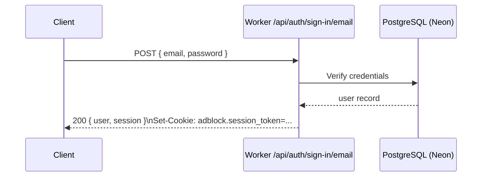
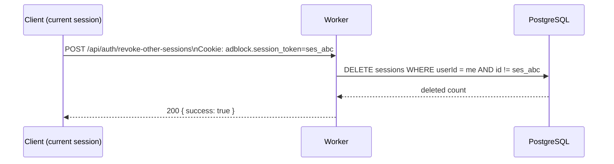
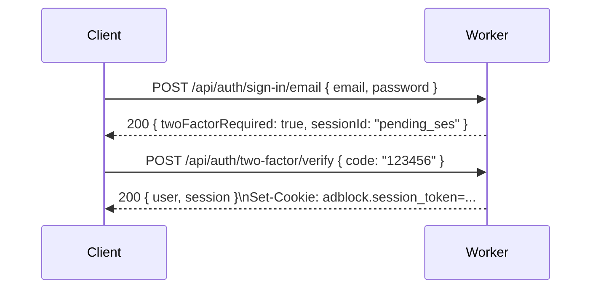

# Better Auth User Guide

End-user reference for signing up, signing in, managing sessions, enabling two-factor
authentication, and authenticating API requests in the bloqr-backend.

---

## Signing Up

### Option A — Angular Sign-Up Page

Navigate to `/sign-up` in the application. Fill in your name, email, and password, then submit.
The form calls `POST /api/auth/sign-up/email` and automatically signs you in on success.

### Option B — Direct API

```bash
curl -X POST https://your-worker.workers.dev/api/auth/sign-up/email \
  -H "Content-Type: application/json" \
  -d '{
    "name": "Jane Smith",
    "email": "jane@example.com",
    "password": "a-very-strong-password"
  }'
```

**Success response (200):**

```json
{
  "user": {
    "id": "cm9abc123",
    "name": "Jane Smith",
    "email": "jane@example.com",
    "tier": "free",
    "role": "user",
    "createdAt": "2025-01-01T00:00:00.000Z"
  },
  "session": {
    "id": "ses_xyz789",
    "token": "adblock.session_token_value",
    "expiresAt": "2025-01-08T00:00:00.000Z"
  }
}
```

The response includes a `Set-Cookie: adblock.session_token=...` header for browser sessions.

---

## Signing In

### Email and Password



```bash
curl -X POST https://your-worker.workers.dev/api/auth/sign-in/email \
  -H "Content-Type: application/json" \
  -c cookies.txt \
  -d '{
    "email": "jane@example.com",
    "password": "a-very-strong-password"
  }'
```

The `-c cookies.txt` flag saves the session cookie for subsequent requests.

### GitHub OAuth

1. Click **Sign in with GitHub** on the sign-in page, **or** redirect to:
   ```
   GET /api/auth/sign-in/social?provider=github&callbackURL=/dashboard
   ```

2. GitHub prompts for authorization.

3. GitHub redirects to `/api/auth/callback/github` with an authorization code.

4. Better Auth exchanges the code for a token, upserts the user record, and sets the session
   cookie. You are redirected to `callbackURL`.

```bash
# Programmatic OAuth initiation (returns redirect URL)
curl -v "https://your-worker.workers.dev/api/auth/sign-in/social?provider=github&callbackURL=/dashboard"
# Follow the Location: header to begin the OAuth flow
```

---

## Signing Out

```bash
# Browser: clears the session cookie
curl -X POST https://your-worker.workers.dev/api/auth/sign-out \
  -H "Content-Type: application/json" \
  -b cookies.txt
```

**Success response (200):**

```json
{ "success": true }
```

The `adblock.session_token` cookie is immediately invalidated and the session record is removed
from the database.

---

## Managing Sessions

Better Auth supports multiple concurrent sessions (e.g., laptop + phone + API client).

### List All Active Sessions

```bash
curl https://your-worker.workers.dev/api/auth/list-sessions \
  -b cookies.txt
```

**Response:**

```json
[
  {
    "id": "ses_abc",
    "userId": "cm9abc123",
    "createdAt": "2025-01-01T00:00:00.000Z",
    "expiresAt": "2025-01-08T00:00:00.000Z",
    "userAgent": "Mozilla/5.0 ...",
    "ipAddress": "1.2.3.4"
  },
  {
    "id": "ses_def",
    "createdAt": "2025-01-03T12:00:00.000Z",
    "expiresAt": "2025-01-10T12:00:00.000Z",
    "userAgent": "curl/8.0"
  }
]
```

### Revoke a Specific Session

```bash
curl -X POST https://your-worker.workers.dev/api/auth/revoke-session \
  -H "Content-Type: application/json" \
  -b cookies.txt \
  -d '{ "sessionId": "ses_def" }'
```

### Revoke All Other Sessions

Keeps the current session active and invalidates all others (useful after a password change):

```bash
curl -X POST https://your-worker.workers.dev/api/auth/revoke-other-sessions \
  -H "Content-Type: application/json" \
  -b cookies.txt
```



---

## Two-Factor Authentication (2FA)

Better Auth uses TOTP (Time-based One-Time Password) compatible with apps like Google
Authenticator, Authy, and 1Password.

### Enable 2FA

**Step 1 — Generate a TOTP secret:**

```bash
curl -X POST https://your-worker.workers.dev/api/auth/two-factor/enable \
  -H "Content-Type: application/json" \
  -b cookies.txt \
  -d '{ "password": "your-current-password" }'
```

**Response:**

```json
{
  "totpURI": "otpauth://totp/bloqr-backend:jane@example.com?secret=JBSWY3DPEHPK3PXP&issuer=bloqr-backend",
  "backupCodes": ["abc123", "def456", "ghi789", ...]
}
```

**Step 2 — Scan the QR code (or enter the secret manually) in your authenticator app.**

The `totpURI` can be converted to a QR code by any standard QR library.

**Step 3 — Verify the TOTP code to activate 2FA:**

```bash
curl -X POST https://your-worker.workers.dev/api/auth/two-factor/verify \
  -H "Content-Type: application/json" \
  -b cookies.txt \
  -d '{ "code": "123456" }'
```

2FA is now active. Future sign-ins will require a TOTP code after the password step.

### Sign In With 2FA Enabled



### Disable 2FA

```bash
curl -X POST https://your-worker.workers.dev/api/auth/two-factor/disable \
  -H "Content-Type: application/json" \
  -b cookies.txt \
  -d '{ "password": "your-current-password" }'
```

---

## Password Reset

### Step 1 — Request a Reset Email

```bash
curl -X POST https://your-worker.workers.dev/api/auth/forget-password \
  -H "Content-Type: application/json" \
  -d '{ "email": "jane@example.com" }'
```

Better Auth sends an email with a short-lived reset link. The link contains a one-time token.

### Step 2 — Submit the New Password

Extract the token from the link (e.g., `?token=abc123`) and call:

```bash
curl -X POST https://your-worker.workers.dev/api/auth/reset-password \
  -H "Content-Type: application/json" \
  -d '{
    "token": "abc123",
    "newPassword": "my-new-strong-password"
  }'
```

**Success response (200):**

```json
{ "success": true }
```

You can now sign in with the new password. All existing sessions are preserved unless you
chose to revoke them.

---

## API Authentication (Bearer Token)

For programmatic access without browser cookies, use API keys.

### Create an API Key

Sign in first and obtain a session cookie or a short-lived token, then:

```bash
curl -X POST https://your-worker.workers.dev/api/keys \
  -H "Content-Type: application/json" \
  -b cookies.txt \
  -d '{
    "name": "My CI Pipeline",
    "scopes": ["compile"],
    "expiresInDays": 90
  }'
```

**Response (key shown only once):**

```json
{
  "id": "key_abc123",
  "key": "abc_XkYZ1234...",
  "name": "My CI Pipeline",
  "scopes": ["compile"],
  "expiresAt": "2025-04-01T00:00:00.000Z",
  "prefix": "abc_XkYZ"
}
```

Store the `key` value securely — it is not stored in plain text and cannot be retrieved again.

### Use the API Key

Pass the key as a Bearer token in the `Authorization` header:

```bash
curl https://your-worker.workers.dev/api/compile \
  -H "Authorization: Bearer abc_XkYZ1234..." \
  -H "Content-Type: application/json" \
  -d '{ ... }'
```

The Worker detects the `abc_` prefix, hashes the key, and verifies it against the database.

### List Your API Keys

```bash
curl https://your-worker.workers.dev/api/keys \
  -b cookies.txt
```

Keys are displayed with their prefix, name, scopes, expiry, and last-used timestamp — never the
plaintext value.

### Revoke an API Key

```bash
curl -X DELETE https://your-worker.workers.dev/api/keys/key_abc123 \
  -b cookies.txt
```

The key is immediately invalidated.

---

## Session Expiry and Renewal

| Setting | Value |
|---------|-------|
| Session TTL | 7 days |
| Auto-renewal | Refreshed if < 1 day remaining |
| Cookie cache | 5 minutes (reduces DB lookups) |
| Cookie prefix | `adblock` |

Sessions are automatically renewed on every authenticated request if they are within 24 hours of
expiry. No manual token refresh is required.

---

## Related Documentation

- [API Authentication](api-authentication.md) — Detailed API key reference
- [Better Auth Admin Guide](better-auth-admin-guide.md) — Admin operations
- [Social Providers](social-providers.md) — GitHub/Google OAuth setup
