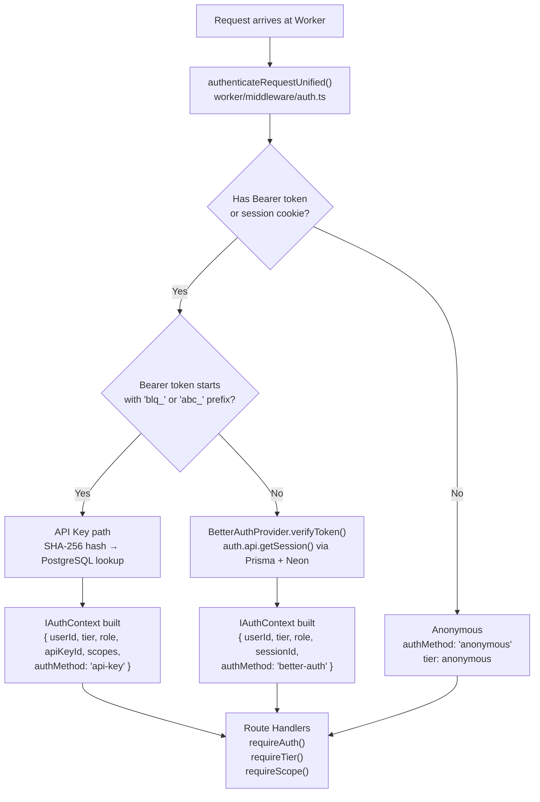

# Authentication Developer Guide

Technical reference for developers working on or extending the adblock-compiler authentication system.

> **See also:** [Better Auth Developer Guide](better-auth-developer-guide.md) for in-depth plugin
> architecture, adapter swapping, and custom `IAuthProvider` creation.

---

## Architecture

### Authentication Flow

The unified auth middleware runs on every protected request. Token type is determined by the
`blq_` prefix (or legacy `abc_` prefix) — API keys and Better Auth session tokens are mutually exclusive.



### Key Files

| File | Purpose |
|------|---------|
| `worker/types.ts` | Type definitions: `IAuthProvider`, `IAuthContext`, `UserTier`, `AuthScope`, `Env` |
| `worker/lib/auth.ts` | Better Auth factory — `createAuth(env, baseURL)` |
| `worker/lib/prisma.ts` | PrismaClient factory — creates per-request client via Hyperdrive |
| `worker/middleware/auth.ts` | Unified auth middleware, `authenticateRequestUnified()`, guards |
| `worker/middleware/better-auth-provider.ts` | `BetterAuthProvider` — `IAuthProvider` implementation |
| `worker/middleware/cf-access.ts` | Cloudflare Access JWT verification (defense-in-depth) |
| `worker/handlers/api-keys.ts` | API key CRUD endpoints |
| `worker/handlers/auth-providers.ts` | `GET /api/auth/providers` — active provider metadata |

---

## The IAuthProvider Interface

The authentication system is built on an extensible provider interface defined in `worker/types.ts`.
You can swap or add identity providers without changing middleware or route handlers.

### Interface Definition

```typescript
// worker/types.ts

export interface IAuthProvider {
    /** Human-readable provider name, e.g. 'better-auth', 'auth0' */
    readonly name: string;

    /** Auth method identifier stamped onto IAuthContext for every verified request */
    readonly authMethod: IAuthContext['authMethod'];

    /** Verify credentials from the incoming request and return user identity */
    verifyToken(request: Request): Promise<IAuthProviderResult>;
}

export interface IAuthProviderResult {
    readonly valid: boolean;
    readonly providerUserId?: string;
    readonly tier?: UserTier;
    readonly role?: string;
    readonly sessionId?: string | null;
    readonly error?: string;
    readonly email?: string | null;
    readonly displayName?: string | null;
}

export interface IAuthContext {
    readonly userId: string | null;
    readonly tier: UserTier;
    readonly role: string;
    readonly apiKeyId: string | null;
    readonly sessionId: string | null;
    readonly scopes: readonly string[];
    readonly authMethod: 'api-key' | 'anonymous' | 'better-auth';
    readonly email?: string | null;
    readonly displayName?: string | null;
    readonly apiKeyRateLimit?: number | null;
}
```

### Default Implementation: BetterAuthProvider

`BetterAuthProvider` delegates all credential verification to Better Auth's `auth.api.getSession()`,
which handles both cookie-based (browser) and Bearer token (API) sessions transparently.

```typescript
// worker/middleware/better-auth-provider.ts (simplified)
export class BetterAuthProvider implements IAuthProvider {
    readonly name = 'better-auth';
    readonly authMethod = 'better-auth' as const;

    constructor(private readonly env: Env) {}

    async verifyToken(request: Request): Promise<IAuthProviderResult> {
        const url = new URL(request.url);
        const auth = createAuth(this.env, url.origin);

        // auth.api.getSession() reads cookies OR the Authorization header.
        // The bearer() plugin enables the Authorization: Bearer <token> path.
        const session = await auth.api.getSession({ headers: request.headers });

        if (!session) {
            return { valid: false }; // No session — fall through to anonymous
        }

        return {
            valid: true,
            providerUserId: session.user.id,
            tier: resolveTier(session.user.tier),   // from additionalFields
            role: resolveRole(session.user.role),   // from additionalFields
            sessionId: session.session.id,
            email: session.user.email ?? null,
            displayName: session.user.name ?? null,
        };
    }
}
```

Key design points:

- **Stateless per request** — a fresh Better Auth instance is created for every call; Hyperdrive
  ensures this is cheap (local proxy socket, not a remote TCP handshake).
- **ZTA-safe tier resolution** — tier and role come from the database on every request, not from
  JWT claims. Privilege changes take effect immediately.
- **Graceful fallback** — a missing session returns `{ valid: false }` (not an error), allowing
  the middleware to fall through to anonymous.

### Creating a Custom Auth Provider

To integrate a third-party identity provider (Auth0, Okta, Supabase Auth, Firebase Auth):

```typescript
// worker/middleware/my-auth-provider.ts
import type { Env, IAuthProvider, IAuthProviderResult } from '../types.ts';
import { UserTier } from '../types.ts';

export class MyAuthProvider implements IAuthProvider {
    readonly name = 'my-provider';
    readonly authMethod = 'better-auth' as const; // reuse, or extend the union type

    constructor(private readonly env: Env) {}

    async verifyToken(request: Request): Promise<IAuthProviderResult> {
        const authHeader = request.headers.get('Authorization');
        if (!authHeader?.startsWith('Bearer ')) {
            return { valid: false };
        }

        const token = authHeader.slice(7);
        try {
            const payload = await verifyMyJwt(token, this.env.MY_JWKS_URL);
            return {
                valid: true,
                providerUserId: payload.sub,
                tier: mapTier(payload.plan) as UserTier,
                role: payload.role ?? 'user',
                email: payload.email ?? null,
                displayName: payload.name ?? null,
            };
        } catch {
            return { valid: false, error: 'Token verification failed' };
        }
    }
}
```

Register it in `worker/hono-app.ts` by replacing the `BetterAuthProvider` instantiation:

```typescript
// worker/hono-app.ts
import { MyAuthProvider } from './middleware/my-auth-provider.ts';

app.use('*', async (c, next) => {
    const authProvider = new MyAuthProvider(c.env); // ← swap here
    // ... rest of middleware setup
});
```

---

## Adding Better Auth Plugins

Better Auth plugins are added to the `plugins` array inside `createAuth()` in `worker/lib/auth.ts`.
Each plugin registers routes under `/api/auth/*` and may add database tables.

### Current Plugins

```typescript
// worker/lib/auth.ts
plugins: [
    bearer(),       // Authorization: Bearer <session-token> path for API clients
    twoFactor({ issuer: 'adblock-compiler' }), // TOTP 2FA
    multiSession(), // Multiple concurrent sessions
    admin(),        // Admin user management endpoints
]
```

### Adding `apiKey()`

Built-in API key management (replaces the custom `api_keys` table if desired):

```typescript
import { apiKey } from 'better-auth/plugins';

plugins: [
    bearer(),
    twoFactor({ issuer: 'adblock-compiler' }),
    multiSession(),
    admin(),
    apiKey(), // adds /api/auth/api-key/create, /list, /revoke
]
```

After adding, run `deno task db:generate` to update the Prisma schema, then `deno task db:migrate`.

### Adding `organization()`

Multi-tenancy support:

```typescript
import { organization } from 'better-auth/plugins';

plugins: [
    // ... existing plugins
    organization(), // adds /api/auth/organization/* and member/* routes
]
```

This adds `organization` and `member` tables — always run `deno task db:generate && deno task db:migrate` after adding any plugin.

### Adding `passkey()`

WebAuthn / FIDO2 passkey support:

```typescript
import { passkey } from 'better-auth/plugins';

plugins: [
    // ... existing plugins
    passkey(), // adds /api/auth/passkey/register, /authenticate
]
```

---

## Swapping the Database Adapter

The database adapter is the single line `database: prismaAdapter(prisma, { provider: 'postgresql' })`.
Changing it requires no other code changes in the auth system.

### Current: Neon PostgreSQL via Hyperdrive

```typescript
// worker/lib/auth.ts — current configuration
import { prismaAdapter } from 'better-auth/adapters/prisma';
import { createPrismaClient } from './prisma.ts';

const prisma = createPrismaClient(env.HYPERDRIVE.connectionString);

betterAuth({
    database: prismaAdapter(prisma, { provider: 'postgresql' }),
    // ...
});
```

### Cloudflare D1 (edge SQLite)

```typescript
import { d1Adapter } from 'better-auth/adapters/d1';

betterAuth({
    database: d1Adapter(env.DB),
    // ...
});
```

Add the D1 binding to `wrangler.toml`:

```toml
[[d1_databases]]
binding = "DB"
database_name = "adblock-auth"
database_id = "<your-d1-id>"
```

### MySQL / PlanetScale

```typescript
import { prismaAdapter } from 'better-auth/adapters/prisma';
// Use a MySQL-compatible PrismaClient

betterAuth({
    database: prismaAdapter(prisma, { provider: 'mysql' }),
    // ...
});
```

### Self-Hosted PostgreSQL (without Hyperdrive)

```typescript
import { prismaAdapter } from 'better-auth/adapters/prisma';
// PrismaClient created with direct DATABASE_URL (not Hyperdrive)

betterAuth({
    database: prismaAdapter(prisma, { provider: 'postgresql' }),
    // ...
});
```

### Custom Adapter

Implement Better Auth's `Adapter` interface directly for any data source:

```typescript
import type { Adapter } from 'better-auth';

const myAdapter: Adapter = {
    async create(data) { /* ... */ },
    async findOne(query) { /* ... */ },
    async findMany(query) { /* ... */ },
    async update(query, data) { /* ... */ },
    async delete(query) { /* ... */ },
};

betterAuth({
    database: myAdapter,
    // ...
});
```

---

## Extending the User Model

Better Auth's `user.additionalFields` lets you add typed fields to every user record without
touching the core session/account tables.

### Current Additional Fields

```typescript
// worker/lib/auth.ts
user: {
    additionalFields: {
        tier: {
            type: 'string',
            required: false,
            defaultValue: 'free',
            input: false, // ← prevents users from self-assigning tier
        },
        role: {
            type: 'string',
            required: false,
            defaultValue: 'user',
            input: false, // ← prevents users from self-assigning role
        },
    },
},
```

### Adding a New Field

**Step 1** — Add to `additionalFields` in `worker/lib/auth.ts`:

```typescript
user: {
    additionalFields: {
        tier: { /* ... existing ... */ },
        role: { /* ... existing ... */ },
        displayName: {         // ← new field
            type: 'string',
            required: false,
            defaultValue: null,
            input: true,       // users may set their own display name
        },
    },
},
```

**Step 2** — Add the column to `prisma/schema.prisma`:

```prisma
model User {
  id            String    @id @default(cuid())
  name          String
  email         String    @unique
  emailVerified Boolean   @default(false)
  image         String?
  createdAt     DateTime  @default(now())
  updatedAt     DateTime  @updatedAt
  tier          String    @default("free")
  role          String    @default("user")
  displayName   String?   // ← new column
  // ...
}
```

**Step 3** — Generate the migration:

```bash
deno task db:generate
deno task db:migrate
```

**Step 4** — Access the field from `IAuthContext`:

The field is automatically included in the session response. `BetterAuthProvider` passes it
through `session.user.displayName` if you add it to the return value:

```typescript
return {
    valid: true,
    providerUserId: session.user.id,
    displayName: (session.user as { displayName?: string }).displayName ?? session.user.name,
    // ...
};
```

---

## wrangler.toml Binding Requirements

| Binding | Type | Required | Description |
|---------|------|----------|-------------|
| `HYPERDRIVE` | Hyperdrive | **Yes** | Neon PostgreSQL connection proxy |
| `BETTER_AUTH_SECRET` | Secret | **Yes** | Session signing secret (32+ chars) |
| `BETTER_AUTH_URL` | Var | No | Override base URL for auth endpoints |
| `GITHUB_CLIENT_ID` | Secret | No | Enables GitHub OAuth |
| `GITHUB_CLIENT_SECRET` | Secret | No | Enables GitHub OAuth |
| `GOOGLE_CLIENT_ID` | Secret | No | Reserved — Google OAuth (not yet active) |
| `GOOGLE_CLIENT_SECRET` | Secret | No | Reserved — Google OAuth (not yet active) |
| `TURNSTILE_SITE_KEY` | Var | No | Cloudflare Turnstile public key |
| `TURNSTILE_SECRET_KEY` | Secret | No | Cloudflare Turnstile verification key |
| `CF_ACCESS_TEAM_DOMAIN` | Secret | No | CF Zero Trust team domain |
| `CF_ACCESS_AUD` | Secret | No | CF Access audience tag |
| `CORS_ALLOWED_ORIGINS` | Secret | No | Comma-separated list of allowed origins |
| `ANALYTICS_ENGINE` | Analytics Engine | No | Workers Analytics Engine dataset |
| `SENTRY_DSN` | Secret | No | Sentry error reporting DSN |

Minimal `wrangler.toml` for Better Auth:

```toml
[[hyperdrive]]
binding = "HYPERDRIVE"
id = "<your-hyperdrive-id>"
```

---

## Local Dev Setup

Copy and fill in `.dev.vars` (never committed to git):

```ini
# .dev.vars — Worker secrets loaded by wrangler dev

# ── Better Auth (required) ──────────────────────────────────────────────────
# Generate: openssl rand -base64 32
BETTER_AUTH_SECRET=your-secret-at-least-32-characters-long

# ── Hyperdrive (required) ───────────────────────────────────────────────────
# Point wrangler dev at your personal Neon development branch.
# Create a branch at https://console.neon.tech → your project → Branches → New Branch.
# Use the "Direct connection" string (not pooled).
CLOUDFLARE_HYPERDRIVE_LOCAL_CONNECTION_STRING_HYPERDRIVE=postgresql://<user>:<password>@<branch-host>.neon.tech/<dbname>?sslmode=require

# ── GitHub OAuth (optional) ─────────────────────────────────────────────────
GITHUB_CLIENT_ID=your-github-oauth-app-client-id
GITHUB_CLIENT_SECRET=your-github-oauth-app-client-secret

# ── Cloudflare Turnstile (optional — use test keys locally) ─────────────────
TURNSTILE_SITE_KEY=1x00000000000000000000AA
TURNSTILE_SECRET_KEY=1x0000000000000000000000000000000AA

# ── CORS ────────────────────────────────────────────────────────────────────
CORS_ALLOWED_ORIGINS=http://localhost:4200,http://localhost:8787
```

Start the dev environment:

```bash
deno task db:migrate    # Apply pending Prisma migrations to your Neon branch
wrangler dev            # Start the Worker
```

See [Local Development Setup](../database-setup/local-dev.md) for full Neon branching instructions.

---

## Testing

### Auth Test Files

| File | What It Covers |
|------|----------------|
| `worker/lib/auth.test.ts` | `createAuth()` factory, config validation, plugin wiring |
| `worker/middleware/auth.test.ts` | `authenticateRequestUnified()` — all three auth paths |
| `worker/middleware/better-auth-provider.test.ts` | `BetterAuthProvider.verifyToken()`, tier/role resolution |
| `worker/middleware/auth-extensibility.test.ts` | `IAuthProvider` contract, tier/scope registries, guards |
| `worker/middleware/zta-auth-gates.test.ts` | ZTA gate enforcement, telemetry on auth failure |
| `worker/handlers/auth-config.test.ts` | `GET /api/auth/providers` response shape |
| `worker/handlers/auth-admin.test.ts` | Admin auth operations |

### Running Auth Tests

```bash
# All worker tests (includes auth)
deno task test:worker

# Auth middleware only
deno test worker/middleware/auth.test.ts worker/middleware/better-auth-provider.test.ts --allow-env --allow-net

# Auth extensibility tests
deno test worker/middleware/auth-extensibility.test.ts --allow-env

# With coverage
deno task test:coverage
```

### Mocking Better Auth in Unit Tests

```typescript
// Create a mock that returns a preset auth context
import { ANONYMOUS_AUTH_CONTEXT } from '../types.ts';
import type { IAuthContext, IAuthProvider, IAuthProviderResult } from '../types.ts';

export class MockAuthProvider implements IAuthProvider {
    readonly name = 'mock';
    readonly authMethod = 'better-auth' as const;

    constructor(private readonly result: IAuthProviderResult) {}

    async verifyToken(_req: Request): Promise<IAuthProviderResult> {
        return this.result;
    }
}

// In your test:
const provider = new MockAuthProvider({ valid: true, providerUserId: 'u_123', tier: UserTier.Pro });
const result = await authenticateRequestUnified(mockRequest, mockEnv, undefined, provider);
assertEquals(result.context.tier, UserTier.Pro);
```

---

## Tier System

### Registry Architecture

```typescript
// worker/types.ts
export enum UserTier {
    Anonymous = 'anonymous',
    Free      = 'free',
    Pro       = 'pro',
    Admin     = 'admin',
}

export const TIER_REGISTRY: Readonly<Record<UserTier, ITierConfig>> = {
    [UserTier.Anonymous]: { order: 0, rateLimit: 10,       displayName: 'Anonymous', description: 'Unauthenticated' },
    [UserTier.Free]:      { order: 1, rateLimit: 60,       displayName: 'Free',      description: 'Registered user' },
    [UserTier.Pro]:       { order: 2, rateLimit: 300,      displayName: 'Pro',       description: 'Paid subscriber' },
    [UserTier.Admin]:     { order: 3, rateLimit: Infinity, displayName: 'Admin',     description: 'Administrator' },
};
```

Tier comparison uses numeric order:

```typescript
isTierSufficient(UserTier.Pro, UserTier.Free);   // true — Pro (2) ≥ Free (1)
isTierSufficient(UserTier.Free, UserTier.Admin); // false — Free (1) < Admin (3)
```

### Guard Functions

```typescript
// Require any authenticated user
const authGuard = requireAuth(authContext);
if (authGuard) return authGuard; // 401 Unauthorized

// Require minimum tier
const tierGuard = requireTier(authContext, UserTier.Pro);
if (tierGuard) return tierGuard; // 403 Forbidden

// Require specific scopes (API key auth only)
const scopeGuard = requireScope(authContext, AuthScope.Compile);
if (scopeGuard) return scopeGuard; // 403 Forbidden
```

---

## Scope System

API key scopes provide fine-grained access control. Session-authenticated users (Better Auth)
bypass scope checks — they inherit full access based on their tier.

```typescript
export enum AuthScope {
    Compile = 'compile',
    Rules   = 'rules',
    Admin   = 'admin',
}
```

| Auth Method | Scope Enforcement |
|-------------|-------------------|
| Better Auth session | Bypassed — tier determines access |
| API key (`blq_`) | Enforced — key must include required scopes |
| Anonymous | 401 returned before scope check |

---

## Related Documentation

- [Better Auth User Guide](better-auth-user-guide.md) — Sign-up/in, sessions, 2FA, API auth
- [Better Auth Admin Guide](better-auth-admin-guide.md) — Bootstrap admin, user management, secrets
- [Better Auth Developer Guide](better-auth-developer-guide.md) — Plugin architecture, adapter swapping, extensibility
- [Auth Provider Selection](auth-provider-selection.md) — How the Worker selects an auth provider
- [Configuration Guide](configuration.md) — Full environment variable reference
- [Social Providers](social-providers.md) — GitHub/Google OAuth setup
- [Better Auth Prisma](better-auth-prisma.md) — Prisma adapter technical details
