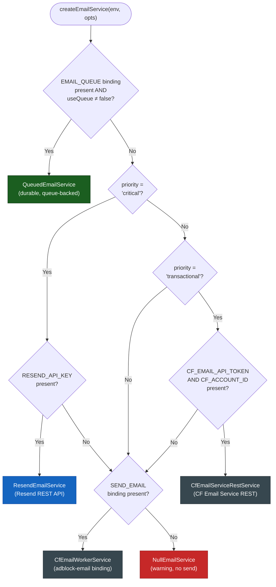
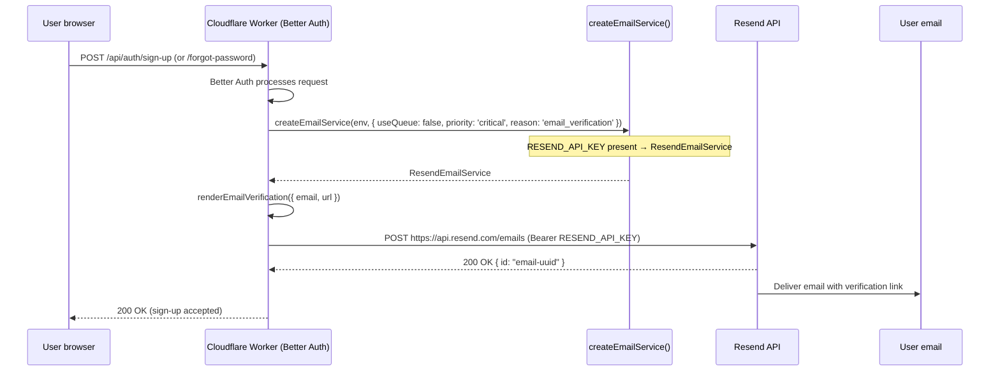
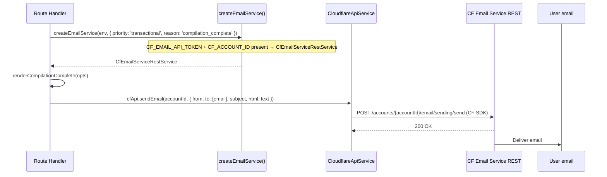
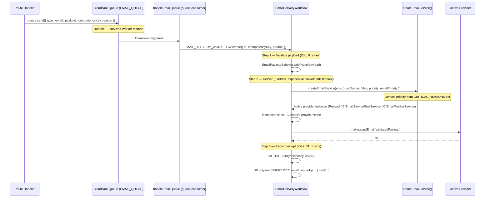
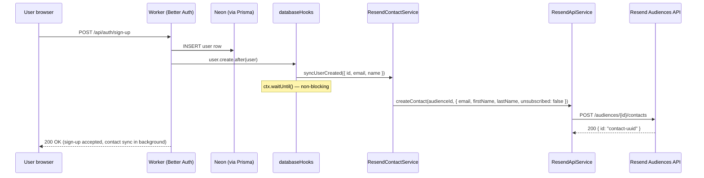

# Hybrid Email Architecture

> **Email delivery in the Bloqr Worker** — why two systems are used, how the provider
> selector works, end-to-end flows, environment setup, and troubleshooting.

---

## Table of Contents

- [Why Two Systems?](#why-two-systems)
- [Provider Overview](#provider-overview)
- [Provider Selector (`createEmailService`)](#provider-selector-createemailservice)
  - [Selection Flowchart](#selection-flowchart)
  - [Priority Logic in Code](#priority-logic-in-code)
- [End-to-End Flows](#end-to-end-flows)
  - [Auth Critical Path (Resend)](#auth-critical-path-resend)
  - [Transactional Notifications (CF Email Service REST)](#transactional-notifications-cf-email-service-rest)
  - [Durable Queue-backed Delivery (EmailDeliveryWorkflow)](#durable-queue-backed-delivery-emaildeliveryworkflow)
  - [Fallback — CF Email Worker Binding](#fallback--cf-email-worker-binding)
- [Email Templates](#email-templates)
- [Environment Configuration](#environment-configuration)
- [Zero Trust Considerations](#zero-trust-considerations)
- [Extending the System](#extending-the-system)
- [Troubleshooting](#troubleshooting)

---

## Why Two Systems?

The Worker sends two fundamentally different **classes** of email with conflicting
requirements that no single provider can optimally serve:

| Class | Examples | Key requirement | Wrong outcome if delivery fails |
|---|---|---|---|
| **Auth critical** | Email verification, password reset, security alerts | **Guaranteed delivery** — user is blocked until the email arrives | User permanently locked out; unrecoverable state |
| **Transactional / notification** | Compilation complete, bulk alerts, admin digests | **Best-effort, cost-efficient** at high volume | Slightly degraded UX — user misses a notification |

The design conclusion:

- **Resend** is purpose-built for deliverability. Its dedicated sending infrastructure, reputation
  management, and engagement data significantly reduce the chance of auth emails landing in spam.
  Missing a password reset email or email verification link is a support and retention crisis; Resend
  makes that scenario unlikely.

- **Cloudflare Email Service REST** (`/accounts/{id}/email/sending/send`) is the low-friction
  choice for notifications: no third-party account required beyond what Cloudflare already provides,
  no SDK bloat, and no separate billing relationship. A notification that lands in spam is annoying;
  it is not a showstopper.

- **Cloudflare Email Worker binding** (`SEND_EMAIL`) is the legacy binding-based path. It stays as
  the universal fallback at every tier so that any environment without either of the two primary
  providers can still send email through the `adblock-email` Email Worker.

This avoids the common anti-pattern of routing _everything_ through a premium deliverability
provider (expensive, overkill for notifications) or routing _everything_ through a commodity
channel (cheap, but unacceptable for auth-critical mail).

---

## Provider Overview

| Class | Provider | Implementation | Env vars required |
|---|---|---|---|
| Auth critical | **Resend** | `ResendEmailService` (via `ResendApiService`) | `RESEND_API_KEY` |
| Transactional | **CF Email Service REST** | `CfEmailServiceRestService` | `CF_EMAIL_API_TOKEN`, `CF_ACCOUNT_ID` |
| Durable queue | **EmailDeliveryWorkflow** | `QueuedEmailService` → Workflow | `EMAIL_QUEUE` binding |
| Fallback | **CF Email Worker binding** | `CfEmailWorkerService` | `SEND_EMAIL` binding |
| No-op | Null | `NullEmailService` | *(none — last resort)* |

### Resend API Wrapper (`ResendApiService`)

`ResendApiService` (`worker/services/resend-api-service.ts`) is the single typed REST wrapper for all Resend Contacts/Audiences API operations. It mirrors the `CloudflareApiService` pattern: all Resend API calls go through this class — no raw `fetch('https://api.resend.com/...')` calls elsewhere in the codebase.

| Method | Description |
|---|---|
| `createContact(audienceId, data)` | Add a contact to a Resend audience |
| `deleteContact(audienceId, contactIdOrEmail)` | Remove a contact by ID or email |
| `getContact(audienceId, contactIdOrEmail)` | Retrieve a single contact |
| `listContacts(audienceId)` | List all contacts in an audience |

All methods validate responses with Zod schemas and throw a typed `ResendApiError` (carrying `statusCode`, `errorName`, and `message`) on non-2xx responses.

```typescript
import { createResendApiService } from '../services/resend-api-service.ts';

const resend = createResendApiService(env.RESEND_API_KEY);
const contact = await resend.createContact(env.RESEND_AUDIENCE_ID, {
    email: 'user@example.com',
    firstName: 'Alice',
    unsubscribed: false,
});
```

All providers implement the `IEmailService` interface:

```typescript
interface IEmailService {
    sendEmail(payload: EmailPayload): Promise<void>;
}
```

All sends are **fire-and-forget**: providers never throw on delivery failure — they log a warning
and resolve. Callers use `ctx.waitUntil()` or `.catch()` to avoid blocking primary Worker
responses.

---

## Provider Selector (`createEmailService`)

The `createEmailService(env, opts)` factory selects the best available provider from the
Worker `Env` object. **First match wins.**

### Selection Flowchart



### Priority Logic in Code

```typescript
// worker/services/email-service.ts — createEmailService()

// Priority 1 — durable queue-backed (EMAIL_QUEUE → EmailDeliveryWorkflow)
if (useQueue && env.EMAIL_QUEUE) {
    return new QueuedEmailService(env.EMAIL_QUEUE, { requestId, reason });
}

// Priority 2a — Resend (auth critical path only)
if (priority === 'critical' && env.RESEND_API_KEY) {
    return new ResendEmailService(env.RESEND_API_KEY, FROM_ADDRESS_CRITICAL);
}

// Priority 2b — CF Email Service REST (transactional)
if (priority === 'transactional' && env.CF_EMAIL_API_TOKEN && env.CF_ACCOUNT_ID) {
    return new CfEmailServiceRestService(env.CF_EMAIL_API_TOKEN, env.CF_ACCOUNT_ID, FROM_ADDRESS_TRANSACTIONAL);
}

// Priority 2c — CF Email Worker binding (fallback, any priority)
if (env.SEND_EMAIL) {
    return new CfEmailWorkerService(env.SEND_EMAIL, FROM_ADDRESS_TRANSACTIONAL);
}

// Priority 3 — no-op
return new NullEmailService();
```

Key design decisions baked into the selector:

- `priority: 'critical'` **never** falls through to `CfEmailServiceRestService`.
  If `RESEND_API_KEY` is absent on the critical path, the selector skips straight to
  `CfEmailWorkerService` (or `NullEmailService`) rather than using the transactional provider
  for an auth email. This prevents misconfiguration from silently routing password-reset
  emails through the wrong channel.

- `QueuedEmailService` is always selected when `EMAIL_QUEUE` is bound, regardless of priority.
  The workflow itself reads `reason` from the queue message and re-derives the priority
  (`CRITICAL_REASONS` set) before constructing the inner provider with `{ useQueue: false }`.

- `priority` is **optional**. Callers that do not supply it fall straight to `CfEmailWorkerService`
  or `NullEmailService`. This preserves backwards compatibility with pre-existing call sites.

---

## End-to-End Flows

### Auth Critical Path (Resend)

Triggered by Better Auth `sendResetPassword` and `sendVerificationEmail` hooks in
`worker/lib/auth.ts`.



**Fallback chain when `RESEND_API_KEY` is absent:**

```
RESEND_API_KEY missing → skip Resend
    ↓
SEND_EMAIL binding present? → CfEmailWorkerService
    ↓ (no)
NullEmailService (email dropped, warning logged)
```

> ⚠️ With `requireEmailVerification: true`, a dropped verification email means the user
> cannot sign in. Always ensure at least one provider (`RESEND_API_KEY` or `SEND_EMAIL`) is
> configured in every deployment environment.

---

### Transactional Notifications (CF Email Service REST)

Used for compilation-complete notifications, admin alerts, and other best-effort sends.



`CfEmailServiceRestService` delegates to `CloudflareApiService.sendEmail()` — a typed method
on the project-wide Cloudflare SDK wrapper (`src/services/cloudflareApiService.ts`). This means
all SDK-level features (auth headers, automatic retry, `APIError` on non-2xx) apply without any
raw `fetch()` to `api.cloudflare.com`.

---

### Durable Queue-backed Delivery (EmailDeliveryWorkflow)

For **production** sends where durability matters (paying users, critical notifications):



**Provider resolution inside the workflow:**

The workflow re-derives `emailPriority` from the `reason` field using the module-level
`CRITICAL_REASONS` set:

```typescript
// worker/workflows/EmailDeliveryWorkflow.ts

const CRITICAL_REASONS = new Set([
    'email_verification',
    'password_reset',
    'security_alert',
    'two_factor_alert',
]);

const emailPriority = CRITICAL_REASONS.has(reason) ? 'critical' : 'transactional';
const mailer = createEmailService(this.env, { useQueue: false, priority: emailPriority });
```

**`providerName` is derived from `instanceof` checks**, not from env-var inspection, so the
delivery receipt always reflects the provider that actually sent the email:

```typescript
if (mailer instanceof ResendEmailService)           providerName = 'resend';
else if (mailer instanceof CfEmailServiceRestService) providerName = 'cf_email_rest';
else if (mailer instanceof CfEmailWorkerService)    providerName = 'cf_email_worker';
else throw new Error('No email provider configured for workflow delivery.');
```

---

### Fallback — CF Email Worker Binding

The `CfEmailWorkerService` is selected when neither `RESEND_API_KEY` (for critical) nor
`CF_EMAIL_API_TOKEN`+`CF_ACCOUNT_ID` (for transactional) is configured, but the `SEND_EMAIL`
binding is present. It builds an RFC 5322 `multipart/alternative` MIME message and dispatches it
through the `adblock-email` Email Worker via the Cloudflare Email Routing infrastructure.

This tier requires no third-party API keys, only:
1. Cloudflare Email Routing enabled on the zone
2. The `[[send_email]]` stanza in `wrangler.toml`

---

## Email Templates

Templates live in `worker/services/email-templates.ts`. Each function returns
`{ subject, html, text }` (and optionally `replyTo`) ready to spread into `sendEmail()`.

| Function | Purpose | Used by |
|---|---|---|
| `renderCompilationComplete(opts)` | Compilation-complete notification | `QueuedEmailService` / direct handlers |
| `renderCriticalErrorAlert(opts)` | Admin alert when ERROR_QUEUE receives a critical error | Error queue consumer |
| `renderEmailVerification(opts)` | Sign-up email verification link | `auth.ts` `emailVerification.sendVerificationEmail` |
| `renderPasswordReset(opts)` | Password reset link | `auth.ts` `emailAndPassword.sendResetPassword` |

### Bloqr Dark Theme (PR #1714)

All four templates were rebuilt with the Bloqr dark design language in PR #1714. The previous templates used a light white design (`color:#1a1a1a`, purple `#4f46e5` CTA buttons) which was off-brand. The current design uses:

| Token | Value | Usage |
|---|---|---|
| Body background | `#070B14` | Outer email body |
| Card background | `#0E1829` | Content card |
| Card border | `#1D2E4A` | Card outline |
| Primary text | `#F0F4FF` | Headings |
| Secondary text | `#D0D9F0` | Body copy |
| Muted text | `#7A8BAA` | Fallback links, footer |
| Orange accent | `#FF5500` | CTA buttons |
| Cyan links | `#00D4FF` | Inline links, fallback URLs |
| Error red | `#FF4444` | Critical alert heading |

All HTML uses **inline styles only** and a **table-based layout** (no flexbox, no grid) for maximum email client compatibility (Gmail, Outlook, Apple Mail). The shared `wrapLayout()` helper function applies the outer card structure consistently across all templates.

**Adding a new template:**

```typescript
// worker/services/email-templates.ts

export interface RenderMyTemplateOpts {
    readonly recipientName: string;
    readonly actionUrl: string;
}

export function renderMyTemplate(opts: RenderMyTemplateOpts): { subject: string; html: string; text: string } {
    return {
        subject: `Action required — ${escapeHtml(opts.recipientName)}`,
        text: `Click here: ${opts.actionUrl}`,
        html: `<p>Click <a href="${escapeHtml(opts.actionUrl)}">here</a>.</p>`,
    };
}
```

All user-supplied values that are interpolated into HTML **must** be passed through
`escapeHtml()` (`worker/utils/escape-html.ts`) to prevent HTML injection.

---

## Resend Audience Contact Sync

`ResendContactService` (`worker/services/resend-contact-service.ts`) syncs user lifecycle events from Better Auth `databaseHooks` to a Resend audience. It uses `ResendApiService` internally.

### Interface

```typescript
interface IResendContactService {
    syncUserCreated(user: { id: string; email: string; name?: string | null }): Promise<void>;
    syncUserDeleted(user: { id: string; email: string }): Promise<void>;
}
```

Both methods are **fire-and-forget**: errors are caught, logged as warnings, and never rethrown. This prevents audience-sync failures from affecting the primary auth/user creation path.

### Factory

```typescript
import { createResendContactService } from '../services/resend-contact-service.ts';

// Returns ResendContactService when both secrets are present;
// returns NullResendContactService (no-op) otherwise — never null.
const contacts = createResendContactService(env);
```

`createResendContactService` returns a `NullResendContactService` when either `RESEND_API_KEY` or `RESEND_AUDIENCE_ID` is absent. This avoids null-guard boilerplate at every call site — hooks are unconditional.

### Better Auth Integration

The sync is wired into `createAuth()` (`worker/lib/auth.ts`) via Better Auth `databaseHooks`. The `ExecutionContext` is now forwarded to `createAuth()` so that sync promises are registered with `ctx.waitUntil()` and survive response completion:

```typescript
// worker/hono-app.ts
const auth = createAuth(c.env, url.origin, c.executionCtx);
```

```typescript
// worker/lib/auth.ts — databaseHooks (simplified)
databaseHooks: {
    user: {
        create: {
            after: async (user) => {
                const syncPromise = contacts.syncUserCreated({ id: user.id, email: user.email, name: user.name });
                if (ctx) {
                    ctx.waitUntil(syncPromise);
                } else {
                    void syncPromise;
                }
            },
        },
        delete: {
            after: async (user) => {
                ctx?.waitUntil(contacts.syncUserDeleted({ id: user.id, email: user.email }));
            },
        },
    },
},
```

### Contact Sync Flow



### Name Splitting

`syncUserCreated` splits the `name` field on whitespace to derive `firstName` / `lastName` for Resend:

| `name` input | `firstName` | `lastName` |
|---|---|---|
| `"Alice Smith"` | `"Alice"` | `"Smith"` |
| `"Mary Smith Jones"` | `"Mary"` | `"Smith Jones"` |
| `"Bob"` | `"Bob"` | *(absent)* |
| `null` / `""` | *(absent)* | *(absent)* |

Multi-word last names are preserved; multi-word first names cannot be: `"Mary Anne Smith"` → `firstName="Mary"`, `lastName="Anne Smith"`.

### Required env vars

| Var | Where | Description |
|---|---|---|
| `RESEND_API_KEY` | Worker Secret | Resend API key (already required for auth email sends) |
| `RESEND_AUDIENCE_ID` | Worker Secret | UUID of the Resend audience to sync contacts into |

```bash
wrangler secret put RESEND_AUDIENCE_ID
# Value: the UUID shown in the Resend dashboard under Audiences
```

### Troubleshooting contact sync

| Symptom | Likely cause | Fix |
|---|---|---|
| Users not appearing in Resend audience | `RESEND_AUDIENCE_ID` not set | `wrangler secret put RESEND_AUDIENCE_ID` |
| `[ResendContactService] syncUserCreated failed: ResendApiError 404` | Audience ID does not exist in Resend | Create the audience in the Resend dashboard; update the secret |
| `[ResendContactService] syncUserCreated failed: ResendApiError 422` | Email address already in audience | Normal for re-registrations — Resend rejects duplicate contacts; this is non-fatal |
| Contact sync not firing at all | `RESEND_API_KEY` absent | Without both secrets, `NullResendContactService` is used — no API calls made |

---

## Environment Configuration

### Secrets (`wrangler secret put`)

```bash
# Resend (auth critical path)
wrangler secret put RESEND_API_KEY
# Obtain from: https://resend.com/api-keys
# Required scope: Full access (or Sending access on verified domain)

# Resend audience (contact sync)
wrangler secret put RESEND_AUDIENCE_ID
# Obtain from: https://resend.com/audiences → copy the audience UUID
# Required for: ResendContactService user lifecycle sync

# Cloudflare Email Service REST (transactional)
wrangler secret put CF_EMAIL_API_TOKEN
# Obtain from: https://dash.cloudflare.com/profile/api-tokens
# Required permission: Account > Email > Send
```

### Non-secret vars (`wrangler.toml [vars]`)

```toml
CF_ACCOUNT_ID = "your-cloudflare-account-id"
```

### Bindings (`wrangler.toml`)

```toml
# Queue-backed delivery (preferred for production)
[[queues.producers]]
binding = "EMAIL_QUEUE"
queue   = "adblock-compiler-email-queue"

# Legacy CF Email Worker fallback
[[send_email]]
name = "SEND_EMAIL"
```

### Local dev (`.dev.vars`)

```ini
# ─── Resend (auth critical path) ────────────────────────────────────────────
# Get from https://resend.com/api-keys → use a test API key locally
RESEND_API_KEY=re_test_...

# ─── Resend (contact sync) ───────────────────────────────────────────────────
RESEND_AUDIENCE_ID=xxxxxxxx-xxxx-xxxx-xxxx-xxxxxxxxxxxx

# ─── Cloudflare Email Service REST (transactional) ──────────────────────────
# Get from https://dash.cloudflare.com/profile/api-tokens
CF_EMAIL_API_TOKEN=...
CF_ACCOUNT_ID=...
```

**Minimum viable local setup** (only one provider needed):

| Scenario | Minimum required |
|---|---|
| Email verification + password reset work | `RESEND_API_KEY` |
| Transactional notifications work | `CF_EMAIL_API_TOKEN` + `CF_ACCOUNT_ID` **or** `SEND_EMAIL` binding |
| Audience contact sync works | `RESEND_API_KEY` + `RESEND_AUDIENCE_ID` |
| Full production parity | All of the above |

---

## Zero Trust Considerations

- `RESEND_API_KEY` and `CF_EMAIL_API_TOKEN` are **Worker Secrets** — never in
  `wrangler.toml [vars]` or source code. Rotate via `wrangler secret put`.
- `CF_ACCOUNT_ID` is non-sensitive and lives in `[vars]`.
- All email payloads are Zod-validated (`EmailPayloadSchema.safeParse()`) before any network
  call. Invalid payloads throw `'Invalid email payload'` and never reach the provider.
- All CF REST calls go through `CloudflareApiService` (the repo's typed SDK wrapper) — no raw
  `fetch()` to `api.cloudflare.com`. This ensures the auth token is managed by the SDK and
  never manually interpolated into request headers.
- Subjects and HTML user data are RFC 2047-encoded / `escapeHtml()`-sanitised before
  interpolation to prevent MIME header injection and HTML injection respectively.

---

## Extending the System

### Adding a new provider

1. Implement `IEmailService` in `worker/services/email-service.ts`.
2. Add the relevant env vars to `worker/types.ts` `Env` and `.dev.vars.example`.
3. Add a selection clause in `createEmailService()`.
4. Export the class and add an `instanceof` branch in `EmailDeliveryWorkflow`.
5. Update unit tests in `worker/services/email-service.test.ts`.
6. Update this document.

### Adding a new `reason` to the critical path

Add the string to `CRITICAL_REASONS` in `worker/workflows/EmailDeliveryWorkflow.ts`:

```typescript
const CRITICAL_REASONS = new Set([
    'email_verification',
    'password_reset',
    'security_alert',
    'two_factor_alert',
    'my_new_reason',   // ← add here
]);
```

This ensures the `EmailDeliveryWorkflow` routes the new reason through `ResendEmailService`
(when configured) inside the durable workflow, consistent with the direct auth.ts path.

---

## Troubleshooting

| Symptom | Likely cause | Fix |
|---|---|---|
| `[NullEmailService] No email provider configured` in logs | No provider env var / binding set | Set at least `RESEND_API_KEY` or `SEND_EMAIL` binding |
| Users cannot sign in after sign-up | Verification email dropped (NullEmailService) | Set `RESEND_API_KEY` or `SEND_EMAIL` binding; `requireEmailVerification: true` blocks sign-in until verified |
| `[ResendEmailService] Delivery failed: HTTP 401` | Invalid or expired `RESEND_API_KEY` | Rotate key: `wrangler secret put RESEND_API_KEY` |
| `[CfEmailServiceRestService] Delivery failed: ...` | Invalid `CF_EMAIL_API_TOKEN` or wrong `CF_ACCOUNT_ID` | Verify token permissions include "Email Send"; confirm account ID |
| Workflow throws `No email provider configured for workflow delivery.` | Workflow environment has neither `RESEND_API_KEY`, CF REST vars, nor `SEND_EMAIL` | Configure at least one direct provider in the Worker environment |
| `providerName` in delivery receipt is wrong | Old code computing providerName from env vars directly | Upgrade to latest `EmailDeliveryWorkflow` — `instanceof` checks are authoritative |
| Email delivered but `provider` field in KV receipt shows `none` | Workflow completed the send before step 3 wrote the receipt | Check `record-send` step logs; `METRICS` KV binding may be missing |
| `[ResendContactService] syncUserCreated failed` in logs | `RESEND_AUDIENCE_ID` misconfigured or audience deleted | Verify audience exists in Resend dashboard; update secret |
| Contact sync runs but `NullResendContactService` is used | One or both of `RESEND_API_KEY`/`RESEND_AUDIENCE_ID` absent | Set both secrets; check `GET /admin/email/config` for presence confirmation |

---

## Further Reading

- [Auth Chain Reference](./auth-chain-reference.md) — request authentication flow
- [Better Auth Developer Guide](./better-auth-developer-guide.md) — `createAuth()` internals
- [`worker/services/email-service.ts`](../../worker/services/email-service.ts) — provider implementations and factory
- [`worker/services/email-templates.ts`](../../worker/services/email-templates.ts) — template renderers
- [`worker/services/resend-api-service.ts`](../../worker/services/resend-api-service.ts) — typed Resend Contacts/Audiences REST wrapper
- [`worker/services/resend-contact-service.ts`](../../worker/services/resend-contact-service.ts) — user lifecycle contact sync service
- [`worker/workflows/EmailDeliveryWorkflow.ts`](../../worker/workflows/EmailDeliveryWorkflow.ts) — durable delivery workflow
- [`src/services/cloudflareApiService.ts`](../../src/services/cloudflareApiService.ts) — Cloudflare SDK wrapper (`sendEmail` method)
- [Resend API reference](https://resend.com/docs/api-reference/emails/send-email)
- [Cloudflare Email Service docs](https://developers.cloudflare.com/email-service/api/send-emails/)
