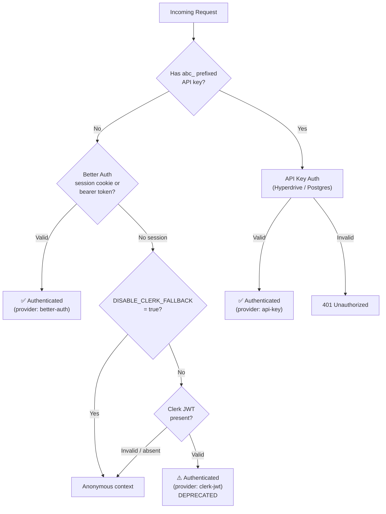

# Clerk → Better Auth Migration Guide

> **Status:** In Progress (Phase 3 — Better Auth primary, Clerk fallback)
>
> **Last updated:** <!-- keep in sync with changes --> 2025-01-01

---

## Table of Contents

- [Overview](#overview)
- [Auth Priority Chain](#auth-priority-chain)
- [Environment Variables](#environment-variables)
- [Migration Phases](#migration-phases)
- [API Key Compatibility](#api-key-compatibility)
- [Webhook Deprecation](#webhook-deprecation)
- [Rollback Procedure](#rollback-procedure)
- [Post-Migration Cleanup](#post-migration-cleanup)

---

## Overview

The application is migrating its identity provider from **Clerk** (JWT-based)
to **Better Auth** (cookie / bearer-plugin sessions backed by Postgres).  The
migration is designed to be **zero-downtime** with a phased rollout:

1. Both providers coexist during the migration window.
2. Better Auth is promoted to the **primary** provider.
3. Clerk is retained as a **deprecated fallback** that can be disabled via
   environment variables.
4. Once all users and integrations have migrated, Clerk code is removed.

The auth hierarchy is implemented in `authenticateRequestUnified()` — see
[`worker/middleware/auth.ts`](../../worker/middleware/auth.ts).

---

## Environment Variables

All migration-related env vars are optional strings.  Set them to `"true"` to
enable the described behaviour.

| Variable | Default | Purpose |
|---|---|---|
| `DISABLE_CLERK_FALLBACK` | _unset_ | Skip the Clerk JWT fallback in the auth chain. When `"true"`, requests without a valid Better Auth session fall through to anonymous. |
| `DISABLE_CLERK_WEBHOOKS` | _unset_ | Return **410 Gone** from `POST /api/webhooks/clerk` without processing the payload. Use once all user sync is handled by Better Auth. |
| `CLERK_JWKS_URL` | _unset_ | Required for Clerk JWT verification. Remove this secret entirely in the final cleanup phase to fully decommission Clerk auth. |
| `CLERK_WEBHOOK_SECRET` | _unset_ | Svix HMAC secret for Clerk webhook signature verification. Remove in the final cleanup phase. |

These are defined in the `Env` interface at
[`worker/types.ts`](../../worker/types.ts).

---

## Migration Phases

### Phase 1 — Better Auth Integration (Complete ✅)

- Better Auth provider implemented (`worker/middleware/better-auth-provider.ts`).
- `authenticateRequestUnified()` updated to accept a `fallbackProvider`.
- Clerk remains primary; Better Auth is tested alongside.

### Phase 2 — Auth Priority Inversion (Complete ✅)

- Better Auth promoted to **primary** provider.
- Clerk demoted to **fallback** (tried only when Better Auth finds no session).
- `DISABLE_CLERK_FALLBACK` env var added.
- Frontend updated to create Better Auth sessions on login.

### Phase 3 — Better Auth Primary + Clerk Conditional (Current 🔄)

- API key management routes accept both Better Auth and Clerk sessions
  (`INTERACTIVE_AUTH_METHODS` in `hono-app.ts`).
- Clerk webhook handler (`POST /api/webhooks/clerk`) made conditional via
  `DISABLE_CLERK_WEBHOOKS`.
- Clerk auth provider and webhook handler marked `@deprecated`.
- Migration documentation created (this file).

### Phase 4 — Clerk Disabled (Planned)

- Set `DISABLE_CLERK_FALLBACK=true` in production.
- Set `DISABLE_CLERK_WEBHOOKS=true` in production.
- Monitor for any auth failures attributed to `clerk-jwt` provider.
- Verify zero traffic on Clerk webhook endpoint.

### Phase 5 — Clerk Removal (Planned)

- Remove `ClerkAuthProvider` class and `clerk-auth-provider.ts`.
- Remove `handleClerkWebhook` and `clerk-webhook.ts`.
- Remove Clerk-related Zod schemas (`ClerkWebhookEventBaseSchema`, etc.).
- Remove Clerk env vars from `Env` interface and Wrangler config.
- Remove `clerk-jwt` from `INTERACTIVE_AUTH_METHODS`.
- Remove Svix dependency if no other consumers.
- Update this document to mark migration as complete.

---

## API Key Compatibility

API key CRUD endpoints (`/api/keys`) are **provider-agnostic**.  They accept
any interactive session (Better Auth or Clerk) and store the resolved
`authContext.userId` in the `api_keys.user_id` column.

| Auth provider | `user_id` format | Example |
|---|---|---|
| Better Auth | UUID (from `users.id`) | `550e8400-e29b-41d4-a716-446655440000` |
| Clerk | Clerk user ID string | `user_2xAbCdEfGhIjKl` |

During the migration window both formats coexist in the same table.  The
`user_id` column is treated as an **opaque string** — no foreign key
constraint ties it to a specific provider's user table.

Once Clerk is fully retired only Better Auth UUIDs will be present.  A
one-time data migration script may be provided to normalise legacy Clerk IDs
if needed.

See [`worker/handlers/api-keys.ts`](../../worker/handlers/api-keys.ts) for
handler implementation details.

---

## Webhook Deprecation

The Clerk webhook endpoint (`POST /api/webhooks/clerk`) syncs user records
from Clerk to D1 via Svix-signed payloads.  During the migration:

1. **While active** — The handler continues to process `user.created`,
   `user.updated`, and `user.deleted` events.
2. **Disable** — Set `DISABLE_CLERK_WEBHOOKS=true`.  The route returns
   `410 Gone` with a JSON body explaining the deprecation.
3. **Remove** — Delete the handler, route registration, Zod schemas, and
   Svix dependency.

See [`worker/handlers/clerk-webhook.ts`](../../worker/handlers/clerk-webhook.ts).

---

## Rollback Procedure

If issues arise after promoting Better Auth:

1. **Unset** `DISABLE_CLERK_FALLBACK` — re-enables Clerk as a fallback.
2. **Unset** `DISABLE_CLERK_WEBHOOKS` — re-enables webhook user sync.
3. Verify Clerk JWKS URL and webhook secret are still configured.
4. No code revert is necessary — the dual-provider architecture handles both
   providers at runtime.

---

## Post-Migration Cleanup

After Phase 5 is complete:

- [ ] Remove all `@deprecated` annotations referencing Clerk.
- [ ] Remove `clerk-jwt` from `INTERACTIVE_AUTH_METHODS`.
- [ ] Remove Clerk env vars from `worker/types.ts` and `wrangler.toml`.
- [ ] Delete `worker/middleware/clerk-auth-provider.ts`.
- [ ] Delete `worker/handlers/clerk-webhook.ts`.
- [ ] Remove Clerk-related Zod schemas from `worker/schemas.ts`.
- [ ] Remove `svix` dependency (if unused elsewhere).
- [ ] Archive this migration document or mark as complete.
- [ ] Update `docs/auth/README.md` to reflect Better Auth as sole provider.
