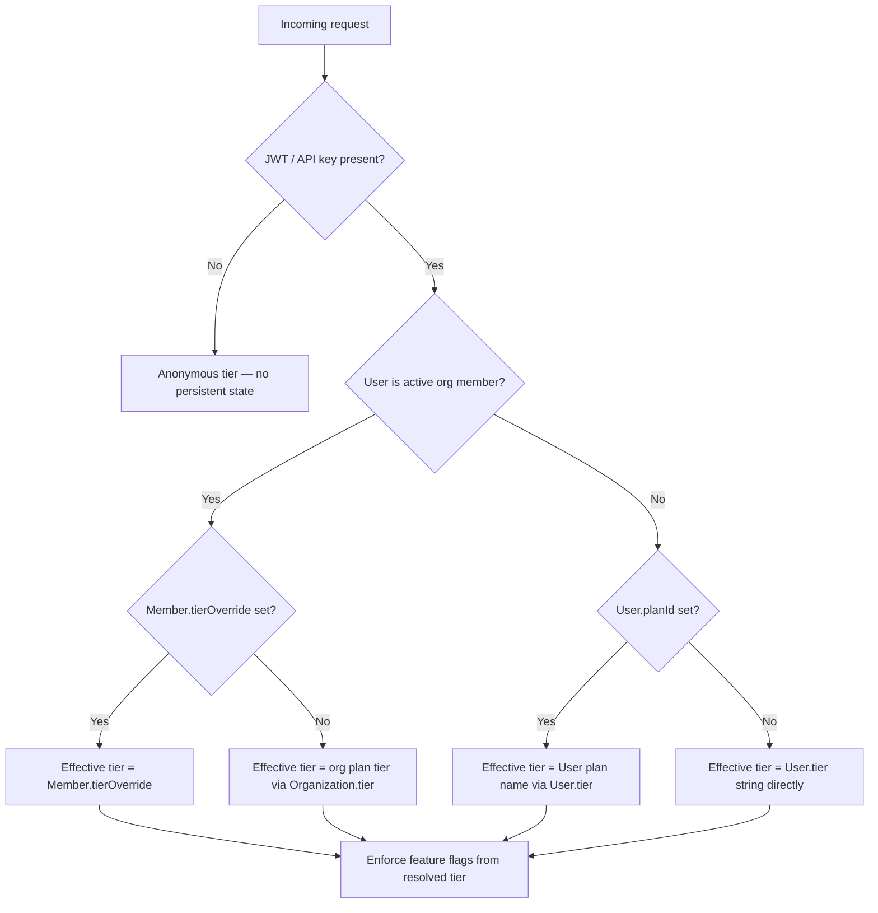

# Multi-Tenancy & Organizations

This document covers how Better Auth's organization plugin integrates with the multi-tenant schema, how subscription-tier feature flags are enforced in the auth/middleware chain, and how data retention consent is checked.

For the overall multi-tenancy architecture, see [`docs/architecture/MULTI_TENANCY.md`](../architecture/MULTI_TENANCY.md).

---

## Better Auth Organization Plugin and the `Organization` Model

Better Auth's organization plugin maps directly to the `Organization` Prisma model. The plugin manages:

- `Organization` — org metadata (name, slug, logo, metadata)
- `Member` — org membership with roles (`owner | admin | member`)
- Invitation flow (handled by Better Auth session/verification tables)

The following fields have been **added** to the `Organization` model beyond what Better Auth scaffolds by default:

| Field | Purpose |
|---|---|
| `tier` | Denormalized plan tier for fast reads (`free \| pro \| vendor \| enterprise`) |
| `planId` | FK to `SubscriptionPlan` — the authoritative source of tier capabilities |
| `retentionDays` | Cached from `SubscriptionPlan.retentionDays` — enforced without a JOIN |
| `retentionPolicyAcceptedAt` | Timestamp of org's latest data retention policy acceptance |

---

## Tier Resolution Algorithm

The effective tier for a request is resolved in the following order:



**Implementation note:** The resolved effective tier should be attached to the request context object (e.g. `ctx.effectiveTier`) early in the middleware chain so downstream handlers can read it without repeating the resolution logic.

---

## Member.tierOverride Resolution

`Member.tierOverride` allows an org admin to limit a specific member to a lower tier than the org plan. For example:

- Org is on `vendor` plan
- A contractor member is restricted to `pro` features
- `Member.tierOverride = 'pro'` is set for that contractor

In the auth middleware, after resolving the org membership, check `member.tierOverride`:

```typescript
function resolveEffectiveTier(user: User, membership: Member | null, org: Organization | null): string {
    if (!user) return 'anonymous';
    if (membership && org) {
        return membership.tierOverride ?? org.tier;
    }
    return user.tier;
}
```

---

## Subscription Plan Feature Flag Enforcement

Feature flags from `SubscriptionPlan` should be enforced in the Hono middleware chain **after** the auth tier is resolved and **before** business logic executes.

### Where to Check Each Flag

| Feature Flag | Enforcement Point |
|---|---|
| `astStorageEnabled` | `POST /ast/parse`, `GET /ast/*` route guards |
| `translationEnabled` | `POST /compile` when `translate: true` is in the config |
| `globalSharingEnabled` | `PATCH /configurations/:id` when setting `visibility = 'public'` |
| `batchApiEnabled` | `POST /compile/batch`, `POST /queue/*` route guards |
| `maxFilterSources` | `POST /filter-sources` — count check before insert |
| `maxCompiledOutputs` | `POST /compile` — count check before insert |
| `maxApiKeysPerUser` | `POST /api-keys` — count check before insert |

### Example Middleware

```typescript
// worker/middleware/featureFlags.ts
import { MiddlewareHandler } from 'hono';
import type { SubscriptionPlan } from '../../prisma/generated/client.ts';

export function requireFeature(flag: keyof SubscriptionPlan): MiddlewareHandler {
    return async (c, next) => {
        const plan = c.get('subscriptionPlan') as SubscriptionPlan | null;
        if (!plan?.[flag]) {
            return c.json({ error: `Feature '${flag}' is not available on your current plan.` }, 403);
        }
        await next();
    };
}
```

---

## isOrgOnly Plan Enforcement

The `vendor` and `enterprise` plans have `isOrgOnly = true`. This means they cannot be assigned to individual users — only to organisations.

Enforce this in the plan-assignment handler:

```typescript
if (plan.isOrgOnly && !organizationId) {
    return c.json({ error: 'This plan is only available to organisations.' }, 400);
}
```

---

## DataRetentionConsent at Signup and Org Creation

### User Signup

After a new user is created (Better Auth `onUserCreate` hook or post-signup middleware):

1. Determine the user's plan `retentionDays` (default: 90 for free)
2. Present the data retention policy with `dataCategories` relevant to their tier
3. On acceptance, insert a `DataRetentionConsent` row:

```sql
INSERT INTO data_retention_consents
    (user_id, policy_version, retention_days, data_categories, accepted_at, ip_address, user_agent)
VALUES
    ($userId, '2026-04', 90, ARRAY['compilation_events'], now(), $ip, $ua);
```

### Organisation Creation

After an org is created:

1. Resolve the org's plan `retentionDays` (default: 90 for free)
2. Present the data retention policy to the org owner
3. On acceptance, insert a `DataRetentionConsent` row with `organization_id` set and `user_id = NULL`
4. Update `Organization.retentionPolicyAcceptedAt = now()`

### Policy Version Bumps

When the data retention policy changes materially:

1. Bump the `policyVersion` string (e.g. `'2026-04'` → `'2026-07'`)
2. On next login, check whether the user/org has a `DataRetentionConsent` row with the current `policyVersion`
3. If not, gate access behind the re-acceptance flow
4. Insert a new consent row after acceptance — **do not update the old row**

---

## Rate Limiting

Rate limiting uses two independent limits:

1. **Per-key** (`ApiKey.rateLimitPerMinute`): Checked in the `checkRateLimitTiered` middleware on every keyed request
2. **Per-plan** (`SubscriptionPlan.rateLimitPerMinute` / `rateLimitPerDay`): The ceiling for the user/org's plan

The per-key limit takes precedence (a key can be configured lower than the plan limit). The plan limit acts as a global cap that cannot be exceeded even with multiple keys.

Org-tier plans (`vendor`, `enterprise`) have higher limits than solo plans and are enforced against the org's aggregate usage, not per-user within the org.
