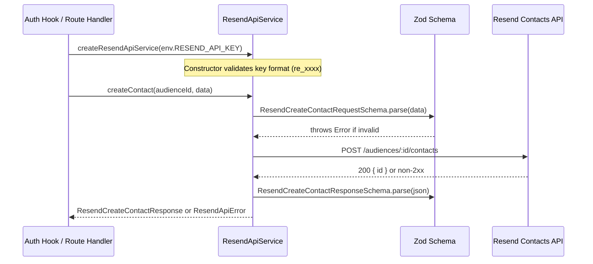

# ResendApiService — Contacts, Audiences & Templates

`ResendApiService` (`worker/services/resend-api-service.ts`) is the Worker's typed REST wrapper for the [Resend](https://resend.com) **Contacts/Audiences** and **Templates** APIs. It handles contact synchronisation and template lifecycle management only.

> **Email sending is a separate concern** — handled by `worker/services/email-service.ts`.  
> **Changes introduced in:** PRs #1714, #1717, #1718, #1719  
> **See also:** [ZTA Developer Guide](../security/ZTA_DEVELOPER_GUIDE.md)

---

## Overview

`ResendApiService` uses `fetch()` directly (no additional npm dependency) and validates every request and response with Zod. It is instantiated via `createResendApiService(apiKey)` wherever contact or template management is needed in the Worker.

### Scope

| Concern | Handled by |
|---------|-----------|
| Contact/audience synchronisation | **`ResendApiService`** (this doc) |
| Template CRUD (create/update/get/list/delete) | **`ResendApiService`** (this doc) |
| Transactional email sending | `email-service.ts` → `EmailService` |

### Design principles

- **Constructor-time key validation**: the API key is validated against `/^re_[A-Za-z0-9_]{8,}$/` in the constructor, failing fast before any network call is attempted.
- **`fetch()`-based, no SDK dependency**: the service calls the Resend REST API directly, keeping the Worker bundle lean.
- **Zod at every trust boundary**: request bodies are validated before sending; response bodies are validated before returning.
- **Stable `ResendApiError`**: non-2xx responses throw `ResendApiError(status, name, message)` — callers can branch on the HTTP status code without parsing error strings.

---

## Architecture — Contact Sync Flow



---

## Constructor — API Key Validation

The service validates the API key format at construction time (fail-fast pattern). This avoids silently sending requests with a misconfigured key.

```typescript
// worker/services/resend-api-service.ts (simplified)
export class ResendApiService {
    private static readonly API_KEY_PATTERN = /^re_[A-Za-z0-9_]{8,}$/;

    constructor(private readonly apiKey: string) {
        if (!ResendApiService.API_KEY_PATTERN.test(apiKey)) {
            throw new Error(
                '[ResendApiService] RESEND_API_KEY does not match the expected format (re_xxxxx). ' +
                'Verify the secret is set correctly.',
            );
        }
    }
    // ...
}

/** Factory — create an instance from the Worker env. */
export function createResendApiService(apiKey: string): ResendApiService {
    return new ResendApiService(apiKey);
}
```

The pattern `/^re_[A-Za-z0-9_]{8,}$/` catches obvious misconfiguration (e.g. swapped env var, empty string) without revealing the key value in any error message.

---

## Input Validation — Zod Schemas

All requests are validated with Zod before any network call. The key schemas are:

```typescript
// worker/services/resend-api-service.ts
export const ResendCreateContactRequestSchema = z.object({
    email:        z.string().email(),
    firstName:    z.string().optional(),
    lastName:     z.string().optional(),
    unsubscribed: z.boolean().optional(),
});

export const ResendCreateTemplateRequestSchema = z.object({
    name:     z.string().min(1).max(255),
    alias:    z.string().max(255).regex(/^[a-z0-9-]+$/).optional(),
    subject:  z.string().max(998).optional(),
    html:     z.string().min(1),
    text:     z.string().optional(),
    from:     z.string().optional(),
    replyTo:  z.string().optional(),
});
```

Validation failures throw an `Error` before the `fetch()` call. Response bodies are also validated before being returned, providing a double trust-boundary check.

---

## Templates API

`ResendApiService` exposes full CRUD for Resend templates:

| Method | Description |
|--------|-------------|
| `createTemplate(data)` | Create a new template |
| `updateTemplate(id, data)` | Partial update of an existing template |
| `getTemplate(id)` | Get a template by ID |
| `listTemplates()` | List all templates in the account |
| `deleteTemplate(id)` | Delete a template by ID |

Templates are referenced by the stable `alias` field wherever possible (never by opaque ID), so templates can be recreated without updating callers.

---

## Contacts and Audiences API

`ResendApiService` wraps the Resend Contacts API to synchronise users with the Resend audience. The service exposes these methods:

| Method | Description |
|--------|-------------|
| `createContact(audienceId, data)` | Create or upsert a contact in the audience |
| `deleteContact(audienceId, contactIdOrEmail)` | Delete a contact by ID or email |
| `getContact(audienceId, contactIdOrEmail)` | Get a contact by ID or email |
| `listContacts(audienceId)` | List all contacts in the audience |

Contact synchronisation typically happens at lifecycle events:

- **On user registration** — `createContact()` called (with `upsert: true` semantics) from the Better Auth `onUserCreated` hook.
- **On user deletion** — `deleteContact()` called from the account deletion flow.

### Contact creation usage

```typescript
// worker/hooks/auth-hooks.ts
onUserCreated: async (user) => {
    const resendService = createResendApiService(env.RESEND_API_KEY);
    await resendService.createContact(env.RESEND_AUDIENCE_ID, {
        email:        user.email,
        firstName:    user.name?.split(' ')[0],
        lastName:     user.name?.split(' ').slice(1).join(' '),
        unsubscribed: false,
    });
},
```

---

## Error Handling

Non-2xx responses from the Resend API throw `ResendApiError(status, name, message)`. Callers can catch and branch on the HTTP status code:

| Resend API status | `ResendApiError.status` | Typical `name` |
|-------------------|-------------------------|----------------|
| `400` | `400` | `validation_error` |
| `401` | `401` | `missing_api_key` |
| `403` | `403` | `restricted_api_key` |
| `404` | `404` | `not_found` |
| `429` | `429` | `rate_limit_exceeded` |
| `500` | `500` | `internal_server_error` |

Request or response validation failures throw a standard `Error` / `ZodError` before any network call is made.

---

## Configuration

| Environment variable | Binding type | Required | Description |
|----------------------|--------------|----------|-------------|
| `RESEND_API_KEY` | Worker Secret | Yes | Resend API key (format: `re_xxxxx`). Must be set via `wrangler secret put`. |
| `RESEND_AUDIENCE_ID` | `[vars]` | No | Resend audience ID for contact synchronisation. If absent, contact sync is disabled. |

```bash
wrangler secret put RESEND_API_KEY
```

---

## Related Documentation

- [Email Architecture](./email-architecture.md) — sequence diagrams, retry policy, bounce handling
- [ZTA Developer Guide](../security/ZTA_DEVELOPER_GUIDE.md) — API key guard pattern, `blq_` vs `blq_admin_` scopes
- [Error Passing Architecture](../architecture/error-passing.md) — `ServiceError`, `ValidationError`, error mapping conventions
