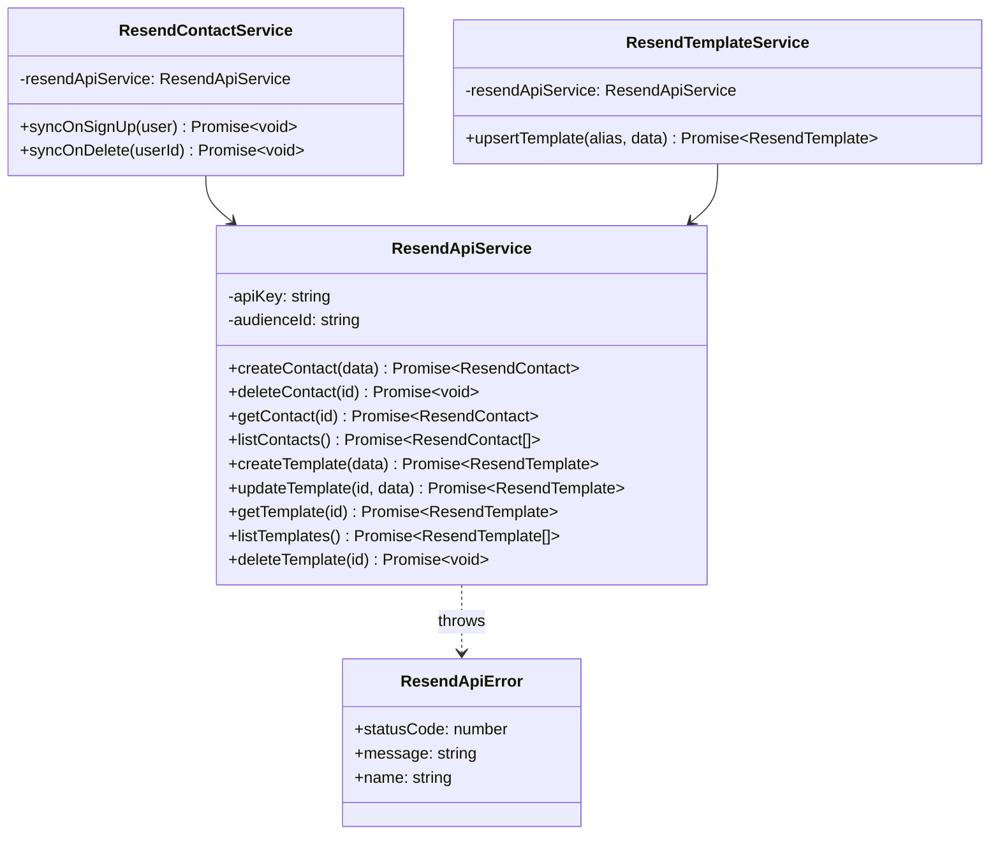

# Resend API Service

This document covers the `ResendApiService` architecture, the Bloqr-branded email templates, the Zod validation layer, and how the ZTA API-key guard is enforced on Resend-related Worker routes.

> **Changes introduced in:** PRs #1714, #1717, #1718, #1719  
> **See also:** [Email Architecture](./email-architecture.md) for the full hybrid provider strategy.  
> **See also:** [Resend Contact Sync](./resend-contact-sync.md) for the user lifecycle → audience sync flow.

---

## Overview

`ResendApiService` (`worker/services/resend-api-service.ts`) is the single integration point for all calls to the Resend REST API. It wraps the HTTP calls with:

- Typed request/response contracts via Zod schemas.
- Consistent error handling via `ResendApiError`.
- ZTA API-key authentication on every outbound request.

No Worker code should call `fetch('https://api.resend.com/...')` directly — all calls must go through this service.

---

## `ResendApiService` Architecture



---

## Contacts / Audiences API

### `createContact(data)`

Adds a contact to the Bloqr Resend audience. Called by `ResendContactService.syncOnSignUp()`.

```typescript
const contact = await resendApiService.createContact({
    email:     user.email,
    firstName: user.name?.split(' ')[0],
    lastName:  user.name?.split(' ').slice(1).join(' '),
    unsubscribed: false,
});
```

**Zod schema (outbound):**

```typescript
const CreateContactSchema = z.object({
    email:        z.string().email(),
    firstName:    z.string().max(255).optional(),
    lastName:     z.string().max(255).optional(),
    unsubscribed: z.boolean().default(false),
});
```

### `deleteContact(id)`

Removes a contact by Resend contact ID. Called by `ResendContactService.syncOnDelete()`.

### `getContact(id)` / `listContacts()`

Read-only audience operations used by admin tooling and runbooks.

---

## Templates API

`ResendApiService` also wraps the Resend Templates API, used by `ResendTemplateService` to manage the four Bloqr-branded transactional email templates.

### The Four Bloqr Email Templates

| Template alias | Use case | Sent when |
|----------------|----------|-----------|
| `bloqr-email-verification` | Verify a new email address | Sign-up, email change |
| `bloqr-password-reset` | Password reset link | "Forgot password" flow |
| `bloqr-welcome` | Welcome message for new users | First sign-in after verification |
| `bloqr-compilation-complete` | Notify user of completed batch | Long-running compilation finishes |

All templates use the Bloqr dark-mode colour palette (`#070B14` background, `#FF5500` accent, `#00D4FF` secondary).

### Template Upsert via Alias

`ResendTemplateService.upsertTemplate(alias, data)` ensures idempotency — it checks whether a template with the given alias already exists and either creates or updates it:

```typescript
const existing = (await resendApiService.listTemplates())
    .find(t => t.alias === alias);

if (existing) {
    return resendApiService.updateTemplate(existing.id, data);
} else {
    return resendApiService.createTemplate({ ...data, alias });
}
```

### Managing Templates via MCP

Templates can be created and updated from the MCP tool surface in the same way as any other Resend resource:

```
User: Update the welcome email subject to "Welcome to Bloqr 🎉"
→ resend-update-template(id: "bloqr-welcome", subject: "Welcome to Bloqr 🎉")
```

The `ResendTemplateService` provides a Deno-callable script (`deno task resend:templates:sync`) that syncs all four template definitions from source to the Resend dashboard in a single idempotent run.

---

## Zod Validation

Every outbound request and every inbound response is validated with Zod. If a response from Resend fails validation, a `ResendApiError` is thrown with the Zod error message. This prevents type-unsafe data from propagating into the rest of the Worker.

**Response schema example:**

```typescript
const ResendContactSchema = z.object({
    id:           z.string(),
    email:        z.string().email(),
    first_name:   z.string().optional(),
    last_name:    z.string().optional(),
    created_at:   z.string(),
    unsubscribed: z.boolean(),
});
```

---

## ZTA API-Key Guard Pattern

All `POST /api/resend/*` Worker routes are protected by the admin API-key guard:

```typescript
// worker/routes/resend.routes.ts (example)
app.post('/api/resend/contacts', adminAuthMiddleware(), async (c) => {
    const authContext = c.get('authContext') as AuthContext;
    if (!isAdminOrApiKey(authContext)) {
        return c.json(forbidden(), 403);
    }
    // ...
});
```

This ensures Resend management operations (adding/removing audience contacts, syncing templates) cannot be performed by regular user sessions — only admin sessions or `blq_admin_*` API keys.

---

## Worker Routes

| Method | Path | Auth | Description |
|--------|------|------|-------------|
| `POST` | `/api/resend/contacts` | Admin API key | Add contact to Resend audience |
| `DELETE` | `/api/resend/contacts/:id` | Admin API key | Remove contact from audience |
| `POST` | `/api/resend/templates/sync` | Admin API key | Upsert all four Bloqr templates |

These routes are used by administrative tooling and the Better Auth `databaseHooks` integration. They are not called by the Angular frontend.

---

## Error Handling

`ResendApiService` throws `ResendApiError` on any non-2xx response from the Resend API:

```typescript
class ResendApiError extends Error {
    constructor(
        public statusCode: number,
        message: string,
    ) {
        super(message);
        this.name = 'ResendApiError';
    }
}
```

All callers (`ResendContactService`, `ResendTemplateService`) catch `ResendApiError` and handle it as a non-fatal error — Resend sync failures are logged but never propagate to the user.

---

## Related Documentation

- [Email Architecture](./email-architecture.md) — hybrid provider strategy (Resend + CF Email Service)
- [Resend Contact Sync](./resend-contact-sync.md) — user lifecycle → audience sync flow with sequence diagrams
- [ZTA Review Fixes](./zta-review-fixes.md) — API-key guard and auth telemetry hardening
