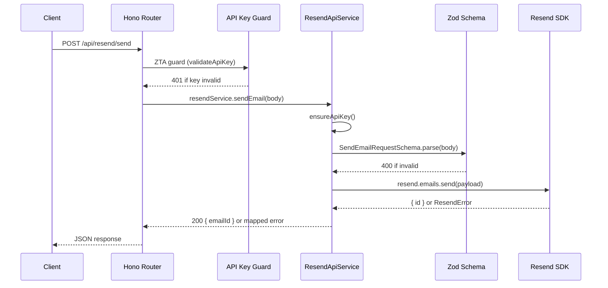

# ResendApiService — Email and Contacts

The `ResendApiService` is the Worker's single integration point with the [Resend](https://resend.com) email and contacts platform. It manages transactional email delivery, contacts / audience synchronisation, and template lifecycle from one cohesive service class.

> **Changes introduced in:** PRs #1714, #1717, #1718, #1719  
> **See also:** [Email Architecture](./email-architecture.md) — full system design  
> **See also:** [ZTA Developer Guide](../security/ZTA_DEVELOPER_GUIDE.md) — API key guard pattern used to protect all routes

---

## Overview

`ResendApiService` lives in `worker/services/resend-api-service.ts` and is instantiated once per Worker request lifetime (scoped to the Hono context). All Resend operations — email sending, contact synchronisation, template upsert, and MCP pass-through — route through this class.

### Design principles

- **API-key-first auth**: every operation requires a valid Resend API key. The key is sourced from `env.RESEND_API_KEY` and checked lazily on first use via a private `ensureApiKey()` guard.
- **Schema validation at the boundary**: all inbound request bodies are parsed with Zod before any Resend SDK call is made. Validation errors produce a `400` with field-level details; Resend SDK errors are mapped to their HTTP status codes.
- **Template aliases, not IDs**: template references use stable string aliases (e.g., `welcome`, `email-verification`) rather than opaque UUIDs. This makes the code readable and ensures templates survive recreation.
- **Upsert semantics**: `ensureTemplate()` creates or updates a template in one idempotent call, safe to run in migrations or tests.

---

## Architecture — Request Flow

The following sequence diagram shows how an email send request travels from the HTTP boundary through the service to Resend and back.



---

## `ensureApiKey()` — Private Initialization Guard

Before any Resend SDK call, `ensureApiKey()` is called to lazily initialize the Resend client. This avoids throwing at construction time if `RESEND_API_KEY` is missing from the environment (which would crash the Worker before it could return a helpful error).

```typescript
// worker/services/resend-api-service.ts (simplified)
private ensureApiKey(): void {
  if (!this.client) {
    const apiKey = this.env.RESEND_API_KEY;
    if (!apiKey) {
      throw new ServiceError(
        'RESEND_API_KEY is not configured',
        503,
        'RESEND_NOT_CONFIGURED',
      );
    }
    this.client = new Resend(apiKey);
  }
}
```

`ServiceError` is the project-standard error class — see [Error Passing Architecture](../architecture/error-passing.md). The `503` status code signals to callers (and the API client) that the service is temporarily unavailable rather than the request being malformed.

---

## Input Validation — `SendEmailRequestSchema`

All inbound email send requests are validated against this Zod schema before any SDK call:

```typescript
// worker/schemas/resend.ts
export const SendEmailRequestSchema = z.object({
  to:       z.string().email(),
  subject:  z.string().min(1).max(998),
  template: z.enum(['welcome', 'email-verification', 'password-reset', 'subscription-update']),
  variables: z.record(z.string(), z.string()).optional(),
});

export type SendEmailRequest = z.infer<typeof SendEmailRequestSchema>;
```

Validation runs in the service before the SDK call:

```typescript
const parsed = SendEmailRequestSchema.safeParse(body);
if (!parsed.success) {
  throw new ValidationError(parsed.error.flatten());  // → 400
}
```

`ValidationError` produces a structured `{ errors: ZodFlattenedError }` response body, giving API clients field-level detail on why the request was rejected.

---

## Email Templates

Templates are managed as Resend templates with stable string aliases. The `ensureTemplate()` method creates or updates each template idempotently; this is run as part of the Worker migration step or on first deploy.

| Template alias | Subject | Use case |
|----------------|---------|----------|
| `welcome` | Welcome to Bloqr | Sent on first successful account creation |
| `email-verification` | Verify your email address | Sent when a user registers or changes their email |
| `password-reset` | Reset your Bloqr password | Sent on forgot-password flow |
| `subscription-update` | Your subscription has changed | Sent on plan upgrade, downgrade, or cancellation |

### Template upsert via alias

```typescript
// worker/services/resend-api-service.ts
async ensureTemplate(alias: string, html: string, subject: string): Promise<void> {
  this.ensureApiKey();

  const existing = await this.client!.templates.get(alias).catch(() => null);

  if (existing) {
    await this.client!.templates.update(existing.id, { html, subject });
  } else {
    await this.client!.templates.create({ name: alias, alias, html, subject });
  }
}
```

Templates are referenced by alias throughout the codebase (never by ID), so a template can be recreated without updating callers.

---

## Contacts and Audiences API

`ResendApiService` wraps the Resend Contacts API to synchronise users with the Resend audience. Contact synchronisation happens:

- **On user registration** — `syncContact()` is called from the Better Auth `onUserCreated` hook.
- **On user deletion** — `removeContact()` is called from the account deletion flow.
- **On email change** — `updateContact()` is called from the email-change flow after verification.

### `syncContact()` usage

```typescript
// worker/hooks/auth-hooks.ts
onUserCreated: async (user) => {
  await resendService.syncContact({
    email:     user.email,
    firstName: user.name?.split(' ')[0],
    lastName:  user.name?.split(' ').slice(1).join(' '),
    unsubscribed: false,
  });
},
```

`syncContact()` uses Resend's `contacts.create()` with `upsert: true` so repeated calls (e.g., from retried webhook deliveries) are idempotent.

---

## Worker Routes

The following routes are exposed by the Worker and handled by `ResendApiService`. All routes require a valid `blq_` API key in the `X-API-Key` header unless otherwise noted.

| Method | Route | Description | Auth |
|--------|-------|-------------|------|
| `POST` | `/api/resend/send` | Send a transactional email via a named template | `blq_` key |
| `POST` | `/api/resend/contacts` | Create or upsert a contact in the Resend audience | `blq_` key |
| `GET` | `/api/resend/contacts/:email` | Look up a contact by email address | `blq_` key |
| `DELETE` | `/api/resend/contacts/:email` | Remove a contact from the audience | `blq_` key |
| `POST` | `/api/resend/mcp` | Pass-through to the Resend MCP endpoint for template management | `blq_admin_` key |

### Route handler example

```typescript
// worker/routes/resend.ts
resendRouter.post('/send', apiKeyGuard(), async (c) => {
  const body = await c.req.json();
  const result = await c.var.resendService.sendEmail(body);
  return c.json({ emailId: result.id }, 200);
});
```

The `apiKeyGuard()` middleware is the ZTA guard — see [ZTA Developer Guide](../security/ZTA_DEVELOPER_GUIDE.md) for the full implementation.

---

## MCP Integration

`ResendApiService` exposes a pass-through handler at `POST /api/resend/mcp` that forwards requests to the [Resend MCP server](https://resend.com/docs/mcp). This allows admin tooling and AI assistants to manage Resend resources (templates, contacts, API keys) through the Worker's ZTA-protected API surface rather than directly against the Resend API.

The MCP route requires an admin key (`blq_admin_` prefix) rather than a user key, limiting its use to operations tooling.

---

## Error Handling

Errors from the Resend SDK are mapped to HTTP status codes before being returned to the caller:

| Resend error type | HTTP status | Response body |
|-------------------|-------------|---------------|
| `validation_error` | `400` | `{ error: "RESEND_VALIDATION", detail: ... }` |
| `missing_required_field` | `400` | `{ error: "RESEND_MISSING_FIELD", detail: ... }` |
| `not_found` | `404` | `{ error: "RESEND_NOT_FOUND" }` |
| `rate_limit_exceeded` | `429` | `{ error: "RESEND_RATE_LIMITED" }` |
| `internal_server_error` | `502` | `{ error: "RESEND_UPSTREAM_ERROR" }` |
| SDK unreachable / timeout | `503` | `{ error: "RESEND_UNAVAILABLE" }` |

All error responses include a stable machine-readable `error` field so API clients can branch on error type without parsing the human-readable `detail`.

---

## Configuration

| Environment variable | Binding type | Required | Description |
|----------------------|--------------|----------|-------------|
| `RESEND_API_KEY` | `[vars]` / secret | Yes | Resend API key. Use a restricted key scoped to `Send emails` only for production. |
| `RESEND_FROM_ADDRESS` | `[vars]` | Yes | Default from-address used for all outbound emails, e.g. `Bloqr <noreply@mail.bloqr.dev>`. |
| `RESEND_AUDIENCE_ID` | `[vars]` | No | Resend audience ID for the contacts list. If absent, contact sync is disabled. |

Set these in `wrangler.toml` (non-secret vars) or via `wrangler secret put` / GitHub Actions secrets (secret var):

```bash
wrangler secret put RESEND_API_KEY
wrangler secret put RESEND_FROM_ADDRESS
```

---

## Related Documentation

- [Email Architecture](./email-architecture.md) — sequence diagrams, retry policy, bounce handling
- [ZTA Developer Guide](../security/ZTA_DEVELOPER_GUIDE.md) — API key guard pattern, `blq_` vs `blq_admin_` scopes
- [Error Passing Architecture](../architecture/error-passing.md) — `ServiceError`, `ValidationError`, error mapping conventions
