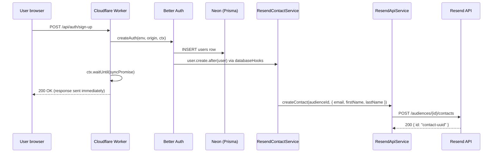
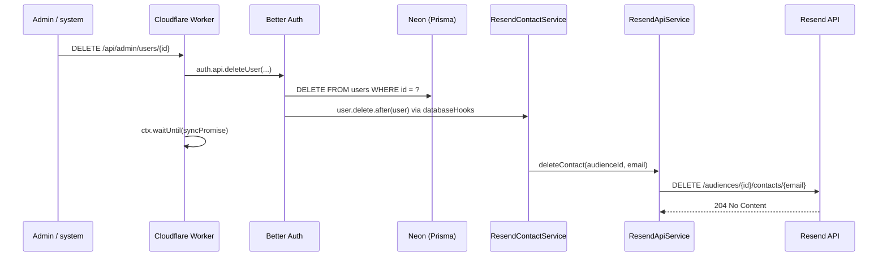

# Resend Audience Contact Sync

> **User lifecycle → Resend audience** — how Bloqr keeps the Resend "Bloqr Users" audience in sync with the D1/Neon user database.

---

## Overview

When a user signs up or is deleted, Better Auth `databaseHooks` trigger `ResendContactService` to add or remove a contact from the configured Resend audience. This happens **fire-and-forget** via `ctx.waitUntil()` — the user-facing response is never delayed by audience sync.

---

## Architecture

```
User sign-up → Better Auth user.create.after hook
                → ResendContactService.syncUserCreated()
                  → ResendApiService.createContact(audienceId, { email, firstName, lastName })
                    → POST https://api.resend.com/audiences/{id}/contacts

User deletion → Better Auth user.delete.after hook
                → ResendContactService.syncUserDeleted()
                  → ResendApiService.deleteContact(audienceId, email)
                    → DELETE https://api.resend.com/audiences/{id}/contacts/{email}
```

---

## Services

### `ResendApiService` (`worker/services/resend-api-service.ts`)

Typed REST wrapper for the Resend Contacts/Audiences API. This is the **only** place in the codebase that calls `https://api.resend.com/audiences/*` — all other code uses this service.

- Zod-validates all request payloads before sending
- Validates all API responses against typed Zod schemas
- Throws `ResendApiError` (typed, carries `statusCode` + `errorName`) on non-2xx responses
- Uses `fetch()` directly — no Resend SDK dependency

### `ResendContactService` (`worker/services/resend-contact-service.ts`)

Business logic layer for user lifecycle sync.

- `syncUserCreated(user)` — calls `ResendApiService.createContact()`
- `syncUserDeleted(user)` — calls `ResendApiService.deleteContact()`
- All errors are **caught and logged as warnings** — never rethrown
- Name splitting: `"Alice Smith"` → `firstName: "Alice"`, `lastName: "Smith"`

### `NullResendContactService`

No-op implementation returned by `createResendContactService()` when either `RESEND_API_KEY` or `RESEND_AUDIENCE_ID` is absent. Implements `IResendContactService` so call sites are unconditional — no `if (contactSvc)` guards needed.

---

## Configuration

### Production secrets

```bash
# Set the Resend API key (shared with email send path)
wrangler secret put RESEND_API_KEY
# Value: re_xxxxxxxxxxxx (from https://resend.com/api-keys)

# Set the audience ID
wrangler secret put RESEND_AUDIENCE_ID
# Value: xxxxxxxx-xxxx-xxxx-xxxx-xxxxxxxxxxxx
# (from https://resend.com/audiences → create "Bloqr Users" → copy UUID)
```

### Local development

Add to `.dev.vars`:

```ini
RESEND_API_KEY=re_test_xxxxxxxxxxxx
RESEND_AUDIENCE_ID=xxxxxxxx-xxxx-xxxx-xxxx-xxxxxxxxxxxx
```

### Resend dashboard setup

1. Go to [resend.com/audiences](https://resend.com/audiences)
2. Create an audience named **"Bloqr Users"**
3. Copy the audience UUID — this becomes `RESEND_AUDIENCE_ID`
4. Ensure `bloqr.dev` is a verified domain in [resend.com/domains](https://resend.com/domains)

---

## Sequence Diagrams

### User sign-up



### User deletion



---

## Error Handling

All sync errors are caught inside `ResendContactService` and logged at `console.warn` level. They never propagate to the auth response:

```
[ResendContactService] syncUserCreated failed: ResendApiError 422 (validation_error): Contact already exists
[ResendContactService] syncUserDeleted failed: ResendApiError 404 (not_found): Contact not found
```

A `ResendApiError 422` on `syncUserCreated` is normal for re-registrations (same email, new account). It is non-fatal.

A `ResendApiError 404` on `syncUserDeleted` means the contact was already removed or never synced. It is non-fatal.

---

## Testing

```bash
# Unit tests (no HTTP calls — uses stub ResendApiService)
deno test worker/services/resend-contact-service.test.ts

# API service tests (patches globalThis.fetch)
deno test worker/services/resend-api-service.test.ts
```

---

## See Also

- [`worker/services/resend-api-service.ts`](../../worker/services/resend-api-service.ts) — API wrapper implementation
- [`worker/services/resend-contact-service.ts`](../../worker/services/resend-contact-service.ts) — contact sync service
- [`worker/lib/auth.ts`](../../worker/lib/auth.ts) — Better Auth `databaseHooks` integration
- [Email Architecture](./email-architecture.md) — full email system reference
- [Resend Contacts API](https://resend.com/docs/api-reference/contacts/create-contact)
