# Billing Overview

Bloqr supports two billing models:

1. **Pay As You Go (PAYG)** — per-call billing via Stripe, no subscription required.
2. **Subscription** — monthly recurring plans (Pro, Vendor, Enterprise) with higher limits and premium features.

---

## Billing Models

### Pay As You Go (PAYG)

PAYG is designed for developers who want to try the API or have low-volume needs without committing to a subscription.

| Property | Value |
|---|---|
| Price per call | Configurable via `PAYG_PRICE_PER_CALL_USD_CENTS` (default: $0.01) |
| Session size | 10 calls per payment |
| Session TTL | 1 hour |
| Rate limit | 120 req/min, 500 req/day |
| Max rules per list | 50,000 |
| Max sources per compile | 5 |
| Retention | 7 days |

PAYG uses the [x402 protocol](https://x402.org) for machine-readable payment negotiation:

- **`X-Payment-Required`** — sent by the server in 402 responses with the payment specification.
- **`X-Payg-Session`** — sent by the client in subsequent requests once a session is purchased.

#### Session Flow

```
Client                          Server
  |                               |
  |-- GET /api/compile ---------->|
  |<-- 402 Payment Required -------|
  |   X-Payment-Required: {...}   |
  |                               |
  |-- POST /stripe/payg/checkout ->|
  |<-- { checkoutUrl } ------------|
  |                               |
  |-- (completes Stripe Checkout) |
  |<-- PaygSession issued (webhook)|
  |                               |
  |-- GET /api/compile ----------->|
  |   X-Payg-Session: <token>     |
  |<-- 200 OK ----------------------|
  |   X-Payg-Session-Remaining: 9  |
```

### Subscription Plans

| Plan | Rate Limit | Daily Limit | Features |
|---|---|---|---|
| Free | 60 req/min | — | Basic compilation |
| Pro | 300 req/min | 10,000/day | AST storage, webhooks, version history |
| Vendor | 600 req/min | 50,000/day | All Pro + translation, CDN distribution |
| Enterprise | Unlimited | Unlimited | All Vendor + dedicated SLA |

Subscription pricing is managed via Stripe and reflected in the `SubscriptionPlan` table in Prisma.

---

## Architecture

```mermaid
flowchart TD
  Worker["Worker (hono-app.ts)"]
  Middleware["Middleware (worker/middleware/)"]
  Types["Types (worker/types.ts)"]
  Database["Database (prisma/schema.prisma)"]

  Worker --> Pricing["/api/payg/pricing → public — returns PAYG_TIER_LIMITS"]
  Worker --> SessionCreate["/api/payg/session/create → 501 stub; session issuance not live until Stripe facilitator is wired"]
  Worker --> SessionStatus["/api/payg/session/status → validates X-Payg-Session header"]
  Worker --> Usage["/api/payg/usage → returns cumulative PAYG spend (requires Better Auth)"]
  Worker --> StripeWebhook["/api/stripe/webhook → handles Stripe events; checkout.session.completed issues PaygSession"]
  Worker --> StripeCheckout["/api/stripe/payg/checkout → creates Stripe Checkout Session (stub)"]

  Middleware --> PaygMiddleware["payg-middleware.ts → paygMiddleware(), paygSessionMiddleware(), paygConversionCheckMiddleware()"]
  Middleware --> HonoMiddleware["hono-middleware.ts → rateLimitMiddleware(), requireAuthMiddleware()"]

  Types --> PaygTierLimits["PAYG_TIER_LIMITS → operational limits for PAYG tier"]
  Types --> SubscriptionTierLimits["SUBSCRIPTION_TIER_LIMITS → operational limits for subscription tiers"]

  Database --> PaygCustomer["PaygCustomer → Stripe customer record"]
  Database --> PaygPaymentEvent["PaygPaymentEvent → append-only payment audit log"]
  Database --> PaygSession["PaygSession → x402-style session tokens"]
```



---

## Environment Variables

| Variable | Type | Description |
|---|---|---|
| `STRIPE_PUBLISHABLE_KEY` | Non-secret | Stripe publishable key (safe for frontend) |
| `STRIPE_SECRET_KEY` | Secret | Stripe secret key for server-side API calls |
| `STRIPE_WEBHOOK_SECRET` | Secret | Stripe webhook signing secret |
| `STRIPE_PAYG_PRICE_ID` | Non-secret | Stripe Price ID for PAYG checkout |
| `PAYG_PRICE_PER_CALL_USD_CENTS` | Non-secret | Price per API call (default: 1) |
| `PAYG_CONVERSION_THRESHOLD_USD_CENTS` | Non-secret | Upsell threshold (default: 2000 = $20) |

See `.dev.vars.example` for local development setup.

---

## Related Documentation

- [PAYG Developer Guide](./payg.md)
- [Stripe Setup Guide](./stripe-setup.md)
