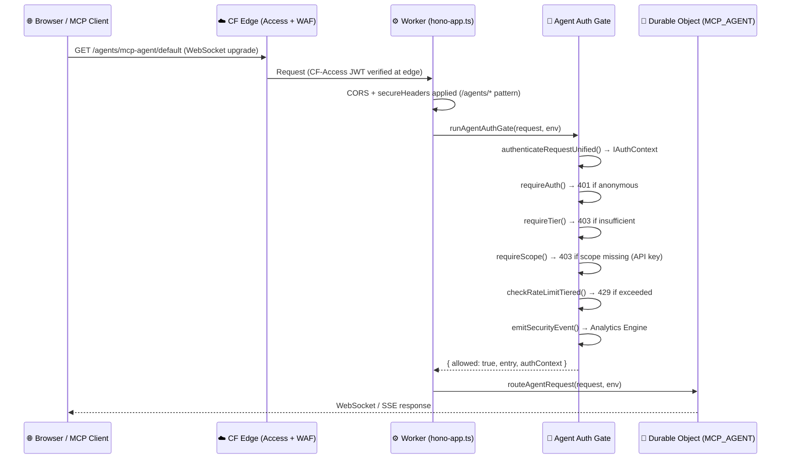

# Cloudflare Agents SDK Integration

This document covers the Cloudflare Agents SDK integration — typed agent registry, Zero Trust Authentication (ZTA) middleware, Durable Object routing, and the D1/Neon schema for agent session tracking.

---

## Overview

The `worker/agents/` module integrates the official [Cloudflare Agents SDK](https://developers.cloudflare.com/agents/) into the Worker's `/agents/*` routing. It replaces a custom Durable Object shim with a typed, extensible registry that drives routing, authentication, and permissions from a single source of truth.



---

## Architecture

### Module layout

```
worker/agents/
├── index.ts          # Barrel export
├── registry.ts       # AGENT_REGISTRY — single source of truth
├── registry.test.ts  # 14 unit tests
├── agent-auth.ts     # ZTA auth middleware + handleAgentRequest
└── agent-auth.test.ts  # 12 unit tests
```

### Request flow

1. `hono-app.ts` registers `cors()` + `secureHeaders()` on `/agents/*` **before** mounting `agentRouter`.
2. `agentRouter` (Hono sub-app) matches `GET /agents/:slug/:instanceId/*` and `POST /agents/:slug/:instanceId/*`.
3. `handleAgentRequest` calls `runAgentAuthGate` — the full ZTA chain (see below).
4. On success, the request is forwarded to the Durable Object via `routeAgentRequest` (lazy-loaded `agents` SDK).

---

## Agent Registry (`worker/agents/registry.ts`)

The registry is the **only** place agent metadata lives. All routing, auth enforcement, and route-permission entries are derived from `AGENT_REGISTRY`.

### `AgentRegistryEntry` shape

```typescript
interface AgentRegistryEntry {
    /** UPPER_SNAKE_CASE Durable Object binding key (matches wrangler.toml [[durable_objects]]) */
    bindingKey: keyof Env;
    /** kebab-case URL slug — maps to /agents/<slug>/<instanceId> */
    slug: string;
    /** Human-readable name for dashboards/logs */
    displayName: string;
    /** One-line description */
    description: string;
    /** Minimum tier required. UserTier.Admin = admin-only (default for all agents) */
    requiredTier: UserTier;
    /** Additional scopes required for API-key callers (session users bypass scope checks) */
    requiredScopes: string[];
    /** Set to false to disable routing without removing from registry */
    enabled: boolean;
    /** Primary transport: 'websocket' (default) or 'sse' */
    transport: 'websocket' | 'sse';
}
```

### Adding a new agent

1. Add a `[[durable_objects]]` binding in `wrangler.toml`:
   ```toml
   [[durable_objects.bindings]]
   name = "MY_NEW_AGENT"
   class_name = "MyNewAgent"
   ```
2. Add the DO class export to `worker/worker.ts`.
3. Add an entry to `AGENT_REGISTRY` in `worker/agents/registry.ts`:
   ```typescript
   {
       bindingKey: 'MY_NEW_AGENT',
       slug: 'my-new-agent',
       displayName: 'My New Agent',
       description: 'Description of what this agent does',
       requiredTier: UserTier.Admin,
       requiredScopes: ['agents'],
       enabled: true,
       transport: 'websocket',
   }
   ```
4. Run `validateAgentRegistry()` (executed automatically in tests) to catch any `bindingKey` ↔ `slug` drift.

### Registry validation

`validateAgentRegistry()` asserts that `agentNameToBindingKey(entry.slug) === String(entry.bindingKey)` for every entry and detects duplicate slugs. Errors are returned as a `string[]` (empty = valid).

```typescript
import { validateAgentRegistry } from './registry.ts';

const errors = validateAgentRegistry();
if (errors.length > 0) throw new Error(errors.join('\n'));
```

---

## Authentication Middleware (`worker/agents/agent-auth.ts`)

### ZTA auth chain

Every `/agents/*` request passes through this chain before the Durable Object is invoked:

| Step | Function | Failure response |
|------|----------|-----------------|
| 1 | `authenticateRequestUnified()` | Auth provider error → 503/401 |
| 2 | `requireAuth(authContext)` | Anonymous → **401** |
| 3 | `requireTier(authContext, entry.requiredTier)` | Insufficient tier → **403** |
| 4 | `requireScope(authContext, ...entry.requiredScopes)` | Missing scope (API key only) → **403** |
| 5 | `checkRateLimitTiered(env, ip, authContext)` | Limit exceeded → **429** + `Retry-After` |
| 6 | `emitSecurityEvent()` | (telemetry — never blocks) |

Admin tier short-circuits step 5 (no KV I/O).

### Security event telemetry

Every connection attempt — success or denial — emits a structured event to Cloudflare Analytics Engine via `AnalyticsService.trackSecurityEvent()`. Events include:

- `eventType`: `'auth_success'` | `'auth_failure'` | `'rate_limit'`
- `path`, `method`, `tier`, `userId`, `authMethod`, `reason`

This feeds real-time ZTA dashboards and SIEM pipelines.

### Exported functions

| Function | Description |
|----------|-------------|
| `runAgentAuthGate(request, env)` | Runs the full ZTA chain. Returns `AgentAuthResult`. |
| `applyAgentAuthChecks(authContext, entry, request, env)` | Tier/scope/rate-limit checks on an already-resolved `IAuthContext`. Exported for unit testing. |
| `handleAgentRequest(request, env)` | Entry point called by `agentRouter`. Returns `null` for non-agent paths. Catches unexpected errors and returns 500. |

### Error responses

All error responses use JSON with `Content-Type: application/json`:

```json
{ "success": false, "error": "<reason>" }
```

| Status | Condition |
|--------|-----------|
| 400 | Bad request (invalid pagination params, invalid UUID) |
| 401 | Anonymous / unauthenticated caller |
| 403 | Authenticated but insufficient tier or missing scope |
| 404 | Unknown slug or path does not match `/agents/*` |
| 405 | HTTP method not in `{GET, POST}` |
| 429 | Rate limit exceeded — includes `Retry-After`, `X-RateLimit-*` headers |
| 500 | Unexpected internal error (logged via `console.error`) |
| 503 | SDK import failed or DO binding unavailable |

---

## Route Permission Registry

Agent routes are also spread into `ROUTE_PERMISSION_REGISTRY` (`worker/utils/route-permissions.ts`) as a defence-in-depth measure. Even if a request bypasses the agent router, the permission registry will deny it.

---

## `AuthScope.Agents`

A new `AuthScope.Agents = 'agents'` scope was introduced in `worker/types.ts`. It is:

- **Admin-only** — seeded into `ADMIN_DB.scope_configs` via `admin-migrations/0002_agent_scope_seed.sql`.
- **Required for API-key callers** to the `mcp-agent` (via `requiredScopes: ['agents']` in the registry).
- **Bypassed for session callers** (better-auth sessions — `requireScope()` never checks session users).

---

## Database Schema

### D1 (`migrations/0008_agent_sessions.sql`)

```sql
CREATE TABLE IF NOT EXISTS agent_sessions (
    id          TEXT      PRIMARY KEY,
    user_id     TEXT      NOT NULL REFERENCES user(id),
    agent_slug  TEXT      NOT NULL,
    instance_id TEXT      NOT NULL DEFAULT 'default',
    started_at  DATETIME  NOT NULL DEFAULT CURRENT_TIMESTAMP,
    ended_at    DATETIME,
    end_reason  TEXT,
    ip_address  TEXT,
    user_agent  TEXT
);
CREATE INDEX idx_agent_sessions_user   ON agent_sessions(user_id, started_at DESC);
CREATE INDEX idx_agent_sessions_active ON agent_sessions(user_id) WHERE ended_at IS NULL;
```

### Neon/Prisma (`prisma/schema.prisma`)

The `AgentSession` model is defined with a foreign key to `User` and a composite index for active-session queries. `AgentInvocation` and `AgentAuditLog` models are also included.

### Zod schemas (`worker/schemas.ts`)

| Schema | Description |
|--------|-------------|
| `AgentSessionRowSchema` | Validates a row from the `agent_sessions` table |
| `AgentInvocationRowSchema` | Validates a row from the `agent_invocations` table |
| `AgentAuditLogRowSchema` | Validates a row from the `agent_audit_log` table |

---

## Admin API Endpoints

Admin-only endpoints for managing agent sessions and audit logs are implemented in `worker/handlers/admin-agents.ts`:

| Method | Path | Description |
|--------|------|-------------|
| `GET` | `/admin/agents/sessions` | Paginated list of `AgentSession` records |
| `GET` | `/admin/agents/sessions/:id` | Single session with nested `AgentInvocation` records |
| `GET` | `/admin/agents/audit` | Paginated `AgentAuditLog` records |
| `DELETE` | `/admin/agents/sessions/:id` | Terminate an active session (idempotent — 409 if already ended) |

All endpoints require `UserTier.Admin` and role `admin` (enforced via `checkRoutePermission`). All Prisma queries are parameterized — no raw SQL string interpolation.

---

## CORS and Security Headers

Because `agentRouter` handlers return a `Response` without calling Hono's `next()`, the global CORS and `secureHeaders()` middleware never runs for `/agents/*` responses. These are applied explicitly in `hono-app.ts` **before** mounting the agent sub-app:

```typescript
// hono-app.ts
app.use(
    '/agents/*',
    cors({ origin: (origin, c) => matchOrigin(origin, c.env), credentials: true }),
);
app.use('/agents/*', secureHeaders());
app.route('/', agentRouter);
```

---

## Testing

### Unit tests

| File | Tests | Coverage |
|------|-------|----------|
| `worker/agents/registry.test.ts` | 14 | Registry integrity, `getAgentBySlug`, `validateAgentRegistry` |
| `worker/agents/agent-auth.test.ts` | 12 | Anonymous→401, free→403, admin→allowed, scope enforcement, rate limiting |
| `worker/handlers/admin-agents.test.ts` | 13 | All admin handler paths (403, 400, 404, 409, 200, 503) |

### Running agent tests

```bash
deno test worker/agents/ --no-check
deno test worker/handlers/admin-agents.test.ts --no-check
```

---

## Related Documentation

- [System Architecture](SYSTEM_ARCHITECTURE.md) — Worker architecture overview
- [Zero Trust Architecture](../security/ZERO_TRUST_ARCHITECTURE.md) — ZTA principles
- [Auth Chain Reference](../auth/auth-chain-reference.md) — `authenticateRequestUnified` details
- [Admin System](../admin/README.md) — Admin endpoints overview
- [Database Setup](../database-setup/README.md) — D1 and Neon/Prisma setup
- [Cloudflare Agents docs](https://developers.cloudflare.com/agents/) — Official SDK reference
