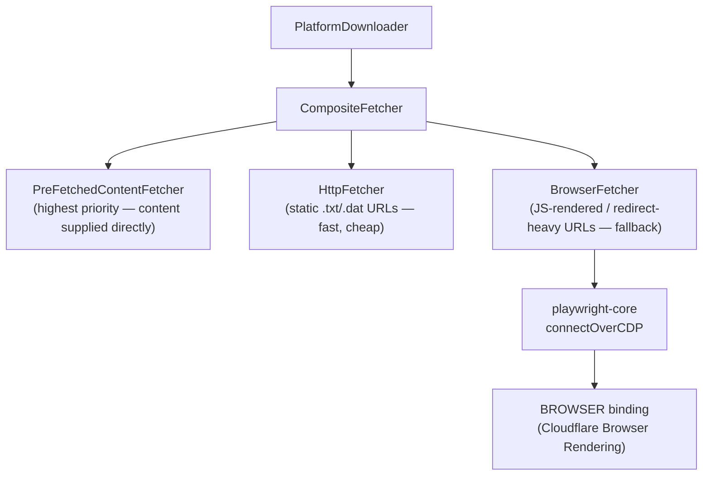
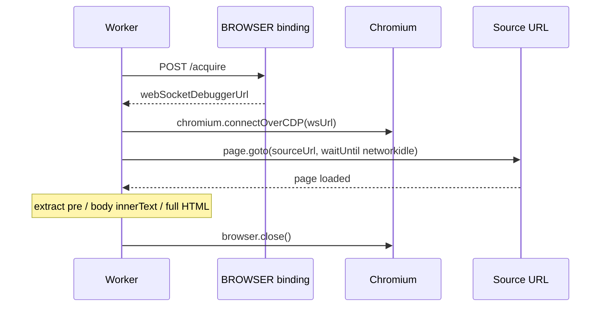

# Browser Rendering Integration

This document describes how Cloudflare Browser Rendering is integrated into `adblock-compiler`, what problems it solves, and how to use the new APIs.

---

## Why Browser Rendering?

`FilterDownloader` and `PlatformDownloader` both use plain `fetch()` to retrieve filter list source files. This fails silently for an increasing number of sources that:

1. **Render their download link dynamically via JavaScript** — e.g. GitHub releases pages, custom dashboards.
2. **Place content behind a lazy-loaded spinner or cookie-consent interstitial** — `fetch()` gets the skeleton HTML with no rules.
3. **Use JS-triggered redirect chains** — `fetch()` follows HTTP `Location` headers but cannot execute JavaScript.

Additionally, filter list maintainers occasionally break their hosting without notice. We had no proactive visibility into source health — we would only find out after a compilation run failed.

Browser Rendering solves all three of these by running a real Chromium instance at the edge without any server to manage.

### Why Playwright (not `@cloudflare/puppeteer`)?

The codebase already has `@cloudflare/playwright-mcp` as a dependency (for the MCP agent). Cloudflare also now recommends Playwright as the preferred path for new Browser Rendering integrations. Using Playwright everywhere keeps a single mental model for all browser automation in this project:

| Layer | What uses it |
|---|---|
| MCP Agent (`worker/mcp-agent.ts`) | `@cloudflare/playwright-mcp` (Playwright under the hood) |
| `BrowserFetcher` | `playwright-core` via CDP |
| `browser.ts` utilities | `playwright-core` via CDP |

---

## Architecture



`BrowserFetcher` implements `IContentFetcher` so it plugs directly into the existing `CompositeFetcher` / `PlatformDownloader` dependency-injection slot. No changes to the compilation pipeline are needed.

### How the CDP Connection Works

The Cloudflare `BROWSER` binding is a `Fetcher`. Calling its `fetch('https://workers-binding.browser/acquire')` endpoint returns a JSON body with a `webSocketDebuggerUrl`. Playwright's `chromium.connectOverCDP(url)` uses that WebSocket to drive a real Chromium instance:



---

## `BrowserFetcher` — `IContentFetcher` implementation

**Location:** `src/platform/BrowserFetcher.ts`

### When to use

| Scenario | Use `HttpFetcher` | Use `BrowserFetcher` |
|---|---|---|
| Static `.txt` / `.dat` filter file | ✅ fast, cheap | ❌ unnecessary overhead |
| GitHub raw content URL | ✅ | ❌ |
| Filter file behind a JS-rendered page | ❌ gets skeleton HTML | ✅ |
| Source behind a cookie-consent interstitial | ❌ | ✅ |
| JS-triggered redirect chain | ❌ | ✅ |
| Source availability screenshot | ❌ | ✅ |

### Options

```typescript
export interface BrowserFetcherOptions {
    timeout?: number;              // Navigation timeout ms (default: 30_000)
    waitUntil?: 'load' | 'domcontentloaded' | 'networkidle' | 'commit'; // default: 'networkidle'
    extractFullHtml?: boolean;     // Return full HTML instead of plain text (default: false)
}
```

### Usage Examples

#### Drop-in fallback in a `CompositeFetcher` chain

```typescript
import { BrowserFetcher, CompositeFetcher, HttpFetcher } from '@jk-com/adblock-compiler';

// env.BROWSER is the Cloudflare BROWSER binding
const fetcher = new CompositeFetcher([
    new HttpFetcher(),
    new BrowserFetcher(env.BROWSER, { timeout: 30_000 }),
]);

// BrowserFetcher is only invoked if HttpFetcher.canHandle() returns false
// (it won't — both handle http/https — so use priority ordering or explicit fallback)
```

#### Explicit browser-only fetch

```typescript
import { BrowserFetcher } from '@jk-com/adblock-compiler';

const fetcher = new BrowserFetcher(env.BROWSER, {
    timeout: 45_000,
    waitUntil: 'networkidle',
});

const rules = await fetcher.fetch('https://some-js-rendered-dashboard.example.com/list');
```

#### Extract full HTML from a page

```typescript
const fetcher = new BrowserFetcher(env.BROWSER, { extractFullHtml: true });
const html = await fetcher.fetch('https://example.com/filter-page');
// Parse html with your own DOM parser to find download links
```

---

## `fetchWithBrowser` — one-shot utility

**Location:** `worker/handlers/browser.ts`

For Worker request handlers where setting up a `CompositeFetcher` is inconvenient:

```typescript
import { fetchWithBrowser } from './handlers/browser.ts';

const content = await fetchWithBrowser(env.BROWSER, 'https://example.com/list.txt', {
    timeout: 30_000,
    waitUntil: 'networkidle',
});
```

---

## `resolveCanonicalUrl` — follow JS redirect chains

**Location:** `worker/handlers/browser.ts`

```typescript
import { resolveCanonicalUrl } from './handlers/browser.ts';

const { canonical, hops } = await resolveCanonicalUrl(env.BROWSER, 'https://short.link/abc');
console.log(canonical); // "https://example.com/filters/list.txt"
console.log(hops);      // 1
```

**Why this matters:** Some filter-list distributors use short links, CDN redirects, or mirror systems. Caching the canonical URL in D1 or KV reduces redirect hops on every compilation run.

---

## `takeSourceScreenshot` — proactive source health monitoring

**Location:** `worker/handlers/browser.ts`

```typescript
import { takeSourceScreenshot } from './handlers/browser.ts';

const { screenshotBase64, storedKey } = await takeSourceScreenshot(
    env.BROWSER,
    'https://easylist.to/easylist/easylist.txt',
    env.FILTER_STORAGE, // R2 bucket (optional)
);
// storedKey: "screenshots/easylist.to/2025-01-15.png"
```

Screenshots are stored under `screenshots/<hostname>/<YYYY-MM-DD>.png` in R2.

---

## REST API Endpoints

Both endpoints require the `BROWSER` binding to be configured. They return `503` with a descriptive error message when the binding is absent (graceful degradation).

### `POST /api/browser/resolve-url`

Resolves the canonical URL of a given address by following all redirects (including JS-triggered ones).

**Request:**
```json
{ "url": "https://short.link/abc" }
```

**Response (200):**
```json
{
  "success": true,
  "canonical": "https://example.com/filters/list.txt",
  "hops": 2
}
```

**Error responses:**
| Status | Meaning |
|---|---|
| `400` | Missing or invalid `url` field, or non-http/https scheme |
| `502` | Navigation failed (unreachable URL, DNS error, etc.) |
| `503` | `BROWSER` binding not configured |

---

### `POST /api/browser/monitor`

Screenshots one or more filter-list source URLs, writes a health summary to the `SOURCE_MONITOR_RESULTS` KV key (via `ctx.waitUntil()` — the response is returned immediately while the KV write completes in the background), and optionally stores screenshots to R2.

**Request:**
```json
{
  "urls": [
    "https://easylist.to/easylist/easylist.txt",
    "https://filters.adtidy.org/extension/ublock/filters/2.txt"
  ],
  "storeScreenshots": true
}
```

**Response (200):**
```json
{
  "success": true,
  "checked": 2,
  "results": [
    {
      "url": "https://easylist.to/easylist/easylist.txt",
      "status": "ok",
      "screenshotKey": "screenshots/easylist.to/2025-01-15.png"
    },
    {
      "url": "https://filters.adtidy.org/extension/ublock/filters/2.txt",
      "status": "error",
      "error": "Navigation timeout after 30000ms"
    }
  ]
}
```

**Notes:**
- `storeScreenshots: true` requires the `FILTER_STORAGE` (R2) binding. Without it, the base-64 screenshot is returned inline.
- Results are also written to `COMPILATION_CACHE` KV under key `SOURCE_MONITOR_RESULTS` for retrieval by the health monitoring dashboard.

**Error responses:**
| Status | Meaning |
|---|---|
| `400` | Missing or empty `urls` array |
| `503` | `BROWSER` binding not configured |

---

## MCP Agent — AI-Assisted Browser Automation

The `PlaywrightMcpAgent` in `worker/mcp-agent.ts` is already deployed and exposes a Playwright MCP server over Server-Sent Events. This lets AI tools (including GitHub Copilot) control a real browser:

```
wrangler dev → ws://localhost:8787/agents/mcp-agent/default/sse
production  → https://adblock-compiler.jayson-knight.workers.dev/agents/mcp-agent/default/sse
```

**Use cases for the MCP agent:**
- **Automated source discovery** — ask Copilot to browse a blocklist aggregator and extract new filter list URLs.
- **Debugging source failures** — when a source fails to download, use the agent to inspect the page interactively (redirect chain, login wall, JS error, etc.).
- **UI smoke testing** — automate testing of the Angular frontend's `/compiler` and `/admin` pages against the live Worker.

The agent is separate from `BrowserFetcher` — it is an interactive tool for AI assistants, while `BrowserFetcher` is a programmatic component for the compilation pipeline.

---

## Configuration

The `BROWSER` binding is already configured in `wrangler.toml`. No additional setup is needed:

```toml
# wrangler.toml (already present)
[browser]
binding = "BROWSER"
```

The `FILTER_STORAGE` (R2) binding is also already configured:

```toml
# wrangler.toml (already present)
[[r2_buckets]]
binding = "FILTER_STORAGE"
bucket_name = "adblock-compiler-r2-storage"
```

For local development (`wrangler dev`), Browser Rendering and R2 are emulated by the `workerd` runtime — no extra Cloudflare account resources are needed.

---

## End-to-End Tests

Browser Rendering e2e tests live in `worker/browser.e2e.test.ts` and follow the same pattern as `worker/api.e2e.test.ts`:

```bash
# Start the dev server in one terminal
deno task dev

# Run browser e2e tests in another terminal
deno test --allow-net worker/browser.e2e.test.ts

# Or with a custom base URL
E2E_BASE_URL=https://staging.example.com deno test --allow-net worker/browser.e2e.test.ts
```

Tests automatically skip if the server is unavailable, matching the existing e2e test convention.

---

## Security Considerations

- `BrowserFetcher` and the browser handler utilities only accept `http://` and `https://` URLs. File paths and other schemes are rejected.
- The `BROWSER` binding check is performed at the start of every handler. A missing binding returns a `503` immediately without attempting any browser operations.
- All browser instances are closed in `finally` blocks to prevent resource leaks regardless of whether navigation succeeds or fails.
- Screenshot storage keys follow a deterministic pattern (`screenshots/<hostname>/<date>.png`) to prevent path traversal.
