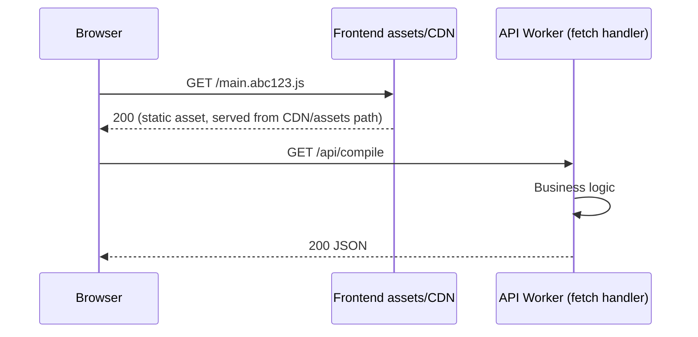

# Cloudflare Services Integration

This document describes all Cloudflare services integrated into the bloqr-backend project, their current status, and configuration guidance.

---

## Service Status Overview

| Service | Status | Binding | Purpose |
|---|---|---|---|
| **KV Namespaces** | ✅ Active | `COMPILATION_CACHE`, `RATE_LIMIT`, `METRICS`, `RULES_KV` | Caching, rate limiting, metrics aggregation, rule set storage |
| **R2 Storage** | ✅ Active | `FILTER_STORAGE` | Filter list storage and artifact persistence |
| **Browser Rendering** | ✅ Active | `BROWSER` | Headless browser fetching for JS-rendered filter sources (see [Browser Rendering](BROWSER_RENDERING.md)) |
| **D1 Database** | ✅ Active | `DB` | Compilation history, deployment records |
| **Queues** | ✅ Active | `ADBLOCK_COMPILER_QUEUE`, `ADBLOCK_COMPILER_QUEUE_HIGH_PRIORITY` | Async compilation, batch processing |
| **Analytics Engine** | ✅ Active | `ANALYTICS_ENGINE` | Request metrics, cache analytics, workflow tracking |
| **Workflows** | ✅ Active | `COMPILATION_WORKFLOW`, `BATCH_COMPILATION_WORKFLOW`, `CACHE_WARMING_WORKFLOW`, `HEALTH_MONITORING_WORKFLOW` | Durable async execution |
| **Hyperdrive** | ✅ Active | `HYPERDRIVE` | Accelerated PostgreSQL (PlanetScale) connectivity |
| **Tail Worker** | ✅ Active | `bloqr-tail` | Log collection, error forwarding |
| **SSE Streaming** | ✅ Active | — | Real-time compilation progress via `/compile/stream` |
| **WebSocket** | ✅ Active | — | Real-time bidirectional compile via `/ws/compile` |
| **Observability** | ✅ Active | — | Built-in logs and traces via `[observability]`; `persist = true` retains logs beyond the live-tail window |
| **Cron Triggers** | ✅ Active | — | Cache warming (every 6h), health monitoring (every 1h) |
| **Pipelines** | ✅ Configured | `METRICS_PIPELINE` | Metrics/audit event ingestion → R2 |
| **Log Sink (HTTP)** | ✅ Configured | `LOG_SINK_URL` (env var) | Tail worker forwards to external log service |
| **API Shield** | 📋 Dashboard | — | OpenAPI schema validation at edge (see below) |
| **API Shield Vulnerability Scanner** | 🔬 Beta | — | Stateful BOLA/logic-flaw detection via AI call graphs (see below) |
| **Containers** | 🔧 Configured | `ADBLOCK_COMPILER` | Durable Object container (production only) |
| **Node.js Compatibility** | ✅ Active | `nodejs_compat` flag | Enables Node.js built-in shims (`node:async_hooks`, `node:crypto`, `node:buffer`, etc.) for npm packages like Sentry |
| **Static Asset Hosting** | ✅ Active | `ASSETS` binding | Angular frontend static files served from Cloudflare CDN edge; compiled filter list artifacts are served from R2 (optionally via an R2 custom domain/CDN) |
| **Gradual Deployments** | ✅ Available | `wrangler versions` CLI | Progressive traffic rollout — route N % of requests to a new version before full rollout (see [Gradual Deployments](../deployment/GRADUAL_DEPLOYMENTS.md)) |

---

## Cloudflare Pipelines

Pipelines provide scalable, batched HTTP event ingestion — ideal for routing metrics and audit events to R2 or downstream analytics.

### Setup

```bash
# Create the pipeline (routes to R2)
wrangler pipelines create bloqr-backend-metrics-pipeline \
  --r2-bucket adblock-compiler-r2-storage \
  --batch-max-mb 10 \
  --batch-timeout-secs 30
```

### Usage

The `PipelineService` (`src/services/PipelineService.ts`) provides a type-safe wrapper:

```typescript
import { PipelineService } from '../src/services/PipelineService.ts';

const pipeline = new PipelineService(env.METRICS_PIPELINE, logger);

await pipeline.send({
    type: 'compilation_success',
    requestId: 'req-123',
    durationMs: 250,
    ruleCount: 12000,
    sourceCount: 5,
});
```

### Configuration

The binding is defined in `wrangler.toml`:
```toml
[[pipelines]]
binding = "METRICS_PIPELINE"
pipeline = "bloqr-backend-metrics-pipeline"
```

---

## Log Sinks (Tail Worker)

The tail worker (`worker/tail.ts`) can forward structured logs to any HTTP log ingestion endpoint (Better Stack, Grafana Loki, Logtail, etc.).

### Configuration

Set these secrets/environment variables:

```bash
wrangler secret put LOG_SINK_URL       # e.g. https://in.logs.betterstack.com
wrangler secret put LOG_SINK_TOKEN     # Bearer token for the log sink
```

Optional env var (defaults to `warn`):
```bash
wrangler secret put LOG_SINK_MIN_LEVEL  # debug | info | warn | error
```

### Supported Log Sinks

| Service | `LOG_SINK_URL` | Auth |
|---|---|---|
| Better Stack | `https://in.logs.betterstack.com` | Bearer token |
| Logtail | `https://in.logtail.com` | Bearer token |
| Grafana Loki | `https://<host>/loki/api/v1/push` | Bearer token |
| Custom HTTP | Any HTTPS endpoint | Bearer token (optional) |

---

## API Shield

Cloudflare API Shield enforces OpenAPI schema validation at the edge for all requests to `/compile`, `/compile/stream`, and `/compile/batch`. This is configured in the Cloudflare dashboard — no code changes are required.

### Setup

1. Go to **Cloudflare Dashboard → Security → API Shield**
2. Click **Add Schema** and upload `docs/api/cloudflare-schema.yaml`
3. Set **Mitigation action** to `Block` for schema violations
4. Enable for endpoints:
   - `POST /compile`
   - `POST /compile/stream`
   - `POST /compile/batch`

### Schema Location

The OpenAPI schema is at `docs/api/cloudflare-schema.yaml` (auto-generated by `deno task schema:cloudflare`).

---

## API Shield Vulnerability Scanner

Cloudflare's **stateful vulnerability scanner** uses AI-driven API call graphs to detect logic flaws, particularly **Broken Object Level Authorization (BOLA)** — the #1 OWASP API risk. Currently in beta.

### How it works

1. Parses `docs/api/cloudflare-schema.yaml` to build an API call graph
2. Sequences requests to simulate realistic attacker flows (e.g., create resource as user A → access as user B)
3. Reports discovered vulnerabilities in the Cloudflare dashboard

### Setup

1. Go to **Cloudflare Dashboard → Security → API Shield → Vulnerability Scanner**
2. Configure test credentials (Clerk JWT, API key) via HashiCorp Vault — never use production credentials
3. Limit initial scan scope to user-scoped resource endpoints (API keys, queue jobs, workflows)

### CI/CD Integration

The `.github/workflows/api-shield-scan.yml` workflow validates scanner compatibility on every PR touching the OpenAPI spec:

```bash
# Manually validate API Shield readiness
deno task openapi:validate
deno task schema:cloudflare
```

### Full Guide

See [API Shield Vulnerability Scanner](../security/API_SHIELD_VULNERABILITY_SCANNER.md) for the complete setup and BOLA prevention guide.

---

## Analytics Engine

The Analytics Engine tracks all key events through `src/services/AnalyticsService.ts`. Data is queryable via the Cloudflare Workers Analytics API.

### Tracked Events

| Event | Description |
|---|---|
| `compilation_request` | Every incoming compile request |
| `compilation_success` | Successful compilation with timing and rule count |
| `compilation_error` | Failed compilation with error type |
| `cache_hit` / `cache_miss` | KV cache effectiveness |
| `rate_limit_exceeded` | Rate limit hits by IP |
| `workflow_started` / `completed` / `failed` | Workflow lifecycle |
| `batch_compilation` | Batch compile job metrics |
| `api_request` | All API endpoint calls |

### Querying

```sql
-- Average compilation time over last 24h
SELECT
  avg(double1) as avg_duration_ms,
  sum(double2) as total_rules
FROM adguard-compiler-analytics-engine
WHERE timestamp > NOW() - INTERVAL '1' DAY
  AND blob1 = 'compilation_success'
```

---

## D1 Database

D1 stores compilation history and deployment records, enabling the admin dashboard to show historical data.

### Schema

Migrations are in `migrations/`. Apply with:
```bash
wrangler d1 execute adblock-compiler-d1-database --file=migrations/0001_init.sql --remote
wrangler d1 execute adblock-compiler-d1-database --file=migrations/0002_deployment_history.sql --remote
```

---

## Workflows

Four durable workflows handle crash-resistant async operations:

| Workflow | Trigger | Purpose |
|---|---|---|
| `CompilationWorkflow` | `/compile/async` | Single async compilation with retry |
| `BatchCompilationWorkflow` | `/compile/batch` | Per-item recovery for batch jobs |
| `CacheWarmingWorkflow` | Cron (every 6h) | Pre-populate KV cache |
| `HealthMonitoringWorkflow` | Cron (every 1h) | Check source URL health |

---

## Node.js Compatibility

Both `wrangler.toml` (API Worker) and `frontend/wrangler.toml` (Angular SSR Worker) have
`compatibility_flags = ["nodejs_compat"]` enabled. This flag exposes Node.js built-in module
shims inside the Cloudflare Workers runtime.

### Why it is needed

| Package | Node.js API used | Reason |
|---|---|---|
| `@sentry/cloudflare` | `node:async_hooks` | Sentry uses async context tracking for request isolation |
| `prisma` (WASM) | `node:buffer`, `node:crypto` | Prisma's WASM engine relies on Buffer and crypto polyfills |
| `@cloudflare/playwright-mcp` | `node:path`, `node:url` | Playwright MCP uses Node-style path resolution |

### Supported Node.js APIs

The `nodejs_compat` flag exposes these Node.js built-ins inside Workers:

```
node:assert      node:async_hooks  node:buffer     node:console
node:crypto      node:diagnostics_channel           node:dns
node:events      node:net          node:path        node:process
node:querystring node:readline     node:stream      node:string_decoder
node:timers      node:tls          node:url         node:util
node:zlib
```

> **Note:** `node:fs` and `node:https` are not available. Workers have no local filesystem
> (`node:fs` is intentionally excluded) and use the native `fetch` API instead of
> `node:https`. Use `fetch()` for all HTTP requests in Worker code.

### wrangler.toml reference

```toml
# Both workers have this flag:
compatibility_flags = ["nodejs_compat"]
```

See the [Cloudflare Node.js compatibility docs](https://developers.cloudflare.com/workers/configuration/compatibility-flags/)
for the full list of supported APIs per compatibility date.

---

## Persistent Logs

Workers Logs are configured with `persist = true` in both `wrangler.toml` files:

```toml
[observability.logs]
enabled = true
head_sampling_rate = 1   # 100 % of invocations captured
persist = true           # retain logs beyond the live-tail window
invocation_logs = true   # include per-invocation metadata (status, duration, outcome)
```

### What "persistent" means

Without `persist = true`, Workers Logs are available only during the **live tail** window
(roughly 5 minutes). With `persist = true`, logs remain queryable beyond live tail, but only
for the normal Workers Logs retention window: **up to 24 hours** without Logpush. For retention
beyond that window, export logs via Logpush or another external sink (see
[Logpush → R2](../observability/LOGPUSH.md)).

### Querying persistent logs

**Via Cloudflare Dashboard:**
1. *Workers & Pages → bloqr-backend → Logs*
2. Use the time range picker to look back up to 24 hours.
3. Filter by outcome (`exception`, `exceededCpu`), log level, or log text.

**Via CLI (live tail):**
```bash
deno task wrangler:tail

# Structured JSON for piping:
deno run -A npm:wrangler tail --format json | jq '.logs[].message[]'
```

**Via Workers Logs REST API:**
```bash
# Requires a Cloudflare API token with Workers:Read permission
curl -X GET "https://api.cloudflare.com/client/v4/accounts/<ACCOUNT_ID>/workers/scripts/bloqr-backend/logs?start=2026-04-01T00:00:00Z&end=2026-04-02T00:00:00Z" \
    -H "Authorization: Bearer $CLOUDFLARE_API_TOKEN"
```

### Structured log format

All worker logs use structured JSON emitted via `console.log()`. The `AdminLogger`
(`worker/services/admin-logger.ts`) outputs:

```json
{
  "level": "info",
  "message": "Compilation completed",
  "requestId": "a1b2c3d4",
  "operation": "compile.run",
  "durationMs": 312,
  "ruleCount": 14250
}
```

The Workers Logs system stores this verbatim, enabling filtering and aggregation in the
Cloudflare dashboard without additional log processing infrastructure.

See [Cloudflare Native Observability](../observability/CLOUDFLARE_OBSERVABILITY.md) and
[Logpush → R2](../observability/LOGPUSH.md) for the full observability stack.

---

## Static Asset Hosting

Only the **frontend Worker** (`frontend/wrangler.toml`) defines an `ASSETS` binding. That
binding serves the Angular application's static files (JS bundles, CSS, fonts, pre-rendered
HTML) directly from Cloudflare's assets/CDN path — without invoking the frontend Worker's
`fetch` handler for those requests.

The **API Worker** (`wrangler.toml`) does **not** define an `ASSETS` binding. All requests to
API routes are handled by the API Worker's `fetch` handler.

### How it works



### Frontend Worker — static asset configuration

`frontend/wrangler.toml` configures the `ASSETS` binding for the Angular SSR Worker:

```toml
[assets]
directory           = "dist/bloqr-backend/browser"
binding             = "ASSETS"
html_handling       = "auto-trailing-slash"
not_found_handling  = "single-page-application"
```

- `html_handling = "auto-trailing-slash"` — normalises `/route` and `/route/` to the same
  prerendered HTML page.
- `not_found_handling = "single-page-application"` — serves `index.html` for unknown paths,
  letting Angular's client-side router handle deep-linked routes.

### Compiled filter list artifacts

Compiled filter list outputs are stored in **R2** (`FILTER_STORAGE` binding), not in the
`ASSETS` directory. To serve compiled outputs as downloadable files from a CDN edge:

1. Upload the compiled `.txt` / `.adblock` file to R2 with a public URL.
2. Or expose a Worker route (`GET /api/lists/:name`) that streams from R2.
3. Use the R2 `custom_domain` setting to serve directly from a CDN-backed custom hostname.

---

## Gradual Deployments

Gradual deployments route a configurable percentage of production traffic to a new Worker
version before committing to a full release. This is the safest way to validate high-risk
changes (compilation logic, rate-limiting, authentication) without a big-bang deploy.

### Quick reference

```bash
# 1. Upload new version (no traffic change)
deno task wrangler:versions:upload

# 2. List uploaded versions to get the version ID
deno task wrangler:versions:list

# 3. Route 10 % of traffic to the new version
deno run -A npm:wrangler versions deploy --version-id <VERSION_ID> --percentage 10 --yes

# 4. Increase to 50 %, then 100 % when healthy
deno run -A npm:wrangler versions deploy --version-id <VERSION_ID> --percentage 50 --yes
deno run -A npm:wrangler versions deploy --version-id <VERSION_ID> --percentage 100 --yes

# Rollback: re-deploy the previous stable version at 100 %
deno run -A npm:wrangler versions deploy --version-id <STABLE_VERSION_ID> --percentage 100 --yes
```

### GitHub Actions workflow

A dedicated **Gradual Deploy (Manual)** workflow is available at
`.github/workflows/gradual-deploy.yml`. Trigger it from the GitHub Actions UI with:

- `version_id` — Cloudflare version ID from `wrangler:versions:list`
- `percentage` — traffic percentage (1/5/10/20/25/50/75/100)
- `confirm_full_rollout` — must be checked for 100 % deploys

### Integration with Feature Flags

For behaviour changes inside the compilation pipeline, combine a gradual Worker deployment
with KV-backed feature flags for double-gated safety. See
[Feature Flags](../feature-flags/KV_FEATURE_FLAGS.md).

Full documentation: [Gradual Deployments](../deployment/GRADUAL_DEPLOYMENTS.md)

---

## References

- [Browser Rendering](BROWSER_RENDERING.md)
- [Cloudflare Pipelines](https://developers.cloudflare.com/pipelines/)
- [Cloudflare Workers Analytics Engine](https://developers.cloudflare.com/analytics/analytics-engine/)
- [Cloudflare API Shield](https://developers.cloudflare.com/api-shield/)
- [Cloudflare API Shield Vulnerability Scanner](https://blog.cloudflare.com/vulnerability-scanner/)
- [API Shield Vulnerability Scanner Guide](../security/API_SHIELD_VULNERABILITY_SCANNER.md)
- [Cloudflare Tail Workers](https://developers.cloudflare.com/workers/observability/logs/tail-workers/)
- [Cloudflare Workflows](https://developers.cloudflare.com/workflows/)
- [Cloudflare D1](https://developers.cloudflare.com/d1/)
- [Cloudflare Queues](https://developers.cloudflare.com/queues/)
- [Cloudflare Hyperdrive](https://developers.cloudflare.com/hyperdrive/)
- [Cloudflare Workers Versioning & Gradual Deployments](https://developers.cloudflare.com/workers/configuration/versions-and-deployments/)
- [Node.js Compatibility flags](https://developers.cloudflare.com/workers/configuration/compatibility-flags/)
- [Static Assets](https://developers.cloudflare.com/workers/static-assets/)
- [Workers Logs (Persistent)](https://developers.cloudflare.com/workers/observability/logs/workers-logs/)
