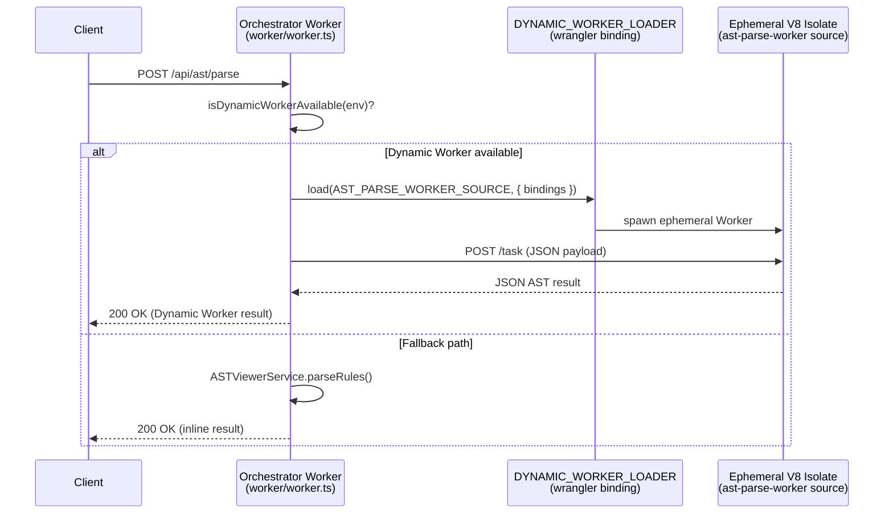

# Cloudflare Dynamic Workers — Integration Guide

> **Status:** Pilot (issue [#1386](https://github.com/jaypatrick/adblock-compiler/issues/1386))
> **Announced:** March 2026 — <https://blog.cloudflare.com/dynamic-workers/>
> **API reference:** <https://developers.cloudflare.com/dynamic-workers/>

---

## What Are Cloudflare Dynamic Workers?

Cloudflare Dynamic Workers allow an orchestrator Worker to **spin up ephemeral, isolated V8
sandboxes at runtime** from source code strings. Key properties:

- **~1 ms cold-start** — no pre-deployment or container warm-up required.
- **Zero pre-deployment** — the Worker source is passed as a string at invocation time; no
  `wrangler deploy` needed for the inner Worker.
- **Full isolate-level sandboxing** — each invocation runs in a fresh V8 context. Network
  egress can be fully disabled via `globalOutbound: null`.
- **Granular bindings** — only the KV namespaces, secrets, and environment variables you
  explicitly forward are visible inside the isolate.

---

## Why This Project Adopted Dynamic Workers

The adblock-compiler processes millions of filter-list rules in short-lived, stateless bursts.
The workload profile matches Dynamic Workers almost perfectly:

| Workload | Suitable for Dynamic Workers? |
|---|---|
| AST parse of a ruleset | ✅ Stateless, CPU-bound, short-lived |
| Rule validation | ✅ Stateless, short-lived |
| Single-file transform | ✅ Stateless |
| Full batch compile (10k+ rules) | ⚠️ Better as a Workflow/Container |
| Browser rendering (Playwright MCP) | ❌ Needs persistent DO session |

Dynamic Workers also resolve a long-standing blocker: running arbitrary compiler logic in a
safe sandbox without pre-registering every variant as a separate Cloudflare Worker.

---

## Architecture



---

## ZTA Posture

Dynamic Workers are a ZTA-native primitive. This project enforces:

| Control | Implementation |
|---|---|
| Minimum bindings | Spawned isolates receive only `COMPILATION_CACHE`, `RATE_LIMIT`, `COMPILER_VERSION` — never the full `Env` |
| No outbound network | `globalOutbound: null` enforced by the loader (configurable per binding) |
| No persistent state | Each invocation spawns a fresh isolate; no shared memory between requests |
| Input validation | `AstParseRequestSchema` (Zod) validates the request body before it reaches the isolate |
| Auth before dispatch | `isDynamicWorkerAvailable` is called inside `handleASTParseRequest`, which is already behind Turnstile + rate-limit middleware |

---

## How to Enable

### 1. Check account access

Dynamic Workers require beta access on your Cloudflare account. Visit
<https://developers.cloudflare.com/dynamic-workers/> and request access.

### 2. Update `wrangler.toml`

Uncomment the binding block at the bottom of `wrangler.toml`:

```toml
[[bindings]]
type = "dynamic_worker_loader"
name = "DYNAMIC_WORKER_LOADER"
```

### 3. Deploy

```bash
wrangler deploy
```

The `DYNAMIC_WORKER_LOADER` binding will be automatically detected by
`isDynamicWorkerAvailable(env)` in `handleASTParseRequest`. No other code changes
are required — the fallback path (inline `ASTViewerService`) is used automatically
when the binding is absent.

---

## Pilot: `/api/ast/parse` Dynamic Worker

The first Dynamic Worker pilot targets the `POST /api/ast/parse` endpoint.

### File layout

| File | Purpose |
|---|---|
| `worker/dynamic-workers/types.ts` | Shared TypeScript types (`DynamicWorkerLoader`, `DynamicWorkerTask`, etc.) |
| `worker/dynamic-workers/loader.ts` | `dispatchToDynamicWorker()` — orchestration helper |
| `worker/dynamic-workers/ast-parse-worker.ts` | Readable source for the AST parse isolate |
| `worker/dynamic-workers/sources.ts` | Inlined source string constants (`AST_PARSE_WORKER_SOURCE`) |
| `worker/dynamic-workers/index.ts` | Barrel export |

### Feature flag flow

```
handleASTParseRequest(request, env)
  └── isDynamicWorkerAvailable(env)
        ├── true  → dispatchToDynamicWorker(env, AST_PARSE_WORKER_SOURCE, task)
        └── false → ASTViewerService.parseRules() [existing path]
```

---

## `transport: 'dynamic-worker'` in AGENT_REGISTRY

The `AgentRegistryEntry.transport` union has been extended:

```typescript
readonly transport: 'websocket' | 'sse' | 'dynamic-worker';
```

`'dynamic-worker'` signals that an agent entry describes a stateless task dispatched via
`DYNAMIC_WORKER_LOADER` rather than a persistent Durable Object. The `validateAgentRegistry()`
function and its corresponding test accept this value as valid.

---

## Future Roadmap

| Phase | Target | Notes |
|---|---|---|
| **Now** (pilot) | `/api/ast/parse` | Feature-flagged; falls back to inline impl |
| **Near-term** | `/api/validate` | Same pattern as ast-parse |
| **Near-term** | `/compile` (single-file) | Small rulesets only; large batches stay in Workflow |
| **Mid-term** | Per-user AiAgent orchestration | Dynamic Worker per task/session, DO for state only |
| **Long-term** | LLM-driven codegen → safe execution | Compiler-as-a-Platform: generate and run custom transform logic |

---

## References

- Issue [#1386](https://github.com/jaypatrick/adblock-compiler/issues/1386) — tracking issue
- PR [#1382](https://github.com/jaypatrick/adblock-compiler/pull/1382) — Cloudflare Agents SDK integration
- <https://blog.cloudflare.com/dynamic-workers/> — announcement post
- <https://developers.cloudflare.com/dynamic-workers/> — API reference
- `ideas/CLOUDFLARE_DYNAMIC_WORKERS.md` — architecture/investment document
