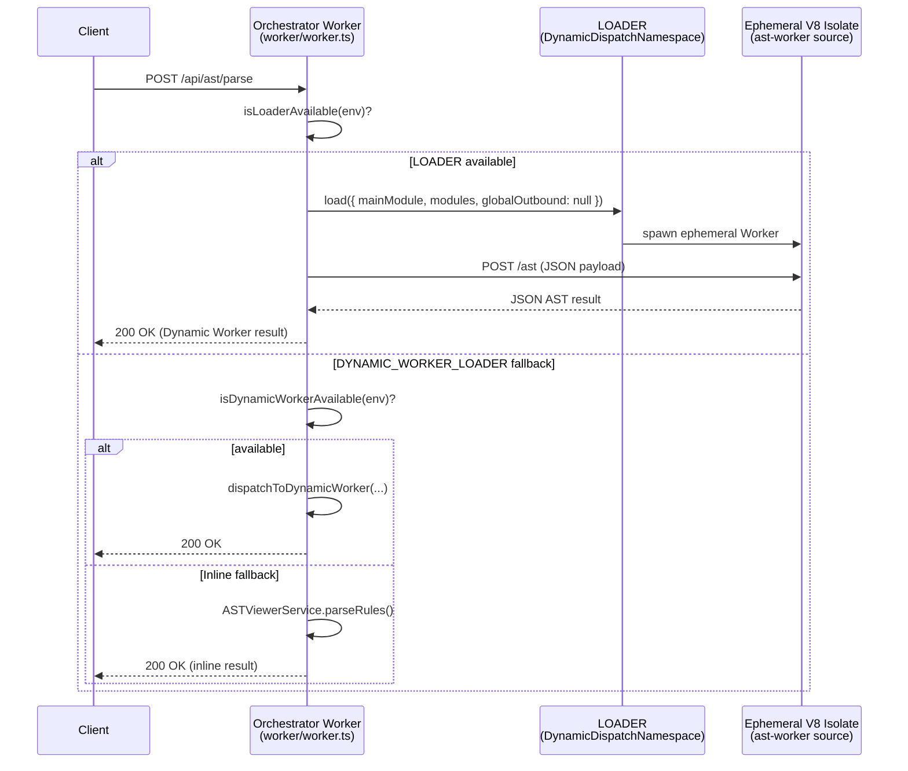
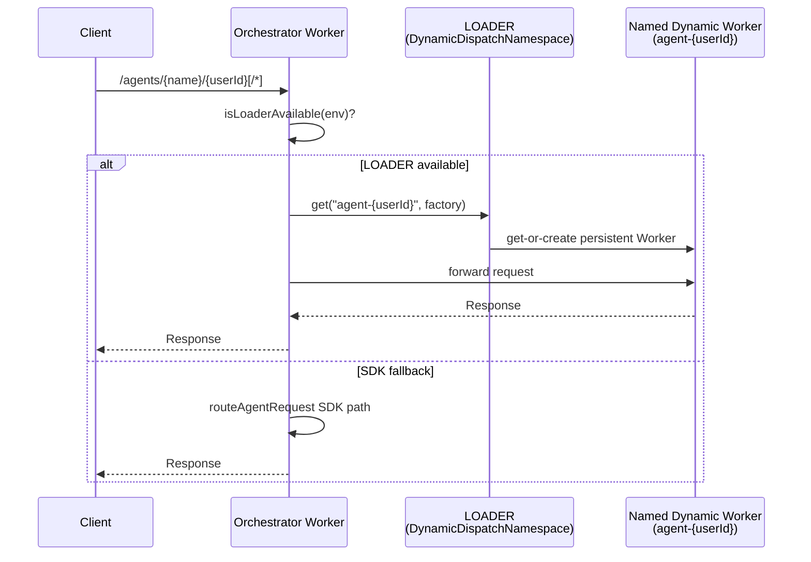

# Cloudflare Dynamic Workers — Integration Guide

> **Status:** Pilot (issue [#1386](https://github.com/jaypatrick/adblock-compiler/issues/1386))
> **Announced:** March 2026 — <https://blog.cloudflare.com/dynamic-workers/>
> **API reference:** <https://developers.cloudflare.com/dynamic-workers/>

---

## What Are Cloudflare Dynamic Workers?

Cloudflare Dynamic Workers allow an orchestrator Worker to **spin up ephemeral, isolated V8
sandboxes at runtime** from source code strings. Key properties:

- **~1 ms cold-start** — no pre-deployment or container warm-up required.
- **Zero pre-deployment** — the Worker source is passed as a string at invocation time; no
  `wrangler deploy` needed for the inner Worker.
- **Full isolate-level sandboxing** — each invocation runs in a fresh V8 context. Network
  egress can be fully disabled via `globalOutbound: null`.
- **Granular bindings** — only the KV namespaces, secrets, and environment variables you
  explicitly forward are visible inside the isolate.

---

## Why This Project Adopted Dynamic Workers

The bloqr-backend processes millions of filter-list rules in short-lived, stateless bursts.
The workload profile matches Dynamic Workers almost perfectly:

| Workload | Suitable for Dynamic Workers? |
|---|---|
| AST parse of a ruleset | ✅ Stateless, CPU-bound, short-lived |
| Rule validation | ✅ Stateless, short-lived |
| Single-file transform | ✅ Stateless |
| Full batch compile (10k+ rules) | ⚠️ Better as a Workflow/Container |
| Browser rendering (Playwright MCP) | ❌ Needs persistent DO session |

Dynamic Workers also resolve a long-standing blocker: running arbitrary compiler logic in a
safe sandbox without pre-registering every variant as a separate Cloudflare Worker.

---

## Two Binding Models

This project supports **two** Dynamic Worker binding models. Both are feature-flagged and
fall back gracefully to the inline implementation when absent.

### Model A — `DYNAMIC_WORKER_LOADER` (string-source loader)

The original binding model. Loads an ephemeral Worker from a raw ES module source string.
Orchestrated via `dispatchToDynamicWorker()` and guarded by `isDynamicWorkerAvailable()`.

```toml
[[bindings]]
type = "dynamic_worker_loader"
name = "DYNAMIC_WORKER_LOADER"
```

### Model B — `LOADER` (Dynamic Dispatch Namespace)

The newer `DynamicDispatchNamespace` binding. Provides two operations:

- **`load()`** — one-shot ephemeral Workers (AST parse, validate, single-file transform).
- **`get(id, factory)`** — named, persistent, hibernating Workers (per-user AI agents).

```toml
[[dynamic_dispatch_namespaces]]
binding = "LOADER"
namespace = "bloqr-backend-dynamic"
```

---

## Architecture

### AST Parse — LOADER path (Model B, preferred)



### Per-User AI Agent — LOADER path (Model B, persistent Workers)



---

## ZTA Posture

Dynamic Workers are a ZTA-native primitive. This project enforces:

| Control | Implementation |
|---|---|
| Minimum bindings | **DYNAMIC_WORKER_LOADER** isolates: `COMPILATION_CACHE`, `RATE_LIMIT`, `COMPILER_VERSION` only — enforced via `DynamicWorkerBindings`; **LOADER** AST/validate isolates: no bindings (`bindings: {}`); **LOADER** per-user agent Workers: `COMPILATION_CACHE` + `METRICS` when present — enforced via `DynamicWorkerSafeBindings` |
| No outbound network | `globalOutbound: null` enforced for all ephemeral Workers (AST parse, validate) |
| No persistent state | Each ephemeral invocation spawns a fresh isolate; no shared memory between requests |
| Input validation | `AstParseRequestSchema` (Zod) validates the request body before it reaches the isolate |
| Auth before dispatch | All dynamic Worker paths are behind Turnstile + rate-limit middleware |
| Least-privilege agents | Per-user agent Workers receive only `COMPILATION_CACHE` and `METRICS` (when present) via `DynamicWorkerSafeBindings` — auth secrets, D1, DO namespaces, and R2 are structurally excluded |

---

## How to Enable

### Model A — `DYNAMIC_WORKER_LOADER`

#### 1. Check account access

Dynamic Workers require beta access on your Cloudflare account. Visit
<https://developers.cloudflare.com/dynamic-workers/> and request access.

#### 2. Update `wrangler.toml`

Uncomment the binding block at the bottom of `wrangler.toml`:

```toml
[[bindings]]
type = "dynamic_worker_loader"
name = "DYNAMIC_WORKER_LOADER"
```

#### 3. Deploy

```bash
wrangler deploy
```

The `DYNAMIC_WORKER_LOADER` binding will be automatically detected by
`isDynamicWorkerAvailable(env)` in `handleASTParseRequest`. No other code changes
are required.

### Model B — `LOADER` (Dynamic Dispatch Namespace)

#### 1. Update `wrangler.toml`

```toml
[[dynamic_dispatch_namespaces]]
binding = "LOADER"
namespace = "bloqr-backend-dynamic"
```

#### 2. Deploy

```bash
wrangler deploy
```

The `LOADER` binding is detected by `isLoaderAvailable(env)`. When present, it takes
priority over the `DYNAMIC_WORKER_LOADER` path in both `handleASTParseRequest` and
`handleValidate`.

---

## Pilot: `/api/ast/parse` and `/api/validate` Dynamic Workers

### File layout

| File | Purpose |
|---|---|
| `worker/dynamic-workers/types.ts` | Shared TypeScript types (`DynamicWorkerLoader`, `DynamicDispatchNamespace`, `DynamicWorkerTask`, `DynamicWorkerResult`, etc.) |
| `worker/dynamic-workers/loader.ts` | Orchestration helpers for both binding models |
| `worker/dynamic-workers/ast-worker.ts` | Source for the LOADER-model AST parse/validate isolate |
| `worker/dynamic-workers/ast-parse-worker.ts` | Source for the DYNAMIC_WORKER_LOADER-model AST parse isolate |
| `worker/dynamic-workers/sources.ts` | Inlined source string constants (`AST_PARSE_WORKER_SOURCE`) |
| `worker/dynamic-workers/index.ts` | Barrel export |

### Feature flag flow — `/api/ast/parse`

```
handleASTParseRequest(request, env)
  ├── isLoaderAvailable(env)?
  │     ├── true  → runAstParseInDynamicWorker(body, env)   [LOADER model]
  │     │              └── success → return result
  │     │              └── failure → fall through
  │     └── false → (skip)
  ├── isDynamicWorkerAvailable(env)?
  │     ├── true  → dispatchToDynamicWorker(env, AST_PARSE_WORKER_SOURCE, task)
  │     └── false → (skip)
  └── ASTViewerService.parseRules()   [inline fallback]
```

### Feature flag flow — `/api/validate`

```
handleValidate(request, env?)
  ├── env provided AND isLoaderAvailable(env)?
  │     ├── true  → runValidateInDynamicWorker({ rules, strict }, env)   [LOADER model]
  │     │              └── success → return result
  │     │              └── failure/null → fall through
  │     └── false → (skip)
  └── ASTViewerService.parseRule() loop   [inline fallback]
```

---

## `transport: 'dynamic-worker'` in AGENT_REGISTRY

The `AgentRegistryEntry.transport` union has been extended:

```typescript
readonly transport: 'websocket' | 'sse' | 'dynamic-worker';
```

`'dynamic-worker'` signals that an agent entry describes a stateless task dispatched via
`DYNAMIC_WORKER_LOADER` rather than a persistent Durable Object. The `validateAgentRegistry()`
function and its corresponding test accept this value as valid.

---

## Per-User AI Agent Workers

When `env.LOADER` is available, `routeAgentRequest` attempts to dispatch
`/agents/{name}/{userId}` requests to a named, persistent dynamic Worker
(`agent-{userId}`) before falling back to the Cloudflare Agents SDK path.

```typescript
// worker/agent-routing.ts
const dynamicResponse = await getOrCreateUserAgent(agentId, request, env);
if (dynamicResponse !== null) return dynamicResponse;
// ... SDK fallback
```

The per-user agent Worker is identified by `makeAgentWorkerId(userId)` → `agent-{userId}`.
Each user's Worker hibernates when idle and wakes on the next request (DO semantics).

---

## Future Roadmap

| Phase | Target | Notes |
|---|---|---|
| **Now** (pilot) | `/api/ast/parse` | LOADER + DYNAMIC_WORKER_LOADER paths; falls back to inline impl |
| **Now** (pilot) | `/api/validate` | LOADER path; falls back to inline impl |
| **Near-term** | `/compile` (single-file) | Small rulesets only; large batches stay in Workflow |
| **Near-term** | Per-user AiAgent orchestration | `getOrCreateUserAgent()` + agents SDK fallback |
| **Mid-term** | Bundle ASTViewerService | Replace stubs with `@cloudflare/worker-bundler` output |
| **Long-term** | LLM-driven codegen → safe execution | Compiler-as-a-Platform: generate and run custom transform logic |

---

## References

- Issue [#1386](https://github.com/jaypatrick/adblock-compiler/issues/1386) — tracking issue
- PR [#1382](https://github.com/jaypatrick/adblock-compiler/pull/1382) — Cloudflare Agents SDK integration
- PR [#1387](https://github.com/jaypatrick/adblock-compiler/pull/1387) — Dynamic Workers LOADER model + per-user agents
- <https://blog.cloudflare.com/dynamic-workers/> — announcement post
- <https://developers.cloudflare.com/dynamic-workers/> — API reference
- `ideas/CLOUDFLARE_DYNAMIC_WORKERS.md` — architecture/investment document
