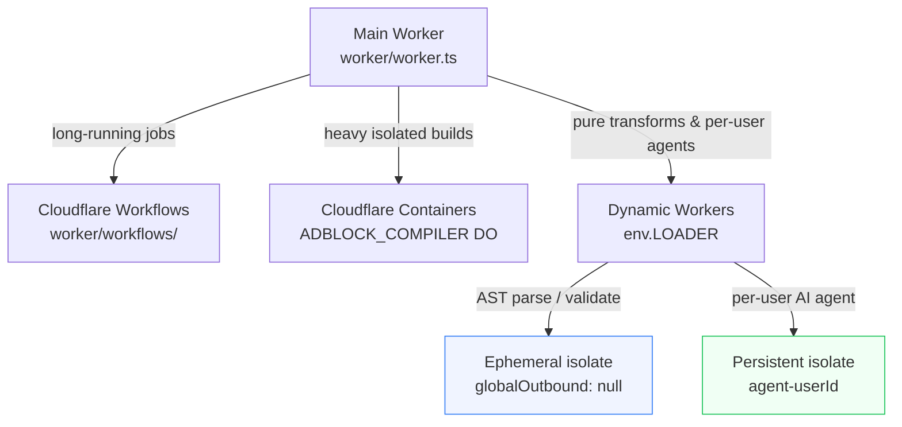

# Dynamic Workers

Documentation for the Cloudflare Dynamic Workers integration in the adblock-compiler Worker.

## What Are Dynamic Workers?

Cloudflare Dynamic Workers (announced March 2026, open beta) allow the main Worker to spin up
isolated V8 sandbox Workers at runtime. Key properties:

- **~1ms cold start** — near-zero overhead for ephemeral isolate creation
- **`globalOutbound: null`** — per-isolate network lockdown for Zero Trust enforcement
- **Isolate-level privilege separation** — each dynamic Worker gets only the bindings it needs
- **Named persistent Workers** — DO-backed hibernation for long-lived per-user agents

See the official documentation: <https://developers.cloudflare.com/dynamic-workers/>

## Architecture

Dynamic Workers fit into the adblock-compiler execution model as a third execution tier:



### Three-Tier Execution Model

| Tier | Mechanism | Use Case | Cold Start |
|------|-----------|----------|------------|
| **Workflows** | `COMPILATION_WORKFLOW` binding | Long-running, durable compilations | ~100ms |
| **Containers** | `ADBLOCK_COMPILER` DO | Heavy isolated builds, stateful sessions | ~500ms |
| **Dynamic Workers** | `LOADER` binding | Pure transforms, per-user AI agents | ~1ms |

## Configuration

### wrangler.toml

Add the following to `wrangler.toml` to enable the `LOADER` binding:

```toml
[[dynamic_dispatch_namespaces]]
binding = "LOADER"
namespace = "adblock-compiler-dynamic"
```

The namespace `adblock-compiler-dynamic` must be created in the Cloudflare dashboard or via the
API before deploying.

### Environment

The `LOADER` binding is **optional** in the `Env` interface. All Dynamic Worker functions
check `isLoaderAvailable(env)` before use and gracefully fall back to in-process handlers
when the binding is absent.

## Code Structure

```
worker/dynamic-workers/
├── index.ts        # Barrel export (public API)
├── types.ts        # Canonical types and guard helpers
├── loader.ts       # Orchestration helpers (runAstParseInDynamicWorker, etc.)
└── ast-worker.ts   # Dynamic Worker source bundle (AST parse + validate)
```

## Usage

### The `isLoaderAvailable()` Guard

Always check for LOADER availability before calling dynamic Worker functions:

```typescript
import { isLoaderAvailable } from './dynamic-workers/index.ts';

if (isLoaderAvailable(env)) {
    // safe to call env.LOADER.load() or env.LOADER.get()
}
```

The high-level helpers (`runAstParseInDynamicWorker`, `runValidateInDynamicWorker`,
`getOrCreateUserAgent`) perform this check internally and return `null` when LOADER is absent,
signalling the caller to fall back to the in-process handler.

### Ephemeral AST Parse

```typescript
import { runAstParseInDynamicWorker } from './dynamic-workers/index.ts';

const result = await runAstParseInDynamicWorker({ rules: ['||example.com^'] }, env);
if (result !== null) {
    // Executed in dynamic Worker isolate — full V8 isolation, no network access
    return JsonResponse.success(result.data);
}
// Fallback to in-process handler
```

### Ephemeral Rule Validation

```typescript
import { runValidateInDynamicWorker } from './dynamic-workers/index.ts';

const result = await runValidateInDynamicWorker({ rules, strict: false }, env);
if (result !== null) {
    return result.success
        ? Response.json(result.data)
        : Response.json({ success: false, error: result.error }, { status: 500 });
}
// Fallback to in-process handler
```

### Per-User Persistent Agent Worker

```typescript
import { getOrCreateUserAgent } from './dynamic-workers/index.ts';

const userId = request.headers.get('X-User-Id');
if (userId) {
    const response = await getOrCreateUserAgent(userId, request, env);
    if (response !== null) return response;
}
// Fallback to agent-routing.ts SDK/shim path
```

## Zero Trust Properties

Ephemeral Workers (AST parse, validate) are created with:

- `globalOutbound: null` — **no outbound network access** inside the isolate
- `bindings: {}` — **no KV, D1, R2, Queue, or DO bindings** — isolate receives only the
  request body
- Destroyed after the response completes — **no shared state** between concurrent jobs

Per-user agent Workers are granted only:

- `COMPILATION_CACHE` (KV read) — for context-aware compilation suggestions
- `METRICS` (KV write) — for per-agent telemetry

No R2, D1, Queue, or other bindings are granted by default (principle of least privilege).

## Build Pipeline TODO

The inline Worker source strings in `loader.ts` are stubs. In production, replace them with
output from `@cloudflare/worker-bundler`:

1. Bundle `worker/dynamic-workers/ast-worker.ts` + `ASTViewerService` into a single ESM string
2. Import the bundled string constant in `loader.ts` instead of the inline stub
3. Bundle the agents SDK `AiAgent` class + tool definitions for the per-user agent Worker to
   bypass the `async_hooks`/esbuild incompatibility in the main Worker

See: <https://developers.cloudflare.com/dynamic-workers/worker-bundler/>

## Related

- Issue [#1386](https://github.com/jaypatrick/adblock-compiler/issues/1386) — Dynamic Workers
  integration tracking
- Issue [#1377](https://github.com/jaypatrick/adblock-compiler/issues/1377) — Agents SDK
  integration (companion PR)
- Architecture document: `ideas/CLOUDFLARE_DYNAMIC_WORKERS_PIVOT.md`
