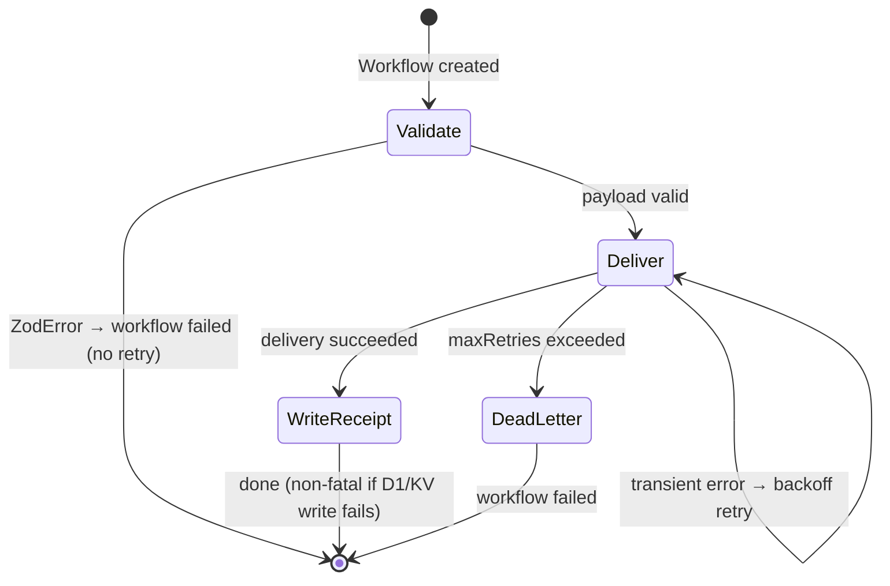

# Email Delivery Workflow

`EmailDeliveryWorkflow` is a Cloudflare Workflow (`WorkflowEntrypoint`) that delivers transactional email with step-level checkpointing, automatic retry, and dead-lettering.

---

## Why a Workflow instead of a plain queue consumer?

A plain `queue` consumer sends the email inline: if the Worker restarts mid-send, the message is retried but the in-flight HTTP call is lost — the email might be sent twice *or* not at all.

A Cloudflare Workflow checkpoints each named **step** in durable storage. If the Worker restarts between steps, the Workflow resumes from the last completed checkpoint — not from the beginning. This means:

- Step 1 (validation) never re-runs after it passes.
- Step 2 (delivery) retries *only* delivery, not validation.
- Step 3 (receipt) can fail without affecting the delivery status.

This is why `EmailDeliveryWorkflow` exists: **no duplicate sends on retry, even across Worker restarts**.

---

## Step diagram



---

## Steps

### Step 1 — Validate payload

- Zod-validates the `EmailDeliveryParams` received from the queue or direct trigger.
- Runs with `retries: 0` — a malformed payload is a programming error, not a transient failure.
- If validation fails, the workflow is immediately marked `failed`. No retries.

### Step 2 — Deliver

- Calls `createEmailService(env, { useQueue: false }).sendEmail(payload)`.
- `{ useQueue: false }` selects the best **non-queue** provider (`CfEmailWorkerService`) — see [below](#why-createemailservice-with-usequeue-false-not-createemailservice).
- Default retry configuration:
  - `limit`: `3`
  - `delay`: `'10 seconds'`
  - `backoff`: `'exponential'` (10 s → 20 s → 40 s)
- After all retries exhausted, the workflow is marked `failed` and the message enters the dead-letter queue (`EMAIL_DLQ`).

### Step 3 — Write delivery receipt

- Writes a row to `email_log_edge` (D1) and the `email_idempotency_keys` D1 table, and stores a receipt object in KV (`METRICS`) with a 7-day TTL.
- Runs with `retries: 1` and is **non-fatal**: a failure here does not mark the workflow as failed. The email was already sent in Step 2.

---

## Configuration

The retry configuration is defined as constants in `worker/workflows/EmailDeliveryWorkflow.ts`:

| Parameter | Default | Description |
|-----------|---------|-------------|
| `limit` | `3` | Number of retry attempts for Step 2 (delivery) |
| `delay` | `'10 seconds'` | Initial back-off wait after first failure |
| `backoff` | `'exponential'` | Multiplier strategy applied to the interval on each retry |

---

## Why `createEmailService(env, { useQueue: false })` not `createEmailService(env)`?

`createEmailService(env)` selects `QueuedEmailService` as the highest-priority provider when `EMAIL_QUEUE` is configured. If `EmailDeliveryWorkflow` called `createEmailService(env)`, it would enqueue the message *back* onto `EMAIL_QUEUE`, which would trigger *another* `EmailDeliveryWorkflow` instance — infinite recursion.

Passing `{ useQueue: false }` skips the queue and selects `CfEmailWorkerService` directly, breaking the cycle.

```typescript
// Inside EmailDeliveryWorkflow.run():
const mailer = createEmailService(this.env, { useQueue: false });
// NOT: createEmailService(this.env)  ← would cause queue→workflow→queue recursion
```

---

## See also

- [`worker/workflows/EmailDeliveryWorkflow.ts`](../../worker/workflows/EmailDeliveryWorkflow.ts) — implementation
- [`worker/handlers/email-queue.ts`](../../worker/handlers/email-queue.ts) — queue consumer that triggers the workflow
- [`docs/cloudflare/EMAIL_SERVICE.md`](EMAIL_SERVICE.md) — provider selection and configuration
