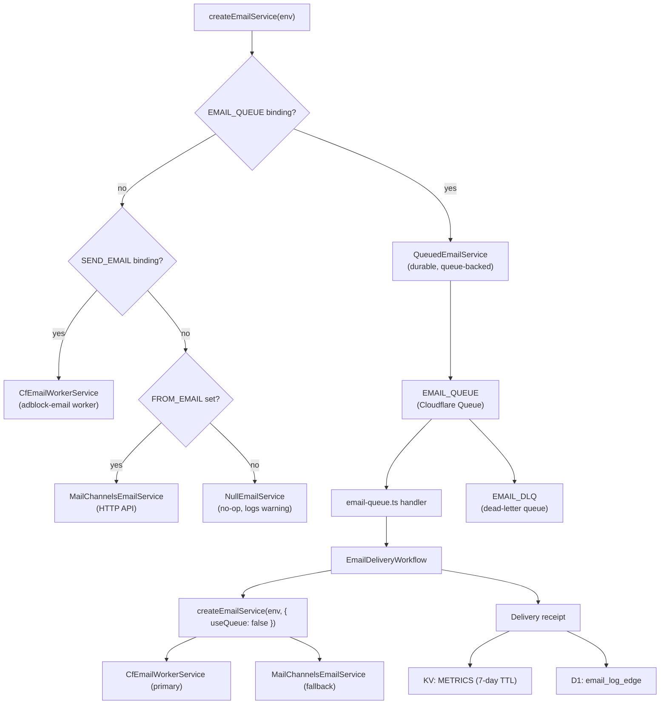

# Email Service

The `EmailService` layer gives every Worker handler a single, provider-agnostic way to send transactional email. You call `createEmailService(env)`, get back an `IEmailService`, and call `sendEmail(payload)` — the service picks the best available provider automatically.

---

## Architecture



---

## Provider priority

| Priority | Provider | Trigger condition | Durability | Retryable |
|----------|----------|-------------------|------------|-----------|
| 1 (best) | `QueuedEmailService` | `EMAIL_QUEUE` binding present | Durable (queue + Workflow) | Yes — Workflow retries |
| 2 | `CfEmailWorkerService` | `SEND_EMAIL` binding present | Best-effort | No |
| 3 | `MailChannelsEmailService` | `FROM_EMAIL` var set | Best-effort | No |
| 4 | `NullEmailService` | Neither configured | N/A | N/A |

---

## Configuration

### 1. `wrangler.toml` bindings (added by PR #1664)

The following bindings are already present in `wrangler.toml`:

```toml
[[send_email]]
name = "SEND_EMAIL"

[[queues.producers]]
queue = "adblock-compiler-email-queue"
binding = "EMAIL_QUEUE"

[[queues.consumers]]
queue = "adblock-compiler-email-queue"
max_batch_size = 5
max_batch_timeout = 5
max_retries = 3
dead_letter_queue = "adblock-compiler-email-dlq"

[[workflows]]
name = "email-delivery-workflow"
binding = "EMAIL_DELIVERY_WORKFLOW"
class_name = "EmailDeliveryWorkflow"
```

### 2. Worker Secrets

Set DKIM signing credentials as Worker Secrets (never in `[vars]`):

```bash
wrangler secret put DKIM_PRIVATE_KEY
# Paste your RSA/Ed25519 private key (PEM or base64-encoded)
```

### 3. Non-secret vars (`wrangler.toml [vars]`)

```toml
[vars]
FROM_EMAIL      = "notifications@bloqr.dev"
DKIM_DOMAIN     = "bloqr.dev"
DKIM_SELECTOR   = "mail"
```

### 4. D1 migration (edge tracking tables)

```bash
wrangler d1 execute adblock-db --file=migrations/0011_email_tracking_edge.sql
```

Creates `email_log_edge` and `email_idempotency_keys` tables in D1.

### 5. Neon migration (primary tracking tables)

```bash
deno task db:migrate:deploy
# Applies: prisma/migrations/20260425000000_email_tracking/
```

Creates `EmailTemplate`, `EmailLog`, and `EmailNotificationPreference` tables in Neon.

---

## How to send an email

Use a fire-and-forget pattern so email never blocks the primary response:

```typescript
import { createEmailService } from '../services/email-service.ts';
import { renderCompilationComplete } from '../services/email-templates.ts';

// Inside a handler that has access to ctx (ExecutionContext):
const mailer = createEmailService(env);
const payload = renderCompilationComplete({
    configName: req.configName,
    ruleCount: result.ruleCount,
    durationMs: elapsed,
    requestId: req.id,
});

ctx.waitUntil(
    mailer.sendEmail(payload).catch((err) =>
        console.warn('[email] send error:', err)
    )
);
```

`ctx.waitUntil` ensures the Worker does not terminate before the email is enqueued, without blocking the HTTP response to the user.

---

## Admin API

| Method | Path | Auth | Returns |
|--------|------|------|---------|
| `GET` | `/admin/email/config` | `UserTier.Admin` + `X-Admin-Key` | Current provider type, binding status, env var presence |
| `POST` | `/admin/email/test` | `UserTier.Admin` + `X-Admin-Key` | Delivery result for a test email to the specified address |

---

## Idempotency

`QueuedEmailService` derives an idempotency key internally as `email-${requestId ?? uuid}`. Pass the optional `requestId` option to make the key deterministic:

```typescript
const mailer = new QueuedEmailService(env.EMAIL_QUEUE, {
    requestId: compilationRequestId,   // derives idempotencyKey = "email-<compilationRequestId>"
    reason: 'compilation_complete',
});
```

Inside `EmailDeliveryWorkflow`, the Workflow instance ID is set to the idempotency key when the queue consumer creates the workflow (`env.EMAIL_DELIVERY_WORKFLOW.create({ id: idempotencyKey })`). Cloudflare's Workflow runtime rejects duplicate `create()` calls with the same instance ID, preventing duplicate workflow runs. After successful delivery, Step 3 writes the key to `email_idempotency_keys` (D1) so the queue consumer can short-circuit replays before even triggering a new workflow.

---

## ZTA notes

- `DKIM_PRIVATE_KEY` is a **Worker Secret** — never in `wrangler.toml [vars]`.
- All inbound `EmailPayload` objects are Zod-validated (`EmailPayloadSchema`) at the service boundary.
- Admin endpoints (`/admin/email/*`) require `UserTier.Admin` + a valid `X-Admin-Key` header.
- Email subject lines are RFC 2047-encoded and validated against a `^[^\r\n]*$` pattern to prevent MIME header injection.
- HTML email bodies are passed through `escapeHtml()` (`worker/utils/escape-html.ts`) before template interpolation to prevent XSS in email clients.

---

## Troubleshooting

| Symptom | Likely cause | Fix |
|---------|-------------|-----|
| No emails sent, no errors logged | `NullEmailService` selected — no provider configured | Set `FROM_EMAIL` (minimum), or configure `SEND_EMAIL` / `EMAIL_QUEUE` bindings |
| DKIM failures / emails land in spam | Missing or incorrect `DKIM_PRIVATE_KEY`, `DKIM_DOMAIN`, `DKIM_SELECTOR` | Run `wrangler secret put DKIM_PRIVATE_KEY` and verify DNS TXT record matches selector |
| Queue backlog growing | `EmailDeliveryWorkflow` failing repeatedly | Check Workflow logs via `wrangler tail`; verify `SEND_EMAIL` or `FROM_EMAIL` is correctly configured |
| `503` from `POST /admin/email/test` | No email provider available | Confirm bindings in `wrangler.toml` are deployed; check `GET /admin/email/config` for binding status |

---

## See also

- [`worker/services/email-service.ts`](../../worker/services/email-service.ts) — implementation
- [`worker/workflows/EmailDeliveryWorkflow.ts`](../../worker/workflows/EmailDeliveryWorkflow.ts) — durable delivery workflow
- [`worker/handlers/email-queue.ts`](../../worker/handlers/email-queue.ts) — queue consumer
- [`worker/handlers/admin-email.ts`](../../worker/handlers/admin-email.ts) — admin endpoints
- [`docs/cloudflare/EMAIL_DELIVERY_WORKFLOW.md`](EMAIL_DELIVERY_WORKFLOW.md) — step-by-step workflow documentation
