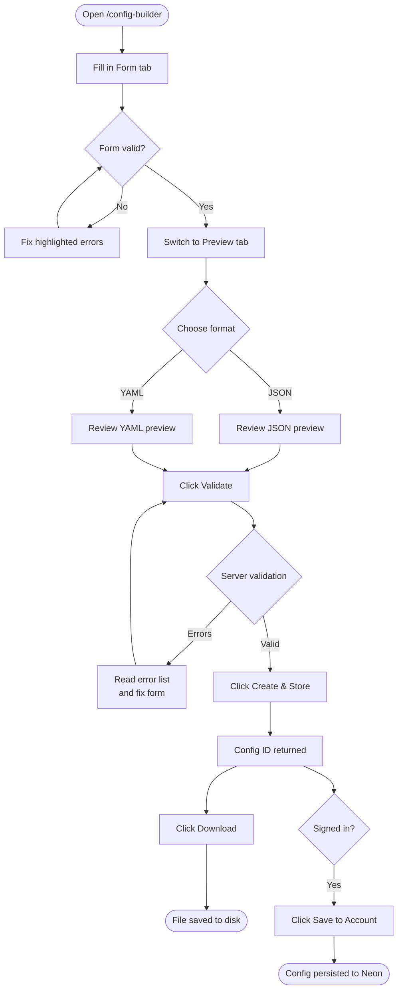
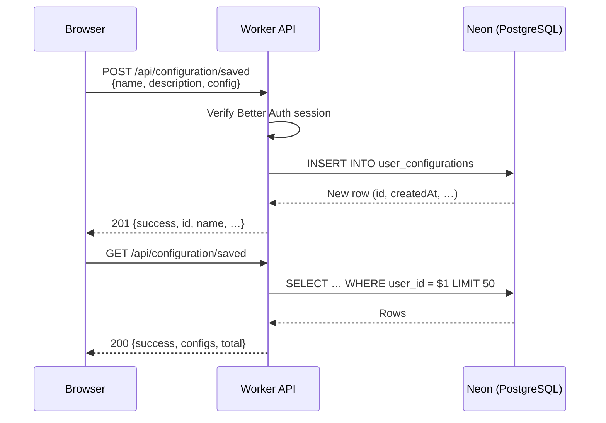

# Config Builder

The **Config Builder** is a browser-based GUI that lets you create, preview, and download adblock filter list configuration files without writing any JSON or YAML by hand. It is available at the `/config-builder` route in the frontend application.

---

## Why Use the Config Builder?

Writing configuration files manually is error-prone — a misplaced comma or an incorrect field name can silently break a compilation. The Config Builder:

- Provides **real-time form validation** with descriptive error messages before you ever hit the API.
- **Generates JSON and YAML previews** so you can inspect the exact document that will be stored.
- Calls **`POST /api/configuration/validate`** to run server-side schema validation against the same rules used during compilation.
- Stores the file via **`POST /api/configuration/create`** and returns a temporary download ID.
- Allows **signed-in users** to save configurations permanently to their Neon account for reuse.

---

## Step-by-Step Walkthrough



### 1. Fill In the Form

Navigate to **`/config-builder`** and open the **Form** tab (selected by default).

Complete the fields described in the [Field Reference](#field-reference) below. Required fields are marked with an asterisk (`*`) in the UI.

### 2. Preview the Output

Switch to the **Preview** tab to see the configuration that will be sent to the API. Use the JSON / YAML toggle at the top of the preview pane to switch between formats. The preview updates in real time as you edit the form.

Click **Copy to Clipboard** to copy the text without leaving the tab.

### 3. Validate

Click **Validate** (requires a valid Turnstile token).

- If the configuration is **valid**, a green success toast appears.
- If validation **fails**, a red error card listing field-level issues is shown beneath the editor. Correct the indicated fields and validate again.

### 4. Create

Click **Create & Store** to persist the configuration to temporary KV storage (24-hour TTL).

On success, the response includes a UUID configuration ID shown in a confirmation card.

### 5. Download

Click **Download** to open a new browser tab and download the file in the selected format.

Alternatively, you can fetch the file programmatically:

```bash
curl "https://api.bloqr-backend.example.com/api/configuration/download/<id>?format=json" \
     --output my-config.json
```

### 6. Save to Account *(signed-in users only)*

If you are signed in, click **Save to Account** to persist the configuration permanently in your Neon account. Saved configurations appear in the **Saved Configs** panel (collapsible) at the bottom of the page.

From the Saved Configs panel you can:

- **Load** a saved config back into the form for editing.
- **Delete** a saved config.

---

## Field Reference

| Field | Required | Validation | Description |
|---|---|---|---|
| **Name** | ✅ | min 1 char | Human-readable name for the filter list (e.g., `"My Block List"`). |
| **Description** | ❌ | — | Optional prose description shown in list metadata. |
| **Homepage** | ❌ | valid URL (`http://` or `https://`) | URL to your project page, repository, or documentation. |
| **License** | ❌ | — | SPDX license identifier (e.g., `MIT`, `GPL-3.0`). |
| **Version** | ❌ | semver `x.y` or `x.y.z` | Semantic version string for the list. |
| **Sources** | ✅ (≥ 1) | each `source` required | See [Sources](#sources) below. |
| **Transformations** | ❌ | array of known values | See [Transformations](#transformations) below. |
| **Exclusions** | ❌ | array of strings | Rules or domains to exclude from the compiled output. |
| **Inclusions** | ❌ | array of strings | Rules or domains to force-include even if excluded. |
| **Extensions** | ❌ | key-value string pairs | Custom metadata propagated to the output header. |

### Sources

Each source in the **Sources** array describes an input filter list:

| Sub-field | Required | Description |
|---|---|---|
| `source` | ✅ | URL or local path to the filter list file. |
| `name` | ❌ | Optional label used in compilation logs. |
| `type` | ✅ | Either `adblock` (AdBlock Plus syntax) or `hosts` (HOSTS file format). |

At least one source must be present. Click **Add Source** to add more.

### Transformations

Transformations are applied in the order specified after all sources are fetched and merged. Available values:

| Transformation | Effect |
|---|---|
| `RemoveComments` | Strips comment lines from the output. |
| `RemoveModifiers` | Strips modifier annotations (e.g., `$important`). |
| `Compress` | Collapses redundant rules. |
| `Validate` | Runs the parser validator; drops invalid rules. |
| `ValidateAllowIp` | Validates IP-based allow rules. |
| `Deduplicate` | Removes exact duplicate rules. |
| `InvertAllow` | Converts allow rules to block rules. |
| `RemoveEmptyLines` | Strips blank lines. |
| `TrimLines` | Strips leading/trailing whitespace from each line. |
| `InsertFinalNewLine` | Ensures the file ends with a newline character. |
| `ConvertToAscii` | Punycode-encodes international domain names. |

---

## Code Examples

### Saved JSON Configuration

```json
{
    "name": "Privacy Shield",
    "description": "Blocks known tracking and advertising domains",
    "homepage": "https://github.com/example/privacy-shield",
    "license": "MIT",
    "version": "2.1.0",
    "sources": [
        {
            "name": "EasyList",
            "source": "https://easylist.to/easylist/easylist.txt",
            "type": "adblock"
        },
        {
            "name": "EasyPrivacy",
            "source": "https://easylist.to/easylist/easyprivacy.txt",
            "type": "adblock"
        }
    ],
    "transformations": [
        "Deduplicate",
        "RemoveComments",
        "TrimLines",
        "InsertFinalNewLine"
    ],
    "exclusions": [
        "@@||cdn.example.com^"
    ],
    "extensions": {
        "maintainer": "Alice <alice@example.com>",
        "last-reviewed": "2025-01-01"
    }
}
```

### Equivalent YAML Configuration

```yaml
name: Privacy Shield
description: Blocks known tracking and advertising domains
homepage: "https://github.com/example/privacy-shield"
license: MIT
version: 2.1.0
sources:
  - name: EasyList
    source: "https://easylist.to/easylist/easylist.txt"
    type: adblock
  - name: EasyPrivacy
    source: "https://easylist.to/easylist/easyprivacy.txt"
    type: adblock
transformations:
  - Deduplicate
  - RemoveComments
  - TrimLines
  - InsertFinalNewLine
exclusions:
  - "@@||cdn.example.com^"
extensions:
  maintainer: "Alice <alice@example.com>"
  last-reviewed: "2025-01-01"
```

---

## Saving Configurations to Your Account

Signed-in users on the **Free tier** (or higher) can save configurations permanently to their Neon account.

### Requirements

- You must be signed in with a Better Auth session.
- No API key is sufficient — the endpoint requires an interactive session (cookie/bearer).

### How Saved Configs Work



Saved configurations are listed in the **Saved Configs** collapsible panel. Clicking **Load** applies the saved config's field values back into the form so you can modify and re-save. Clicking **Delete** sends `DELETE /api/configuration/saved/:id` and removes it from your account.

> **Free tier limit:** up to 50 saved configurations are returned per request. There is no UI-side hard cap on creation, but the API limits the list response to the 50 most recently updated entries.

---

## Troubleshooting

### Turnstile widget fails to load

The Validate and Create & Store buttons are disabled until Turnstile completes its challenge. Common causes:

- **Ad blocker** is blocking the Turnstile script (`challenges.cloudflare.com`). Add an exception for that domain.
- **VPN or proxy** routing is causing challenge failures. Try disabling the VPN.
- **Incorrect site key** in environment configuration. Contact the site administrator.

### Validation errors after clicking Validate

The error card below the editor shows field-level messages. Each error includes:

- **Path** — the JSON path of the offending field (e.g., `sources[0].source`).
- **Message** — a human-readable explanation.
- **Code** — the Zod error code for debugging (e.g., `invalid_type`).

Fix the highlighted fields and click **Validate** again.

### "Configuration has validation errors" on Create

The Create & Store flow runs validation internally before persisting. If the server returns validation errors at this stage, correct the form fields shown in the error card and try again.

### Download button is disabled

The Download button is enabled only after a successful **Create & Store** call returns a configuration ID. If you navigated away or refreshed the page, the ID is lost — run Create & Store again to generate a new one.

### "Service unavailable — database not configured" on Save to Account

This error means the Hyperdrive binding is not configured on the Worker. This is an infrastructure issue; contact the site administrator.

### Save to Account returns 401 Unauthorized

Your session may have expired. Sign out and sign back in, then try again.

---

## See Also

- [Schema Reference](./schema-reference.md) — complete field documentation and constraints
- [Environment Overrides](./env-overrides.md) — `ADBLOCK_CONFIG_*` variable reference
- [Config Flow Diagram](./flow-diagram.md) — pipeline load diagram
