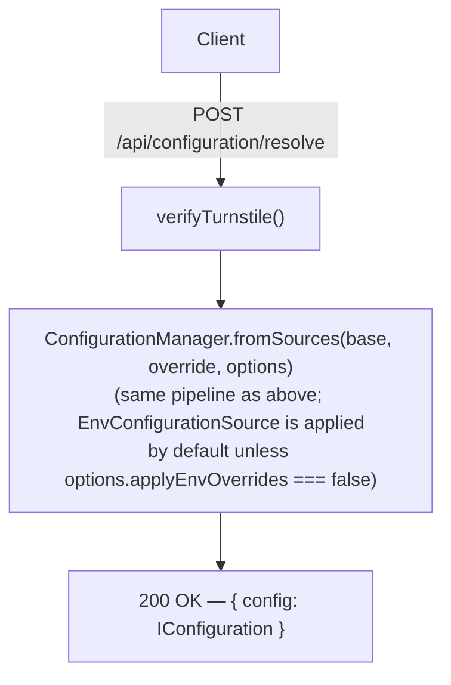

# Configuration Load Flow

The diagram below shows how `ConfigurationManager.load()` processes sources
from lowest to highest priority.

```mermaid
flowchart TD
    A["1. FileConfigurationSource\n(or ObjectSource, etc.)\n← --config path.json"]
    B["2. EnvConfigurationSource\n← ADBLOCK_CONFIG_* env vars\n(skipped if --no-env-overrides)"]
    C["3. OverrideConfigurationSrc\n← --override '{\"name\":\"...\"}'\n(optional, highest prio)"]
    D["ConfigurationManager.deepMerge(partials)\n· Scalars: last-defined wins\n· Arrays: last-defined fully replaces (no append)\n· undefined values do NOT override defined values"]
    E["Limit enforcement\n· sources.length > MAX_SOURCES(100) → truncate\n· exclusions.length > MAX_EXCLUSIONS(10 000) → truncate"]
    F["ConfigurationSchema.safeParse(merged)"]
    G["✓ return IConfiguration"]
    H["✗ throw ConfigurationValidationError"]

    A -->|"Partial&lt;IConfiguration&gt;"| B
    B -->|"Partial&lt;IConfiguration&gt;"| C
    C --> D
    D -->|"merged Partial&lt;IConfiguration&gt;"| E
    E --> F
    F -->|success| G
    F -->|failure| H
```

---

## Worker API flow



---

## Source interface

```ts
interface IConfigurationSource {
    readonly sourceType: string;
    load(): Promise<Partial<IConfiguration>>;
}
```

Any class implementing `IConfigurationSource` can be inserted into the
pipeline, making it straightforward to add Terraform, remote API, or
database-backed sources in the future.
