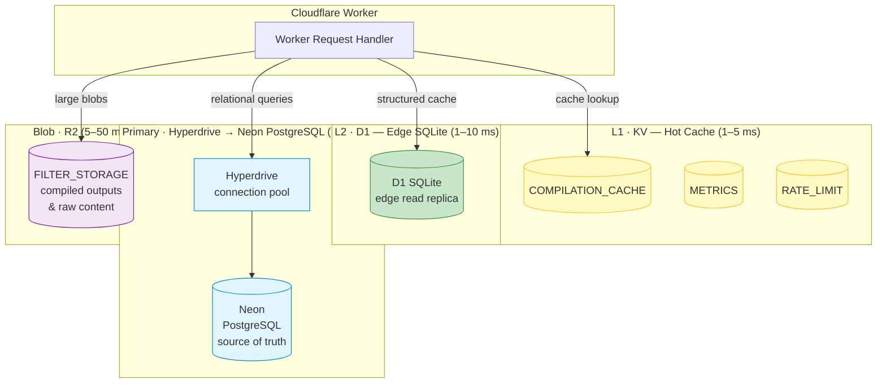
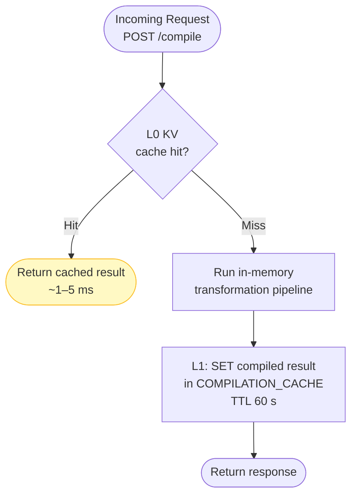
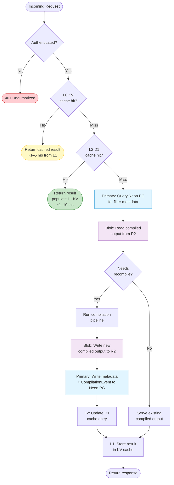
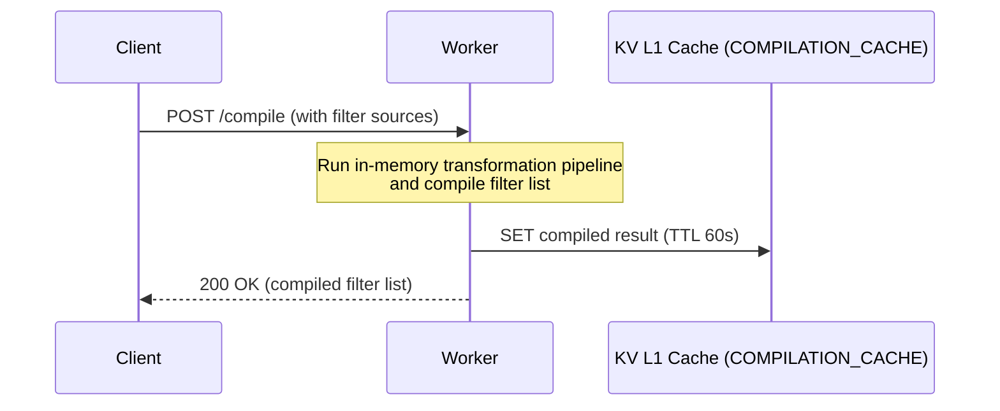
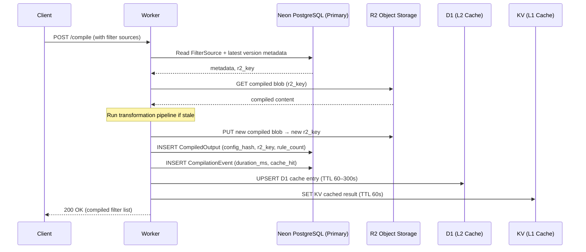
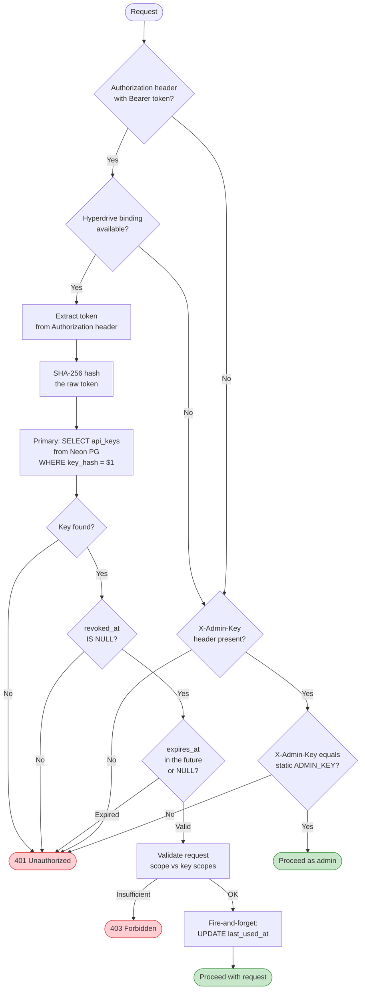
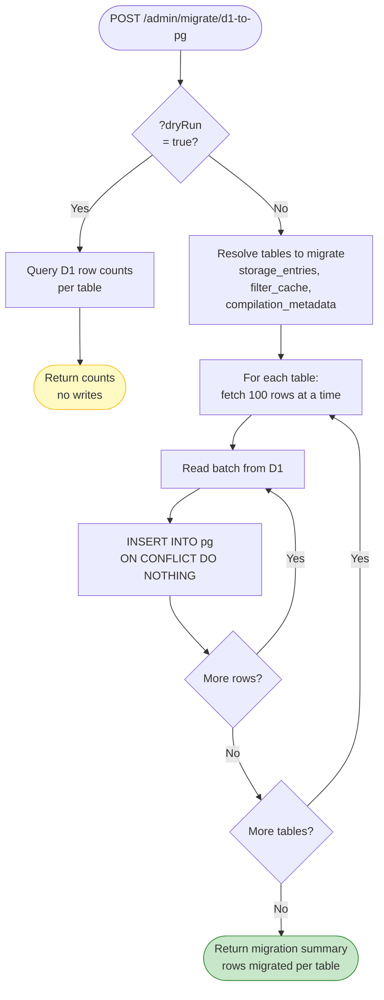
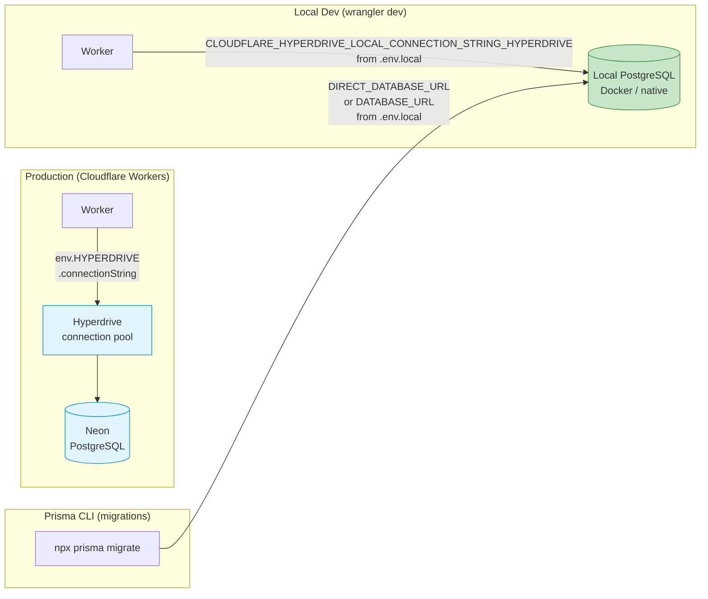

# Database Architecture

> Visual reference for the multi-tier storage architecture using Neon PostgreSQL (primary) with Cloudflare Hyperdrive, KV (L1 cache), D1 (L2 edge cache), and R2 (object storage).

## Table of Contents

- [Storage Tier Overview](#storage-tier-overview)
- [Request Data Flow](#request-data-flow)
- [Write Path](#write-path)
- [Authentication Flow](#authentication-flow)
- [D1 → PostgreSQL Migration Flow](#d1--postgresql-migration-flow)
- [Local vs Production Connection Routing](#local-vs-production-connection-routing)
- [Schema Relationships](#schema-relationships)

---

## Storage Tier Overview

The system uses four storage tiers arranged by access latency and role:

| Tier | Binding | Technology | Role |
|------|---------|-----------|------|
| **Primary** | `HYPERDRIVE` | Hyperdrive → Neon PostgreSQL | Primary relational store (source of truth) |
| **L1 Cache** | `COMPILATION_CACHE`, `METRICS`, `RATE_LIMIT` | Cloudflare KV | Hot-path key-value cache (config, rate limits) |
| **L2 Cache** | `DB`, `ADMIN_DB` | Cloudflare D1 (SQLite) | Edge read replicas, admin DB |
| **Object Storage** | `FILTER_STORAGE` | Cloudflare R2 | Large compiled outputs, raw filter content |

---

## Request Data Flow

### Current behaviour (Phase 1)

The compile handler today only consults the KV cache (`COMPILATION_CACHE`). D1, Neon PostgreSQL, and R2 are **not** in the hot compile path yet:

### Target behaviour (Phase 5 — planned)

Once the full Hyperdrive/R2 integration is complete (Phases 2–5), the flow will traverse all storage tiers:

---

## Write Path

### Current behaviour (Phase 1)

Today `POST /compile` writes only to the KV cache:

### Target behaviour (Phase 5 — planned)

Once Phase 2–5 are implemented, writes will propagate through all tiers:

---

## Authentication Flow

API key authentication as implemented in `worker/middleware/auth.ts` (`authenticateRequest`):

> **Header routing**: Bearer token → Hyperdrive API key auth. No Bearer token (or no Hyperdrive binding) → `X-Admin-Key` static key fallback.

---

## D1 → PostgreSQL Migration Flow

One-time migration from the legacy D1 SQLite store to Neon PostgreSQL:

> **Idempotent**: `ON CONFLICT DO NOTHING` means the migration can be run multiple times safely — only missing rows are inserted.

---

## Local vs Production Connection Routing

How the worker resolves its database connection string depending on the environment:

> Set credentials in `.env.local` (gitignored). See [`.env.example`](../../.env.example) and [local-dev.md](./local-dev.md).

---

## Schema Relationships

Core PostgreSQL model relationships derived from `prisma/schema.prisma`.
Field names reflect the underlying **database column names** (snake_case); Prisma model field names are the camelCase equivalents (e.g., `display_name` → `displayName`).

```mermaid
erDiagram
    User {
        uuid id PK
        string email UK
        string display_name
        string role
        string clerk_user_id UK
        string tier
        string first_name
        string last_name
        string image_url
        boolean email_verified
        timestamp last_sign_in_at
        boolean two_factor_enabled
        boolean banned
        string ban_reason
        timestamp ban_expires
        timestamp created_at
        timestamp updated_at
    }

    ApiKey {
        uuid id PK
        uuid user_id FK
        string key_hash UK
        string key_prefix
        string name
        string[] scopes
        int rate_limit_per_minute
        timestamp last_used_at
        timestamp expires_at
        timestamp revoked_at
        timestamp created_at
        timestamp updated_at
    }

    Session {
        uuid id PK
        uuid user_id FK
        string token UK
        string token_hash UK
        string ip_address
        string user_agent
        timestamp expires_at
        timestamp created_at
        timestamp updated_at
    }

    TwoFactor {
        uuid id PK
        uuid user_id FK
        string secret
        string backup_codes
    }

    Account {
        uuid id PK
        uuid user_id FK
        string account_id
        string provider_id
        string access_token
        string refresh_token
        timestamp access_token_expires_at
        timestamp refresh_token_expires_at
        string scope
        string id_token
        string password
        timestamp created_at
        timestamp updated_at
    }

    Verification {
        uuid id PK
        string identifier
        string value
        timestamp expires_at
        timestamp created_at
        timestamp updated_at
    }

    FilterSource {
        uuid id PK
        string url UK
        string name
        string description
        boolean is_public
        string owner_user_id
        int refresh_interval_seconds
        int consecutive_failures
        string status
        timestamp last_checked_at
        timestamp created_at
        timestamp updated_at
    }

    FilterListVersion {
        uuid id PK
        uuid source_id FK
        string content_hash
        int rule_count
        string etag
        string r2_key
        boolean is_current
        timestamp fetched_at
        timestamp expires_at
    }

    CompiledOutput {
        uuid id PK
        string config_hash UK
        string config_name
        json config_snapshot
        int rule_count
        int source_count
        int duration_ms
        string r2_key
        string owner_user_id
        timestamp created_at
        timestamp expires_at
    }

    CompilationEvent {
        uuid id PK
        uuid compiled_output_id FK
        string user_id
        string api_key_id
        string request_source
        string worker_region
        int duration_ms
        boolean cache_hit
        string error_message
        timestamp created_at
    }

    SourceHealthSnapshot {
        uuid id PK
        uuid source_id FK
        string status
        int total_attempts
        int successful_attempts
        int failed_attempts
        int consecutive_failures
        float avg_duration_ms
        float avg_rule_count
        timestamp recorded_at
    }

    SourceChangeEvent {
        uuid id PK
        uuid source_id FK
        string previous_version_id
        string new_version_id
        int rule_count_delta
        boolean content_hash_changed
        timestamp detected_at
    }

    AgentSession {
        uuid id PK
        string agent_slug
        string instance_id
        uuid user_id FK
        string clerk_user_id
        timestamp started_at
        timestamp ended_at
        string end_reason
        int message_count
        string transport
        string client_ip
        string user_agent
        json metadata
    }

    AgentInvocation {
        uuid id PK
        uuid session_id FK
        string tool_name
        string input_summary
        string output_summary
        int duration_ms
        boolean success
        string error_message
        timestamp invoked_at
        json metadata
    }

    AgentAuditLog {
        uuid id PK
        uuid actor_user_id
        string agent_slug
        string instance_id
        string action
        string status
        string ip_address
        string user_agent
        string reason
        json metadata
        timestamp created_at
    }

    DeploymentHistory {
        string id PK
        string version
        int build_number
        string full_version UK
        string git_commit
        string git_branch
        timestamp deployed_at
        string deployed_by
        string status
        int deployment_duration
        string workflow_run_id
        string workflow_run_url
        json metadata
    }

    DeploymentCounter {
        string version PK
        int last_build_number
        timestamp updated_at
    }

    User ||--o{ ApiKey : "owns"
    User ||--o{ Session : "has"
    User ||--o{ Account : "has"
    User ||--o| TwoFactor : "has"
    User ||--o{ AgentSession : "has"
    FilterSource ||--o{ FilterListVersion : "has versions"
    FilterSource ||--o{ SourceHealthSnapshot : "monitored by"
    FilterSource ||--o{ SourceChangeEvent : "changes tracked by"
    CompiledOutput ||--o{ CompilationEvent : "recorded in"
    AgentSession ||--o{ AgentInvocation : "has"
```

---

## References

- [plan.md](./plan.md) — Database architecture plan and migration phases
- [local-dev.md](./local-dev.md) — Local PostgreSQL setup guide
- [postgres-modern.md](./postgres-modern.md) — PostgreSQL best practices
- [quickstart.sh](./quickstart.sh) — Automated local Docker bootstrap
- [WORKFLOW_DIAGRAMS.md](../workflows/WORKFLOW_DIAGRAMS.md) — Compilation and queue workflow diagrams
