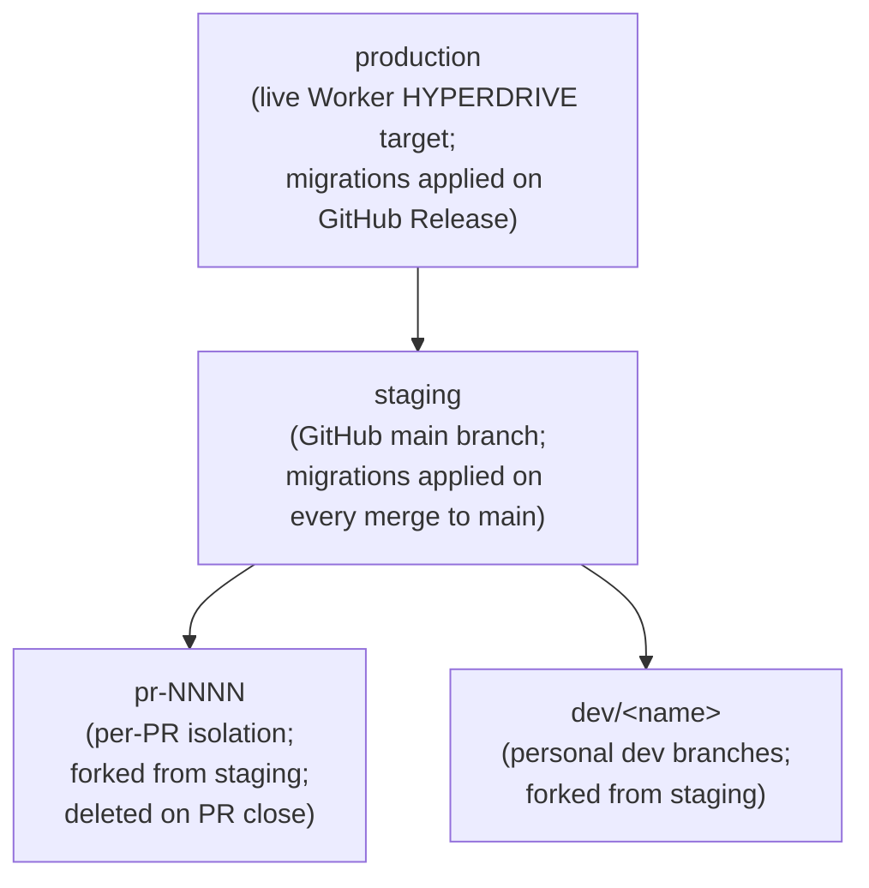
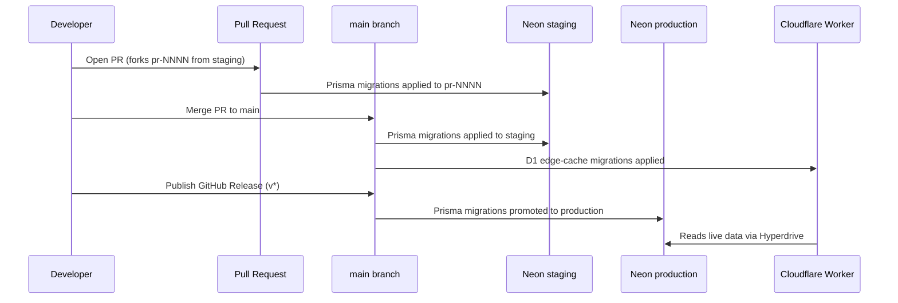

# Neon Database Branching Strategy

## Branch Hierarchy

## Branch Descriptions

| Branch | Purpose | Migrations Applied By |
|---|---|---|
| `production` | Live Neon branch — Cloudflare Worker reads through Hyperdrive | GitHub Release (`on: release: types: [published]`) |
| `staging` | Tracks `main`; source-of-truth for PR branches | Every merge to `main` (`on: push: branches: [main]`) |
| `pr-NNNN` | Per-PR isolation; forked from `staging` at PR open | `neon-branch-create.yml` via Prisma migrate deploy |
| `dev/*` | Personal dev branches; forked from `staging` | Manual |

## Workflow Triggers

### Push to `main` (`db-migrate.yml`)

On every merge to `main`:

1. D1 edge-cache migrations applied (`migrate` job — Cloudflare D1 only)
2. Prisma migrations applied to **staging** Neon branch (`pg_migrate_staging` job)

### GitHub Release published (`db-migrate.yml`)

On every published GitHub Release (tag `v*`):

1. Prisma migrations applied to **production** Neon branch (`pg_migrate_production` job)

This is the **Option B1** promotion gate: staging migrations are promoted to production only when a release is cut.

### Pull Request opened/updated (`neon-branch-create.yml`)

On every PR that touches `prisma/**`, schema, or DB middleware:

1. A new Neon branch `pr-NNNN` is forked from **staging** (not production)
2. All pending Prisma migrations are applied to the new branch
3. A PR comment is posted with the connection string

## Secrets Required

| Secret | Description |
|---|---|
| `NEON_API_KEY` | Neon API token (Settings → API Keys in the Neon console) |
| `NEON_PROJECT_ID` | Neon project ID (e.g. `twilight-river-73901472`) |
| `NEON_DATABASE_URL` | Connection string for the **staging** branch; used by `neon-branch-create.yml` to resolve the DB name/role and as the parent reference for new PR branches (not used for migrations directly) |
| `DIRECT_DATABASE_URL_STAGING` | Direct connection string for the **staging** branch; used by Prisma `migrate deploy` on push to `main` |
| `DIRECT_DATABASE_URL` | Direct connection string for the **production** branch; used by Prisma `migrate deploy` on GitHub Release |

## Promotion Flow (Option B1)

## Local Development

For local development, use a personal `dev/<name>` Neon branch forked from `staging`.
Set `DIRECT_DATABASE_URL` in your `.dev.vars` to point at your dev branch.

See [local-dev.md](./local-dev.md) for full setup instructions.
