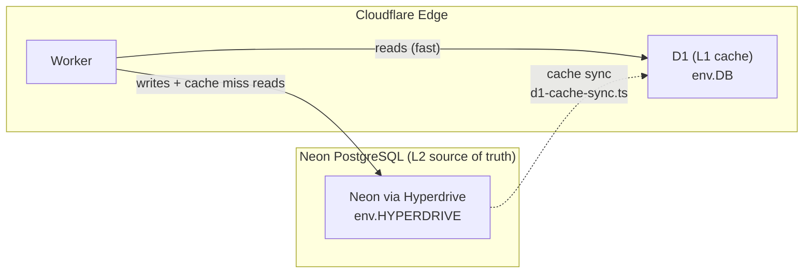

# D1 → Neon Migration Status

> **Living document** — update this file as each migration item is completed.
> Last updated: 2026-03-25

## Background

The project has intentionally designed Cloudflare D1 as an **L1 edge cache** in front of
Neon PostgreSQL (L2 source of truth). However, the migration from D1-as-primary-store to
Neon-as-primary-store is still incomplete. Several worker handlers still read/write
directly to `env.DB` (D1 / `adblock-compiler-d1-database`) rather than going through the
Hyperdrive/Prisma path.

This document tracks each remaining item. The `DB` D1 binding and the `migrations/`
directory **must not be removed** until all items below are marked complete.

---

## Architecture Reminder



The cache sync infrastructure (`src/storage/d1-cache-sync.ts`) is already built.
Once writes go to Neon first, D1 remains as the L1 edge read cache — it is **not** being
retired, only demoted from primary store to cache.

---

## Migration Checklist

| Status | Item | File(s) | What needs to happen |
|--------|------|---------|---------------------|
| 🔴 TODO | `deployment_history` table | `worker/handlers/info.ts` — `/api/version`, `/api/deployments`, `/api/deployments/stats` | Add `DeploymentHistory` Prisma model to `prisma/schema.prisma` + create migration; port the three handler endpoints to use `prisma.deploymentHistory` via Hyperdrive; add D1 cache sync for edge reads |
| 🔴 TODO | Admin user ban/unban/delete | `worker/handlers/admin-users.ts` | Replace raw `env.DB.prepare(...)` calls against `"user"`, `"session"`, `"account"` tables with `prisma.user`, `prisma.session`, `prisma.account` via Hyperdrive |
| 🔴 TODO | Legacy storage stats/export/clear | `worker/handlers/admin.ts` | Decide fate of `storage_entries`, `filter_cache`, `compilation_metadata` D1 tables — either (a) retire and replace with Neon equivalents (`CompiledOutput`/`FilterCache`) or (b) keep as D1 L1 cache with Neon as source of truth and wire up `d1-cache-sync.ts` |
| 🔴 TODO | Health check `env.DB` guard | `worker/handlers/health.ts` | Auth health currently marks status `down` if `env.DB` is missing. Once migration is complete, update the check to use `env.HYPERDRIVE` instead |
| ✅ DONE | D1 as edge cache infrastructure | `src/storage/d1-cache-sync.ts` | Cache sync module is already built. No changes needed here — wire it up once writes go to Neon first |

---

## Item Details

### 1. `deployment_history` Table

**Current state:** `/api/version`, `/api/deployments`, `/api/deployments/stats` all query `env.DB`
directly. The `deployment_history` table exists only in D1 (`migrations/0002_deployment_history.sql`)
and has no Neon equivalent.

**Required changes:**
1. Add `DeploymentHistory` model to `prisma/schema.prisma`:
   ```prisma
   model DeploymentHistory {
     id          String   @id @default(cuid())
     version     String
     environment String
     deployedAt  DateTime @default(now()) @map("deployed_at")
     commitSha   String?  @map("commit_sha")
     deployedBy  String?  @map("deployed_by")
     status      String   @default("success")
     notes       String?

     @@map("deployment_history")
   }
   ```
2. Create and run a Prisma migration: `deno task db:migrate --name add_deployment_history`
3. Port the three handler endpoints in `worker/handlers/info.ts` to use
   `prisma.deploymentHistory` via `c.env.HYPERDRIVE`
4. Optionally keep D1 as read cache by wiring up `d1-cache-sync.ts` for `deployment_history`

**Tracking issue:** (open one and link it here)

---

### 2. Admin User Ban/Unban/Delete

**Current state:** `worker/handlers/admin-users.ts` uses raw `env.DB.prepare(...)` against
the `"user"`, `"session"`, and `"account"` tables for ban/unban/delete operations. These are
Better Auth tables that already exist in Neon via the Prisma schema.

**Required changes:**
1. Replace every `env.DB.prepare(...)` in `admin-users.ts` with the equivalent Prisma call:
   - `env.DB.prepare('UPDATE "user" SET banned=1 ...')` → `prisma.user.update({ where: { id }, data: { banned: true } })`
   - `env.DB.prepare('DELETE FROM "session" WHERE userId=?')` → `prisma.session.deleteMany({ where: { userId: id } })`
   - `env.DB.prepare('DELETE FROM "user" WHERE id=?')` → `prisma.user.delete({ where: { id } })`
2. Use the shared `prisma` instance from `prismaMiddleware` (available as `c.get('prisma')`)
3. Remove the raw D1 queries; no D1 cache sync needed for admin mutations (low-frequency writes)

**Tracking issue:** (open one and link it here)

---

### 3. Legacy Storage Stats/Export/Clear

**Current state:** `worker/handlers/admin.ts` queries `storage_entries`, `filter_cache`, and
`compilation_metadata` D1 tables for admin stats, data export, and cache clearing. These are
legacy L1 cache tables with no direct Neon equivalents currently wired up.

**Decision required — choose one:**

**Option A — Retire legacy D1 tables (recommended)**
- Map `storage_entries` → `CompiledOutput` (Neon), `filter_cache` → `FilterCache` (Neon),
  `compilation_metadata` → fields on `CompiledOutput`
- Port admin stats/export/clear handlers to use Prisma queries against Neon
- Wire up `d1-cache-sync.ts` to populate D1 from Neon for edge reads

**Option B — Keep legacy D1 as cache**
- Add corresponding Neon models for any legacy tables that lack Neon equivalents
- Ensure all writes go to Neon first, then sync to D1 via `d1-cache-sync.ts`
- Admin handlers read from Neon (source of truth), not D1

**Tracking issue:** (open one and link it here)

---

### 4. Health Check `env.DB` Guard

**Current state:** `worker/handlers/health.ts` marks the auth subsystem as `down` if
`env.DB` is missing (`if (authProvider === 'better-auth' && !env.DB)`). Once Better Auth
is fully on Neon/Hyperdrive, this check should test `env.HYPERDRIVE` instead.

**Required changes:**
1. After items 2 and 3 are complete (all auth and storage reads/writes going through Hyperdrive),
   update the health check guard:
   ```typescript
   // Before:
   if (authProvider === 'better-auth' && !env.DB) { status = 'down'; }
   // After:
   if (!env.HYPERDRIVE) { status = 'down'; }
   ```
2. Remove or demote the `env.DB` guard to a warning (D1 will still exist as an edge cache,
   but the system can function without it in degraded mode)

**Tracking issue:** (open one and link it here)

---

## What NOT to Remove Yet

- **`DB` D1 binding** in `wrangler.toml` — still actively used
- **`migrations/`** directory — D1 migration files; not retired yet
- **`admin-migrations/`** directory — separate `ADMIN_DB` D1 database; not part of this migration
- **`prisma/schema.prisma`** `@map` decorators — needed for D1 table compatibility

---

## Completion Criteria

The `DB` D1 binding can be retired (removed from `wrangler.toml`) when:

- [ ] All four items above are marked ✅ DONE
- [ ] CI confirms no remaining `env.DB` references in `worker/` (except `d1-cache-sync.ts`)
- [ ] The `migrations/` directory is archived with a README explaining it is historical
- [ ] The `DB` binding step is removed from `db-migrate.yml`

---

## References

- [D1 Cache Architecture](./edge-cache-architecture.md)
- [Neon Setup](./neon-setup.md)
- [Local Development Setup](./local-dev.md)
- [PRODUCTION_SECRETS.md](../deployment/PRODUCTION_SECRETS.md)
- [Neon Local Development Guide](https://neon.com/guides/local-development-with-neon)
