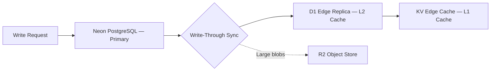
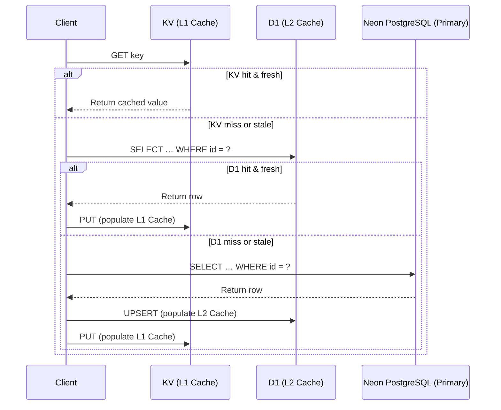
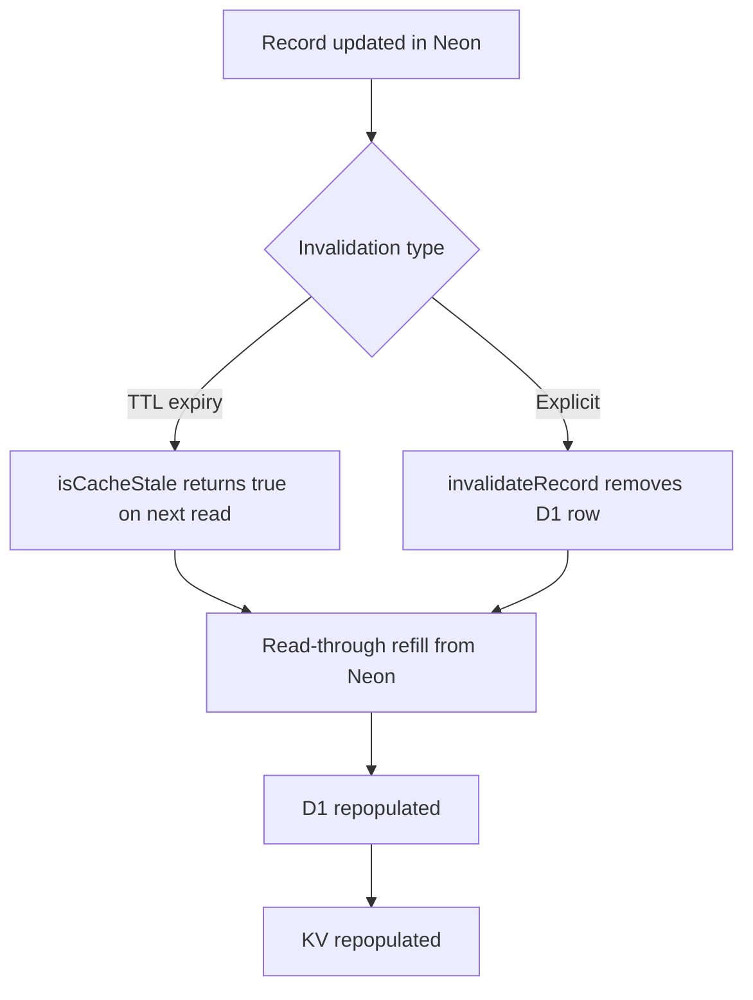

# Edge Cache Architecture

> How the bloqr-backend project uses a multi-tier storage hierarchy to
> serve compiled filter lists at the edge with low latency and strong
> consistency.

## Overview

The storage architecture uses **Neon PostgreSQL as the primary database** with
multiple cache tiers at the edge. Each tier trades off latency, capacity,
and durability differently. By layering them together we can serve the vast
majority of reads from edge caches while keeping a durable, strongly
consistent source of truth in Neon PostgreSQL.

| Tier | Technology | Role | Latency | Capacity |
|------|-----------|------|---------|----------|
| **Primary** | Hyperdrive → Neon PostgreSQL | Source of truth | ~ 10–50 ms | Unlimited |
| **L1 Cache** | Cloudflare KV | Edge key-value cache (config, rate limits) | &lt; 1 ms | 25 MiB / value |
| **L2 Cache** | Cloudflare D1 (SQLite) | Edge read replicas, admin DB | ~ 1 ms | 10 GB |
| **Object Storage** | Cloudflare R2 | Blob / artifact storage | ~ 10 ms | 10 TiB+ |

## Data Flow

### Write Path (Write-Through)

When a new compilation or record is created the write follows this path:

1. The **write request** is always applied to **Neon PostgreSQL (Primary)** first — it is the
   single source of truth.
2. On success the **D1 cache sync** utility (`d1-cache-sync.ts`) performs a
   write-through upsert to **D1 (L2 Cache)**.
3. The KV layer (**L1 Cache**) is populated either eagerly or on the next read.
4. Large compiled artefacts (full filter lists) are stored in **R2 (Object Storage)**.

### Read Path (Cache-Miss Waterfall)

Reads cascade through the tiers until a fresh value is found:

## Cache Sync Configuration

The `D1CacheSyncConfigSchema` (defined in `src/storage/d1-cache-sync.ts`)
controls how records are synchronised from Neon to D1:

| Option | Type | Default | Description |
|--------|------|---------|-------------|
| `syncTables` | `SyncTable[]` | `['filterCache', 'compilationMetadata', 'user']` | Prisma model names to sync. |
| `maxAge` | `number` (seconds) | `300` (5 min) | Maximum age before a D1 record is considered stale. |
| `strategy` | `'write-through' \| 'lazy'` | `'write-through'` | When syncing happens relative to writes. |

### Strategy: Write-Through

With **write-through** (the default), every successful write to Neon is
immediately followed by an upsert to D1.  This keeps the edge replica warm
and avoids cold-read latency for subsequent requests.

**Pros:** Consistently low read latency; readers never trigger a sync.
**Cons:** Slightly higher write latency; unnecessary syncs if the data is
rarely read.

### Strategy: Lazy

With **lazy** sync, D1 is only populated when a read observes a cache miss
or a stale record (checked via `isCacheStale()`).  The read then fetches
from Neon and writes-through to D1 before returning.

**Pros:** No wasted syncs for infrequently accessed data.
**Cons:** First read after expiry pays the full Neon round-trip cost.

## Cache Invalidation

Invalidation follows two complementary strategies:

### TTL-Based Expiry

Each cached record carries a **maxAge** (default 300 s).  The helper
`isCacheStale(table, id, d1Prisma, maxAge)` compares `updatedAt` (or
`createdAt`) against `Date.now()` and returns `true` when the record has
expired.

### Explicit Invalidation

When a record is deleted or materially changed in Neon, the writer calls
`invalidateRecord(table, id, d1Prisma)` which removes the D1 row.  The
next read will refill it from the source of truth.

KV entries are invalidated by setting a short TTL or by issuing an explicit
`KV.delete(key)` after the D1 invalidation completes.

## Sync Utilities API

All functions live in `src/storage/d1-cache-sync.ts`.

| Function | Purpose |
|----------|---------|
| `syncRecord(table, id, data, d1Prisma, logger?)` | Upsert a single record to D1. |
| `invalidateRecord(table, id, d1Prisma, logger?)` | Delete a record from D1 (idempotent). |
| `isCacheStale(table, id, d1Prisma, maxAge, logger?)` | Check if a cached record is expired. |
| `syncBatch(table, records, d1Prisma, logger?)` | Batch upsert using a Prisma transaction, with individual-upsert fallback. |

All functions accept an optional logger that conforms to the
`ICacheSyncLogger` interface (methods: `debug`, `info`, `warn`, `error` —
all optional).

## Error Handling Philosophy

Cache operations are **never fatal**.  A failed D1 write or read simply
means the next request will fall through to Neon PostgreSQL (the primary).
This ensures edge availability is not gated on the health of the D1 edge cache:

- `syncRecord` / `syncBatch` return a result object with `success: false` and an `error` string.
- `invalidateRecord` treats a missing record as success (idempotent delete).
- `isCacheStale` returns `true` on any error — safe fallback to L2.

## File Map

| File | Description |
|------|-------------|
| `src/storage/d1-cache-sync.ts` | Core sync utilities |
| `src/storage/d1-cache-sync.test.ts` | Deno tests with mock Prisma clients |
| `src/storage/D1StorageAdapter.ts` | Full D1 storage adapter (Prisma + raw D1) |
| `src/storage/HyperdriveStorageAdapter.ts` | Neon PostgreSQL adapter via Hyperdrive |
| `worker/lib/prisma-d1.ts` | Factory for D1-backed Prisma client |
| `prisma/schema.d1.prisma` | D1 Prisma schema (SQLite) |
| `prisma/schema.prisma` | Neon Prisma schema (PostgreSQL) |
