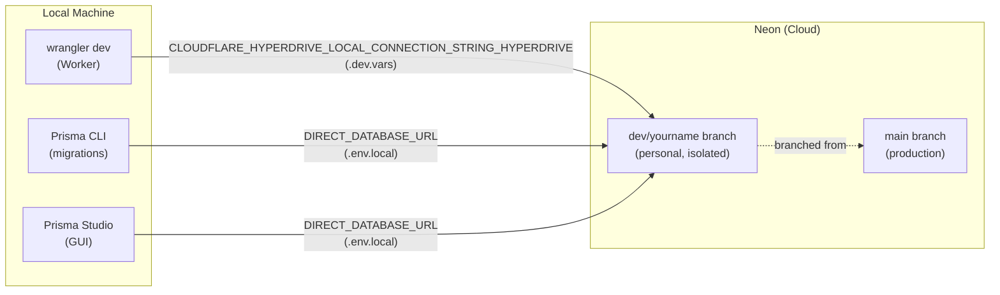

# Local Development Database Setup

This guide covers setting up your local development database using **Neon branching**.
Each developer gets a personal, isolated Neon branch that is safe to reset or delete
without affecting the production database.

> **Reference:** [Local Development with Neon](https://neon.com/guides/local-development-with-neon)

## Prerequisites

- [Deno](https://deno.land/) ≥ 2.x (for running Prisma tasks)
- A Neon account with access to the `bloqr-backend` project
- [direnv](https://direnv.net/) (optional, for automatic env loading)

## Quick Start

```bash
# 1. Create a personal dev branch in the Neon Console (one-time)
#    https://console.neon.tech → bloqr-backend project → Branches → New Branch
#    Base the branch on: main

# 2. Copy the example env files
cp .dev.vars.example .dev.vars
cp .env.example .env.local

# 3. Fill in your Neon branch connection strings (see "Getting Your Connection Strings" below)
#    Edit .dev.vars:
#      CLOUDFLARE_HYPERDRIVE_LOCAL_CONNECTION_STRING_HYPERDRIVE=postgresql://<user>:<password>@<branch-host>.neon.tech/<dbname>?sslmode=require
#    Edit .env.local:
#      DATABASE_URL="postgresql://<user>:<password>@<branch-host>.neon.tech/<dbname>?sslmode=require"
#      DIRECT_DATABASE_URL="postgresql://<user>:<password>@<branch-host>.neon.tech/<dbname>?sslmode=require"

# 4. Apply pending migrations to your branch
deno task db:migrate

# 5. Start the Worker dev server
deno task wrangler:dev
```

## Architecture



`wrangler dev` never uses the real Cloudflare Hyperdrive binding — it reads the
`CLOUDFLARE_HYPERDRIVE_LOCAL_CONNECTION_STRING_HYPERDRIVE` env var from `.dev.vars` as a
passthrough to whatever Postgres URL you provide. For local dev that URL is your Neon branch.

## Neon Branching Workflow

### Creating Your Dev Branch (One-Time Setup)

1. Go to [console.neon.tech](https://console.neon.tech) and open the `bloqr-backend` project.
2. Click **Branches** → **New Branch**.
3. Set the **Branch name** to something like `dev/<your-name>` (e.g. `dev/alice`).
4. Leave **Branch from** set to `main` (or the latest production branch).
5. Click **Create Branch**.

The branch is an instant copy of the production schema and data (or empty if main is empty).
You can reset it or delete it at any time without affecting `main`.

### Getting Your Connection Strings

After the branch is created:

1. Click on your branch name in the Neon Console.
2. Click **Connect** (or the connection string icon).
3. Select **Direct connection** (not "Pooled connection") — Prisma migrations require a direct URL.
4. Copy the connection string; it looks like:
   ```
   postgresql://<user>:<password>@ep-<name>.<region>.neon.tech/<dbname>?sslmode=require
   ```

> ⚠️ **Direct vs. Pooled:** Always use the direct (non-pooler) URL for local dev and Prisma CLI.
> The pooler URL (`-pooler` in the hostname) is only for the production Hyperdrive binding.

### Configuring Your Local Environment

**.dev.vars** (Worker runtime — used by `wrangler dev`):

```ini
# Point wrangler dev at your personal Neon development branch.
CLOUDFLARE_HYPERDRIVE_LOCAL_CONNECTION_STRING_HYPERDRIVE=postgresql://<user>:<password>@ep-<name>.<region>.neon.tech/<dbname>?sslmode=require
```

**.env.local** (Prisma CLI — used by `prisma migrate dev/deploy/status`):

```ini
# Use the same direct connection string for Prisma CLI.
DATABASE_URL="postgresql://<user>:<password>@ep-<name>.<region>.neon.tech/<dbname>?sslmode=require"
DIRECT_DATABASE_URL="postgresql://<user>:<password>@ep-<name>.<region>.neon.tech/<dbname>?sslmode=require"
```

Copy the example files as a starting point:

```bash
cp .dev.vars.example .dev.vars
cp .env.example .env.local
```

### Resetting Your Branch

If your dev branch gets into an inconsistent state, reset it in the Neon Console:
**Branches → your branch → Reset to main** (or delete and recreate it).
This is safe — `main` is never affected.

### `.envrc` (direnv)

Loads `.env`, `.env.local`, and `.dev.vars` automatically when you `cd` into the project:

```bash
direnv allow .
```

## Deno Task Reference

| Task | Description |
|------|-------------|
| `deno task db:migrate` | Run pending Prisma migrations against your Neon branch |
| `deno task db:generate` | Regenerate Prisma client after schema changes |
| `deno task db:studio` | Open Prisma Studio GUI connected to your Neon branch |
| `deno task wrangler:dev` | Start the Worker dev server (uses `.dev.vars` for DB connection) |

## Common Workflows

### First-Time Setup

```bash
# Copy env templates
cp .dev.vars.example .dev.vars
cp .env.example .env.local

# Fill in your Neon branch URLs (see "Getting Your Connection Strings" above)

# Apply migrations to your branch
deno task db:migrate

# Generate Prisma client (for IDE autocomplete)
deno task db:generate

# Start dev server
deno task wrangler:dev
```

### After Pulling New Schema Changes

```bash
# Apply any new migrations to your Neon branch
deno task db:migrate

# Regenerate Prisma client
deno task db:generate
```

### Inspect Data with Prisma Studio

```bash
deno task db:studio
# Opens browser at http://localhost:5555
```

### Create a New Migration

```bash
# Make changes to prisma/schema.prisma, then:
deno task db:migrate --name describe_your_change
```

This creates a migration file in `prisma/migrations/` and applies it to your Neon branch.

## Troubleshooting

### "SSL required" or `sslmode` errors

Neon always requires SSL. Make sure `?sslmode=require` is appended to every connection string
in `.dev.vars` and `.env.local`.

### "Cannot connect to server" / ETIMEDOUT

Check that:

1. You copied the connection string from the **Direct connection** tab (not pooled).
2. The branch hasn't been suspended. Open the Neon Console and verify the branch is active.
3. Your connection string isn't the placeholder (`<user>`, `<branch-host>`, etc.).

### "Cannot find module 'prisma/config'"

The Prisma CLI npm package isn't installed. Run:

```bash
pnpm install
```

Or use Deno directly (the `db:migrate` task does this automatically):

```bash
deno run -A npm:prisma migrate deploy
```

### Migration Fails on Fresh Branch

The incremental migrations assume existing tables. For a brand-new branch, run `db push` first:

```bash
DIRECT_DATABASE_URL="postgresql://<user>:<password>@<branch-host>.neon.tech/<dbname>?sslmode=require" \
  deno run -A npm:prisma db push
```

Then mark existing migrations as applied:

```bash
DIRECT_DATABASE_URL="postgresql://<user>:<password>@<branch-host>.neon.tech/<dbname>?sslmode=require" \
  deno run -A npm:prisma migrate resolve --applied <migration_name>
```

### Branch Data Drift / Inconsistent State

Reset your branch from the Neon Console:
**Branches → your branch → Reset to main**.

This replaces your branch data with a fresh copy from `main`. All local changes are lost.
