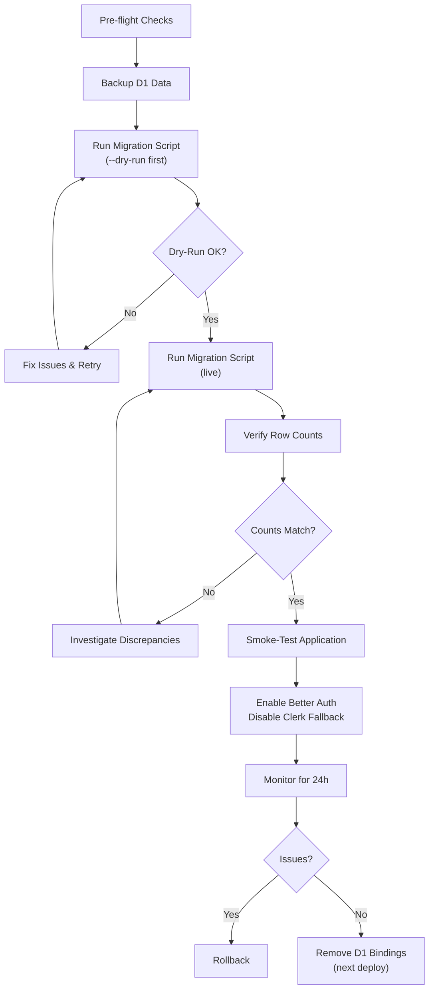

# D1 → Neon PostgreSQL Migration Checklist

> One-time migration from Cloudflare D1 to Neon PostgreSQL.
> See also: [`neon-setup.md`](./neon-setup.md), [`neon-branching.md`](./neon-branching.md)

## Migration Flow



---

## Pre-Migration Checklist

Complete **every** item before running the migration script.

- [ ] **Neon project exists** — Verify at [console.neon.tech](https://console.neon.tech)
- [ ] **Prisma migrations applied** — Run `deno task db:migrate` against the Neon database
- [ ] **Hyperdrive binding configured** — Confirm `HYPERDRIVE` in `wrangler.toml` points to the correct Neon connection string
- [ ] **Environment variables set**:
  - [ ] `NEON_API_KEY` — Neon admin API key
  - [ ] `NEON_PROJECT_ID` — Neon project ID
  - [ ] `CF_API_TOKEN` — Cloudflare API token with D1 read access
  - [ ] `CF_ACCOUNT_ID` — Cloudflare account ID
  - [ ] `D1_DATABASE_ID` — Source D1 database UUID
  - [ ] `NEON_CONNECTION_STRING` — Target Neon PostgreSQL connection string
- [ ] **D1 backup taken** — Export via `wrangler d1 export <db-name> --output d1-backup.sql`
- [ ] **Dry-run passes** — `deno run -A scripts/migrate-d1-to-neon.ts --dry-run`
- [ ] **Low-traffic window** — Schedule migration during off-peak hours

---

## Migration Steps

### 1. Backup D1

```bash
wrangler d1 export adblock-compiler-d1-database --output artifacts/d1-backup-$(date +%Y%m%d).sql
```

### 2. Dry Run

```bash
deno run -A scripts/migrate-d1-to-neon.ts --dry-run
```

Review the output:
- Verify table names and row counts match expectations.
- Confirm no transformation errors are logged.
- Check that the script would insert the expected number of rows.

### 3. Live Migration

```bash
deno run -A scripts/migrate-d1-to-neon.ts
```

The script:
- Reads each D1 table via `CloudflareApiService.queryD1()`.
- Transforms rows to match the PostgreSQL schema (column mapping, type coercion).
- Batch-inserts into Neon via `NeonApiService.querySQL()` with `ON CONFLICT DO NOTHING` for idempotency.
- Logs progress per table with row counts and durations.

### 4. Verify Row Counts

```bash
# D1 counts (from dry-run output or manual queries)
# vs
# Neon counts
deno run -A scripts/migrate-d1-to-neon.ts --verify-only
```

### 5. Smoke-Test the Application

- [ ] Health check: `curl https://your-worker.workers.dev/api`
- [ ] Sign in with existing credentials
- [ ] Compile a filter list
- [ ] Verify admin dashboard loads
- [ ] Check compilation event telemetry

### 6. Switch Authentication

Update `.dev.vars` (or Wrangler secrets for production):

```bash
wrangler secret put BETTER_AUTH_SECRET   # if not already set
wrangler secret put DISABLE_CLERK_FALLBACK  # set to 'true'
wrangler secret put DISABLE_CLERK_WEBHOOKS  # set to 'true'
```

---

## Post-Migration Checklist

- [ ] **Row counts match** — D1 row counts ≈ Neon row counts for all tables
- [ ] **Application health** — All health checks pass for 24 hours
- [ ] **Authentication works** — Sign-in, token refresh, API key auth all functional
- [ ] **Compilation works** — End-to-end filter compilation succeeds
- [ ] **Monitoring active** — Neon dashboard shows expected query patterns
- [ ] **Clerk disabled** — `DISABLE_CLERK_FALLBACK=true` in production secrets
- [ ] **Clean up** — Remove D1 bindings from `wrangler.toml` in a follow-up PR
- [ ] **Documentation updated** — README, CONTRIBUTING, and `.dev.vars.example` reflect the new stack

---

## Rollback Procedure

If critical issues arise after migration:

1. **Re-enable Clerk** — Set `DISABLE_CLERK_FALLBACK=false` via Wrangler secrets
2. **Restore D1 bindings** — Revert the `wrangler.toml` change that removed D1 bindings
3. **Redeploy previous version** — `wrangler rollback` to the last known-good deployment
4. **Investigate** — Check Neon dashboard metrics and Worker logs for the root cause

> **Note:** The migration script uses `ON CONFLICT DO NOTHING`, so re-running it is safe and will not create duplicates. After a rollback, fix the issue and re-run the migration.

---

## Tables Migrated

| D1 Table | PostgreSQL Table | Notes |
|---|---|---|
| `users` | `users` | UUID primary key; `clerk_user_id` preserved |
| `api_keys` | `api_keys` | Scopes converted from CSV → PostgreSQL array |
| `sessions` | `sessions` | Legacy `token_hash` nullable for Better Auth sessions |
| `filter_sources` | `filter_sources` | Status enum preserved as text |
| `compiled_outputs` | `compiled_outputs` | `config_snapshot` becomes JSONB |
| `compilation_events` | `compilation_events` | Append-only telemetry |
| `storage_entries` | `storage_entries` | Legacy key-value store |
| `filter_cache` | `filter_cache` | Legacy filter cache |
| `compilation_metadata` | `compilation_metadata` | Legacy metadata (to be deprecated) |

---

## Related Docs

- [Database Architecture](./DATABASE_ARCHITECTURE.md)
- [Neon Setup](./neon-setup.md)
- [Neon Branching](./neon-branching.md)
- [Local Development](./local-dev.md)
- [Prisma + Deno Compatibility](./prisma-deno-compatibility.md)
